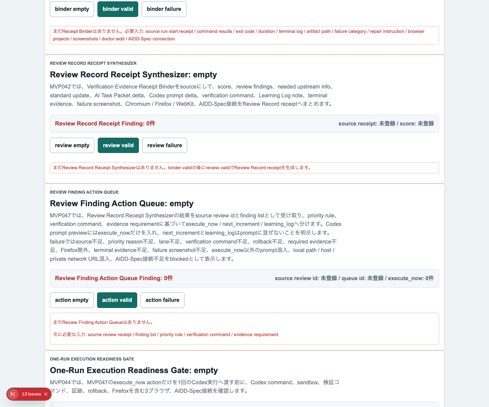
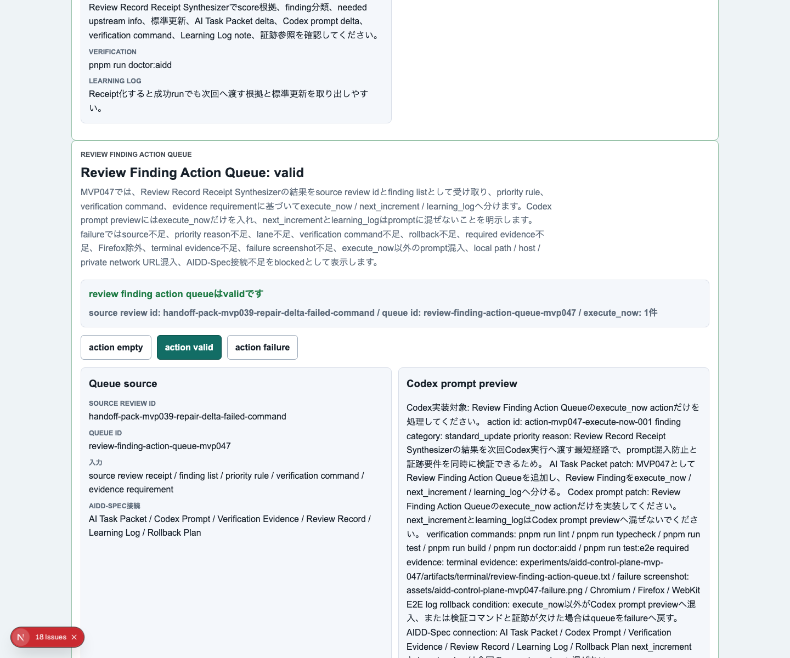
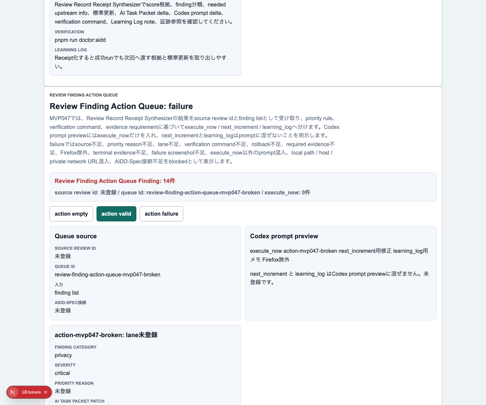
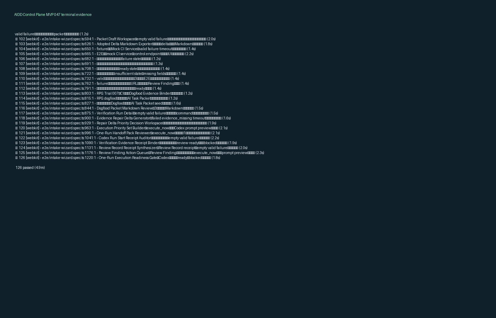

# AIDD Control Plane MVP 047：Review Findingを「次にやる1件」へ仕分けるAction Queueを作る

> 2026-07-05 / Codex Mastery Lab  
> 記事種別: Experiment / SaaS  
> 将来の書籍章: 第10章 Verification Evidence、第11章 Learning Log、第12章 雑プロンプト vs AI Task Packet、第18章 AIDD Control PlaneのMVP

## タイトル案

「全部直して」ではAI依頼が太りすぎる：Review Findingを1回分の実行キューへ仕分ける

## 読者の悩み

AIに実装を任せたあと、レビューやテストで指摘が出ます。問題は、その次です。

- 失敗ログから修正候補は出たが、どれを今すぐ直すべきか分からない
- 複数のReview Findingを全部Codex promptに入れてしまい、1回の修正範囲が広がりすぎる
- 次回送りの改善と、今回実行する改善が混ざる
- Learning Logに残すだけの学びまで、実装指示に混入する
- promptには書いたが、verification command、rollback、証跡要件が抜ける

前回のMVP 046では、Verification Evidence ReceiptからReview Finding / AI Task Packet delta / Codex prompt delta / Verification command / Learning Log noteを作る **Run Result Review Synthesizer** を作りました。

今回は、そのReview Findingをさらに一段だけ進めます。すべてを一気にCodexへ渡すのではなく、次の3つへ仕分けます。

```text
Review Finding
  -> Review Finding Action Queue
      - execute_now: 今回の1回で実行する
      - next_increment: 次回に送る
      - learning_log: 学びとして残す
  -> Codex prompt previewにはexecute_nowだけを入れる
```

料理でいえば、冷蔵庫の中身を見て「今日作る1品」「明日使う材料」「買い物メモ」を分けるようなものです。全部を鍋に入れないことが大事です。

## 今回の仮説

今回の仮説は次です。

> Review FindingをAction Queueへ仕分け、Codex prompt previewにexecute_nowだけを入れれば、AIへの依頼範囲を小さく保ち、検証しやすい1インクリメントにできる。

AIDD Control Planeの価値は、AIがコードを書く前後の判断を見える化することです。今回のMVP 047は、失敗や学びを「全部修正して」ではなく、「今回の1回で何を直すか」へ落とす部品です。

## 実験内容

`experiments/aidd-control-plane-mvp-047/generated-repo/` に、**Review Finding Action Queue** を追加しました。

必須項目は次です。

| 項目 | 何を確認したいのか | なぜ必要か |
| --- | --- | --- |
| source review id | どのReview Findingから作った行動か | 失敗原因と修正指示を追跡するため |
| queue id | どの行動キューか | 複数の修正候補を混ぜないため |
| action item | 実行する作業内容 | AIに渡せる粒度へ落とすため |
| finding category / severity | 指摘分類と重大度 | 優先度判断を感覚にしないため |
| lane | execute_now / next_increment / learning_log | 今回実行するものだけを分けるため |
| priority reason | なぜ今やる/送る/残すのか | 判断の説明責任を残すため |
| AI Task Packet patch | 次回依頼に入る差分 | 同じ失敗を繰り返さないため |
| Codex prompt patch | Codexへ渡す具体文 | AIが実行できる文にするため |
| verification commands | 修正後に走らせるコマンド | 完了条件を曖昧にしないため |
| required evidence | terminal / screenshot / report | 証跡なしの完了を防ぐため |
| rollback condition | 外したときの戻し方 | AI修正を安全に扱うため |
| AIDD-Spec connection | どの標準成果物に接続するか | 個別修正を標準改善へ戻すため |
| Codex prompt preview | 今回AIへ渡す文面 | execute_now以外の混入を確認するため |

## 画面キャプチャ

### empty：まだAction Queueがない



emptyでは、Review Finding Action Queueを作る前に必要な材料を見せます。source review、finding list、priority reason、verification command、required evidence、rollbackがなければ、次のCodex実行へ進めません。

### valid：execute_nowだけをprompt previewへ入れる



validでは、Review Findingが3つのlaneへ分かれます。重要なのは、画面上では`next_increment`や`learning_log`も見える一方で、Codex prompt previewには`execute_now`だけが入る点です。

これにより、AIへの依頼が「全部直して」にならず、今回の1回で検証できるサイズに保てます。

### failure：混ぜてはいけない状態を止める



failureでは、source不足、priority reason不足、lane不足、verification command不足、rollback不足、required evidence不足、Firefox除外、terminal evidence不足、failure screenshot不足、execute_now以外のprompt混入、local path / host / private network URL混入、AIDD-Spec接続不足をblockedとして表示します。

### terminal evidence



## 失敗と修正

今回のCodex CLI実行は、実装途中のログを出しながら600秒でタイムアウトしました。ただし、生成されたMVP 047の差分自体は残っていたため、Codexの自己申告には依存せず、Hermes側で独立検証しました。

実装後の検証では、lint / typecheck / unit / build / 3ブラウザE2E / doctor:aidd / capture が通りました。

この失敗から得た学びは、AIDD Control Plane自身のテーマと同じです。

- Codexの完了メッセージがなくても、成果物を独立検証する
- timeoutは失敗ログとして保存し、次のReview Findingに戻す
- 1回の実行で欲張りすぎないよう、Action Queueでexecute_nowを絞る

## 検証ログ

| コマンド | 結果 | メモ |
| --- | --- | --- |
| `pnpm install --frozen-lockfile` | pass | lockfile固定で依存解決 |
| `pnpm run lint` | pass | ESLintエラーなし |
| `pnpm run typecheck` | pass | TypeScriptエラーなし |
| `pnpm run test` | pass | Vitest 76 tests |
| `pnpm run build` | pass | Next.js build成功。ESLint plugin警告は既存構成警告として記録 |
| `pnpm run test:e2e` | pass | 126 passed。Chromium / Firefox / WebKit |
| `pnpm run doctor:aidd` | pass | MVP 047必須tokenと証跡条件を確認 |
| `pnpm run capture:mvp047` | pass | empty / valid / failure / terminal evidenceを生成 |

E2Eの最終結果は次です。

```text
126 passed (4.9m)
```

`doctor:aidd` もMVP 047として通過しました。

```text
doctor:aidd passed
checked MVP: AIDD Control Plane MVP 047 Review Finding Action Queue
```

## 読者が使えるチェックリスト

AI実装後のReview Findingを、次のAI依頼へ渡す前にこのチェックを使えます。

| チェック項目 | 何を確認したいのか | なぜ必要か |
| --- | --- | --- |
| execute_nowは1回分か | 今回やる修正が広がりすぎていないか | 検証しやすい単位にするため |
| next_incrementと混ざっていないか | 次回送りの改善がpromptに入っていないか | AI依頼の範囲を守るため |
| learning_logが実装指示化していないか | 学びだけの内容をCodexへ渡していないか | 不要な実装を防ぐため |
| priority reasonがあるか | なぜ今やるのか説明できるか | 判断の再現性を上げるため |
| verification commandがあるか | 修正後に何を実行するか | 完了条件を明確にするため |
| required evidenceがあるか | terminal / screenshot / reportを残すか | 証跡なし完了を防ぐため |
| 3ブラウザか | Firefox / WebKitも含むか | 1ブラウザだけの成功を防ぐため |
| rollback条件があるか | 外したとき戻せるか | AI修正の安全性を保つため |
| 公開リスクを見たか | local path / host / private network URLがないか | 記事・証跡で漏えいを避けるため |
| AIDD-Spec接続があるか | 標準のどの成果物へ戻すか | 個別の学びを再利用するため |

## AIDD-Spec / SaaSへの接続

今回のMVP 047は、AIDD-Specの次の成果物に接続します。

- Review Record
- Learning Log
- AI Task Packet
- Verification Evidence
- Review Process
- Rollback Plan

`standards/aidd-control-plane-mvp-v0.1.md` では、Review Finding Action Queueを「Review Findingを次に実行する行動キューへ変換し、execute_now / next_increment / learning_logを混ぜずに扱う」部品として扱います。

SaaSとして見ると、これはかなり重要な境界です。AIDD Control Planeは、AIに長いpromptを渡す画面ではありません。失敗や学びを読み、今回実行する1件を選び、必要な検証と証跡をセットにしてからAIへ渡す画面です。

note記事としても同じです。AI量産記事ではなく、実際にtimeoutし、検証し、3ブラウザE2Eを通し、スクリーンショットを残した一次情報だから読者に価値があります。

## 次回

次回は、Review Finding Action Queueの`execute_now` itemを、実際にCodexへ渡す直前の **One-Run Execution Readiness Gate** へ接続します。

今回の学びはシンプルです。

> Review Findingを全部promptへ入れない。  
> 今回の1回で実行するものだけをexecute_nowとして渡す。

これが、誰でもベストに近いAI駆動開発フローを再現するための次の小さな部品です。
