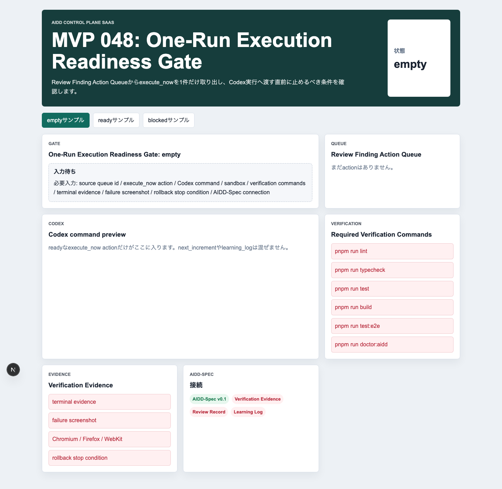
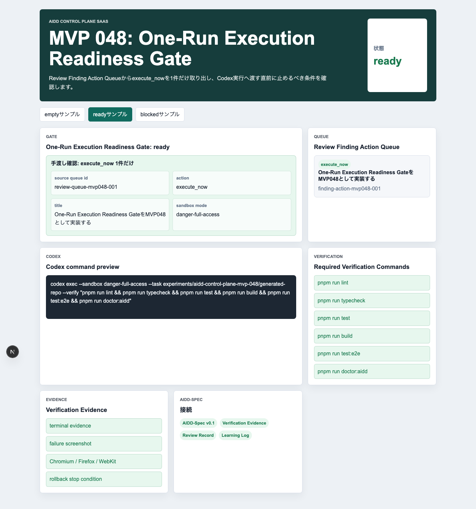
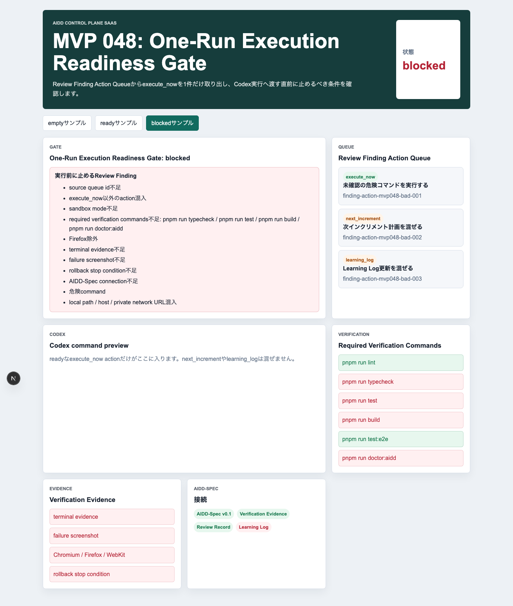
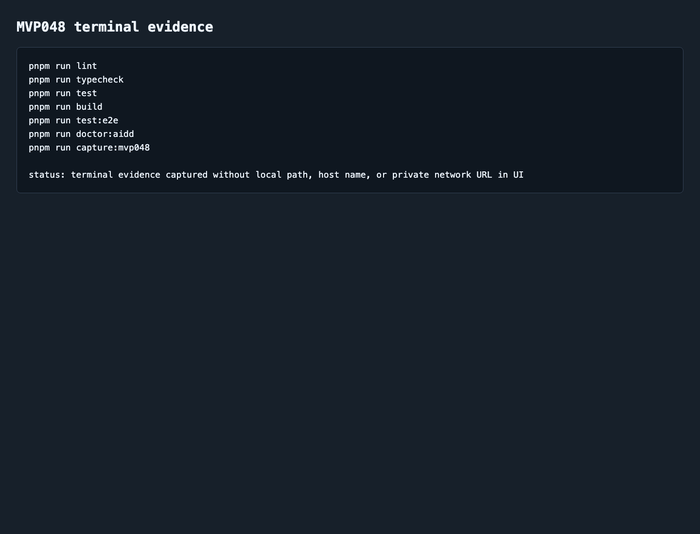

# AIDD Control Plane MVP 048：Codex実行の直前に「本当に走らせてよいか」を止めるReadiness Gate

> 2026-07-05 / Codex Mastery Lab  
> 記事種別: Experiment / SaaS  
> 将来の書籍章: 第10章 Verification Evidence、第11章 Learning Log、第12章 雑プロンプト vs AI Task Packet、第18章 AIDD Control PlaneのMVP

## タイトル案

Codexに渡す前の最後の確認：execute_now 1件だけを走らせるReadiness Gate

## 読者の悩み

AIに修正を頼む直前、意外と次の事故が起きます。

- 「今回やる1件」だけのつもりが、次回送りや学びメモまでpromptに混ざる
- `pnpm run test` だけで十分だと思い、typecheckやbuild、3ブラウザE2Eを落とす
- Firefoxを外したまま「E2E済み」と言ってしまう
- failure screenshotやterminal evidenceがないのに完了扱いにする
- rollback条件がないまま危険なcommandを走らせる
- ローカルパスやhost名が証跡に混ざる

前回のMVP 047では、Review Findingを `execute_now` / `next_increment` / `learning_log` に仕分ける **Review Finding Action Queue** を作りました。今回は、その次です。`execute_now` に選ばれた1件を、Codexへ渡す直前に **ready / blocked** として判定する画面を作りました。

旅行前の持ち物チェックに近いです。航空券、財布、スマホ、薬、充電器が揃っていなければ出発しません。AI実行も同じで、実行前に必要なものが揃っていなければ止めます。

## 今回の仮説

> Codex実行直前にReadiness Gateを置けば、execute_now以外の混入、浅い検証、証跡不足、rollback不足、危険commandを実行前に止められる。

AIDD Control Planeは「AIにコードを書かせるボタン」ではありません。むしろ、AIを走らせる前後の判断を標準化するSaaSです。今回のMVP 048は、その実行直前の安全弁です。

## 実験内容

`experiments/aidd-control-plane-mvp-048/generated-repo/` に、Next.js + TypeScript + pnpmで **One-Run Execution Readiness Gate** を実装しました。

確認する項目は次です。

| チェック項目 | 何を確認したいのか | なぜ必要か |
| --- | --- | --- |
| source queue id | どのAction Queueから来た実行か | 修正指示の出どころを追跡するため |
| execute_now action id | 今回走らせる1件か | 次回送りやLearning Logを混ぜないため |
| Codex command | 実行するcommandが明示されているか | 曖昧な依頼や危険commandを止めるため |
| sandbox mode | 実行境界が明示されているか | 許可範囲をレビューできるようにするため |
| required verification commands | lint/typecheck/test/build/e2e/doctorを含むか | 完了条件を浅くしないため |
| Chromium / Firefox / WebKit | 3ブラウザE2Eを要求しているか | 「1ブラウザだけ通った」を防ぐため |
| required evidence | terminal / empty / valid / failure screenshot等があるか | 証跡なしの完了を防ぐため |
| rollback stop condition | どの条件なら止めるか | AI修正を安全に扱うため |
| AIDD-Spec connection | Verification Evidence / Review Record / Learning Logへ戻るか | 個別実行を標準改善へつなげるため |

## 画面キャプチャ

### empty：まだ実行前チェックの材料がない



emptyでは、Review Finding Action Queueから `execute_now` を1件選ぶ必要があることを表示します。いきなりCodex commandを作るのではなく、source queue、検証、証跡、rollback、AIDD-Spec接続を揃えるよう促します。

### ready：execute_now 1件だけを渡せる



readyでは、Codex command previewに `execute_now` の1件だけが入ります。`next_increment` や `learning_log` は見えていても、今回のpromptには混ぜません。

今回のポイントは「promptを太らせない」ことです。AIに渡す依頼を小さく保つほど、検証もrollbackも現実的になります。

### blocked：走らせてはいけない条件を止める



blockedでは、source queue id不足、execute_now以外の混入、危険command、sandbox不足、検証不足、Firefox除外、terminal evidence不足、failure screenshot不足、rollback不足、local path / host / private network URL混入、AIDD-Spec connection不足を検出します。

### terminal evidence



## 失敗と修正

今回の実装では、CodexはMVP048のプロジェクトを生成し、自己申告としてlint / typecheck / test / build / E2E / doctor / captureが通ったと報告しました。ただし、Codexの自己申告は完了条件にしません。

Hermes側で別途、個別コマンドとして実行し直しました。`pnpm run build` では Next.js のESLint plugin警告が出ましたが、終了コードは0で、lint自体は `eslint . --max-warnings=0` で通過しています。警告は今後の依存・設定改善候補として扱います。

## 検証ログ

| コマンド | 結果 | メモ |
| --- | --- | --- |
| `pnpm install --frozen-lockfile` | pass | lockfile固定で依存解決 |
| `pnpm run lint` | pass | ESLintエラーなし |
| `pnpm run typecheck` | pass | TypeScriptエラーなし |
| `pnpm run test` | pass | Vitest 3 tests |
| `pnpm run build` | pass | Next.js build成功。ESLint plugin警告を記録 |
| `pnpm run test:e2e` | pass | 9 passed。Chromium / Firefox / WebKit |
| `pnpm run doctor:aidd` | pass | MVP048 token、AIDD-Spec接続、capture scriptを確認 |
| `pnpm run capture:mvp048` | pass | empty / ready / blocked / terminal evidenceを生成 |

E2Eの最終結果は次です。

```text
9 passed (14.9s)
```

## 読者が使えるチェックリスト

AIに実装を頼む直前に、最低限これだけ確認します。

| チェック項目 | 何を確認したいのか | なぜ必要か |
| --- | --- | --- |
| 今回やる1件だけか | promptにexecute_now以外が混ざっていないか | 依頼範囲を小さく保つため |
| 検証コマンドが揃っているか | lint/typecheck/test/build/e2e/doctorがあるか | 「雰囲気で完了」を防ぐため |
| 3ブラウザを外していないか | Chromium / Firefox / WebKitが対象か | ブラウザ差分の見落としを減らすため |
| 証跡が残るか | terminal、スクリーンショット、レポートがあるか | 後からレビューできるようにするため |
| rollback条件があるか | どの失敗なら止めるか | AI修正を安全に扱うため |
| 公開できる証跡か | local path、host名、private network URLがないか | noteや公開repoで漏えいしないため |

## SaaS / AIDD-Specへの接続

MVP 048は、AIDD Control Planeの次の流れに入ります。

```text
Review Finding Action Queue
  -> One-Run Execution Readiness Gate
  -> Codex Run Start Receipt
  -> Verification Evidence Receipt
  -> Review Record
  -> Learning Log
```

AIDD-Spec v0.1の観点では、これは **AI Task Packetを実行可能な形にする直前の確認** です。料理でいえば、レシピを書いたあと、火をつける前に材料と道具を確認する段階です。

## 次回

次回は、Readiness Gateでreadyになった実行を、実際のCodex run queueへ積む前後の証跡に接続します。特に、開始時刻、実行command、証跡保存先、rollback停止条件をレシート化し、Verification Evidenceへ渡せる形にします。
