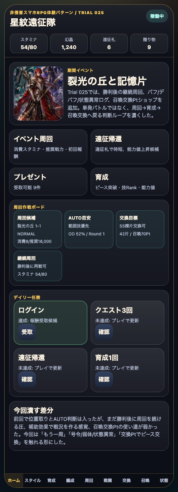
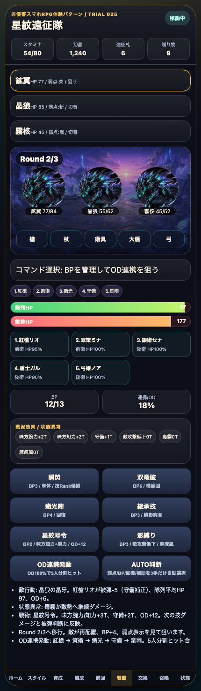
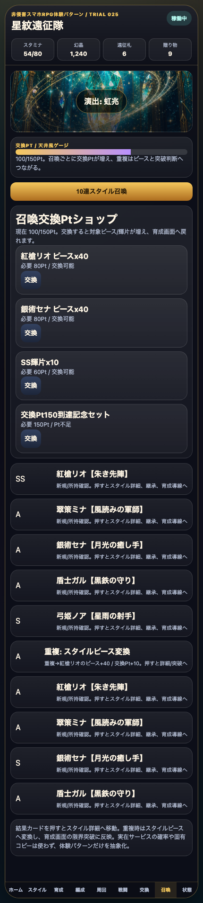

# SagaForge Trial 025: 継続周回・補助効果・召喚交換Ptで「周回して育てる」圧を強める

前回までで、星紋遠征隊はホーム、スタイル、5人編成、クエスト、BP/OD風バトル、育成、召喚、交換所まで触れる状態になった。ユーザーからの「全然ロマサガRSとは程遠い」という評価に対して、今回は単なる見た目追加ではなく、キャラ収集RPGで期待される「勝ったら次の周回へ進み、素材や交換Ptで育成へ戻る」手触りを少し増やした。

> 注意: アプリ本体では実在IP、公式素材、商標、ロゴ、公式文言、公式確率、公式UIの完全コピーは使わない。この記事では、期待される体験パターンを説明する文脈としてのみ実在タイトル名に触れる。

## 前回の何がロマサガRSから遠かったか

Trial 024では、陣形位置の被弾、AUTO判断、召喚交換Pt風ゲージを入れた。これで「5人編成で戦う」形は濃くなったが、まだ次の差分が残っていた。

| 不足 | なぜ遠く見えるか | 今回の扱い |
|---|---|---|
| 勝利後の周回継続が弱い | スマホRPGは1回勝って終わりではなく、スタミナと報酬を見ながら同じ場所を回す | 勝利リザルトに「再戦してAUTO」「3周予約」「残りスタミナ」を追加 |
| 補助効果・状態異常が薄い | BP技だけだと単純なダメージボタンに見える | 星紋号令、影縛り、攻撃低下、毒霧、麻痺風、守備補正を戦闘ログに追加 |
| 召喚Ptの使い道が見えない | 交換Ptゲージがあっても、交換できなければ収集導線にならない | 召喚交換Ptショップを追加し、ピース/輝片交換から育成へ戻す |

## 今回どの差分を潰したか

1. **勝利後の継続周回導線**
   - 勝利リザルトに「同じクエストを再戦」「3周予約」「再戦してAUTO」を追加。
   - 残りスタミナと次回消費量を表示し、周回を続けるか育成へ戻るかを選べるようにした。
   - ホームの周回作戦ボードにも継続周回の予約状態を表示する。

2. **バフ/デバフ/状態異常の第一段階**
   - `星紋号令`: 味方腕力/知力、守備、ODを上げる補助コマンド。
   - `影縛り`: 敵攻撃低下、毒霧、麻痺風を付与する弱体コマンド。
   - 戦闘画面に「戦況効果 / 状態異常」パネルを追加し、敵行動ログにも軽減や行動阻害を出した。

3. **召喚交換Ptショップ**
   - 10連で増える交換Ptを、スタイルピースや輝片に交換できるようにした。
   - 交換後は育成画面へ戻り、限界突破や強化へつながる。
   - 実在タイトルの確率、UI、公式文言は使わず、収集RPGの「重複→ピース→育成」パターンだけを抽象化した。

## 触れる導線

- プレイアブル: プレビュー配信の `/sagaforge-app/index.html`
- 推奨確認順: ホーム → 周回作戦ボード → 戦闘 → 星紋号令/影縛り → AUTO判断 → 勝利リザルト → 再戦してAUTO → 召喚 → 召喚交換Ptショップ → 育成

## スクリーンショット







## 実装メモ

今回も、記事より先にユーザーが触れる静的プレイアブルを優先した。

- `playables/sagaforge-app/index.html`
  - Trial 025へ更新。
  - 勝利リザルトに継続周回ボタンと予約表示を追加。
  - `buffs` / `debuffs` / `renderStatusEffects()` / `applyTactic()` を追加。
  - AUTO判断が補助状態も見て、弱体や号令を選ぶようにした。
  - 召喚交換Ptショップと `tradeSummonPoint()` を追加。
- `scripts/build_preview.py`
  - Trial 025記事とスクリーンショットコピー対象を追加。
  - `playables/sagaforge-app/` が `preview/sagaforge-app/` にコピーされる状態を維持。

## 検証ログ

今回確認した主なコマンドは次の通り。

```text
node --check /tmp/sagaforge-trial025.js
python3 scripts/build_preview.py
node experiments/character-collection-rpg-trial-001/generated-repo/scripts/capture-playable-trial025.mjs
pnpm run lint
pnpm run typecheck
pnpm run test
pnpm run build
curl -I <preview-host>/sagaforge-app/index.html
curl -I <preview-host>/sagaforge-app/assets/party-key-art.png
```

主な確認内容:

- ホームで Trial 025 の説明と継続周回の作戦ボードが表示される。
- 戦闘画面に `星紋号令`、`影縛り`、`戦況効果 / 状態異常` が表示される。
- AUTO判断後に補助効果、敵攻撃低下、毒霧、麻痺風ログが更新される。
- 勝利後のリザルトに `再戦してAUTO` と `3周予約` が出る。
- 召喚画面に `召喚交換Ptショップ` が表示され、交換から育成へ戻れる。
- プレビュー配信のプレイアブルURLと主要画像URLが `http=200` を返す。

## まだ遠い点

今回で「周回継続」「補助効果」「召喚交換Ptの使い道」は入ったが、まだロマサガRS的な期待には遠い。

- AUTO周回はまだ完全な連続実行ではなく、ユーザーがボタンを押して進める疑似ループ。
- バフ/デバフはターン管理の雰囲気はあるが、技ごとの詳細な成功率、耐性、状態異常アイコン、解除条件は薄い。
- スタイル育成はピース、Lv、Rank、覚醒を表示しているが、能力値上昇のランダム感や周回場所ごとの育成効率はまだ弱い。
- ホームは情報密度が増えたが、イベント複数本、ショップ、ミッション詳細、プレゼント詳細の密度はまだ足りない。

## 次に潰す差分

次回は、次の1〜3個に絞る。

1. **本物に近いAUTO周回テンポ**
   - 3周予約を実際に消化し、勝利→再戦→報酬累計を画面上で自動更新する。
2. **スタイル育成の周回場所依存**
   - クエストごとに上がりやすい能力値、ドロップするピース、技Rank候補を分ける。
3. **ホーム情報密度のさらに強化**
   - ミッション受取、プレゼント詳細、交換おすすめ、スタミナ回復判断をホームから直接触れるようにする。

## AIDD-Specへの学び

「AUTO」「バフ」「ガチャ交換」とだけ書くと、AIはボタン名を増やすだけになりやすい。今回の改善から、AI Task Packetには次のような受け入れ条件が必要だと分かる。

- AUTOは、HP、BP、OD、弱点、補助状態を見て判断し、その理由をログに残す。
- バフ/デバフは、表示だけでなくダメージ、被弾、敵行動に影響する。
- 勝利リザルトは報酬表示で終わらず、再戦、育成、交換、編成見直しへ分岐する。
- 召喚交換Ptはゲージだけでなく、実際にピースや素材と交換でき、育成に反映される。

料理のレシピで言えば、「塩を入れる」と書くだけでは味の変化が分からない。いつ入れて、どのくらい味が変わり、次に何をするかまで書くと再現しやすい。同じように、AIDD-Specでは画面名よりも「状態が次の判断にどう効くか」を受け入れ条件にする必要がある。
