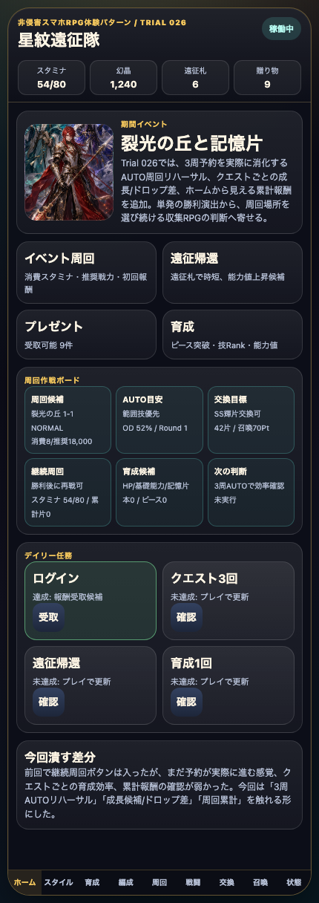
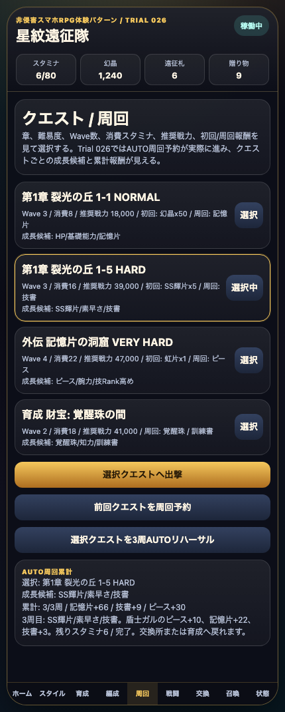
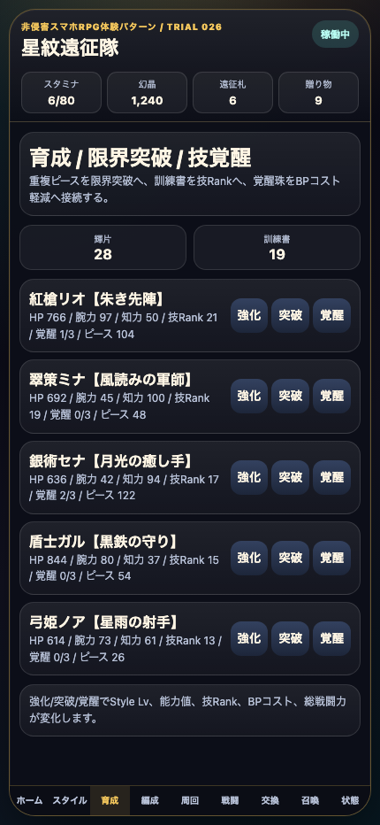

# SagaForge Trial 026: 3周AUTOリハーサルとクエスト別成長で「周回場所を選ぶ」感覚を入れる

前回のTrial 025では、勝利後の再戦導線、補助効果、召喚交換Ptショップを入れた。ユーザーからの「全然ロマサガRSとは程遠い」という評価に対して、今回もアプリ本体の触れる体験を先に改善した。

> 注意: アプリ本体では実在IP、公式素材、商標、ロゴ、公式文言、公式確率、公式UIの完全コピーは使わない。この記事では、期待される体験パターンを説明する文脈としてのみ実在タイトル名に触れる。

## 前回の何がロマサガRSから遠かったか

Trial 025で「再戦してAUTO」や「3周予約」という入口はできた。しかし、まだ次の点が遠かった。

| 不足 | なぜ遠く見えるか | 今回の扱い |
|---|---|---|
| 予約が実際に進まない | 周回系スマホRPGでは、勝利後に同じ場所を回し、素材が積み上がる感覚が重要 | 3周AUTOリハーサルを追加し、スタミナ消費、記憶片、技書、ピースを累計 |
| クエストごとの育成効率が薄い | どこを周回するかの判断がないと、単なる戦闘デモに見える | NORMAL/HARD/VERY HARD/覚醒珠で成長候補とドロップ傾向を分けた |
| ホームに周回結果が戻らない | 周回結果がホームや育成に戻らないと、スマホRPGの循環が弱い | ホーム作戦ボードにAUTO累計、育成候補、次の判断を表示 |

## 今回どの差分を潰したか

1. **3周AUTOリハーサル**
   - クエスト画面に「選択クエストを3周AUTOリハーサル」を追加。
   - 押すとスタミナを消費しながら3回分の結果を短縮計算する。
   - 記憶片、技書、スタイルピース、成長回数が増える。

2. **クエスト別の成長/ドロップ差**
   - NORMAL: HP/基礎能力/記憶片。
   - HARD: SS輝片/素早さ/技書。
   - VERY HARD: ピース/腕力/技Rank高め。
   - 覚醒珠の間: 覚醒珠/知力/訓練書。

3. **ホームから見える累計報酬**
   - 周回作戦ボードを4枠から6枠へ拡張。
   - AUTO累計周回数、累計記憶片、技書、ピース、次の判断を表示。
   - 周回後に育成/交換へ戻る理由が少し見えるようにした。

## 触れる導線

- 公開プレイアブル: `/sagaforge-app/index.html`（配信URLではこのパスを開く）
- 推奨確認順: ホーム → 周回 → HARDを選択 → 3周AUTOリハーサル → 育成 → 交換 → 戦闘 → 召喚

## スクリーンショット







## 実装メモ

今回も、記事より先に `playables/sagaforge-app/index.html` を更新した。

- Trial 026へ更新。
- クエスト画面にAUTO周回累計パネルを追加。
- `autoLoop` 状態を追加。
- `questGrowthHint()` でクエストごとの成長候補を表示。
- `startAutoLoop(3)` / `runAutoLoopStep()` で3周分の短縮周回を実行。
- `scripts/build_preview.py` にTrial 026記事とスクリーンショットコピー対象を追加。
- `playables/sagaforge-app/` が `preview/sagaforge-app/` にコピーされる状態を維持。

## 検証ログ

今回確認した主なコマンドは次の通り。

```text
node --check /tmp/sagaforge-trial026.js
python3 scripts/build_preview.py
node experiments/character-collection-rpg-trial-001/generated-repo/scripts/capture-playable-trial026.mjs
pnpm run lint
pnpm run typecheck
pnpm run test
pnpm run build
curl -I <preview-host>/sagaforge-app/index.html
curl -I <preview-host>/sagaforge-app/assets/party-key-art.png
```

主な確認内容:

- ホームにTrial 026の説明と6枠の周回作戦ボードが表示される。
- クエスト画面に成長候補とAUTO周回累計パネルが表示される。
- 3周AUTOリハーサル後、スタミナ、記憶片、技書、スタイルピース、育成表示が更新される。
- プレイアブルURLと主要画像URLが `http=200` を返す。

## まだ遠い点

今回で「周回予約が実際に進む」「周回場所ごとの成長候補」「累計報酬」は入ったが、まだ遠い。

- AUTO周回は短縮計算であり、バトル演出を挟んだ連続周回テンポではない。
- スタイル育成はまだ上昇値のランダム感、上限、場所ごとの能力成長制御が薄い。
- ホームのミッション、プレゼント、ショップ、イベント複数本の密度はまだ足りない。
- 戦闘はBP/OD/補助効果があるが、連携演出、複数キャラの個別行動、ターンごとの選択密度はまだ浅い。

## 次に潰す差分

次回は、次の1〜3個に絞る。

1. **AUTO周回にリザルト遷移を挟む**
   - 周回短縮だけでなく、Round→勝利→リザルト→再戦を画面上で段階表示する。
2. **スタイル育成の上限/成長傾向**
   - スタイルごとに上がりやすい能力、技Rank候補、ピース突破条件を分ける。
3. **ホームのスマホRPG密度強化**
   - イベント複数本、交換おすすめ、プレゼント詳細、ミッション受取、スタミナ回復判断をホームで触れるようにする。

## AIDD-Specへの学び

「AUTO周回」と書くだけでは、AIはボタンだけを作りがちだった。今回の改善から、AI Task Packetには次のように書く必要がある。

- AUTO周回は予約数、消費資源、累計報酬、停止条件、次の導線を画面に出す。
- クエストは名前だけでなく、消費、推奨戦力、Wave、成長候補、ドロップ傾向を持つ。
- 周回後の報酬は、ホーム、育成、交換のいずれかに反映される。

旅行の持ち物リストで言えば、「服を持つ」だけでは足りない。日数、天気、洗濯できるか、帰りの荷物が増えるかまで書くと判断しやすい。同じように、AIDD-Specでは画面名よりも「その操作で何が積み上がり、次にどこへ戻るか」を受け入れ条件にする必要がある。
