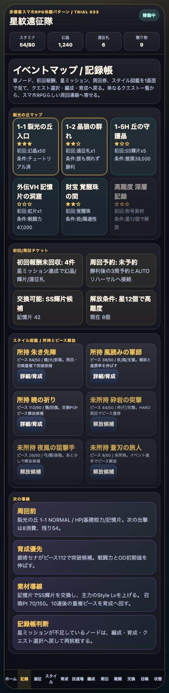
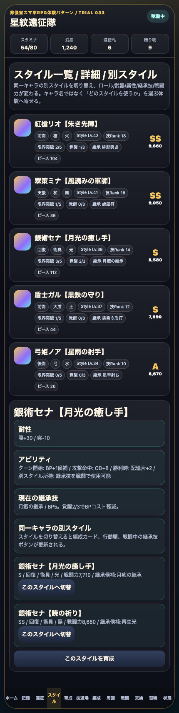

# SagaForge Trial 033: イベントマップ・初回報酬・スタイル図鑑で周回導線を強める

ユーザーからの「全然ロマサガRSとは程遠い」という評価は、今回も起点にした。前回まででホーム、スタイル、5人編成、クエスト、戦闘、遠征、育成、召喚は増えた。しかし、画面が増えただけでは、キャラ収集スマホRPGで期待される「今日はどのイベントを進め、どの報酬を回収し、どのスタイルを育てるか」という循環にはまだ弱い。

今回も記事より先に、触れるプレイアブル `playables/sagaforge-app/index.html` を更新した。実在IP・公式素材・ロゴ・公式コピー・公式確率は使わず、体験パターンだけを非侵害のオリジナル表現へ抽象化している。

## 前回の何がロマサガRSから遠かったか

Trial 032では、スタイル別アビリティ、遠征大成功、召喚段階演出を追加した。それでも次が遠かった。

1. **クエストが一覧選択のままに見える**
   消費スタミナ、推奨戦力、報酬はあったが、章ノード、初回報酬、星ミッションの進行感が薄かった。
2. **ホームからイベント進行の見通しが弱い**
   周回作戦ボードはあるが、現在どのノードを進めているか、星をいくつ集めたか、次の報酬は何かが一目では分かりにくかった。
3. **スタイル収集が所持カード一覧に寄りすぎている**
   所持スタイルだけではなく、未所持スタイル、ピース解放、あと何個で解放できるか、という収集RPGらしい目標表示が足りなかった。

## 今回どの差分を潰したか

Trial 033では、1サイクルで次の差分を潰した。

- 下部ナビに **記録** タブを追加。
- 記録画面に **イベントマップ / 記録帳** を追加。
- マップノードに、章番号、タイトル、星ミッション、初回報酬、解放条件、選択中表示を入れた。
- ホームに **イベント進行レール** を追加し、進行ノード数、星合計、次報酬、周回予約を見えるようにした。
- 記録画面に **初回/周回チケット** を追加し、未回収報酬、周回予約、交換可能状態、解放条件をまとめた。
- 記録画面に **スタイル図鑑 / 所持とピース解放** を追加し、所持/未所持、ピース数、解放候補、育成/詳細導線を追加した。

これで、単なる「クエスト一覧を押して戦闘」から一歩進み、「イベントマップで星/初回報酬を見る → クエストへ行く → 周回/交換/育成/スタイル解放へ戻る」というスマホRPGらしい循環が少し強くなった。

## 触れる確認ポイント

公開プレイアブルで次を確認できる。

1. ホームで **イベント進行** レールを見る。
2. 「イベントマップを開く」または下部ナビの **記録** を押す。
3. **裂光の丘マップ** でノード、星、初回報酬、解放条件を確認する。
4. ノードを押してクエスト選択へ遷移する。
5. **初回/周回チケット** で未回収報酬、交換可能、解放条件を見る。
6. **スタイル図鑑** で所持/未所持、ピース解放候補、スタイル詳細/育成導線を見る。

## AIDD-Spec / Control Planeへの学び

今回の学びは、キャラ収集RPGプロトタイプでは、個別画面の実装だけでなく、**プレイヤーが今日やることを決めるための進行台帳** が必要だという点だった。

| 観点 | これまでの欠落 | Trial 033の仕様化 |
|---|---|---|
| イベント進行 | クエスト一覧はあるが章進行が薄い | イベントマップ、星、初回報酬、解放条件 |
| ホーム密度 | 周回候補はあるが進行の見通しが弱い | イベント進行レールで星合計・次報酬・周回予約を表示 |
| スタイル収集 | 所持スタイル中心 | 所持/未所持、ピース数、解放候補、育成導線 |

AIDD Control PlaneのAI Task Packetには、今後「イベント進行契約」を追加したい。つまり、クエスト一覧だけでなく、ノード進行、初回報酬、ミッション達成、周回予約、交換、スタイル解放がどの画面で確認できるかを最初から書かせる項目である。

## まだ遠い点

まだ期待体験には遠い。特に次が残っている。

- イベントマップは静的なノード表示で、スクロールマップ、分岐、解放アニメーションまではない。
- 星ミッションは表示中心で、各条件の達成状態がバトル結果から完全に同期しているわけではない。
- スタイル図鑑はピース解放候補を表示するが、未所持から正式加入する演出や図鑑詳細はまだ浅い。
- ホームのバナー、ミッション、プレゼント、交換所、召喚Pt、イベントマップの相互誘導はまだ商用スマホRPGほど密ではない。
- 戦闘テンポは改善済みだが、全体攻撃、耐性、OD演出、周回リザルトのスピード感はさらに強化が必要。

## 次に潰す差分

次回は、次の1〜3個を優先したい。

1. **星ミッションとバトル結果の同期**
   誰も倒れず、弱点回数、OD発動などを勝利リザルトからイベントマップの星へ反映する。
2. **未所持スタイルのピース解放演出**
   ピースが足りたら図鑑から加入、加入後に編成候補へ出る流れを作る。
3. **ホームのイベントバナー密度強化**
   期間イベント、ミッション、プレゼント、交換所、召喚Pt到達、周回予約をより強く相互誘導する。

## 検証

今回の検証ログは `experiments/character-collection-rpg-trial-001/artifacts/character-collection-rpg-trial-033/terminal/` に保存した。

- `trial033-js-check.txt`: プレイアブル内scriptの構文検証。
- `trial033-build-preview.txt`: preview再生成。
- `trial033-playable-check.txt`: Playwrightによる主要UI表示・クリック確認とスクリーンショット保存。
- `trial033-public-url-check.txt`: 公開URLと主要画像のHTTP確認。

## 公開URL

公開プレイアブルURLは、この実行レポート側で共有する。記事本文にはローカル環境名や内部ホスト名を固定で残さない。
