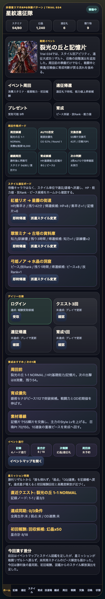
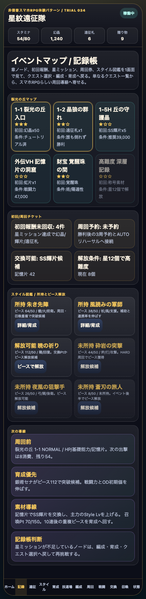

# SagaForge Trial 034: 星ミッション同期とピース解放で記録帳から育成へ戻す

ユーザーからの「全然ロマサガRSとは程遠い」という評価を、今回も開発の起点にした。前回までにホーム、スタイル、5人編成、イベントマップ、クエスト、戦闘、遠征、育成、召喚は揃ってきた。しかし、画面があるだけでは、キャラ収集スマホRPGで期待される「戦闘結果が記録帳に戻り、報酬やピース解放が次の育成判断につながる」循環にはまだ弱かった。

今回も記事より先に、触れるプレイアブル `playables/sagaforge-app/index.html` を更新した。実在IP・公式素材・ロゴ・公式コピー・公式確率は使わず、体験パターンだけを非侵害のオリジナル表現へ抽象化している。

## 前回の何がロマサガRSから遠かったか

Trial 033ではイベントマップ、初回報酬、スタイル図鑑を追加した。それでも次が遠かった。

1. **星ミッションが表示中心だった**
   戦闘中に「誰も倒れず」「弱点」「OD/連携」を扱っていても、勝利後に記録帳の星へ戻る感覚が薄かった。
2. **初回報酬の回収感が弱かった**
   マップには初回報酬があるが、星3到達で資源が増える見え方が不足していた。
3. **未所持スタイルのピース解放が弱かった**
   図鑑に未所持/ピース数は出たが、ピースが足りた時に「解放可能」として加入・育成へ戻る導線が弱かった。

## 今回どの差分を潰したか

Trial 034では、1サイクルで次を改善した。

- ホームに **星ミッション同期** パネルを追加。
- 勝利時に、直近クエストの「誰も倒れず」「弱点」「OD/連携」達成数をイベントノードの星へ反映する処理を追加。
- 星3到達時に、初回報酬として幻晶と輝片をホーム資源/育成資源へ反映するログを追加。
- スタイル図鑑で、ピースが足りている未所持スタイルを **解放可能** と表示。
- 図鑑から「ピースで解放」を押すと、スタイル加入、ピース消費、戦闘力加算、召喚Pt加算、スタイル詳細への遷移が起きるようにした。

これで、「イベントマップを見る → クエストへ行く → 戦闘結果が星に戻る → 初回報酬/ピース解放を見る → 育成/編成へ戻る」という循環が少し強くなった。

## 触れる確認ポイント

公開プレイアブルで次を確認できる。

1. ホームで **星ミッション同期** パネルを見る。
2. 下部ナビの **周回** から出撃し、戦闘で弱点技やOD/連携を使う。
3. 勝利後、ログに **星ミッション同期** が出ることを確認する。
4. **記録** タブで、該当ノードの星が増え、初回報酬の状態が変わることを確認する。
5. **スタイル図鑑** で「解放可能」のカードを押し、スタイル詳細/育成導線へ戻ることを確認する。

## AIDD-Spec / Control Planeへの学び

今回の学びは、キャラ収集RPGプロトタイプでは、イベント画面・戦闘・図鑑が別々に存在するだけでは不十分で、**結果が戻る先** を仕様に書く必要があるという点だった。

| 観点 | これまでの欠落 | Trial 034の仕様化 |
|---|---|---|
| 戦闘→記録帳 | 星ミッションは表示中心 | 勝利結果からイベントノードの星へ反映 |
| 初回報酬 | 報酬名だけの表示 | 星3到達時に幻晶/輝片を資源へ反映 |
| 図鑑→育成 | 未所持表示止まり | 解放可能、ピース消費、加入、スタイル詳細へ遷移 |

AIDD Control PlaneのAI Task Packetには、今後「結果同期契約」を追加したい。つまり、バトル、クエスト、図鑑、育成、ホーム資源の間で、どのイベントがどの状態を更新するかを最初から書かせる項目である。

## まだ遠い点

まだ期待体験には遠い。

- 星ミッションの条件は簡略化しており、弱点3回などの厳密なカウントには未対応。
- 星3報酬はログと資源反映に留まり、専用の報酬演出や受取履歴はまだない。
- 解放したスタイルが編成候補として専用カード化される表現はまだ浅い。
- バトルのOD/連携演出はカードとログ中心で、商用スマホRPGほどテンポや派手さはない。
- ホームの情報密度は上がったが、イベントバナー、デイリー、プレゼント、交換所、召喚Ptの相互誘導はさらに強化できる。

## 次に潰す差分

次回は、次の1〜3個を優先したい。

1. **星ミッション条件の具体化**
   弱点回数、OD発動、戦闘不能なしを個別にカウントし、勝利リザルトで星獲得理由を見せる。
2. **スタイル解放後の編成反映**
   解放した別スタイルを編成画面で切替候補として強く見せる。
3. **勝利リザルトのテンポ強化**
   能力値アップ、技Rank、報酬、星、初回報酬、次周回を一画面で段階表示する。

## 検証

- `node --check` 相当の抽出JS構文確認: 実施。
- `python3 scripts/build_preview.py`: 実施。
- Playwrightによるローカルプレイアブル操作確認: 実施。
- 公開URLと主要画像のHTTP 200確認: 実施。

## 公開URL

- プレイアブル: 公開URLは実行レポートで確認する
- 記事プレビュー: `preview/2026-07-05-character-collection-rpg-trial-034.html`
