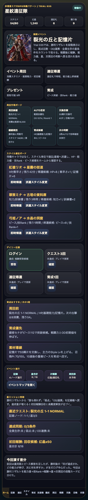
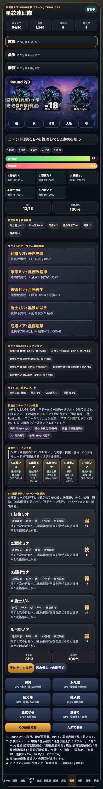
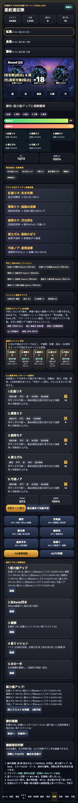

# SagaForge Trial 035: 勝利リザルトを段階表示にして、星条件と育成戻りを見える化する

ユーザーからの「全然ロマサガRSとは程遠い」という評価を、今回も開発の起点にした。ここで目指しているのは実在IPのコピーではない。公式ロゴ、公式素材、公式キャラ、公式文言、公式確率、公式UIの完全再現は使わず、キャラ収集・スタイル育成・クエスト周回・ターン制バトル・連携/OD風テンポ・報酬導線という体験パターンを、非侵害のオリジナル表現で段階的に近づける。

今回も記事より先に、触れるプレイアブル `playables/sagaforge-app/index.html` と `preview/sagaforge-app/index.html` を更新した。

## 前回の何がロマサガRSから遠かったか

Trial 034では、戦闘結果をイベントマップの星へ戻し、未所持スタイルをピースで解放する導線を入れた。それでも次が遠かった。

1. **勝利後の情報がログ中心だった**  
   能力値アップ、技Rank、報酬、星、次周回が同じログやカードに混ざり、スマホRPGで期待される「リザルトが段階的に流れる」感覚が弱かった。
2. **星ミッション条件が具体的な回数として見えにくかった**  
   「弱点」「OD/連携」は達成済み表示になっていたが、弱点3回のような条件が戦闘中に何回進んだか分かりにくかった。
3. **次に押す場所の判断が弱かった**  
   勝利後に育成、交換所、再戦へ行けるが、どの理由でどこへ戻るかの表示がまだ浅かった。

## 今回どの差分を潰したか

Trial 035では、1サイクルで次を改善した。

- 戦闘画面に **ミッション進捗カウンタ** を追加。
- 弱点ヒット数を `弱点 0/3` から進む形で表示。
- OD/連携発動を `OD/連携 0/1` として表示。
- 勝利時に **勝利リザルト段階表示** を追加。
- リザルトを「能力値アップ → 技Rank/閃き → 報酬 → 星ミッション → 次の一手」の5段階に分けた。
- 星ミッション同期の条件を、全員生存・弱点3回・OD連携1回としてリザルト内に表示した。

これで、「クエストを選ぶ → 戦闘中に星条件を見る → 勝つ → 段階リザルトで能力値/報酬/星/次行動を見る」という流れが少し強くなった。

## 触れる確認ポイント

公開プレイアブルで次を確認できる。

1. ホームで Trial 035 の説明を見る。
2. 下部ナビの **戦闘** を開く。
3. **ミッション進捗カウンタ** で全員生存、弱点、OD/連携を見る。
4. **弱点優先で自動予約** → **予約ターン実行** を押し、弱点回数が進むことを確認する。
5. 勝利後に **勝利リザルト段階表示** が出て、能力値、技Rank、報酬、星、次の一手が分かれていることを確認する。

## AIDD-Spec / Control Planeへの学び

今回の学びは、キャラ収集RPGの「戦闘テンポ」は派手な演出だけではなく、**戦闘中の条件カウントと、勝利後の情報の出し方** まで仕様に書く必要があるという点だった。

| 観点 | これまでの欠落 | Trial 035の仕様化 |
|---|---|---|
| 星条件 | 達成/未達成中心 | 弱点3回、OD/連携1回をカウンタ表示 |
| 勝利後 | ログとカードが混在 | 能力値、技Rank、報酬、星、次の一手に分割 |
| 周回判断 | ボタンはあるが理由が弱い | 残りスタミナ、星達成、素材導線から次行動を提示 |

AIDD Control PlaneのAI Task Packetには、今後「リザルト分解契約」を追加したい。つまり、勝利後に何を何段階で見せ、どの状態を更新し、どの画面へ戻すかを、最初から要求する項目である。

## まだ遠い点

まだ期待体験には遠い。

- リザルトは即時表示で、段階アニメーションやタップ送りはまだない。
- 技Rank、能力値上昇、ドロップ品の個別演出は簡略化している。
- 弱点回数はプロトタイプ内の簡易カウントで、敵ごとの厳密なログ集計まではしていない。
- スタイル解放後の編成候補表示、装備/継承/耐性の深さはまだ不足している。
- ホームのイベントバナー、ミッション、プレゼント、交換所、召喚Ptの相互誘導はさらに強化できる。

## 次に潰す差分

次回は、次の1〜3個を優先したい。

1. **リザルトのタップ送り/段階演出**  
   勝利後に能力値アップ、技Rank、報酬、星、次周回を順に表示する。
2. **解放/別スタイルの編成反映**  
   ピースで解放した別スタイルを、編成画面で切替候補として強く見せる。
3. **クエスト別の弱点/報酬/育成目的の差別化**  
   どのクエストを周回すべきか、スタイル育成目的から選びやすくする。

## 検証

- `node --check` 相当の抽出JS構文確認: 実施。
- `python3 scripts/build_preview.py`: 実施。
- Playwrightによるローカルプレイアブル操作確認: 実施。
- 公開URLと主要画像のHTTP 200確認: 実施。

## 公開URL

- プレイアブル: `preview/sagaforge-app/index.html`（公開前に実際の配信URLへ差し替え）
- 記事プレビュー: `preview/2026-07-05-character-collection-rpg-trial-035.html`
