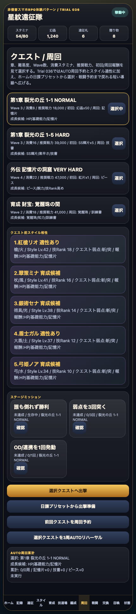
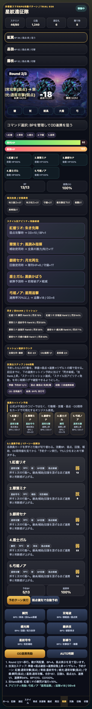

# SagaForge Trial 036: ホームから日課プリセットで周回へ入る導線を足す

前回までで、スタイル、5人編成、陣形、クエスト、複数Round戦闘、BP、OD/連携、勝利リザルト、交換所、召喚結果カードは入った。けれど、ユーザー評価の「まだロマサガRSとは程遠い」に照らすと、まだ大きな不足がある。

今回の改善は、実在IP・公式素材・商標・ロゴ・キャラ・公式文言・公式確率・公式UIコピーを使わず、キャラ収集スマホRPGで期待される体験パターンだけを抽象化している。

## 前回の不足

前回は勝利後の段階リザルトを強めたが、次の点がまだ弱かった。

| 不足 | 何が問題だったか | 今回の狙い |
|---|---|---|
| ホームの毎日触る導線 | ホームは情報密度が増えたが、「今日まず何を押すか」がまだ弱い | 日課プリセットを追加し、受取→育成候補→周回→戦闘予約を1本にする |
| 周回準備の短さ | クエストや戦闘はあるが、各画面を自分で探す必要がある | ホームからクエスト選択へ直接遷移し、3周予約もセットする |
| 戦闘テンポへの接続 | 5人予約バトルはあるが、日課導線とは別物に見えた | 日課プリセットで弱点優先の予約行動まで事前セットする |

## 実装した差分

`playables/sagaforge-app/index.html` を Trial 036 に更新した。

1. ホームに「日課プリセット / 1タップ周回準備」パネルを追加。
2. `runDailyRoute()` を追加し、プレゼント受取、育成候補選択、3周予約、弱点優先の5人行動予約をまとめて行うようにした。
3. クエスト画面に「日課プリセットから出撃準備」ボタンを追加。
4. 既存のスタイル、5人編成、陣形、Round、BP、OD/連携、複数スキル、勝利報酬、ガチャ結果カード、失敗状態は維持した。

## スクリーンショット

日課プリセットからクエスト準備へ入った状態。



日課導線から出撃し、弱点優先の5人予約バトルへ接続した状態。



## 検証

今回の変更範囲は静的プレイアブルが中心なので、Playwrightで次を確認した。

- Trial 036の表示が出る。
- ホームの日課プリセットを押すとクエスト画面へ遷移する。
- クエスト前スタイル相性が表示される。
- 出撃後、弱点優先で自動予約できる。
- 予約ターン実行後も5人連携予約と連携率が表示される。
- スクリーンショット2枚を保存できる。

実行結果:

```text
JS syntax OK
playable smoke OK: daily route and battle preset screenshots saved
```

## AIDD-Specへの学び

今回の差分は「見た目を足す」ではなく、「スマホRPGらしい毎日の操作ループを標準の検証対象にする」方向の改善だった。

AI Task Packetに入れるべき項目は次。

- ホームはイベントバナーだけでなく、日課・受取・育成・周回・失敗状態への短い導線を持つ。
- キャラ収集RPGでは、クエスト単体ではなく、ホームからクエスト、編成、戦闘、リザルト、育成へ戻るループを検証する。
- バトルはHPが少し減るだけでなく、BP、弱点、複数人行動、連携率、Round、報酬へ接続する。
- プレイアブルURLを毎回維持し、記事より先に触れる体験を改善する。

## まだ遠い点

- 戦闘演出はカードとログ中心で、スマホRPGの派手なテンポにはまだ届いていない。
- スタイル差し替えと技継承はあるが、所持スタイル一覧から編成へ入れる手触りはまだ浅い。
- 育成の長期目標、イベント交換、ミッション、ガチャ交換Ptの相互作用はあるが、まだ数値の説得力が弱い。

## 次に潰す差分

次は、日課プリセットの先にある「短時間周回の気持ちよさ」を強める。

- 3周AUTOの結果を、成長・素材・星ミッション・交換候補のリザルトカードとしてまとめる。
- スタイル別に「今回伸びた能力」「次に伸ばす技」「不足素材」を表示する。
- 戦闘中の連携演出を、ログだけでなく段階的なカットイン風表示に寄せる。
