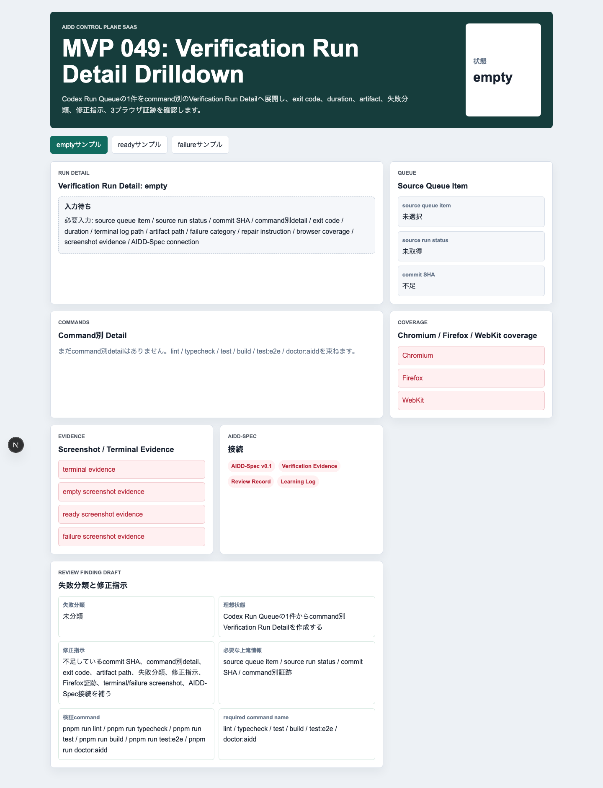
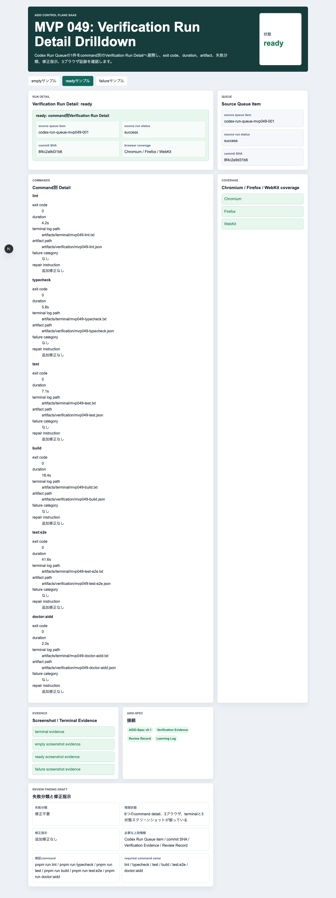
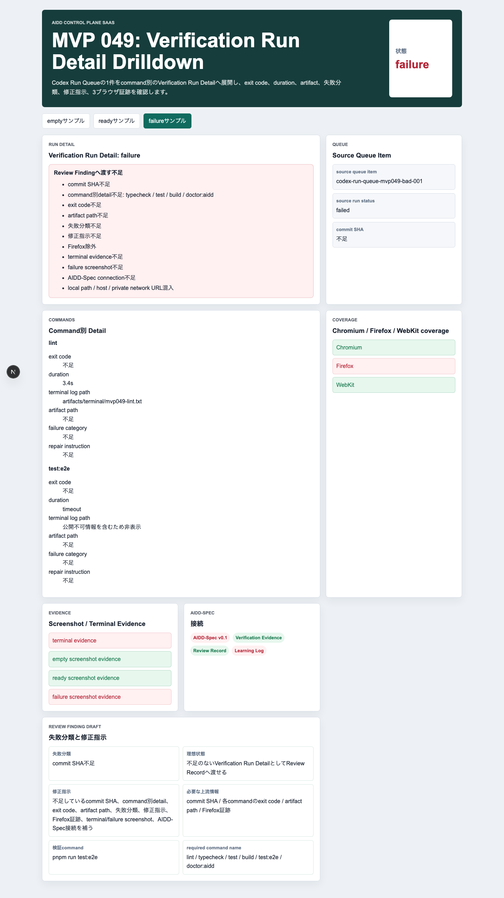
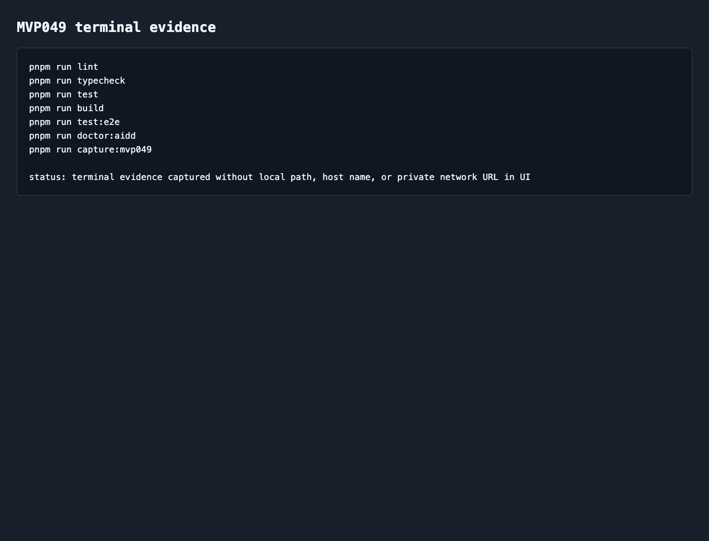

# AIDD Control Plane MVP 049：AI実行結果をcommand別の明細に分けるVerification Run Detail

> 2026-07-06 / Codex Mastery Lab  
> 記事種別: Experiment / SaaS  
> 将来の書籍章: 第10章 Verification Evidence、第11章 Learning Log、第12章 雑プロンプト vs AI Task Packet、第18章 AIDD Control PlaneのMVP

## タイトル案

「テストしたはず」を分解する：Codex実行結果をcommand別の証跡にする

## 読者の悩み

AIに実装を頼むと、最後に「lint、test、buildは通りました」とまとめて報告されがちです。けれど、実際にレビューする側が知りたいのはもう少し細かい情報です。

- どのcommandを実行したのか
- exit codeは0だったのか
- 何秒かかったのか
- ログはどこに保存したのか
- PlaywrightはChromium / Firefox / WebKitを本当に見たのか
- 失敗した場合、失敗分類と修正指示はあるのか
- terminal evidenceやfailure screenshotは残っているのか

前回のMVP 048では、Codexへ渡す直前に `execute_now` の1件だけをready / blockedで判定するReadiness Gateを作りました。今回は、その次に必要な **Verification Run Detail Drilldown** を作りました。

家計簿で「今月はお金を使いました」だけでは役に立たないのと同じです。食費、交通費、通信費のように分けて記録して初めて、どこを直すべきかが見えます。AI実行の検証も、command別に分けて残す必要があります。

## 今回の仮説

> Codex Run Queueの1件をcommand別のVerification Run Detailへ分解すれば、「何が通ったか」「何が足りないか」「次にどの上流情報を直すか」をReview Record / Learning Logへ渡しやすくなる。

AIDD Control Planeは、AIにコードを書かせるだけのボタンではありません。AI実行の前後に必要な判断、証跡、学びを、誰でも追える形にするSaaSです。MVP 049は、実行後の検証を雑な一言で終わらせないための明細画面です。

## 実験内容

`experiments/aidd-control-plane-mvp-049/generated-repo/` に、Next.js + TypeScript + pnpmで **Verification Run Detail Drilldown** を実装しました。

今回の画面で確認する項目は次です。

| チェック項目 | 何を確認したいのか | なぜ必要か |
| --- | --- | --- |
| source queue item | どのCodex Run Queue itemの結果か | ログだけが孤立するのを防ぐため |
| source run status | 実行全体がsuccess / failedか | 後続レビューの入口を揃えるため |
| commit SHA | どのコードに対する検証か | 後から同じ状態を追跡するため |
| command detail | lint/typecheck/test/build/e2e/doctorの明細 | 「全部通った」という曖昧な報告を避けるため |
| exit code | commandが実際に成功したか | 成功/失敗を機械的に判断するため |
| artifact path | ログやレポートの場所 | レビュー時に証跡を開けるようにするため |
| failure category | 失敗の種類 | 次回AI Task Packetへ戻しやすくするため |
| repair instruction | 何を直すべきか | 次のCodex依頼を小さく具体化するため |
| Chromium / Firefox / WebKit | 3ブラウザE2Eを見たか | 1ブラウザだけの成功を防ぐため |
| terminal / screenshot evidence | 画面とログ証跡が残るか | note記事や公開repoで検証可能にするため |

## 画面キャプチャ

### empty：まだRun Queue itemを明細化していない



emptyでは、Codex Run Queueから1件を選び、command別のVerification Run Detailを作る必要があることを表示します。まだcommit SHA、command明細、証跡、Review Finding draftは揃っていません。

### ready：6つのcommand明細と3ブラウザ証跡が揃っている



readyでは、`pnpm run lint`、`pnpm run typecheck`、`pnpm run test`、`pnpm run build`、`pnpm run test:e2e`、`pnpm run doctor:aidd` の6つをcommand別に表示します。exit code、duration、terminal log path、artifact path、failure category、repair instructionが揃っているため、Review Recordへ渡せます。

### failure：不足している証跡をReview Finding draftへ変える



failureでは、commit SHA不足、command別detail不足、exit code不足、artifact path不足、失敗分類不足、修正指示不足、Firefox除外、terminal evidence不足、failure screenshot不足、local path / host / private network URL混入、AIDD-Spec connection不足を検出します。

ここで重要なのは、単に赤くするだけではないことです。Review Finding draftとして、失敗分類、理想状態、修正指示、必要な上流情報、検証commandまで出します。次回のAI Task Packetへ戻すためです。

### terminal evidence



## 失敗と修正

最初にCodexを呼び出したとき、HermesのPATHには `codex` が見つからず、Codex CLIのフルパスを指定して再実行しました。これはアプリ品質の失敗ではありませんが、実行環境の前提がログに残る典型例です。

その後、CodexはMVP049のプロジェクトを生成し、自己申告として検証済みと報告しました。ただし、Codexの自己申告は完了条件にしません。Hermes側で個別に `pnpm install --frozen-lockfile`、lint、typecheck、test、build、3ブラウザE2E、doctor、captureを実行し直しました。

`pnpm run build` ではNext.jsのESLint plugin警告が出ましたが、終了コードは0です。独立した `pnpm run lint` は `eslint . --max-warnings=0` で通過しました。警告は今後の依存・設定改善候補として残します。

## 検証ログ

| コマンド | 結果 | メモ |
| --- | --- | --- |
| `pnpm install --frozen-lockfile` | pass | lockfile固定で依存解決 |
| `pnpm run lint` | pass | ESLintエラーなし |
| `pnpm run typecheck` | pass | TypeScriptエラーなし |
| `pnpm run test` | pass | Vitest 3 tests |
| `pnpm run build` | pass | Next.js build成功。ESLint plugin警告を記録 |
| `pnpm run test:e2e` | pass | 9 passed。Chromium / Firefox / WebKit |
| `pnpm run doctor:aidd` | pass | MVP049 token、AIDD-Spec接続、capture scriptを確認 |
| `pnpm run capture:mvp049` | pass | empty / ready / failure / terminal evidenceを生成 |

E2Eの最終結果は次です。

```text
9 passed (18.9s)
```

## 読者が使えるチェックリスト

AI実行結果を受け取ったら、最低限これだけ確認します。

| チェック項目 | 何を確認したいのか | なぜ必要か |
| --- | --- | --- |
| command別に分かれているか | lint/typecheck/test/build/e2e/doctorが個別に見えるか | 「まとめて通った」という曖昧さを減らすため |
| exit codeがあるか | 成功/失敗を機械的に判断できるか | 人の記憶や自己申告に頼らないため |
| artifact pathがあるか | ログやレポートを後から開けるか | レビューと記事化の証拠にするため |
| 3ブラウザが揃うか | Firefoxを外していないか | UI差分の見落としを減らすため |
| failure categoryがあるか | 失敗の種類が分類されているか | 次回の修正依頼を小さくするため |
| repair instructionがあるか | 次に何を直すかが明確か | Codexへ雑に丸投げしないため |
| 公開可能か | local path、host名、private network URLが混ざっていないか | 公開記事やrepoで漏えいしないため |

## SaaS / AIDD-Specへの接続

MVP 049は、AIDD Control Planeの次の流れに入ります。

```text
Codex Run Queue
  -> Verification Run Detail
  -> Evidence Repair Delta Generator
  -> Repair Delta Priority Decision Workspace
  -> 次回AI Task Packet / Codex prompt
```

AIDD-Spec v0.1の観点では、これは **Verification Evidenceをcommand単位へ細かくする部品** です。料理でいえば「味見した」だけでなく、塩、火加減、盛り付け、時間をメモして次回に活かす段階です。

## 次回

次回は、Verification Run Detailで見つけた failed / evidence_missing / timeout を、次回AI Task Packet delta、Codex prompt delta、検証command、rollback条件、Learning Logへ戻す **Evidence Repair Delta Generator** を進めるのが自然です。
