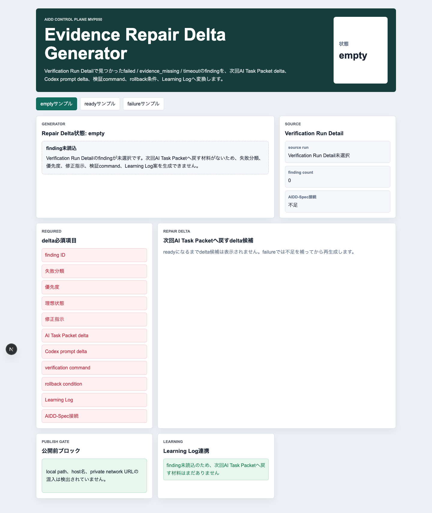
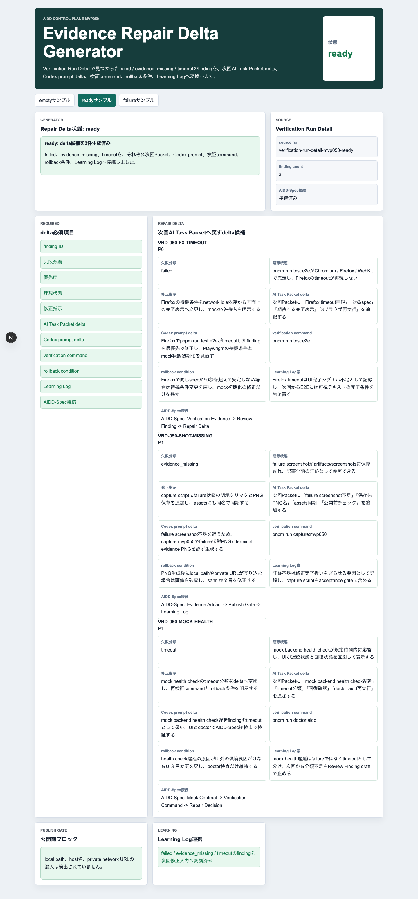
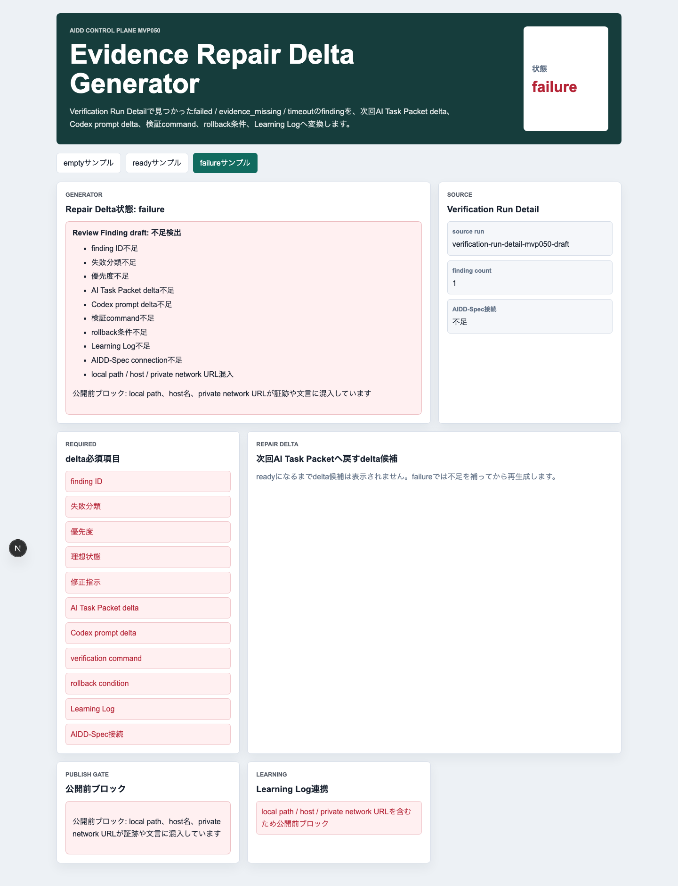
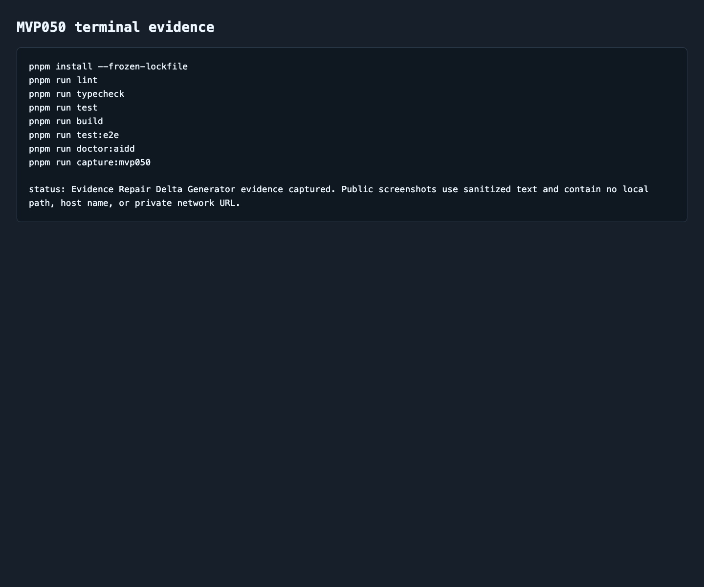

# AIDD Control Plane MVP 050：失敗ログを次回AI Task Packetへ戻すEvidence Repair Delta Generator

> 2026-07-06 / Codex Mastery Lab  
> 記事種別: Experiment / SaaS  
> 将来の書籍章: 第10章 Verification Evidence、第11章 Learning Log、第12章 雑プロンプト vs AI Task Packet、第18章 AIDD Control PlaneのMVP

## タイトル案

「失敗しました」で終わらせない：AI開発の検証ログを次回の修正依頼に変える

## 読者の悩み

AIに実装を頼むと、失敗ログはよく残ります。けれど、そのログを次にどう使うかは人間側に丸投げされがちです。

- FirefoxだけE2Eがtimeoutした
- failure screenshotを撮り忘れた
- mock backendのhealth checkが遅い
- local pathやprivate URLが証跡に混ざった
- でも次回のAI Task Packetには、何を書き足せばよいのかわからない

前回のMVP 049では、Codex実行結果をcommand別のVerification Run Detailに分解しました。今回はその次です。command別明細で見つけた `failed` / `evidence_missing` / `timeout` を、次回のAI Task Packet delta、Codex prompt delta、検証command、rollback条件、Learning Logへ戻す **Evidence Repair Delta Generator** を作りました。

料理でいえば、「焦げた」とだけメモするのではなく、「火を弱める」「次回は3分で一度見る」「焦げたらこの手順に戻す」までレシピに追記する感じです。AI駆動開発でも、失敗を次回の具体的な依頼に変える仕組みが必要です。

## 今回の仮説

> Verification Run DetailのfindingをRepair Deltaへ変換できれば、AIへの次回依頼が「直して」ではなく、検証可能な小さな差分になる。

AIDD Control Planeは、AIにコードを書かせるだけのボタンではありません。曖昧な失敗を、再利用できる上流情報へ戻すSaaSです。MVP 050はその変換部分を小さく実装しました。

## 実験内容

`experiments/aidd-control-plane-mvp-050/generated-repo/` に、Next.js + TypeScript + pnpmで **Evidence Repair Delta Generator** を実装しました。

今回の画面で確認する項目は次です。

| チェック項目 | 何を確認したいのか | なぜ必要か |
| --- | --- | --- |
| finding ID | どの失敗から作ったdeltaか | 失敗ログと修正依頼を対応づけるため |
| 失敗分類 | failed / evidence_missing / timeout を分ける | 同じ「失敗」でも直し方が違うため |
| 優先度 | P0 / P1 / P2 を決める | 次回Codex依頼を小さく並べるため |
| AI Task Packet delta | 次回packetへ追記する文 | 雑な「直して」を避けるため |
| Codex prompt delta | Codexへ渡す追加指示 | 実装担当AIが迷わないようにするため |
| verification command | 修正後に何を実行するか | 完了条件を自己申告にしないため |
| rollback condition | どこまで戻すか | 直しすぎや別バグ混入を防ぐため |
| Learning Log | なぜこの修正が必要だったか | 次回以降の標準に戻すため |
| 公開前ブロック | local pathやprivate URLが混ざらないか | noteや公開repoへ安全に出すため |

## 画面キャプチャ

### empty：まだfindingを読み込んでいない



emptyでは、Verification Run Detail findingをまだ読み込んでいないため、次回AI Task Packetへ戻す材料がないことを表示します。ここで無理にCodexへ依頼すると、また「いい感じに直して」という雑な依頼になりやすい状態です。

### ready：3種類の失敗をRepair Deltaへ変換する



readyでは、3つのdelta候補を表示します。

1. `failed`: `pnpm run test:e2e` がFirefoxでtimeoutしたfinding
2. `evidence_missing`: failure screenshotが不足したfinding
3. `timeout`: mock backend health checkが遅延したfinding

それぞれに、AI Task Packet delta、Codex prompt delta、verification command、rollback condition、Learning Log案、AIDD-Spec接続を持たせました。ここまで分解すると、次回のCodex依頼は「失敗を直して」ではなく、「このfindingを、この検証commandで確認できる形へ直して」になります。

### failure：不足項目と公開前ブロックを止める



failureでは、finding ID不足、失敗分類不足、優先度不足、AI Task Packet delta不足、Codex prompt delta不足、検証command不足、rollback条件不足、Learning Log不足、AIDD-Spec connection不足、local path / host / private network URL混入を検出します。

特に公開前ブロックは重要です。Markdownだけを置換しても、画像やterminal evidenceにlocal pathが写っていれば公開物としては危険です。MVP 050では危険サンプルを検出し、「公開前ブロック」として日本語で表示します。

### terminal evidence



## 失敗と修正

今回のCodex実行では、最初にプロンプトの相対パス指定を間違え、空の入力でCodexを起動してしまいました。すぐに絶対パスで再実行し、MVP050の実装を生成しました。この失敗は、まさに今回のテーマに近いです。実行ログがあるだけでは不十分で、次回の実行手順に「プロンプトは絶対パスで読む」という修正情報を戻す必要があります。

また、`pnpm run build` では前回同様にNext.jsのESLint plugin警告が出ました。終了コードは0で、独立した `pnpm run lint` は `eslint . --max-warnings=0` で通っています。ただし、警告は依存・設定改善の候補としてLearning Logへ残すべきです。

## 検証ログ

| コマンド | 結果 | メモ |
| --- | --- | --- |
| `pnpm install --frozen-lockfile` | pass | lockfile固定で依存解決 |
| `pnpm run lint` | pass | ESLintエラーなし |
| `pnpm run typecheck` | pass | TypeScriptエラーなし |
| `pnpm run test` | pass | Vitest 3 tests |
| `pnpm run build` | pass | Next.js build成功。ESLint plugin警告を記録 |
| `pnpm run test:e2e` | pass | 9 passed。Chromium / Firefox / WebKit |
| `pnpm run doctor:aidd` | pass | MVP050 token、AIDD-Spec接続、3ブラウザ設定、local pathブロック文言を確認 |
| `pnpm run capture:mvp050` | pass | empty / ready / failure / terminal evidenceを生成 |

E2Eの最終結果は次です。

```text
9 passed (9.9s)
```

unit testは次です。

```text
Tests  3 passed (3)
```

## 読者が使えるチェックリスト

AI実装の失敗ログを受け取ったら、次の形へ変換できるかを確認します。

| チェック項目 | 何を確認したいのか | なぜ必要か |
| --- | --- | --- |
| finding IDがあるか | どの失敗を直すのか | ログと修正依頼を結びつけるため |
| 分類があるか | failed / evidence_missing / timeout など | 修正方法を間違えないため |
| 優先度があるか | P0 / P1 / P2 | 次回Codex依頼を小さくするため |
| AI Task Packet deltaがあるか | 上流文書へ何を足すか | 同じ失敗を繰り返さないため |
| Codex prompt deltaがあるか | AIへ何を頼むか | 「いい感じに直して」を避けるため |
| verification commandがあるか | 修正後に何を実行するか | 完了を自己申告にしないため |
| rollback条件があるか | 失敗時に何を戻すか | 修正範囲を広げすぎないため |
| Learning Logがあるか | なぜ必要だったか | チームの標準へ戻すため |
| 公開可能か | local pathやprivate URLがないか | 記事・preview・repo公開で漏えいしないため |

## SaaS / AIDD-Specへの接続

MVP 050は、AIDD Control Planeの流れでは次の位置に入ります。

```text
Codex Run Queue
  -> Verification Run Detail
  -> Evidence Repair Delta Generator
  -> Repair Delta Priority Decision Workspace
  -> 次回AI Task Packet / Codex prompt
```

AIDD-Spec v0.1の観点では、これは **Verification EvidenceをLearning LogとAI Task Packetへ戻す部品** です。失敗を記録して終わりではなく、次回の共通説明へ戻すことで、AIと人間レビューアの両方が同じチェックリストを見られるようにします。

## 次回

次回は、複数のRepair DeltaをP0 / P1 / P2で並べ替え、1回のCodex実行に入れるものと後回しにするものを分ける **Repair Delta Priority Decision Workspace** を進めるのが自然です。
