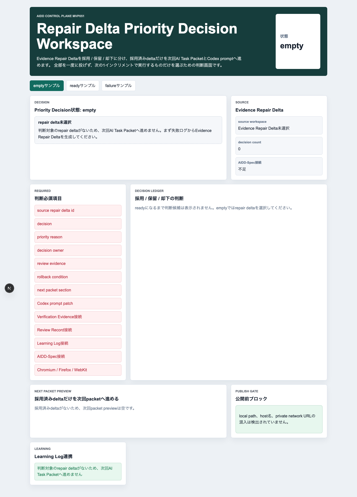
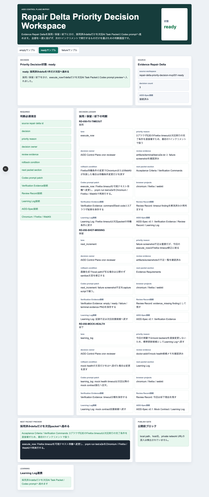
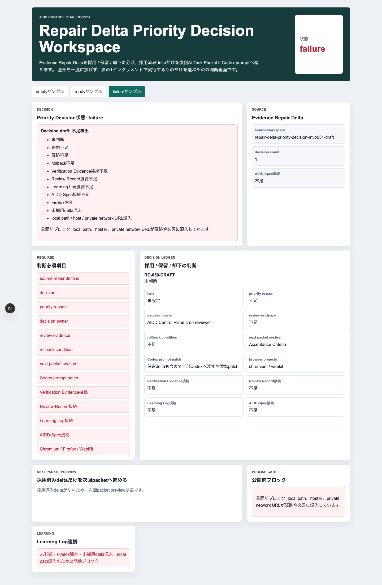
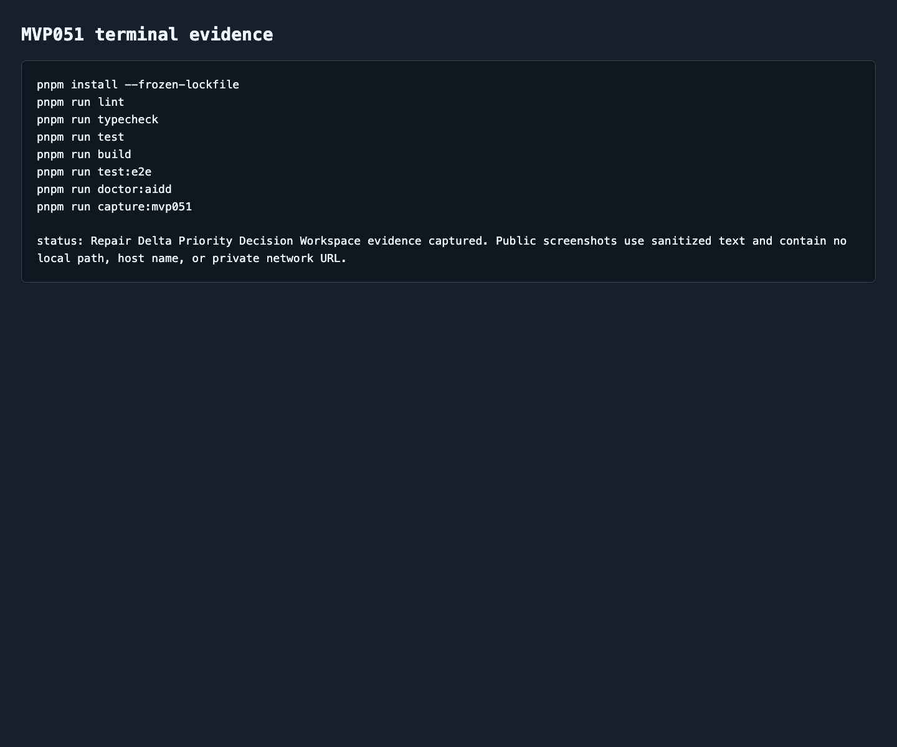

# AIDD Control Plane MVP 051：失敗修正deltaを「全部投げない」ための優先判断画面

> 2026-07-06 / Codex Mastery Lab  
> 記事種別: Experiment / SaaS  
> 将来の書籍章: 第10章 Verification Evidence、第11章 Learning Log、第12章 雑プロンプト vs AI Task Packet、第18章 AIDD Control PlaneのMVP

## タイトル案

AIへの修正依頼を増やしすぎない：失敗ログから作ったdeltaを採用・保留・却下に分ける

## 読者の悩み

AI開発で失敗ログを丁寧に読めるようになると、今度は別の問題が出ます。

- 直したいことが多すぎる
- 失敗ログから作った修正案を全部Codexへ渡してしまう
- その結果、1回の依頼が大きくなり、どの修正で壊れたのかわからなくなる
- FirefoxだけのE2E失敗、画像証跡不足、mock health遅延を同時に直そうとして混乱する

前回のMVP 050では、Verification Run Detailの失敗をEvidence Repair Deltaへ変換しました。今回はその次です。作ったdeltaをすべて実行するのではなく、**採用 / 保留 / 却下**に分け、採用済みdeltaだけを次回AI Task PacketとCodex promptへ進める **Repair Delta Priority Decision Workspace** を作りました。

料理でいえば、買い物メモに書いた材料を全部買うのではなく、「今日作る一品に必要な材料だけ」を選ぶ感じです。AI駆動開発でも、失敗から得た学びを全部同時に投げず、次の1回で実行するものだけを決める必要があります。

## 今回の仮説

> Evidence Repair Deltaを採用 / 保留 / 却下に分ければ、次回Codex依頼を小さく保ち、Verification EvidenceとReview Recordを追いやすくなる。

AIDD Control Planeは、AIにコードを書かせるだけのボタンではありません。失敗を読み、修正差分を作り、さらに「次に実行する1つ」を安全に選ぶSaaSです。MVP 051は、その判断レイヤーを小さく実装しました。

## 実験内容

`experiments/aidd-control-plane-mvp-051/generated-repo/` に、Next.js + TypeScript + pnpmで **Repair Delta Priority Decision Workspace** を実装しました。

今回のチェック項目は次です。

| チェック項目 | 何を確認したいのか | なぜ必要か |
| --- | --- | --- |
| source repair delta id | どの修正deltaを判断したか | 失敗ログと次回依頼をつなぐため |
| decision | 採用 / 保留 / 却下を決めたか | 全deltaをCodexへ投げないため |
| priority reason | なぜ今やるのか | 次の1インクリメントを小さく保つため |
| decision owner | 誰が判断したか | Review Recordとして追えるようにするため |
| review evidence | 判断の根拠ログや画像があるか | 気分ではなく証跡で決めるため |
| rollback condition | 失敗時にどこまで戻すか | 直しすぎを防ぐため |
| Firefox含む3ブラウザ | Chromiumだけで済ませていないか | 3ブラウザE2Eの品質を維持するため |
| 未採用delta混入 | 保留・却下をpromptに混ぜていないか | Codex依頼の肥大化を防ぐため |
| 公開前ブロック | local pathやprivate URLがないか | noteや公開previewへ安全に出すため |

## 画面キャプチャ

### empty：判断対象がまだない



emptyでは、判断対象のrepair deltaがないため、次回AI Task Packetへ進めないことを表示します。ここで無理に進めると、また「いい感じに直して」という曖昧な依頼に戻ります。

### ready：採用済みdeltaだけを次回へ進める



readyでは、3つのdeltaを表示しました。

1. `RD-050-FX-TIMEOUT`: 採用。Firefox timeoutは次回実行の完了条件を壊すため、execute_nowへ入れる
2. `RD-050-SHOT-MISSING`: 保留。重要だが、今回の1インクリメントからは外す
3. `RD-050-MOCK-HEALTH`: 却下。今回はmock backendを直接変更しないため、Learning Logへ戻す

重要なのは、画面下のNext Packet Previewに **採用済みdeltaだけ** が入ることです。保留や却下までCodex promptへ混ぜると、依頼が大きくなりすぎます。

### failure：未判断・Firefox除外・未採用delta混入を止める



failureでは、未判断、理由不足、証跡不足、rollback不足、Firefox除外、未採用delta混入、AIDD-Spec接続不足、local path / host / private network URL混入を検出します。

特に「未採用delta混入」は今回の主役です。保留や却下にしたdeltaがCodex promptへ入ると、せっかく判断した意味がなくなります。MVP 051では、これを公開前・実行前のブロック理由として表示します。

### terminal evidence



## 失敗と修正

今回の実行では、Codex CLIを起動しようとしたところ、cron環境で `codex: command not found` になりました。そこで、Codex生成を待たず、既存MVP050をコピーしてMVP051へ手動で更新し、独立検証を続行しました。

これはAIDD Control Planeの観点では重要な失敗です。AI実行そのものが使えない場合でも、AI Task Packet、検証計画、証跡、記事化は止めずに進め、失敗理由をLearning Logへ戻す必要があります。

また、最初のE2EではPlaywrightのstrict modeで同じ文言が2箇所に見つかり、empty / readyテストが失敗しました。これはアプリの機能不良ではなく、テストの指定が曖昧だったためです。locatorを `empty state` と `pre` に絞り、3ブラウザE2Eを再実行して成功させました。

## 検証ログ

| コマンド | 結果 | メモ |
| --- | --- | --- |
| `pnpm install --frozen-lockfile` | pass | lockfile固定で依存解決 |
| `pnpm run lint` | pass | ESLintエラーなし |
| `pnpm run typecheck` | pass | TypeScriptエラーなし |
| `pnpm run test` | pass | Vitest 3 tests |
| `pnpm run build` | pass | Next.js build成功。ESLint plugin警告は既知の改善候補 |
| `pnpm run test:e2e` | pass | 9 passed。Chromium / Firefox / WebKit |
| `pnpm run doctor:aidd` | pass | MVP051 token、AIDD-Spec接続、3ブラウザ設定、未採用delta混入検出を確認 |
| `pnpm run capture:mvp051` | pass | empty / ready / failure / terminal evidenceを生成 |

E2Eの最終結果は次です。

```text
9 passed (8.4s)
```

unit testは次です。

```text
Tests  3 passed (3)
```

## 読者が使えるチェックリスト

失敗ログから修正案を作ったら、Codexへ渡す前に次を確認します。

| チェック項目 | 何を確認したいのか | なぜ必要か |
| --- | --- | --- |
| 採用 / 保留 / 却下を分けたか | 今回実行するdeltaだけを選ぶ | 依頼を大きくしすぎないため |
| priority reasonがあるか | なぜ今やるのかを説明する | 後から判断をレビューできるため |
| review evidenceがあるか | ログ・画像・テスト結果に基づくか | 思いつき修正を避けるため |
| rollback条件があるか | 失敗時に戻せるか | 直しすぎを止めるため |
| Firefoxを含むか | 3ブラウザE2Eから逃げていないか | Web品質の抜けを減らすため |
| 未採用deltaがpromptに混ざっていないか | 保留・却下を実行しない | 1回のCodex依頼を小さく保つため |
| local pathやprivate URLがないか | 公開してよい証跡か | note・preview・公開repoの安全性を守るため |

## SaaS / AIDD-Specへの接続

MVP 051で、AIDD Control Planeの流れは次のように一段進みました。

```text
Verification Run Detail
  -> Evidence Repair Delta
  -> Repair Delta Priority Decision Workspace
  -> 採用済みdeltaだけを次回AI Task Packet / Codex promptへ進める
```

AIDD-Spec v0.1の観点では、これはReview RecordとLearning Logの間にある「判断の記録」です。失敗を学びに変えるだけでは足りません。どの学びを今実行し、どれを次回へ送り、どれを今回は却下したかを残すことで、AI駆動開発の再現性が上がります。

## 次回

次は、採用済みdeltaの中から `execute_now` だけを取り出し、実行予算、verification commands、rollback、Codex prompt previewへまとめる **Execution Priority Set Builder** を進めるのが自然です。今回のDecision Workspaceで「選ぶ」ところまでできたので、次は「次の1回へ渡す形に整える」ところを作ります。
