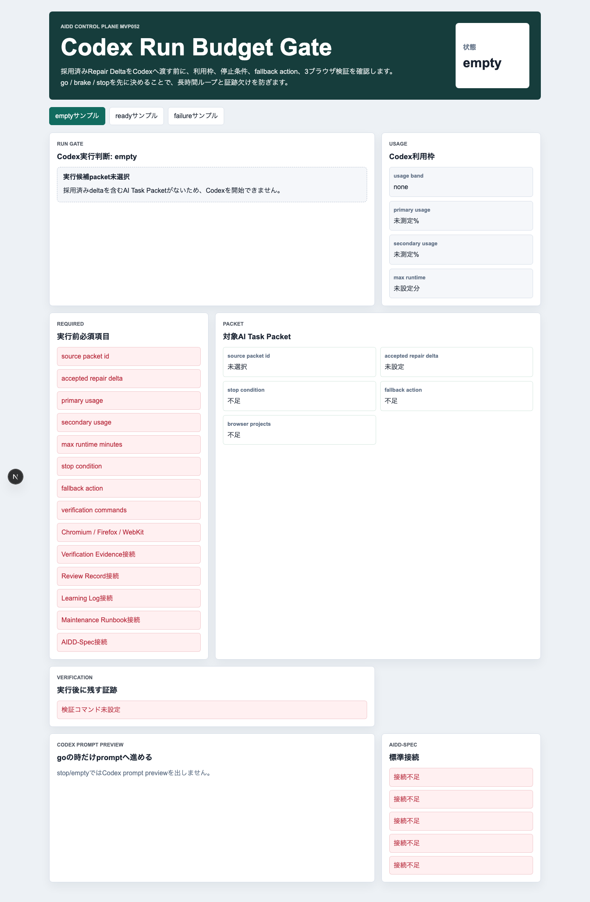
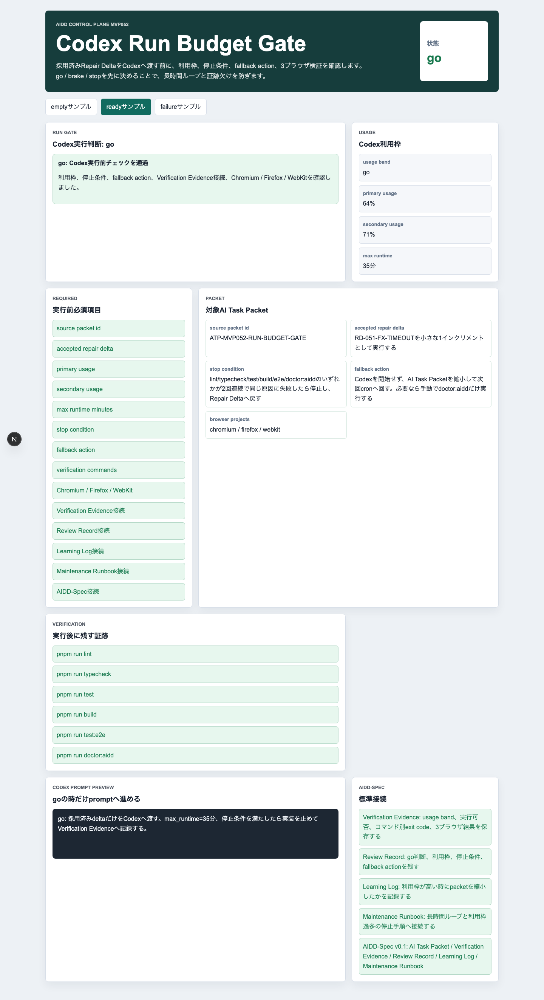
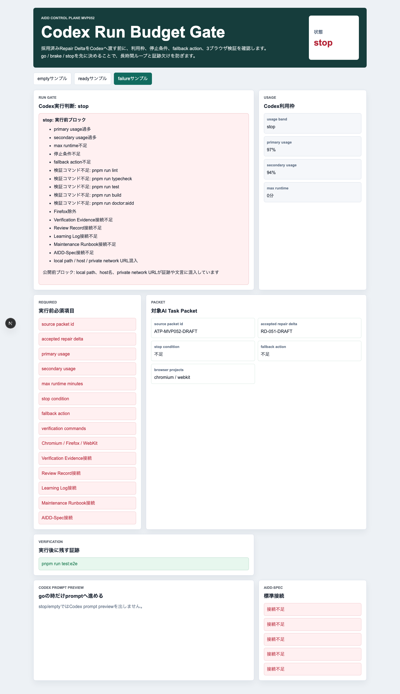
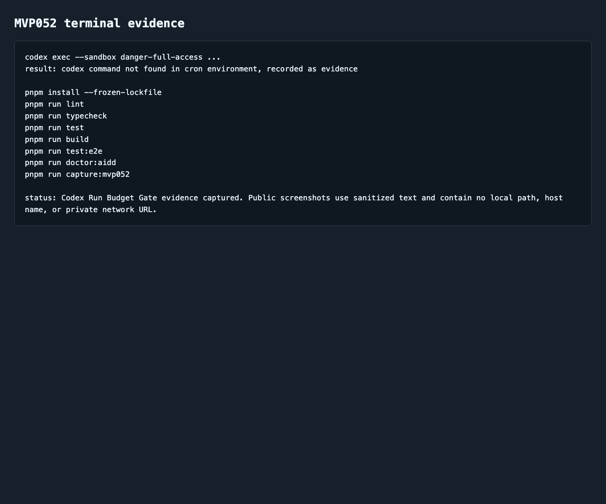

# AIDD Control Plane MVP 052：Codexへ投げる前に「実行予算」と停止条件を見る

> 2026-07-06 / Codex Mastery Lab
> 記事種別: Experiment / SaaS
> 将来の書籍章: 第10章 Verification Evidence、第11章 Learning Log、第12章 雑プロンプト vs AI Task Packet、第18章 AIDD Control PlaneのMVP

## タイトル案

Codexに投げる前の信号機：AI実装を始める前に利用枠・停止条件・fallbackを確認する

## 読者の悩み

AI駆動開発で次に直すことが決まると、ついすぐCodexへ投げたくなります。

でも実際には、次のような失敗が起きます。

- もう利用枠が高いのに、新しい実装を始めて途中で止まる
- 「失敗したらどこで止めるか」を決めず、修正ループが長引く
- lint / typecheck / unit / build / 3ブラウザE2Eのどこまで証跡を残すか曖昧になる
- Codexが使えないcron環境なのに、実装前提で計画してしまう

前回のMVP 051では、失敗ログから作ったRepair Deltaを **採用 / 保留 / 却下** に分けました。今回は、その次です。採用済みdeltaをCodexへ渡す前に、**実行予算・停止条件・fallback action** を見る小さな画面、MVP 052 **Codex Run Budget Gate** を作りました。

料理でいえば、作るメニューは決まったけれど、冷蔵庫の残り、調理時間、失敗した時の代替メニューを先に確認する感じです。AI開発でも、「作るもの」だけでなく「今実行してよい状態か」を見る必要があります。

## 今回の仮説

> 採用済みdeltaをCodexへ渡す前にgo / brake / stopを判断すれば、途中停止、長時間ループ、証跡欠けを減らせる。

AIDD Control Planeは、単なる「AIにコードを書かせるボタン」ではありません。Product Brief、AI Task Packet、Verification Evidence、Review Record、Learning Logをつなぎ、**いつ実行して、いつ止めるか** まで扱うSaaSにする必要があります。

## 実験内容

`experiments/aidd-control-plane-mvp-052/generated-repo/` に、Next.js + TypeScript + pnpmで **Codex Run Budget Gate** を実装しました。

今回のチェック項目は次です。

| チェック項目 | 何を確認したいのか | なぜ必要か |
| --- | --- | --- |
| source packet id | どのAI Task Packetを実行するか | 実行対象を後から追うため |
| accepted repair delta | 採用済みdeltaだけか | 保留・却下まで混ぜて依頼を肥大化させないため |
| primary / secondary usage | Codex利用枠が高すぎないか | 検証途中の停止を避けるため |
| max runtime minutes | 何分で区切るか | 長時間ループを防ぐため |
| stop condition | どの失敗で止めるか | 同じ失敗を繰り返さないため |
| fallback action | 実行できない時に何をするか | cronや利用枠の制約でも仕事を止めないため |
| 3ブラウザ | Chromium / Firefox / WebKitを含むか | 片ブラウザだけの成功を避けるため |
| Verification Evidence接続 | コマンド別証跡を残すか | 自己申告ではなく実行結果で確認するため |
| local pathブロック | 公開してはいけない文字列がないか | note/previewへ安全に出すため |

## 画面キャプチャ

### empty：実行候補packetがない



emptyでは、採用済みdeltaを含むAI Task Packetがないため、Codexを開始できないと表示します。ここで無理に進むと、また「いい感じに直して」という雑な依頼に戻ります。

### ready：go判断とprompt preview



readyでは、次を満たすと `go` になります。

- source packet idがある
- 採用済みRepair Deltaが1つに絞られている
- primary / secondary usageがブレーキ閾値未満
- max runtime minutesが設定されている
- stop conditionとfallback actionがある
- lint / typecheck / test / build / test:e2e / doctor:aiddを検証する
- Chromium / Firefox / WebKitを含む
- AIDD-Spec v0.1のVerification Evidence / Review Record / Learning Log / Maintenance Runbookへ接続している

重要なのは、`go` の時だけCodex prompt previewを表示することです。stop/emptyでは、そもそもCodexへ渡す文面を出しません。

### failure：利用枠過多、停止条件不足、公開前ブロック



failureでは、primary/secondary usage過多、max runtime不足、停止条件不足、fallback action不足、Firefox除外、AIDD-Spec接続不足、local path / host / private network URL混入を検出します。

これは「AIを使わない」のではなく、「今は大きな実装を始めない」という判断です。代わりに、短い検証、記事化、証跡整理、AI Task Packetの縮小へ寄せられます。

### terminal evidence



## 失敗と修正

今回もcron環境では `codex: command not found` でした。`codex exec --sandbox danger-full-access` は実行できず、その失敗を `artifacts/terminal/codex-exec.txt` に保存しました。

ただし、これは今回のテーマに合っています。Codexが使えない状態でも、AIDD Control Planeは「では何をするか」を提示する必要があります。MVP052のfallback actionは、Codexを開始せず、AI Task Packetを縮小して次回cronへ回す判断を扱います。

また、最初のE2EではPlaywrightのstrict modeに2回引っかかりました。

1. `chromium / firefox / webkit` が複数箇所にあり、locatorが曖昧だった
2. `pnpm run test` が `pnpm run test:e2e` にも部分一致した

修正として、`getByText(..., { exact: true })` を使い、3ブラウザE2Eを再実行しました。最終的にはChromium / Firefox / WebKitで9件すべて通過しました。

## 検証ログ

| コマンド | 結果 | メモ |
| --- | --- | --- |
| `pnpm install --frozen-lockfile` | pass | lockfile固定で依存解決 |
| `pnpm run lint` | pass | ESLintエラーなし |
| `pnpm run typecheck` | pass | TypeScriptエラーなし |
| `pnpm run test` | pass | Vitest 3 tests |
| `pnpm run build` | pass | Next.js build成功。ESLint plugin警告は既知の改善候補 |
| `pnpm run test:e2e` | pass | 9 passed。Chromium / Firefox / WebKit |
| `pnpm run doctor:aidd` | pass | MVP052 token、停止条件、fallback、3ブラウザ設定、画像名を確認 |
| `pnpm run capture:mvp052` | pass | empty / ready / failure / terminal evidenceを生成 |
| `python3 scripts/codex_usage_kpi.py` | pass | 実Codex usageからBRAKE推奨を生成 |

E2Eの最終結果は次です。

```text
9 passed (11.9s)
```

unit testは次です。

```text
Tests  3 passed (3)
```

Codex usage KPIの今回の実測は、secondary usageが高く、推奨は `BRAKE` でした。

```text
recommendation: BRAKE
secondary_used_percent: 96.0
recommendation_detail: 新規Codex起動を止め、短い検証・ブログ・メディア圧縮へ寄せる。
```

この実測値は、MVP052のテーマそのものです。採用済みdeltaがあっても、利用枠が高ければ「今は大きなCodex実装を始めない」という判断が必要です。

## 読者が使えるチェックリスト

Codexへ投げる前に、次を確認します。

| チェック項目 | 何を確認したいのか | なぜ必要か |
| --- | --- | --- |
| 実行対象packetは1つか | 何を実行するか | 依頼の責任範囲を明確にするため |
| 採用済みdeltaだけか | 保留・却下が混ざっていないか | 1回の変更を小さく保つため |
| 利用枠は高すぎないか | primary/secondary usage | 検証途中の停止を避けるため |
| max runtimeはあるか | 何分で止めるか | 長時間ループを防ぐため |
| stop conditionはあるか | 何が起きたら止めるか | 同じ失敗を繰り返さないため |
| fallback actionはあるか | 実行できない時の代替行動 | cronや環境差で仕事を止めないため |
| 検証コマンドは揃っているか | lint/typecheck/test/build/e2e/doctor | Codexの自己申告に頼らないため |
| 3ブラウザか | Chromium / Firefox / WebKit | WebKit/Firefoxだけの不具合を拾うため |
| 証跡保存先はあるか | terminalログとスクリーンショット | noteやレビューで説明できる一次情報にするため |
| 公開前ブロックはあるか | local pathやprivate URL | 公開事故を避けるため |

## SaaS/AIDD-Specへの接続

MVP052で、AIDD Control Planeに「実行前ゲート」が入りました。

- **AIDD-Spec**: AI Task Packetに実行予算、停止条件、fallback actionを追加する根拠になる
- **AIDD Control Plane**: Codex実行前にgo / brake / stopを見せるSaaS画面になる
- **Verification Evidence**: 実行できたか、止めたか、なぜ止めたかを証跡化する
- **Learning Log**: 利用枠過多やCLI未検出を次回改善へ戻す
- **note記事**: 「AIが作ったまとめ」ではなく、実際の失敗、ログ、スクリーンショットを持つ一次情報になる

## 次回

次回は、MVP052の実行前ゲートをさらに進め、**stop時にAI Task Packetを自動縮小する提案** を作るのが自然です。たとえば「E2E修正は次回へ回し、今回はdoctor:aiddと記事QAだけにする」のように、利用枠に応じた小さな代替packetを生成できると、AIDD Control Planeはより実用的になります。
