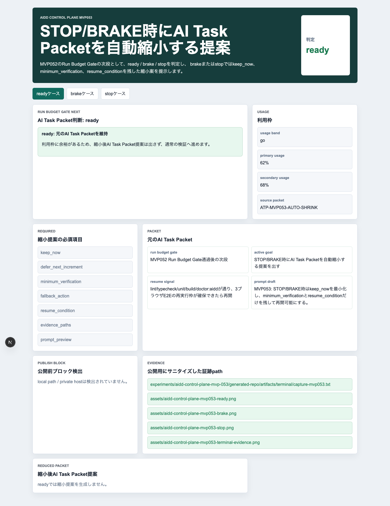
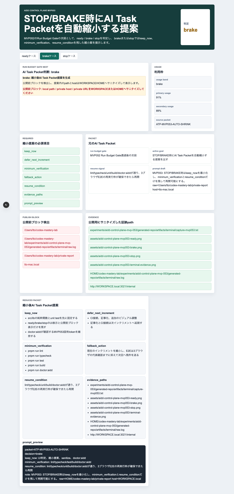
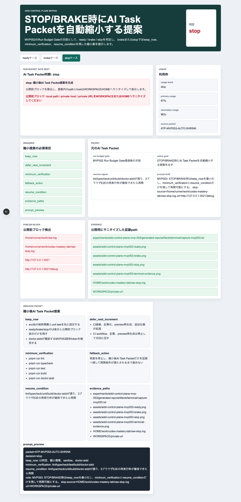
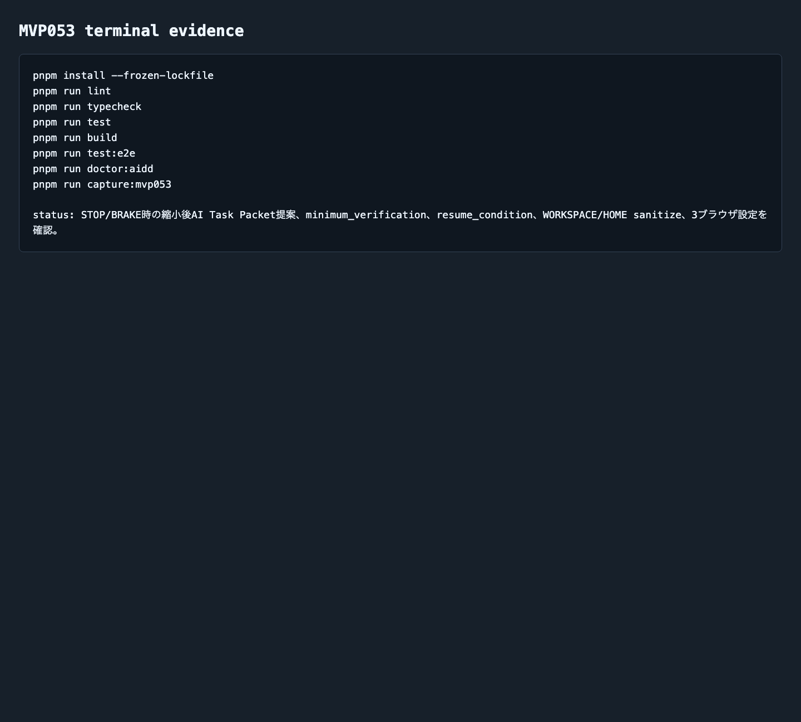

# AIDD Control Plane MVP 053：STOP/BRAKE時にAI Task Packetを小さく畳む

> 2026-07-06 / Codex Mastery Lab  
> 記事種別: Experiment / SaaS / Template  
> 将来の書籍章: 第9章 AI Task Packet、第10章 Verification Evidence、第11章 Learning Log、第18章 AIDD Control PlaneのMVP

## タイトル案

Codexを止めるだけでは足りない：STOP/BRAKE時にAI Task Packetを小さく畳む仕組み

## 今日の問い

今回の問いは、**Codex実行前ゲートでSTOPまたはBRAKEになった時、次に渡すAI Task Packetを自動で小さくできるか**です。

前回のMVP052では、Codexへ投げる前に利用枠、停止条件、fallback action、3ブラウザE2E、Verification Evidence接続を確認する **Codex Run Budget Gate** を作りました。これは、冷蔵庫の残りや調理時間を見ずに料理を始めないための確認に近いものです。

ただし、MVP052には次の弱点が残りました。

- `go` ならCodexへ進めるが、`brake` / `stop` の時に「何を削るか」が人間判断のまま
- fallback actionは文としてあるが、次回のAI Task Packetに変換されない
- 利用枠が厳しい時ほど、焦って大きいpromptをそのまま投げがち
- 公開前にlocal pathやprivate hostを消す作業が、記事作成の最後に寄ってしまう

AI駆動開発で本当に困るのは、失敗そのものよりも、失敗後の次の一手が大きすぎることです。テストが落ちた、利用枠が高い、E2Eが重い、でも次の依頼文には「全部直して」と書いてしまう。するとまた時間が伸び、証跡が欠け、レビューできない差分になります。

そこで今回は、MVP052の次段として **Codex Run Budget Shrink Planner** を作りました。STOP/BRAKE時に「実行を諦める」のではなく、AI Task Packetを小さく畳みます。

## 仮説

仮説は次です。

> Codex実行前にSTOP/BRAKEになった時、keep_now / defer_next_increment / minimum_verification / resume_conditionを機械的に生成できれば、次回のprompt肥大化と証跡欠けを減らせる。

ポイントは、単に「今日はやめる」と表示するのではないことです。家計簿で予算超過が見えた時、「外食を控える」だけでは行動に落ちません。「今日は自炊、買うものは卵と野菜だけ、外食は来週、再開条件は食費残高が戻ったら」のように、小さな行動へ分解する必要があります。

AI Task Packetでも同じです。STOP/BRAKE時には、次を明示する必要があります。

| 項目 | 何のために必要か |
| --- | --- |
| keep_now | 今回やる最小範囲を固定する |
| defer_next_increment | 次回へ送る範囲を明確にする |
| minimum_verification | 重い検証を避けても最低限の証拠を残す |
| fallback_action | Codexを始めない時の代替行動を決める |
| resume_condition | いつ再開してよいかを決める |
| evidence_paths | 後でレビューできる証跡の場所を残す |
| prompt_preview | Codexへ渡す文面を公開前に確認する |

## 実験環境

```text
Mon Jul  6 09:01:38 JST 2026
ProductName: macOS
ProductVersion: 26.5.1
BuildVersion: 25F80
Filesystem: 228Gi total / 101Gi available
Codex CLI: codex-cli 0.142.5 via npx -y @openai/codex
Repo: codex-mastery-lab
Experiment: experiments/aidd-control-plane-mvp-053/
```

重要な補足として、通常の `codex` コマンドはcron環境では見つかりませんでした。しかし `npx -y @openai/codex --version` は成功しました。MVP052では `codex: command not found` を失敗ログとして扱いましたが、今回はnpx経由でCodex CLIを起動できました。

## 実際にCodexへ渡した日本語プロンプト

今回、Codexへ渡した原文は次です。

```text
あなたはCodex Mastery Labの実装担当です。WORKSPACE のgit repo内だけを変更してください。既存の experiments/aidd-control-plane-mvp-052/generated-repo を参考に、experiments/aidd-control-plane-mvp-053/generated-repo を作ってください。テーマは AIDD Control Plane MVP 053「STOP/BRAKE時にAI Task Packetを自動縮小する提案」です。Next.js + TypeScript + pnpmの小さなアプリとして、以下を満たしてください。

1. UIは日本語。MVP052のRun Budget Gateの次段として、ready/brake/stopの3ケースを表示する。
2. brake/stop時に「縮小後AI Task Packet提案」を出す。含める項目: keep_now, defer_next_increment, minimum_verification, fallback_action, resume_condition, evidence_paths, prompt_preview。
3. local pathやprivate hostを公開前ブロックとして検出し、縮小提案では公開用にWORKSPACE/HOMEへサニタイズした表示にする。
4. src/lib 配下に純粋関数を置き、unit testで ready/brake/stop と sanitize を検証する。
5. Playwright E2Eで Chromium/Firefox/WebKit を対象に3ケースを確認する。
6. capture scriptで assets/aidd-control-plane-mvp053-ready.png, brake.png, stop.png, terminal-evidence.png を生成する。
7. doctor:aidd scriptで MVP053固有token、縮小提案、minimum_verification、resume_condition、3ブラウザ設定、画像名を確認する。
8. READMEに実行方法を書く。

重い依存追加は避け、既存MVP052の構成をコピーして必要最小限で変更してください。最後に実行すべき検証コマンド一覧を出力してください。
```

実行コマンドは次です。

```bash
npx -y @openai/codex exec --sandbox danger-full-access '<上記プロンプト>'
```

## Codex実行で起きたこと

CodexはMVP052を読み、`experiments/aidd-control-plane-mvp-053/generated-repo/` を作りました。主な生成物は次です。

```text
app/page.tsx
src/lib/packet-reduction.ts
tests/packet-reduction.test.ts
e2e/packet-reduction.spec.ts
scripts/doctor-aidd.mjs
scripts/capture-mvp053.mjs
README.md
docs/product-brief.md
docs/verification-plan.md
docs/review-record.md
docs/learning-log.md
```

ただし、Codex実行自体は600秒でタイムアウトしました。ログ上では、CodexがE2E失敗を見つけ、修正しようとしている途中で終了しています。

```text
Chromiumのbrakeが90秒待ち切りで落ちました。
完了ログで該当expectを確認してから、遅延ではなく条件の書き方を直します。
[Command timed out after 600s]
```

これは隠してはいけない失敗です。実装はほぼ生成されていましたが、E2Eの期待値が実装とずれていました。

## 失敗の中身

最初の3ブラウザE2Eでは、readyとstopは通りました。しかしbrakeケースだけがChromium / Firefox / WebKitすべてで失敗しました。

```text
Error: expect(locator).toBeVisible() failed
Locator: getByLabel('sanitized evidence paths').getByText('WORKSPACE/private-url')
Expected: visible
Timeout: 90000ms
```

原因は、テスト側が `WORKSPACE/private-url` を期待していたのに、brakeケースの危険値は `tto-mac.local` というprivate hostでした。実装の `sanitizeForPublic()` はprivate hostを `WORKSPACE.local` に変換します。つまり、実装が間違っていたというより、テストの期待値がケース設計と合っていませんでした。

修正は小さく、brakeケースのE2E期待値を `WORKSPACE.local` に変えました。

```diff
- await expect(page.getByLabel("sanitized evidence paths").getByText("WORKSPACE/private-url")).toBeVisible();
+ await expect(page.getByLabel("sanitized evidence paths").getByText("WORKSPACE.local")).toBeVisible();
```

ここで分かったのは、sanitize仕様もAI Task Packetに含めるべきだということです。「local pathやprivate hostを消す」だけでは粒度が粗い。`/Users/...` は `HOME/...`、private URLは `WORKSPACE/private-url`、`.local` hostは `WORKSPACE.local` のように、変換ルールまで書く必要があります。

## 画面キャプチャ

### ready: 通常実行を維持



readyでは利用枠がgo帯なので、縮小提案は出しません。元のAI Task Packetを維持し、通常の検証へ進めます。

### brake: 小さく畳んで進める



brakeでは、実装を完全停止するのではなく、今回やることを小さくします。`keep_now` に純粋関数、unit test、UI表示、doctorを残し、CI接続や追加調整は `defer_next_increment` へ送ります。

### stop: 実装を止め、再開条件だけ残す



stopでは、実装を進めず、縮小後AI Task Packetだけを証跡に残します。重要なのは `resume_condition` です。再開条件がない停止は、次回また同じ迷いを繰り返します。

### terminal evidence



## 実装の中心: packet-reduction.ts

今回の中心は `src/lib/packet-reduction.ts` です。UIから切り離した純粋関数として、次を実装しました。

- `createTaskPacket(caseName)`
- `reviewTaskPacket(packet)`
- `createReducedProposal(packet, decision)`
- `detectPrivateLocations(value)`
- `sanitizeForPublic(value)`

判定は単純です。

```text
primary >= 96 または secondary >= 96 => stop
primary >= 90 または secondary >= 92 => brake
それ以外 => go / ready
```

brakeまたはstopの場合、`ReducedTaskPacketProposal` を生成します。

```ts
type ReducedTaskPacketProposal = {
  keep_now: string[];
  defer_next_increment: string[];
  minimum_verification: string[];
  fallback_action: string;
  resume_condition: string;
  evidence_paths: string[];
  prompt_preview: string;
};
```

これはAIDD-SpecのAI Task Packetにそのまま戻せる形です。画面のためだけの型ではなく、後工程のVerification Evidence、Review Record、Learning Logが読むための型にしました。

## 検証結果

実行した品質ゲートは次です。

| コマンド | 結果 |
| --- | --- |
| `pnpm install --frozen-lockfile` | pass |
| `pnpm run lint` | pass |
| `pnpm run typecheck` | pass |
| `pnpm run test` | pass / 4 tests |
| `pnpm run test:coverage` | pass / 100% |
| `pnpm run build` | pass / Next.js plugin警告あり |
| `pnpm run doctor:aidd` | pass |
| `pnpm run test:e2e` | pass / 9 tests / 3ブラウザ |
| `pnpm run capture:mvp053` | pass |

unit testの結果です。

```text
Test Files  1 passed (1)
Tests  4 passed (4)
```

coverageは小さい純粋関数に対して100%でした。

```text
All files          | 100 | 100 | 100 | 100
```

3ブラウザE2Eの最終結果です。

```text
Running 9 tests using 1 worker
9 passed (9.2s)
```

build時には既存構成由来の警告が残りました。

```text
The Next.js plugin was not detected in your ESLint configuration.
```

これは今回の主テーマではないため残課題として扱います。ただし、記事には残します。警告を消さずに「成功」とだけ書くと、次回の監査材料が消えてしまうからです。

## 監査結果

```yaml
findings:
  - category: Verification / E2E Contract
    finding: brakeケースの期待値がprivate hostのsanitize仕様とずれていた
    severity: medium
    observed_by: pnpm run test:e2e
    ideal_state: テストは危険値の種類ごとに期待sanitize結果を分ける
    fix_instruction: private URLはWORKSPACE/private-url、private hostはWORKSPACE.localとして期待値を分ける
    needed_upstream_info:
      - sanitize mapping contract
      - public artifact policy
    standard_update:
      document: AI Task Packet Standard
      field: execution_budget.shrink_when_brake_or_stop.prompt_preview_policy
    codex_prompt_delta: |
      local path、private host、private network URLの種類ごとに期待される公開用sanitize結果を明記する。
    verification:
      command: pnpm run test:e2e
      expected: Chromium / Firefox / WebKitで9件pass

  - category: Operations / Run Budget
    finding: STOP/BRAKE時の次の一手がMVP052では文だけで、packet構造になっていなかった
    severity: high
    observed_by: MVP052からの逆算
    ideal_state: STOP/BRAKE時にkeep_now/defer_next_increment/minimum_verification/resume_conditionを生成する
    fix_instruction: Codex Run Budget Shrink Plannerを追加し、縮小後AI Task PacketをVerification Evidenceへ保存する
    needed_upstream_info:
      - execution budget
      - stop conditions
      - fallback action
      - resume condition
    standard_update:
      document: AI Task Packet Template
      field: execution_budget.shrink_when_brake_or_stop
    codex_prompt_delta: |
      brake/stop時は実装を拡大せず、keep_nowとminimum_verificationだけに縮小したprompt previewを出す。
    verification:
      command: pnpm run doctor:aidd && pnpm run test
      expected: pass
```

## 後工程から前工程へ逆算する

今回の欠陥から逆算すると、前工程で必要だった情報は次です。

| 後工程で困ったこと | 前工程で必要だった情報 | AIDD-Spec成果物 |
| --- | --- | --- |
| E2Eがsanitize期待値で失敗した | 危険値タイプ別のsanitize mapping | AI Task Packet / Security Baseline |
| STOP/BRAKE時に次の行動が曖昧 | keep_now / defer_next_increment / minimum_verification | AI Task Packet |
| 停止後の再開タイミングが不明 | resume_condition | Maintenance Runbook / Learning Log |
| 公開前にローカル情報が混ざる | prompt_preview_policyとevidence_pathsの公開用変換 | Verification Evidence |

つまり、AI Task Packetには「作るもの」だけでなく、**作らない判断になった時の縮小ルール** も必要です。

## AIDD-Specへの反映

今回、次の標準を更新しました。

- `standards/templates/ai-task-packet-template-v0.1.md`
- `standards/aidd-spec-ai-task-packet-standard-v0.1.md`
- `standards/aidd-control-plane-mvp-v0.1.md`

追加した中心項目はこれです。

```yaml
execution_budget:
  usage_band_policy: "go / brake / stop"
  max_runtime_minutes: null
  stop_conditions: []
  fallback_action: ""
  shrink_when_brake_or_stop:
    keep_now: []
    defer_next_increment: []
    minimum_verification: []
    resume_condition: ""
    evidence_paths: []
    prompt_preview_policy: "sanitize local paths and private hosts before publishing"
```

AIDD Control Plane側には、`Codex Run Budget Shrink Planner` をMVP機能として追加しました。

## SaaS化した場合の機能仮説

AIDD Control Planeにこの機能を入れるなら、画面は次の流れになります。

1. Run Budget Gateが `ready / brake / stop` を判定する
2. `brake` なら、今やる最小範囲を提案する
3. `stop` なら、実装を止めてresume_conditionだけ残す
4. local path / private host / private URLを公開前ブロックとして検出する
5. 縮小後AI Task PacketをMarkdown/YAMLで書き出す
6. Verification Evidenceに、縮小理由と証跡パスを保存する
7. Learning Logに「なぜ縮小したか」を戻す

これは派手なAI機能ではありません。しかし、現場ではかなり効きます。AI開発の事故は、実装能力不足よりも、止め方・小さくし方・再開条件の曖昧さで起きるからです。

## 明日から使えるチェックリスト

Codexへ投げる前に、次を確認します。

- [ ] 今の利用枠はgo / brake / stopのどれか
- [ ] brake/stop時のkeep_nowが3項目以内に絞れているか
- [ ] defer_next_incrementに「今回はやらないこと」が明記されているか
- [ ] minimum_verificationはlint/typecheck/test/build/doctorなど軽量に絞れているか
- [ ] resume_conditionが「いつ再開してよいか」として読めるか
- [ ] evidence_pathsは公開用にHOME/WORKSPACEへサニタイズされているか
- [ ] prompt_previewにlocal path、host名、private URLが混ざっていないか

## まとめ

MVP053で分かったことは、AI駆動開発には「実行するための仕様」だけでなく、**実行しない時に小さく畳む仕様** が必要だということです。

MVP052のRun Budget Gateは、Codexへ投げてよいかを見る信号機でした。MVP053は、その信号が黄色または赤になった時に、次の持ち物リストを作る機能です。

今回の学びは3つです。

1. STOP/BRAKEは失敗ではなく、AI Task Packetを小さくする入力になる
2. sanitize仕様は「消す」ではなく、危険値タイプ別の変換ルールとして書く必要がある
3. 後工程のVerification EvidenceとLearning Logが欲しいのは、実行ログだけでなく、縮小判断の理由と再開条件である

次回は、この縮小後AI Task Packetを実際に次のCodex promptへ渡し、元の大きいpacketよりも失敗が減るかを検証します。

## 付録: 証跡パス

- Experiment: `experiments/aidd-control-plane-mvp-053/`
- Generated app: `experiments/aidd-control-plane-mvp-053/generated-repo/`
- Terminal logs: `experiments/aidd-control-plane-mvp-053/artifacts/terminal/`
- Assets:
  - `assets/aidd-control-plane-mvp053-ready.png`
  - `assets/aidd-control-plane-mvp053-brake.png`
  - `assets/aidd-control-plane-mvp053-stop.png`
  - `assets/aidd-control-plane-mvp053-terminal-evidence.png`
- Standards updated:
  - `standards/templates/ai-task-packet-template-v0.1.md`
  - `standards/aidd-spec-ai-task-packet-standard-v0.1.md`
  - `standards/aidd-control-plane-mvp-v0.1.md`
