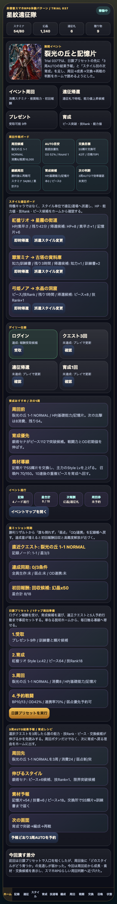
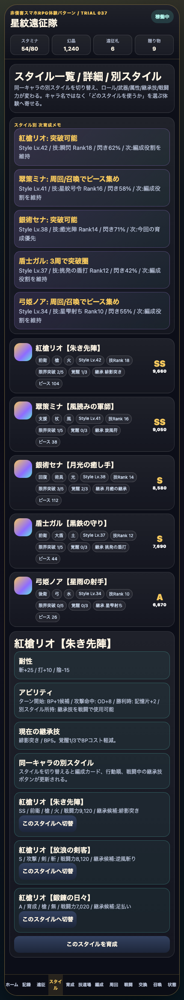

# SagaForge Trial 037: 周回前に3周AUTO結果予報とスタイル別育成メモを出す

前回までで、ホーム、スタイル、5人編成、クエスト、Round制バトル、BP、OD/連携、勝利報酬、召喚結果カード、日課プリセットまで入った。けれど、ユーザー評価の「まだロマサガRSとは程遠い」に照らすと、まだ足りない点がある。

今回も、実在IP・公式素材・商標・ロゴ・キャラ・公式文言・公式確率・公式UIコピーは使っていない。目指しているのは、キャラ収集・スタイル育成・クエスト周回・ターン制バトル・報酬導線を持つ、非侵害のスマホRPG体験パターンである。

## 前回の何が遠かったか

Trial 036では「日課プリセット」でホームからクエストへ入る道は短くなった。しかし、まだ次の弱さが残っていた。

| 不足 | 何が問題だったか | 今回の狙い |
|---|---|---|
| 周回前の見通し | 3周したら何が増え、誰を育てるべきかが押す前に読めなかった | ホームに3周AUTO結果予報を出す |
| スタイル育成の判断 | スタイルカードはあるが、周回・技Rank・突破候補との接続が弱かった | スタイル別に次育成メモを出す |
| 周回後の戻り先 | クエスト、交換所、育成が別画面に見え、短時間周回の判断感が薄かった | 周回→素材→突破/交換→再戦の理由をホームに戻す |

## 今回潰した差分

`playables/sagaforge-app/index.html` を Trial 037 に更新した。

1. ホームに「3周AUTO結果予報 / 育成レシピ」を追加。
2. 選択クエストを3周した場合の、消費スタミナ、弱点、記憶片、技書、ピース、次画面を表示。
3. 「予報どおり3周AUTOを予約」ボタンで、周回予約と5人行動予約へ進めるようにした。
4. スタイル画面に「スタイル別 次育成メモ」を追加し、突破可能、3周で突破圏、技Rank/閃き進捗、今回の育成優先を表示。
5. 既存の下部ナビ、スタイルカード、5人編成、陣形、クエスト選択、Round/BP/OD/連携、ガチャ結果カード、失敗状態は維持した。

## スクリーンショット

ホームで、周回前に3周AUTOの素材・成長予報を読める状態。



スタイル画面で、各スタイルの次育成メモと突破候補を確認できる状態。



## 検証

今回の変更範囲は静的プレイアブル中心なので、次を確認した。

- HTML内scriptを抽出し、`node --check` で構文確認。
- `scripts/build_preview.py` で `preview/sagaforge-app/` へコピーされることを確認。
- Playwright smokeで、Trial 037表示、3周AUTO結果予報、予約後のクエスト遷移、スタイル別次育成メモ、スクリーンショット保存、アプリ本体に実在IP名が混ざっていないことを確認。

実行結果の要約:

```text
JS syntax OK: playable script extracted from index.html
Wrote 102 articles to WORKSPACE/preview
playable smoke OK
```

## AIDD-Specへの学び

今回の差分は「カードを増やす」ではなく、「AIに周回型RPGの判断ループまで要求する」ための改善だった。

AI Task Packetに入れるべき項目は次。

- ホームは入口だけでなく、周回前の結果予報、育成対象、素材の使い道を表示する。
- スタイル一覧は見た目のカードで終わらせず、突破、技Rank、閃き、周回候補、編成役割へ接続する。
- 周回ボタンは、消費・報酬・成長・交換・再戦までの短いループとして検証する。
- プレイアブルURLを毎回維持し、記事より先に触れる体験を改善する。

## まだ遠い点

- 戦闘演出はまだカードとログが中心で、スマホRPGらしい派手な連携テンポには届いていない。
- AUTO周回は予報と予約が中心で、複数周のリザルトカードを一気に気持ちよく見せる段階にはまだ弱い。
- スタイル育成はメモが出たが、装備、耐性、継承技、クエスト適性の深い組み合わせはまだ浅い。

## 次に潰す差分

次は「3周AUTO結果そのものの気持ちよさ」を強める。

- 3周AUTO完了後に、周回ごとの能力値アップ、技Rank、ピース、記憶片、星ミッションをリザルトカードとしてまとめる。
- リザルトから、交換所・育成・再戦・スタイル詳細へすぐ戻る導線を強める。
- 戦闘中のOD/連携を、ログだけでなく段階演出と結果バナーで見せる。

## 公開URL

- プレイアブル: https://ttomac-mini.tail352b67.ts.net/sagaforge-app/index.html
