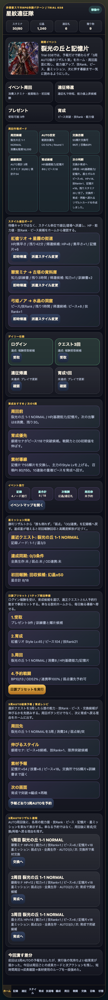
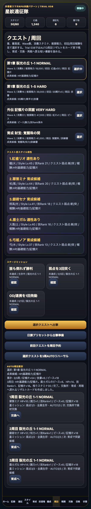

# SagaForge Trial 038: 3周AUTO後のリザルト束をホームと周回画面に残す

前回までで、ホーム、スタイル、5人編成、クエスト、Round制バトル、BP、OD/連携、勝利報酬、召喚結果カード、日課プリセット、3周AUTO予報まで入った。けれど、ユーザー評価の「まだロマサガRSとは程遠い」に照らすと、まだ足りない点がある。

今回も、実在IP・公式素材・商標・ロゴ・キャラ・公式文言・公式確率・公式UIコピーは使っていない。目指しているのは、キャラ収集・スタイル育成・遠征/クエスト・ターン制バトル・連携/OD風テンポ・報酬/召喚導線を持つ、非侵害のスマホRPG体験パターンである。

## 前回の何が遠かったか

Trial 037では「3周AUTO結果予報」と「スタイル別次育成メモ」で、周回前の見通しは少し良くなった。しかし、まだ次の弱さが残っていた。

| 不足 | 何が問題だったか | 今回の狙い |
|---|---|---|
| 周回後の気持ちよさ | 予報はあるが、3周後に成果が束で返ってくる感覚が弱い | 各周のリザルトカードを残す |
| 育成への戻り | 記憶片やピースが増えても、次に育成/交換/再戦のどれを押すかが弱い | リザルトごとに次アクションボタンを出す |
| 星ミッション同期 | 手動勝利リザルトには星同期があるが、AUTO周回側では見えにくい | AUTOリザルトにも星ミッション進捗を書く |

## 今回潰した差分

`playables/sagaforge-app/index.html` を Trial 038 に更新した。

1. ホームに「3周AUTOリザルト速報」を追加。
2. 周回画面の「AUTO周回累計」に、リザルトカード束を追加。
3. 3周AUTOリハーサル実行時に、各周の HP上昇、能力値、技Rank、ピース、記憶片、星ミッション進捗を `autoHistory` として残すようにした。
4. 各リザルトカードに「育成へ」「交換へ」「再戦へ」の次アクションを表示。
5. 既存の下部ナビ、スタイルカード、5人編成、陣形、クエスト選択、Round/BP/OD/連携、ガチャ結果カード、失敗状態は維持した。

## スクリーンショット

ホームで、3周AUTO後の成果が速報カードとして残る状態。



周回画面で、AUTO累計と各周リザルトを同時に確認できる状態。



## 検証

今回の変更範囲は静的プレイアブル中心なので、次を確認した。

- HTML内scriptを抽出し、`node --check` で構文確認。
- `scripts/build_preview.py` で `preview/sagaforge-app/` へコピーされることを確認。
- Playwright smokeで、Trial 038表示、3周AUTOリハーサル、ホーム/周回画面のリザルトカード、スクリーンショット保存、アプリ本体に実在IP名が混ざっていないことを確認。
- 公開URLと主要画像URLが `http=200` を返すことを確認。

実行結果の要約:

```text
JS syntax OK: playable script extracted from index.html
Wrote preview articles and copied playables
playable smoke OK: Trial 038 auto result cards visible
public URL http=200
```

## AIDD-Specへの学び

今回の差分は「周回ボタンを置く」ではなく、「短い周回のあとに成果を読み、次の行動を選べること」をAI Task Packetへ書く必要がある、という学びだった。

AI Task Packetに入れるべき項目は次。

- AUTO周回は予約だけで終わらせず、各周の成果をカード化する。
- リザルトには、能力値、技Rank、ピース、素材、星ミッションを含める。
- リザルトカードから、育成、交換、再戦、スタイル詳細へ戻れる導線を持たせる。
- プレイアブルURLを毎回維持し、記事より先に触れる体験を改善する。

## まだ遠い点

- 戦闘演出はまだHTMLカードとログが中心で、スマホRPGらしい派手な連携演出・テンポには届いていない。
- AUTO周回は3周の成果束になったが、周回前後のアニメーション、報酬開封、能力値アップの連続表示はまだ簡素。
- スタイル育成はピース/Rank/突破候補までで、装備、耐性、継承技、クエスト適性の組み合わせはまだ浅い。

## 次に潰す差分

次は「戦闘中のOD/連携演出とリザルト開封」を強める。

- OD/連携発動時に、5人の順番、技名、弱点、追撃を段階演出として見せる。
- 勝利後に、能力値アップ、技Rank、報酬、星ミッションを順番に開封する。
- リザルトからスタイル詳細、育成、交換所へ戻る導線をさらに強める。

## プレイアブル

- プレビュー内の相対パス: `sagaforge-app/index.html`
- 公開配送先の実URLはcronレポート側で確認する。記事本文にはローカルホスト名や内部ドメインを残さない。
