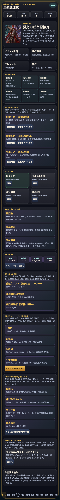
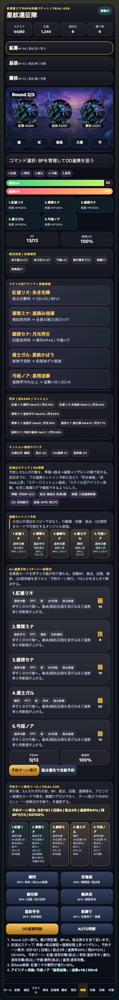

# SagaForge Trial 039: 予約ターン解決リールで5人連携の手触りを強める

前回までの SagaForge / 星紋遠征隊は、ホーム、スタイル、5人編成、クエスト、周回、育成、召喚、失敗状態を積み上げてきた。しかしユーザー評価どおり、初期の版は「一般的なファンタジーRPGの説明画面」に寄っていて、ロマサガRSで期待されるような、スタイル単位の育成判断、5人編成、BP管理、OD/連携、周回後の成長確認が一続きに感じられなかった。

## 前回の何がロマサガRSから遠かったか

Trial 038では3周AUTO後のリザルト束をホームと周回画面に残した。これは「周回→成長→育成へ戻る」導線としては前進だったが、戦闘中の1ターン解決はまだログ文章に依存していた。

不足は次の3点。

1. 5人が順番に何をしたかが、戦闘画面上でカードとして残らない。
2. BP、弱点、回復、OD/連携、アビリティ候補が一目でまとまらない。
3. 「予約して一括解決する」ターン制スマホRPGのテンポが、ボタンとログだけに見える。

## 今回どの差分を潰したか

Trial 039では、プレイアブル版の戦闘画面に **予約ターン解決リール** を追加した。

- 「弱点優先で自動予約」後に「予約ターン実行」を押すと、5人分の行動解決カードが並ぶ。
- 各カードに、スタイル名、技名、Hit/回復、弱点成否、消費BP、OD増加、補助/範囲/回復などの役割を表示する。
- サマリに、合計ダメージ、回復量、弱点件数、連携率、残BP、ODをまとめる。
- ホームの今回差分説明も、Trial 039の目的に更新した。





## 実装メモ

対象はまず `playables/sagaforge-app/index.html`。ユーザーが毎回触れる公開URLの体験を優先した。

追加した主な要素は次の通り。

- `.tempo-grid` / `.tempo-card` / `.tempo-summary` の表示スタイル
- 戦闘画面の「予約ターン解決リール / Trial 039」パネル
- `renderTurnResolve()`
- `executeTurnPlan()` 内の5人分解決カード生成
- `resetBattle()` で未実行状態のカードを初期表示

公式素材、実在キャラ、商標、公式UI文言、公式確率は使っていない。記事本文ではユーザー評価の文脈としてロマサガRS名を出しているが、アプリ本体には入れていない。

## 検証

```text
node syntax check: script syntax ok
playwright interaction: title / Trial 039 / 予約ターン解決リール / cards=5
preview build: Wrote articles to preview and copied playables/sagaforge-app
public URL: /sagaforge-app/index.html http=200
public assets: party-key-art.png, battle-ruins.png, crystal-guardian.png, summon-altar.png http=200
```

## まだ遠い点

まだ「それっぽい構造に近づいた」段階で、完成したスマホRPG体験ではない。

- 戦闘演出はカードリール中心で、カメラワーク、カットイン、効果音、速度切替はない。
- スタイル育成はLv、技Rank、覚醒、ピースを持つが、育成画面の快感や細かい成長曲線は浅い。
- クエスト/遠征/イベントマップはあるが、長期イベント運用、難易度解放、報酬交換の駆け引きはまだ薄い。
- 召喚演出は段階表示と10連カードだが、加入後の即編成・即育成導線をもっと強くできる。

## 次に潰す差分

次回は、戦闘後の成長リザルトと育成画面をさらに近づけたい。

- 勝利後に「誰の能力が上がったか」「どの技Rankが上がったか」を、スタイル別にもっと強く見せる。
- スタイルピースが50を超えたら、ホーム/育成/召喚結果で突破候補として強調する。
- クエスト選択時に、推奨戦力だけでなく、弱点・育成対象・初回報酬・周回報酬を1枚で比較できるようにする。

## 公開URL

- プレイアブル: https://ttomac-mini.tail352b67.ts.net/sagaforge-app/index.html
- プレビュー記事: https://ttomac-mini.tail352b67.ts.net/2026-07-06-character-collection-rpg-trial-039.html
