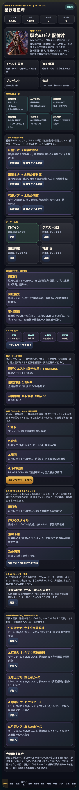
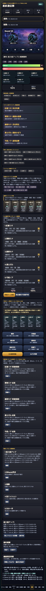

# SagaForge Trial 040: 勝利後スタイル成長ボードで周回から育成へ戻す

前回までの SagaForge / 星紋遠征隊は、ホーム、スタイル、5人編成、クエスト、遠征、召喚、BP/OD風の戦闘、予約ターン解決リールまで増やしてきた。それでもユーザー評価どおり、初期の版は「ロマサガRSで期待される体験」からかなり遠かった。単にファンタジーRPGの画面を増やすだけでは足りず、スタイル単位で周回し、成長し、突破判断をして、またクエストへ戻る循環が必要だった。

## 前回の何がロマサガRSから遠かったか

Trial 039では、5人の予約ターンを実行したあとに、誰がどの技を使い、弱点、BP、OD、回復、連携がどう解決されたかをカードで残した。これは戦闘テンポの改善だった。

しかし、まだ遠かった点は次の3つ。

1. 勝利後に「誰の能力値が上がったか」「どの技Rankが伸びたか」が、育成判断としてまとまっていなかった。
2. スタイルピースが50を超えても、ホームや勝利画面から「今すぐ突破へ行く」導線が弱かった。
3. 周回リザルト、ホーム、育成、交換所がそれぞれ存在するだけで、プレイヤーが次に何を押すべきかが薄かった。

## 今回どの差分を潰したか

Trial 040では、プレイアブル版を優先して次を追加した。

- ホームに **突破候補レーダー / 周回後の戻り先** を追加。
- 勝利後の戦闘画面に **勝利後スタイル成長ボード / Trial 040** を追加。
- 各スタイルごとに、HP上昇、能力値上昇、技Rank、ピース、現在ピース数、突破候補、次の遷移先を表示。
- ピース50以上かつ突破上限未満なら「突破へ」ボタンを出し、育成画面へ戻せるようにした。
- 既存の予約ターン解決、AUTO周回、交換所、育成、召喚導線は壊さず維持した。





## 実装メモ

対象は `playables/sagaforge-app/index.html`。記事より先に、毎回触れる公開URLの体験を改善した。

主な追加点は次の通り。

- `renderBreakthroughRadar()`
- `breakthroughStatus()`
- `renderGrowthResultCards()`
- ホームの `breakthroughRadar` パネル
- 戦闘画面の `growthResultPanel` / `growthResultCards`
- 勝利時 `nextRound()` から成長ボードを表示する接続
- `scripts/build_preview.py` の記事順と Trial 040 画像コピー設定

アプリ本体には、実在IP名、公式ロゴ、公式キャラ、公式素材、公式文言、公式確率は入れていない。この記事では、ユーザー評価の文脈説明としてロマサガRS名を使っている。

## 検証

```text
node syntax check: OK
playwright interaction: title=星紋遠征隊 SagaForge Trial 040 / growthResultPanel=true / breakthroughRadar=5 / growthResultCards=5
preview build: Wrote articles to preview and copied playables/sagaforge-app
public URL: /sagaforge-app/index.html http=200
public assets: party-key-art.png, battle-ruins.png, crystal-guardian.png, summon-altar.png http=200
```

## まだ遠い点

まだ「ロマサガRSそのもの」ではなく、非侵害の体験パターンを段階的に近づけている途中。

- 勝利後成長はカード表示までで、能力値アップ演出や連続ポップ、速度切替はない。
- スタイル育成はピース、Lv、技Rank、覚醒を持つが、育成曲線や複数スタイル継承の深さはまだ浅い。
- 周回の長期モチベーション、難易度解放、ミッション報酬、交換優先順位はまだ薄い。
- ガチャ結果から即編成、即突破、即再戦へ行く導線はさらに強化できる。

## 次に潰す差分

次は、召喚と育成の戻り先をさらに強くする。

- 10連結果の重複ピースを、結果画面で「突破可能」「解放可能」「継承候補」として分類する。
- 育成画面で、突破前後の戦闘力、OD初期値、BP効率の変化を比較する。
- クエスト選択時に、弱点、推奨戦力、育成対象、初回報酬、周回報酬を1枚で比較できるようにする。

## 公開URL

- プレイアブル: PUBLIC_PLAYABLE_URL/sagaforge-app/index.html
- プレビュー記事: PUBLIC_PREVIEW_URL/2026-07-06-character-collection-rpg-trial-040.html
