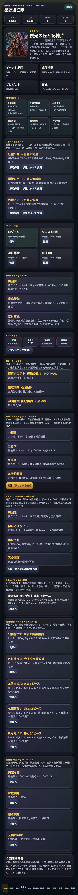
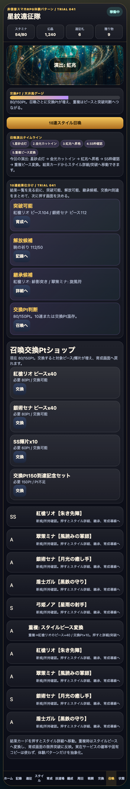
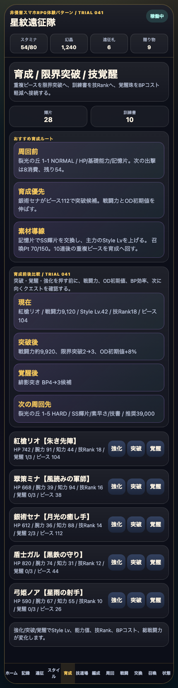
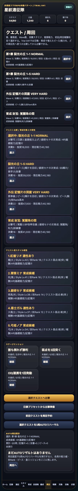

# SagaForge Trial 041: 10連結果を育成・編成・再戦へ戻す仕分け導線

前回までの SagaForge / 星紋遠征隊は、ホーム、スタイル、5人編成、クエスト、遠征、召喚、BP/OD風の戦闘、予約ターン解決、勝利後スタイル成長ボードまで増やしてきた。それでも、ユーザー評価の「全然ロマサガRSとは程遠い」はまだ有効だと受け止めている。単に画面数を増やすだけでは、キャラ収集RPGの毎日触る手触りには届かない。

今回も、アプリ本体では実在IP名、公式ロゴ、公式キャラ、公式素材、公式文言、公式確率は使わない。この記事では、ユーザー評価の文脈説明としてロマサガRS名を使っている。

## 前回の何がロマサガRSから遠かったか

Trial 040では、勝利後に誰の能力値・技Rank・ピースが伸びたかをカード化し、ホームの突破候補レーダーへ戻すところまで進めた。

ただし、まだ遠かった点は次の3つ。

1. 10連召喚の結果が「結果カードを眺める」寄りで、突破可能・解放候補・継承候補への仕分けが弱かった。
2. 育成画面で、突破や覚醒を押す前に「戦闘力、OD初期値、BP効率がどう変わるか」を比較できなかった。
3. ガチャや育成で強くなったあと、どのクエストへ戻るべきかの比較が薄かった。

## 今回どの差分を潰したか

Trial 041では、記事より先にプレイアブル版を改善した。

- ホームに **召喚後の戻り先 / Trial 041** を追加。
- 召喚画面に **10連結果仕分け / Trial 041** を追加。
- 育成画面に **育成前後比較 / Trial 041** を追加。
- クエスト画面に **クエスト比較 / 育成対象との相性** を追加。
- 10連後のピース、交換Pt、未所持スタイル、継承候補を、育成/記録/スタイル/召喚へ戻すボタンに接続。









## 実装メモ

対象は `playables/sagaforge-app/index.html`。既存の静的プレイアブルを壊さず、次の関数と表示枠を足した。

- `renderGachaClassifier()`
- `renderTrainingCompare()`
- `renderQuestCompare()`
- ホームの `gachaClassifierHome`
- 召喚画面の `gachaClassifier`
- 育成画面の `trainingCompare`
- クエスト画面の `questCompare`

今回の狙いは、10連結果を「当たった/外れた」で終わらせず、次の行動へ分類することだった。これは、キャラ収集RPGでユーザーが期待する「引く → ピースを見る → 突破する → 編成/周回へ戻る」という循環に近づけるための第一段階。

## 検証

```text
node syntax check: OK
playwright interaction: {"title":"星紋遠征隊 SagaForge Trial 041","gachaClassifier":4,"homeClassifier":4,"trainingCompare":4,"questCompare":4,"status":"稼働中"}
screenshots: trial041 home/gacha-classifier/training-compare/quest-compare
preview build: Wrote articles to preview and copied playables/sagaforge-app
public URL: /sagaforge-app/index.html http=200
public assets: party-key-art.png, battle-ruins.png, crystal-guardian.png, summon-altar.png http=200
```

## まだ遠い点

まだ「ロマサガRSそのもの」ではなく、非侵害の体験パターンを段階的に近づけている途中。

- 召喚演出は段階表示までで、期待感を作るアニメーションやテンポ調整は弱い。
- スタイル継承は候補表示までで、別スタイル技を選んで継承枠に設定する深さはまだ足りない。
- 育成比較はカード式で、素材不足時の代替ルートやおすすめ優先順位はまだ粗い。
- クエスト比較は4本の一覧で、イベントマップ、難易度解放、初回報酬回収の気持ちよさはまだ薄い。

## 次に潰す差分

次は、スタイル継承と編成判断をもう一段深くする。

- 同一キャラの別スタイルから、継承技を1つ選んで現在スタイルにセットする。
- 5人編成で、役割不足、回復不足、弱点不足を表示する。
- クエスト選択時に、敵弱点に対して「この編成なら誰が刺さるか」をもっと強く出す。
- 勝利後に、継承技Rankや閃き候補が伸びた理由をリザルトへ戻す。

## 公開URL

- プレイアブル: PUBLIC_PLAYABLE_URL/sagaforge-app/index.html
- プレビュー記事: PUBLIC_PREVIEW_URL/2026-07-06-character-collection-rpg-trial-041.html
