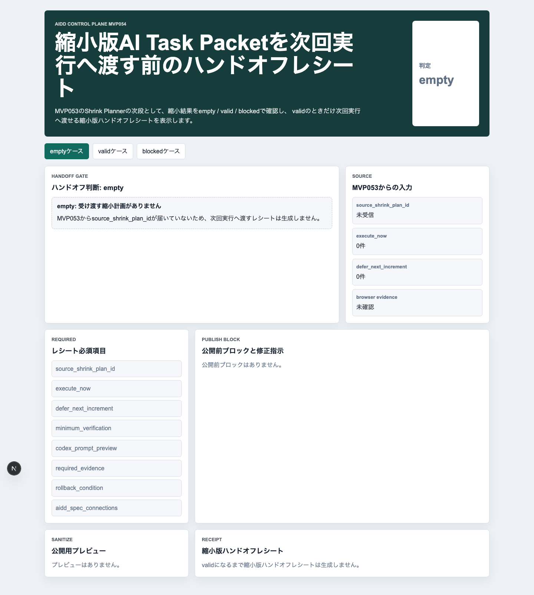
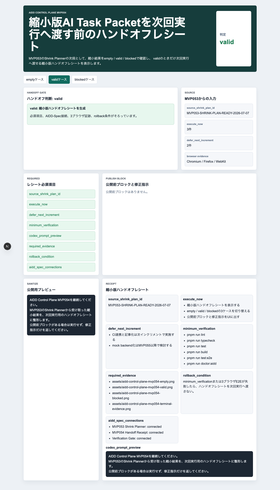
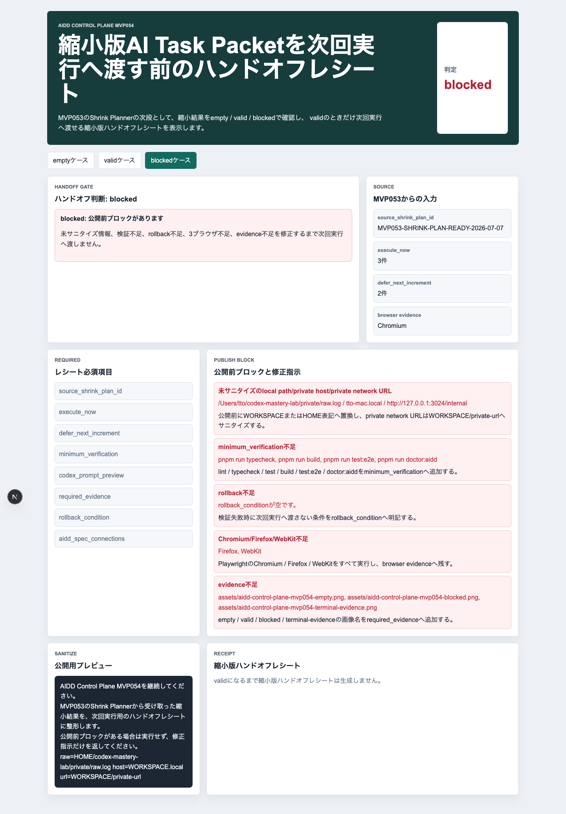
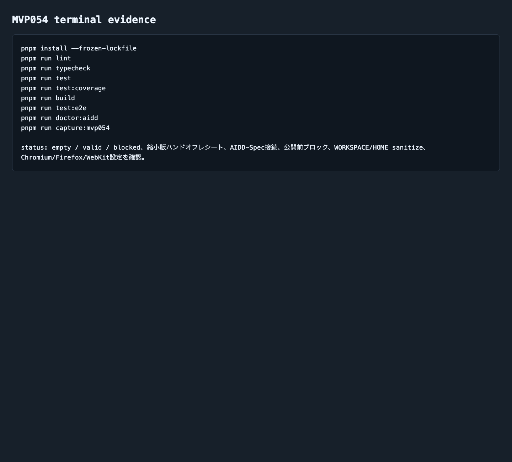

# AIDD Control Plane MVP 054：縮小したAI Task Packetを、次回実行へ渡す前にもう一度確認する

> 2026-07-07 / Codex Mastery Lab
> 記事種別: Experiment / SaaS / Verification Evidence
> 将来の書籍章: 第9章 AI Task Packet、第10章 Verification Evidence、第11章 Learning Log、第18章 AIDD Control PlaneのMVP

## 読者の悩み

AIに開発を頼む時、失敗後の依頼文ほど大きくなりがちです。

「テストも直して、画面も直して、記事も書いて、CIも通して」と一気に頼む。するとCodexは長く走り、途中で止まり、証跡が足りず、次回また同じ説明を繰り返します。

MVP053では、STOP/BRAKE時にAI Task Packetを小さく畳む **Shrink Planner** を作りました。今回のMVP054では、その次です。小さく畳んだpacketを、そのまま次回Codexへ渡してよいのか。実行直前に確認する **縮小版ハンドオフレシート** を作りました。

## 今回の仮説

仮説は次です。

> 縮小後AI Task Packetを次回実行へ渡す前に、execute_now / defer_next_increment / minimum_verification / required evidence / rollback conditionを1枚のレシートとして確認できれば、prompt肥大化と証跡不足を減らせる。

買い物でいえば、カゴに入れたものをレジ前でもう一度見る作業です。必要なものだけ入っているか、買わないものが混ざっていないか、予算を超えていないかを確認する。AI駆動開発でも、次回実行へ渡す直前の確認が必要です。

## 実験内容

今回Codexへ渡した主な要件は次です。

```text
MVP053のShrink Plannerの次段として、empty / valid / blocked の3ケースを表示する。
validでは source_shrink_plan_id, execute_now, defer_next_increment,
minimum_verification, codex_prompt_preview, required_evidence,
rollback_condition, aidd_spec_connections を表示する。
blockedでは local path/private host/private network URL、minimum_verification不足、
rollback不足、Chromium/Firefox/WebKit不足、evidence不足を公開前ブロックとして出す。
```

生成先は `experiments/aidd-control-plane-mvp-054/generated-repo/` です。MVP053をコピーし、差分を小さくして実装しました。

## 画面キャプチャ

### empty: まだShrink Planがない



emptyでは、まだ元になるShrink Planがありません。ここで無理にCodex promptを作らず、「まず何を用意すべきか」を表示します。

### valid: 次回実行へ渡せる



validでは、縮小版ハンドオフレシートを表示します。大事なのは、`execute_now` だけが次回promptに入り、`defer_next_increment` は次回送りとして分離されることです。

### blocked: 公開前ブロックを止める



blockedでは、次の5種類を止めます。

| ブロック | 何を守るか | なぜ必要か |
| --- | --- | --- |
| 未サニタイズのlocal path/private host/private network URL | 公開記事・preview・証跡に個人環境名を出さない | 一度公開すると後から消しても読者や検索に残るため |
| minimum_verification不足 | lint/typecheck/test/build/e2e/doctorを抜かさない | 「動いた気がする」だけで次回へ渡さないため |
| rollback不足 | 失敗時に進めない条件を持つ | 失敗後に同じ大きい依頼文へ戻らないため |
| Chromium/Firefox/WebKit不足 | 3ブラウザE2Eを維持する | 1ブラウザだけの成功を過大評価しないため |
| evidence不足 | empty/valid/blocked/terminal画像を揃える | 記事とレビューで後から追えるようにするため |

### terminal evidence



## 失敗と修正

今回のCodex実装は、生成後の自己申告では検証まで通ったと報告しました。しかし、Codexの報告だけでは完了扱いにしません。独立に次のコマンドを個別実行し、`experiments/aidd-control-plane-mvp-054/artifacts/terminal/` に保存しました。

```text
pnpm install --frozen-lockfile
pnpm run lint
pnpm run typecheck
pnpm run test
pnpm run test:coverage
pnpm run build
pnpm run test:e2e
pnpm run doctor:aidd
```

また、terminal logにはローカルパスが出やすいため、公開用証跡では `WORKSPACE` / `HOME` 表記へサニタイズしました。これはMarkdown本文だけでなく、証跡ログそのものに対して行いました。

## 検証ログ

独立検証の結果です。

```text
pnpm install --frozen-lockfile: pass
pnpm run lint: pass
pnpm run typecheck: pass
pnpm run test: 4 tests passed
pnpm run test:coverage: 100% lines / branches / funcs / statements
pnpm run build: pass（Next.js ESLint plugin warningあり）
pnpm run test:e2e: 9 passed（Chromium / Firefox / WebKit）
pnpm run doctor:aidd: pass
```

E2Eでは、3ブラウザで empty / valid / blocked を確認しました。

```text
9 passed
chromium: empty / valid / blocked
firefox: empty / valid / blocked
webkit: empty / valid / blocked
```

Next.js buildでは、既存構成由来のESLint plugin warningが出ています。ビルドは成功していますが、warningは品質メモとして残します。AIDD-Spec上は、warningも「見なかったことにしない」証跡です。

## 読者が使えるチェックリスト

AIに次回の修正を頼む前に、次を確認してください。

| チェック項目 | 何を確認したいのか | なぜ必要か |
| --- | --- | --- |
| execute_nowは1回で終わる大きさか | 今回やる範囲だけが入っているか | promptを大きくしすぎないため |
| defer_next_incrementが分かれているか | 今回やらない範囲を明示したか | AIが勝手に全部やろうとするのを防ぐため |
| minimum_verificationがあるか | 最低限の検証コマンドが入っているか | 終了条件をあいまいにしないため |
| required evidenceがあるか | スクリーンショットとterminal logが指定されているか | 後からレビューできる一次情報を残すため |
| rollback conditionがあるか | 失敗時に進めない条件があるか | 失敗したまま次工程へ流さないため |
| 3ブラウザが残っているか | Chromium / Firefox / WebKitを確認するか | UI品質を1環境だけで判断しないため |
| 公開前ブロックがないか | local pathやprivate hostが混ざっていないか | 記事・preview・artifactを安全に公開するため |

## AIDD-Spec / SaaSへの接続

今回、`standards/aidd-control-plane-mvp-v0.1.md` に次のMVP機能を追加しました。

```text
Shrunk Packet Handoff Receipt
```

これはAIDD Control Planeを「別のcoding agent」にする機能ではありません。価値は、AIへ渡す前の説明を小さくし、検証と証跡を見える状態にすることです。

AIDD-Spec側では、AI Task Packet、Verification Evidence、Review Record、Learning Logがつながります。

```text
Review Finding
  -> Shrink Planner
  -> Shrunk Packet Handoff Receipt
  -> Codex Run
  -> Verification Evidence
  -> Review Record
  -> Learning Log
```

## まとめ

MVP054では、STOP/BRAKE後に小さく畳んだAI Task Packetを、次回実行へ渡す前にもう一度確認する画面を作りました。

今回の学びは、AI駆動開発で大事なのは「たくさん自動化すること」だけではない、という点です。むしろ、次回AIに渡すものを小さくし、実行しないものを分け、最低限の検証と証跡を固定することが重要です。

noteで読まれる記事も同じです。AI量産記事ではなく、実際にCodexを走らせ、E2Eを通し、warningも残し、スクリーンショットとterminal evidenceを出す一次情報に価値があります。

## 次回

次回は、ハンドオフレシートから実際のCodex Run Queueへ進める前に、実行後の結果をより細かくreceipt化する方向が自然です。特に、command別exit code、duration、artifact path、failure category、repair instructionを1つのVerification Evidence Receiptとして束ねるMVPへ進めます。
