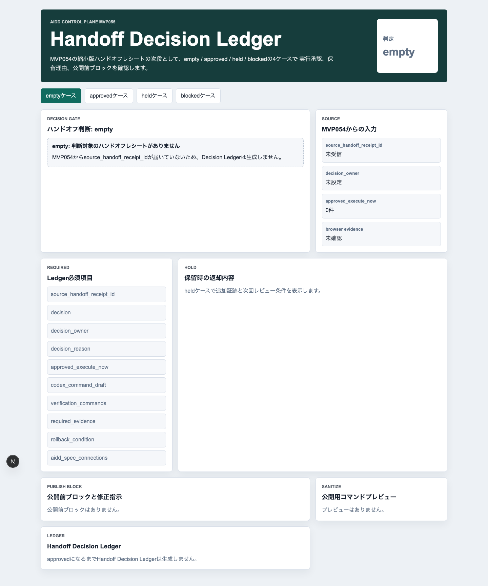
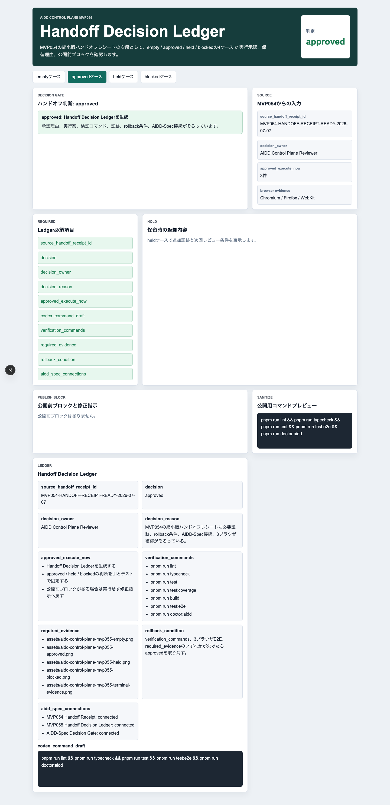
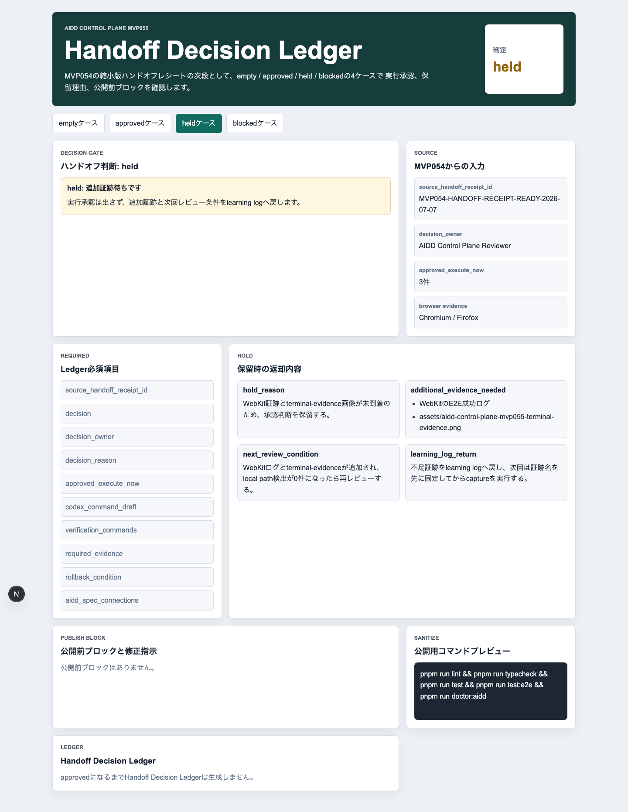
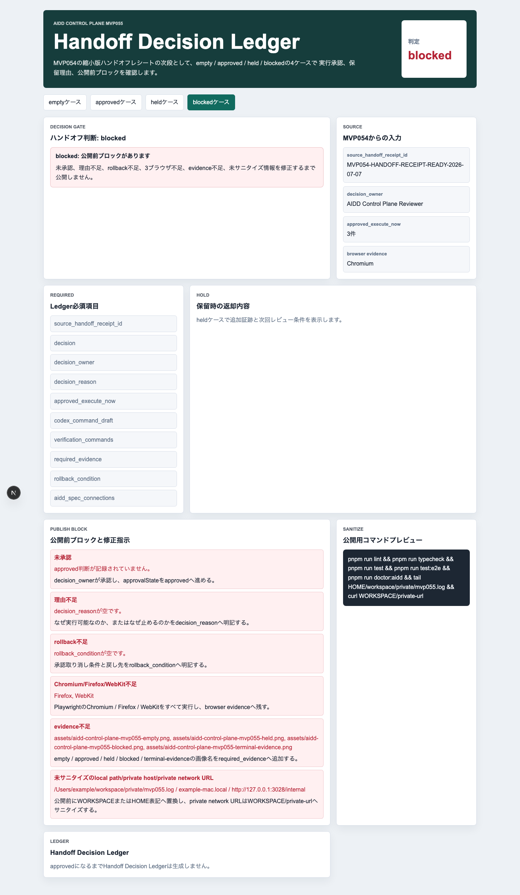
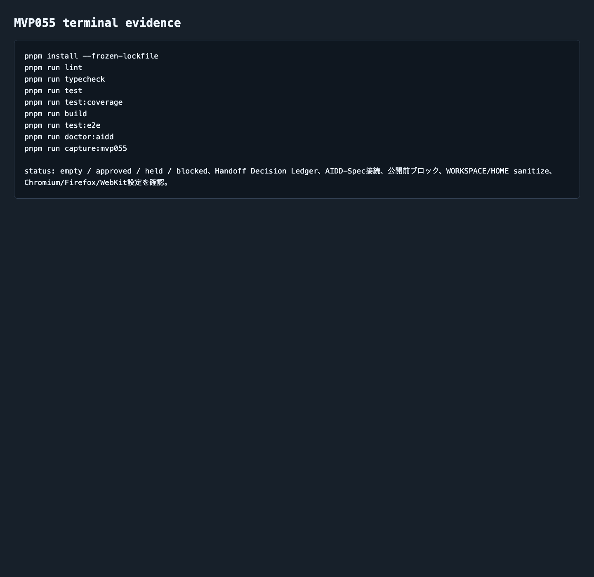

# AIDD Control Plane MVP 055：縮小版ハンドオフを、実行承認・保留・停止に分けて記録する

> 2026-07-07 / Codex Mastery Lab  
> 記事種別: Experiment / SaaS / Verification Evidence  
> 将来の書籍章: 第9章 AI Task Packet、第10章 Verification Evidence、第11章 Review Record、第18章 AIDD Control PlaneのMVP

## 読者の悩み

AIに次の作業を頼む直前、「この依頼文、本当に今投げていいのか？」で迷うことがあります。

MVP054では、縮小したAI Task Packetを次回Codexへ渡す前のハンドオフレシートを作りました。けれど、レシートを見るだけではまだ足りません。人間のレビューでいえば、確認したあとに「実行してよい」「まだ待つ」「止める」を記録しないと、次回また同じ迷いが戻ってきます。

今回のMVP055では、縮小版ハンドオフレシートを **Handoff Decision Ledger** に変換しました。買い物メモでいえば、レジへ進む前に「買うもの」「今日は買わないもの」「予算や持ち物が足りないので止めるもの」を分けて、理由をメモする作業です。

## 今回の仮説

仮説は次です。

> 縮小版ハンドオフレシートを、approved / held / blocked の判断ログに変換できれば、AI実行前の曖昧な「たぶん大丈夫」を減らし、Review RecordとLearning Logへ戻せる。

AIDD Control Planeは、ただCodexを起動するボタンではありません。何を作るか、何を検証するか、何を証拠として残すか、失敗したらどこへ戻すかを、誰でも追えるようにするSaaSです。今回の1インクリメントは、その「実行直前の判断」を画面にしました。

## 実験内容

生成先は `experiments/aidd-control-plane-mvp-055/generated-repo/` です。MVP054をコピーし、Codexへ次のAI Task Packetを渡しました。

```text
テーマは AIDD Control Plane MVP 055「Handoff Decision Ledger」。
empty / approved / held / blocked の4ケースを表示する。
approvedでは source_handoff_receipt_id, decision, decision_owner,
decision_reason, approved_execute_now, codex_command_draft,
verification_commands, required_evidence, rollback_condition,
aidd_spec_connections を表示する。
heldでは hold_reason, additional_evidence_needed,
next_review_condition, learning_log_return を表示する。
blockedでは未承認、理由不足、rollback不足、3ブラウザ不足、
evidence不足、未サニタイズのlocal path/private host/private network URLを止める。
```

Codexは実装途中で長く走ったため、自己申告だけでは完了扱いにしませんでした。生成物を独立に確認し、lint/typecheck/unit/coverage/build/e2e/doctor/captureを別々に実行しました。

## 画面キャプチャ

### empty: まだ判断対象がない



emptyでは、MVP054由来の `source_handoff_receipt_id` がありません。ここで無理に実行承認を作らず、「まずハンドオフレシートを受け取る」状態として止めます。

### approved: 次回Codex実行へ進める



approvedでは、Handoff Decision Ledgerを表示します。重要なのは、実行許可の根拠が `decision_owner` と `decision_reason` として残ることです。さらに `approved_execute_now`、`codex_command_draft`、`verification_commands`、`required_evidence`、`rollback_condition` を同じ画面で確認できます。

### held: まだ実行しない



heldでは、すぐにCodexへ渡しません。WebKit証跡やterminal evidenceのような追加証跡が足りない時、`hold_reason`、`additional_evidence_needed`、`next_review_condition`、`learning_log_return` として次回へ戻します。

### blocked: 公開前ブロックを止める



blockedでは、次の6種類を止めます。

| ブロック | 何を確認したいのか | なぜ必要か |
| --- | --- | --- |
| 未承認 | approved判断が記録されているか | 誰も承認していない実行をキューへ進めないため |
| 理由不足 | decision_reasonが空でないか | あとで「なぜ実行したのか」を説明できるようにするため |
| rollback不足 | 失敗時に承認を取り消す条件があるか | 失敗後に同じ大きな依頼文へ戻らないため |
| Chromium/Firefox/WebKit不足 | 3ブラウザ証跡がそろっているか | 1ブラウザだけの成功を過大評価しないため |
| evidence不足 | empty/approved/held/blocked/terminal画像があるか | 記事とレビューで後から追えるようにするため |
| 未サニタイズ情報 | local path/private host/private network URLが残っていないか | 公開記事やpreviewに個人環境情報を出さないため |

### terminal evidence



## 失敗と修正

今回の失敗は、Codexが最初の調査でコピー済みの `node_modules` や `.next` まで広く見に行き、実行時間が伸びたことです。途中でタイムアウトしましたが、ソース変更は十分に生成されていたため、以後は独立検証へ切り替えました。

ここでの学びは、Codexの完了メッセージではなく、手元で分けて実行した検証ログを一次情報にすることです。AIDD-Specでは、実行結果と証拠がセットで残って初めて「進めてよい」と判断します。

## 検証ログ

独立検証の結果です。

```text
pnpm install --frozen-lockfile: pass
pnpm run lint: pass
pnpm run typecheck: pass
pnpm run test: 5 tests passed
pnpm run test:coverage: 100% lines / branches / funcs / statements
pnpm run build: pass（Next.js ESLint plugin warningあり）
pnpm run test:e2e: 12 passed（Chromium / Firefox / WebKit）
pnpm run doctor:aidd: pass
pnpm run capture:mvp055: pass
```

E2Eでは、3ブラウザで4状態を確認しました。

```text
12 passed
chromium: empty / approved / held / blocked
firefox: empty / approved / held / blocked
webkit: empty / approved / held / blocked
```

Next.js buildでは、既存構成由来のESLint plugin warningが出ています。ビルドは成功していますが、warningを見なかったことにはしません。次回以降の改善対象として残します。

## 読者が使えるチェックリスト

AIに次回実行を頼む前に、次を確認してください。

| チェック項目 | 何を確認したいのか | なぜ必要か |
| --- | --- | --- |
| approved / held / blockedを分けたか | 実行・保留・停止を同じ扱いにしていないか | AIが勝手に全部進めるのを防ぐため |
| decision_ownerを書いたか | 誰が判断したか | 後からレビュー責任を追えるようにするため |
| decision_reasonを書いたか | なぜ実行できるのか | 成功時も失敗時も理由を説明できるようにするため |
| verification_commandsがあるか | lint/typecheck/test/build/e2e/doctorが明示されているか | 「動いた気がする」だけで進めないため |
| required_evidenceがあるか | 画面・terminal・E2E証跡がそろうか | 記事やレビューで再確認できるようにするため |
| rollback_conditionがあるか | 失敗した時にどこで止めるか | 無限修正ループを防ぐため |
| local pathを消したか | `/Users/...` やprivate URLが残っていないか | 公開前の情報漏れを防ぐため |

## SaaS / AIDD-Specへの接続

今回、`standards/aidd-control-plane-mvp-v0.1.md` に **Handoff Decision Ledger** を追加しました。

AIDD-Specの観点では、これは次の接続点です。

```text
Shrunk Packet Handoff Receipt
  -> Handoff Decision Ledger
  -> Run Authorization Gate
  -> Codex Run Queue
  -> Verification Evidence Receipt
  -> Review Record / Learning Log
```

つまり、AIDD Control Planeは「実行ボタン」だけではなく、実行前の判断を標準化する道具になります。AI量産記事ではなく、実際に作り、止まり、直し、証跡を残した一次情報として記事化できるのも、このLedgerがあるからです。

## 次回

次回は、approvedになったDecision Ledgerを、実際のRun Authorization GateまたはCodex Run Queueへ渡す直前の入力にします。特に、承認済みの実行案だけがqueueへ進み、heldやblockedが混ざらないことを確認したいです。
