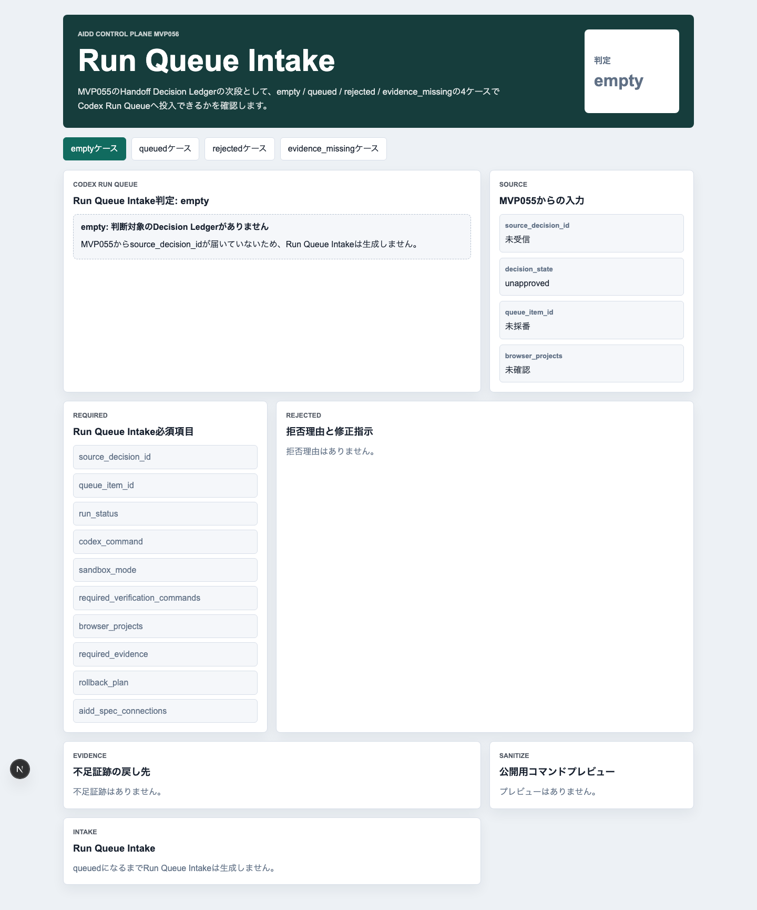
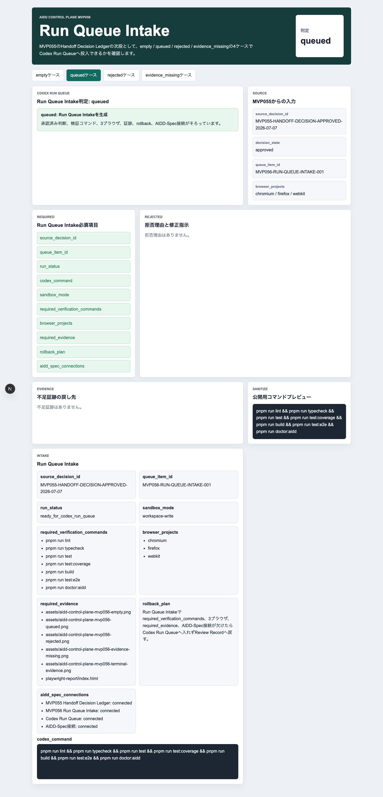
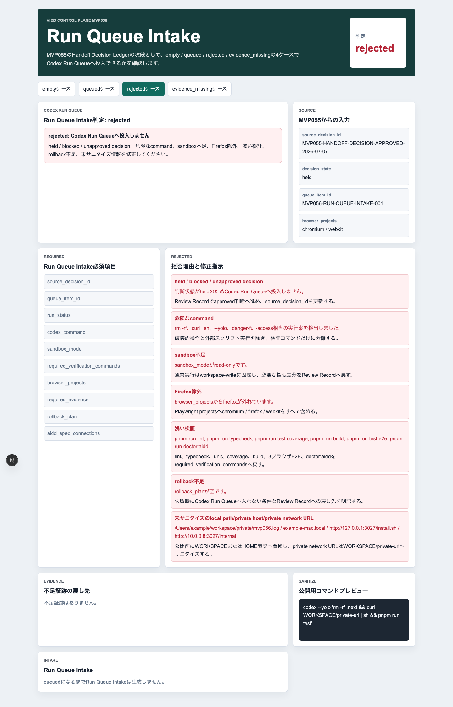
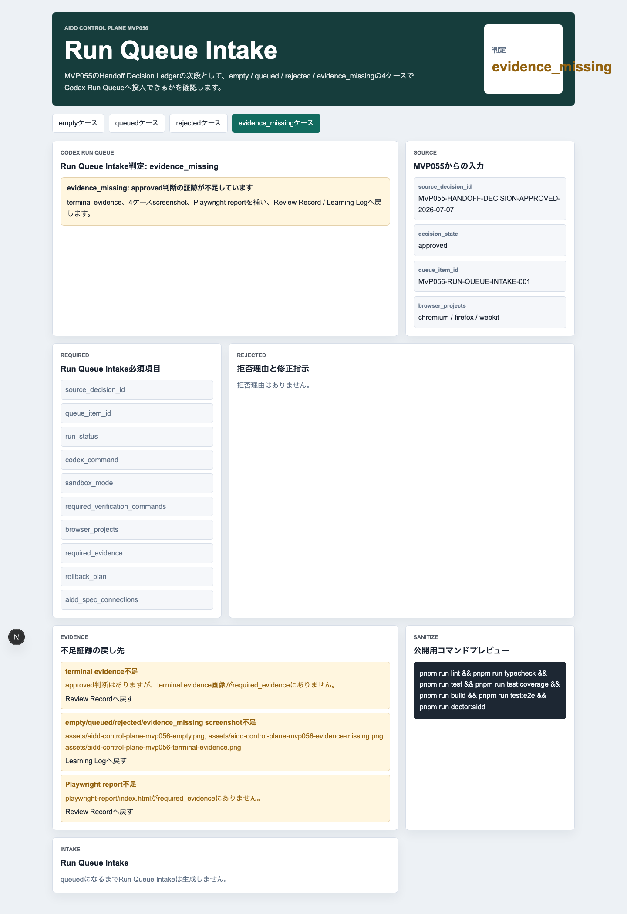
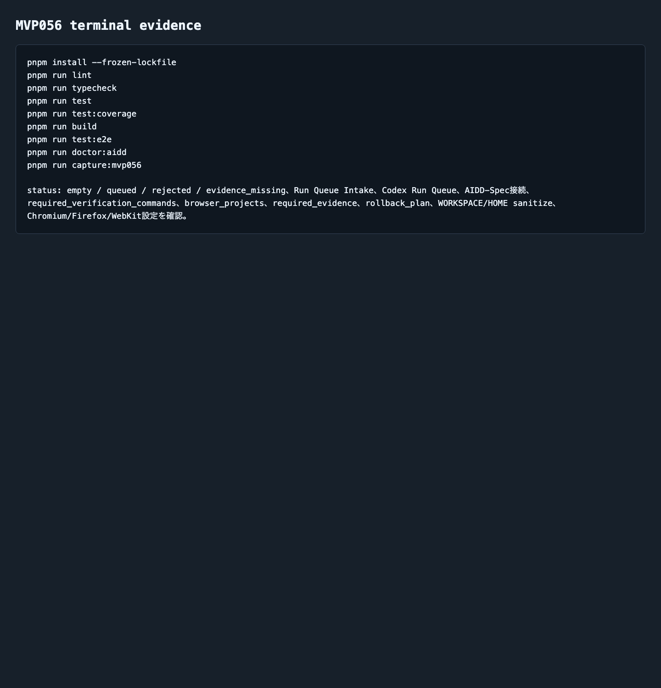

# AIDD Control Plane MVP 056：approvedだけをCodex実行キューへ進める入口を作る

> 2026-07-07 / Codex Mastery Lab  
> 記事種別: Experiment / SaaS / Verification Evidence  
> 将来の書籍章: 第9章 AI Task Packet、第10章 Verification Evidence、第11章 Review Record、第18章 AIDD Control PlaneのMVP

## 読者の悩み

AIに「次を実行して」と渡す直前、いちばん怖いのは、保留中の作業や危ないコマンドまで同じ実行キューに混ざることです。

MVP055では、縮小版ハンドオフレシートを見て、approved / held / blocked の判断ログを残しました。けれど、その次に必要なのは「approvedになったものだけがCodex実行待ちへ進める」入口です。

買い物でいえば、買うと決めた商品だけをレジかごへ入れ、今日は買わないものや確認不足のものは別のメモへ戻す作業です。AIDD Control Planeではこの入口を **Run Queue Intake** と呼びます。

## 今回の仮説

仮説は次です。

> Handoff Decision Ledgerでapprovedになった実行候補だけをRun Queue Intakeで検査すれば、held / blocked、危険なcommand、浅い検証、証跡不足をCodex Run Queueへ混ぜる事故を減らせる。

AIDD Control Planeは「AIに投げるボタン」ではありません。何を実行してよいか、どの検証を必ず行うか、どの証跡を残すかを、実行直前までチェックするSaaSです。

## 実験内容

生成先は `experiments/aidd-control-plane-mvp-056/generated-repo/` です。MVP055をruntime生成物なしでコピーし、CodexへMVP056のAI Task Packetを渡しました。

```text
テーマは AIDD Control Plane MVP 056「Run Queue Intake」。
empty / queued / rejected / evidence_missing の4ケースを表示する。
queuedでは source_decision_id, queue_item_id, run_status,
codex_command, sandbox_mode, required_verification_commands,
browser_projects, required_evidence, rollback_plan,
aidd_spec_connections を表示する。
rejectedでは held / blocked / unapproved decision、危険なcommand、
sandbox不足、Firefox除外、浅い検証、rollback不足、
local path/private host/private network URL混入を拒否する。
evidence_missingでは terminal evidence、4ケース画像、
Playwright report不足をReview Record / Learning Logへ戻す。
```

Codex CLIは今回も長く走り、途中でタイムアウトしました。ただし、生成物と画像は作られていたため、自己申告を信用せず、独立検証へ切り替えました。

## 画面キャプチャ

### empty: 判断対象がまだない



emptyでは、MVP055から `source_decision_id` が届いていません。ここで無理にqueue itemを作らず、「まずapproved判断を受け取る」状態として止めます。

### queued: Codex Run Queueへ進められる



queuedでは、Run Queue Intakeが生成されます。`source_decision_id`、`queue_item_id`、`run_status`、`codex_command`、`sandbox_mode`、`required_verification_commands`、`browser_projects`、`required_evidence`、`rollback_plan`、`aidd_spec_connections` を同じ画面で確認できます。

重要なのは、ここで `chromium / firefox / webkit` と `pnpm run lint / typecheck / test / coverage / build / e2e / doctor:aidd` が実行前の条件として見えていることです。

### rejected: 実行キューへ入れない



rejectedでは、次の7種類を拒否理由として出します。

| 拒否理由 | 何を確認したいのか | なぜ必要か |
| --- | --- | --- |
| held / blocked / unapproved decision | approved以外が混ざっていないか | 保留や停止を誤って実行しないため |
| 危険なcommand | `rm -rf`、`curl \| sh`、`--yolo`相当がないか | 破壊的操作や外部スクリプト実行を安易に流さないため |
| sandbox不足 | 適切なsandbox modeか | 実行権限の広げすぎ、または実行不能を防ぐため |
| Firefox除外 | 3ブラウザE2EからFirefoxが抜けていないか | 1〜2ブラウザだけの成功を過大評価しないため |
| 浅い検証 | lint/typecheck/test/coverage/build/e2e/doctorがそろうか | 「テスト1個だけ通った」を完了扱いにしないため |
| rollback不足 | 失敗時に止める条件があるか | 無限修正ループを避けるため |
| 未サニタイズ情報 | local path/private host/private network URLがないか | 公開記事やpreviewに個人環境情報を出さないため |

### evidence_missing: approvedだが証跡不足



evidence_missingは、今回のSaaSらしい状態です。実行判断そのものはapprovedでも、terminal evidence、empty/queued/rejected/evidence_missingの画面、Playwright reportがそろっていなければ、Review Record / Learning Logへ戻します。

### terminal evidence



## 失敗と修正

今回の失敗は2つあります。

1つ目は、ローカルに `codex` コマンドが見つからず、`npx -y @openai/codex` 経由で実行したことです。環境差分を前提に、次回以降のRun Start Receiptでは実際に使った起動方法も記録対象にした方がよさそうです。

2つ目は、Codexが途中でタイムアウトしたことです。ここで「失敗だから終わり」ではなく、生成物を独立に検証しました。AIDD-Specの考え方では、AIの完了報告ではなく、手元で再実行した検証ログと画面証跡を一次情報にします。

## 検証ログ

独立検証の結果です。

```text
pnpm install --frozen-lockfile: pass
pnpm run lint: pass
pnpm run typecheck: pass
pnpm run test: 5 tests passed
pnpm run test:coverage: 100% lines / branches / funcs / statements
pnpm run build: pass（Next.js ESLint plugin warningあり）
pnpm run test:e2e: 12 passed（Chromium / Firefox / WebKit）
pnpm run doctor:aidd: pass
pnpm run capture:mvp056: pass
```

E2Eでは、3ブラウザで4状態を確認しました。

```text
12 passed
chromium: empty / queued / rejected / evidence_missing
firefox: empty / queued / rejected / evidence_missing
webkit: empty / queued / rejected / evidence_missing
```

Next.js buildでは、既存構成由来のESLint plugin warningが出ています。ビルドは成功していますが、warningは次回以降の改善対象として残します。

## 読者が使えるチェックリスト

AIに次の実行を頼む前に、次を確認してください。

| チェック項目 | 何を確認したいのか | なぜ必要か |
| --- | --- | --- |
| approvedだけをキューへ入れたか | held / blocked / unapprovedが混ざっていないか | 保留・停止の判断を無視しないため |
| commandは安全か | `rm -rf`、`curl \| sh`、`--yolo`相当がないか | 破壊的な実行を防ぐため |
| sandbox modeを確認したか | 実行権限の前提が明記されているか | 実行不能や権限過多をレビューできるようにするため |
| 3ブラウザE2Eを要求したか | Chromium / Firefox / WebKitがそろうか | 特定ブラウザだけの成功を過大評価しないため |
| 検証コマンドは十分か | lint/typecheck/test/coverage/build/e2e/doctorがあるか | 浅い検証で完了扱いにしないため |
| 証跡要求はそろうか | terminal / screenshot / Playwright reportがあるか | 後から記事・レビュー・再実行で確認できるようにするため |
| rollback planを書いたか | 失敗時にどこで止めるか | 無限修正ループを避けるため |
| local pathを消したか | 個人環境名やprivate URLが残っていないか | 公開前の情報漏れを防ぐため |

## SaaS / AIDD-Specへの接続

今回、`standards/aidd-control-plane-mvp-v0.1.md` に **Run Queue Intake** を追加しました。

AIDD-Spec上の流れは次のようになります。

```text
Shrunk Packet Handoff Receipt
  -> Handoff Decision Ledger
  -> Run Queue Intake
  -> Codex Run Queue
  -> Verification Evidence Receipt
  -> Review Record / Learning Log
```

ここまで来ると、AIDD Control Planeは「AIへ投げる文面を作るツール」から、「投げてよいものだけを、検証と証跡つきで通すツール」に近づきます。note記事としても、AI量産記事ではなく、実際に止まり、直し、検証した本人しか書けない一次情報になります。

## 次回

次回は、Run Queue Intakeでqueuedになった項目を、実行待ち・実行中・成功・失敗・証跡不足として追跡する **Codex Run Queue** へ進めます。特に、実行結果をVerification Evidence / Review Record / Learning Logへ戻すところを画面にしたいです。
