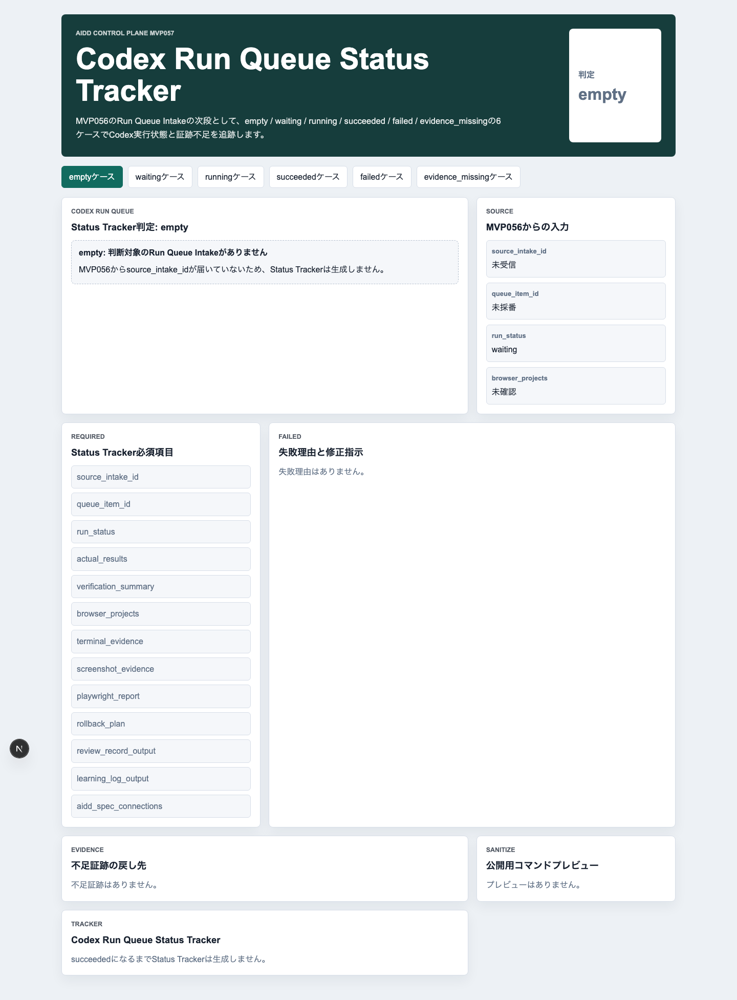
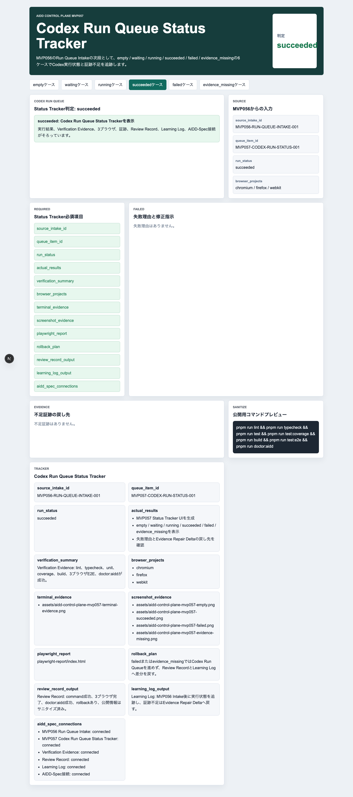
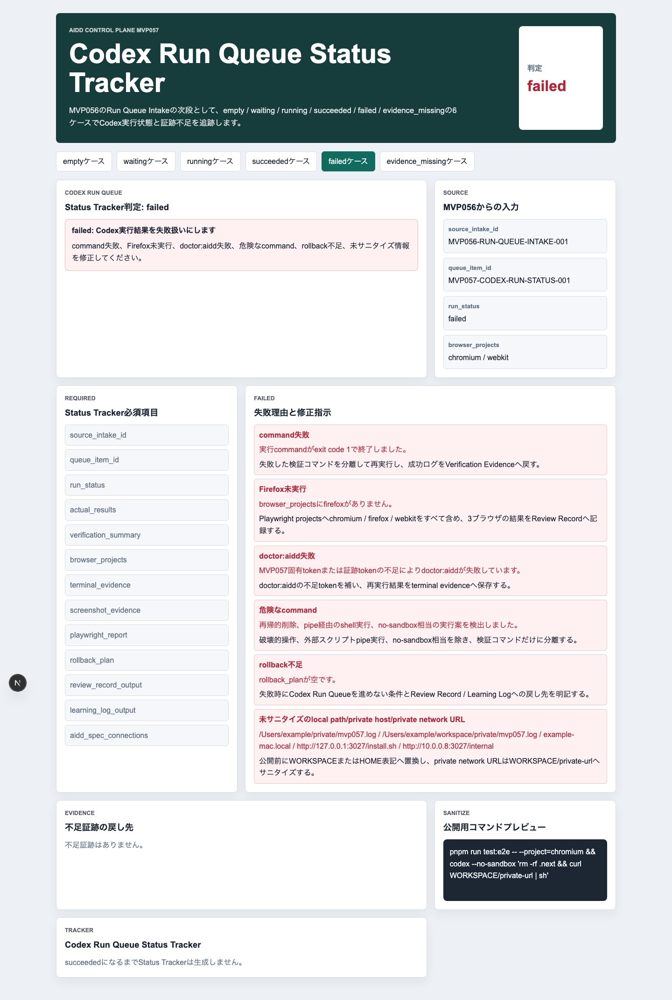
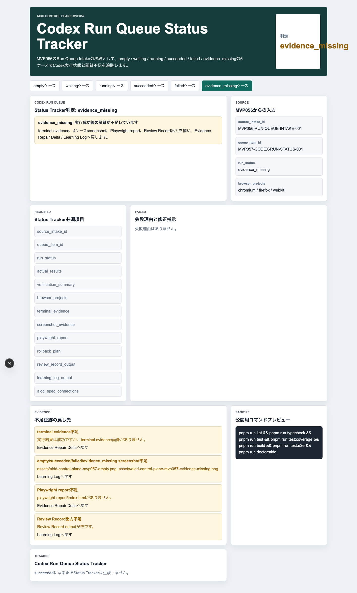
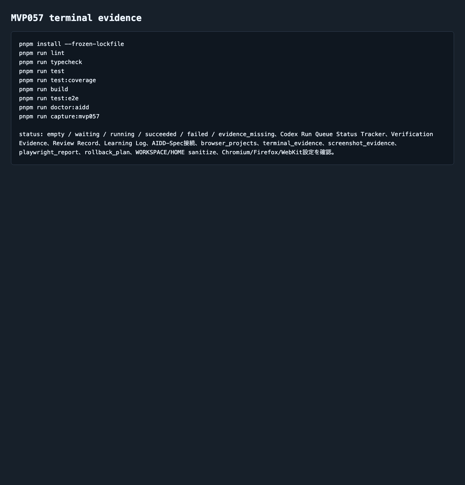

# AIDD Control Plane MVP 057：Codex実行の「成功したつもり」を状態で止める

> 2026-07-07 / Codex Mastery Lab  
> 記事種別: Experiment / SaaS / Verification Evidence  
> 将来の書籍章: 第9章 AI Task Packet、第10章 Verification Evidence、第11章 Review Record、第18章 AIDD Control PlaneのMVP

## 読者の悩み

AIに実装を頼むと、最後に「完了しました」と言われます。けれど、実務で怖いのは、その完了報告が何を根拠にしているのか分からないことです。

- lintだけ通ったのか
- 3ブラウザE2Eまで通ったのか
- Firefoxは本当に走ったのか
- terminal logやスクリーンショットは残ったのか
- 失敗時の戻し先はあるのか

MVP056では、approvedになった実行候補だけをCodex Run Queueへ入れる入口を作りました。今回はその次です。キューへ入った実行が、いま **waiting / running / succeeded / failed / evidence_missing** のどこにあるのかを見えるようにしました。

家計簿でいえば、「買う予定」だけでなく、「注文待ち」「配送中」「受け取り済み」「返品が必要」「領収書不足」を分けて残す感覚です。AIDD Control Planeではこれを **Codex Run Queue Status Tracker** と呼びます。

## 今回の仮説

仮説は次です。

> Codex実行を単なる完了報告ではなく、実行状態・検証結果・3ブラウザ・証跡・Review Record / Learning Logへの戻し先として管理すれば、「成功したつもり」のまま記事化・次工程化する事故を減らせる。

AIDD Control Planeは、AIにコードを書かせるボタンではありません。AIが出した結果を、人間と次のAIが再利用できる一次情報へ変換するSaaSです。

## 実験内容

生成先は `experiments/aidd-control-plane-mvp-057/generated-repo/` です。MVP056をruntime生成物なしでコピーし、CodexへMVP057のAI Task Packetを渡しました。

```text
テーマは AIDD Control Plane MVP 057「Codex Run Queue Status Tracker」。
empty / waiting / running / succeeded / failed / evidence_missing の6ケースを表示する。
succeededでは source_intake_id, queue_item_id, run_status,
actual_results, verification_summary, browser_projects,
terminal_evidence, screenshot_evidence, playwright_report,
rollback_plan, review_record_output, learning_log_output,
aidd_spec_connections を表示する。
failedでは command失敗、Firefox未実行、doctor:aidd失敗、危険command、
rollback不足、local path/private host/private network URL混入を失敗理由にする。
evidence_missingでは実行結果が成功でも証跡不足ならEvidence Repair Delta / Learning Logへ戻す。
```

Codex CLIは今回もタイムアウトしました。ただし、生成物・テスト・画像は作られていたため、自己申告を信用せず、独立検証へ切り替えました。

## 画面キャプチャ

### empty: queue itemがまだない



emptyでは、MVP056のRun Queue Intakeから `source_intake_id` が届いていません。ここでは無理に実行結果を作らず、「まずqueued itemを受け取る」状態として止めます。

### succeeded: 実行結果と証跡を束ねる



succeededでは、Codex Run Queue Status Trackerが生成されます。`actual_results`、`verification_summary`、`browser_projects`、`terminal_evidence`、`screenshot_evidence`、`playwright_report`、`review_record_output`、`learning_log_output` を同じ画面で見ます。

重要なのは、成功を「AIがそう言った」ではなく、検証コマンド・3ブラウザ・証跡・Review Recordへの出力で判断している点です。

### failed: 失敗を分類して戻す



failedでは、次の失敗理由を表示します。

| 失敗理由 | 何を確認したいのか | なぜ必要か |
| --- | --- | --- |
| command失敗 | 検証コマンドがexit code 0で終わったか | 失敗ログを隠したまま次へ進めないため |
| Firefox未実行 | Chromium / Firefox / WebKitがそろったか | 1ブラウザ成功を過大評価しないため |
| doctor:aidd失敗 | MVP固有tokenや証跡tokenがあるか | 浅い実装を完了扱いしないため |
| 危険なcommand | 再帰的削除、pipe経由shell、no-sandbox相当がないか | 実行事故を防ぐため |
| rollback不足 | 失敗時に止める条件があるか | 無限修正ループを避けるため |
| 未サニタイズ情報 | local path / private host / private network URLがないか | 公開記事やpreviewに個人環境情報を出さないため |

### evidence_missing: 成功しても証跡不足なら止める



evidence_missingは、今回もっともSaaSらしい状態です。実行結果そのものは成功でも、terminal evidence、empty/succeeded/failed/evidence_missing画像、Playwright report、Review Record出力が不足していれば、完了扱いにせずEvidence Repair Delta / Learning Logへ戻します。

### terminal evidence



## 失敗と修正

今回の失敗は2つです。

1つ目は、Codexが長時間走ってタイムアウトしたことです。ここでCodexの自己申告を待ち続けず、生成済みファイルを独立検証しました。

2つ目は、最初のファイルコピー時に破壊的cleanupと誤検知されるコマンド表現がブロックされたことです。再試行で危険な表現を避け、Pythonの非破壊的コピーに切り替えました。AIDD-Spec的には、このような環境制約もLearning Logへ戻すべき一次情報です。

## 検証ログ

独立検証の結果です。

```text
pnpm install --frozen-lockfile: pass
pnpm run lint: pass
pnpm run typecheck: pass
pnpm run test: 7 tests passed
pnpm run test:coverage: 100% lines / branches / funcs / statements
pnpm run build: pass（Next.js ESLint plugin warningあり）
pnpm run test:e2e: 12 passed（Chromium / Firefox / WebKit）
pnpm run doctor:aidd: pass
pnpm run capture:mvp057: pass
```

E2Eでは、3ブラウザで4状態を確認しました。

```text
12 passed
chromium: empty / succeeded / failed / evidence_missing
firefox: empty / succeeded / failed / evidence_missing
webkit: empty / succeeded / failed / evidence_missing
```

Next.js buildでは、既存構成由来のESLint plugin warningがまだ出ています。ビルドは成功していますが、warningは次回以降の改善対象として残します。

## 読者が使えるチェックリスト

| チェック項目 | 何を確認したいのか | なぜ必要か |
| --- | --- | --- |
| 実行状態を分けたか | waiting / running / succeeded / failed / evidence_missingを区別できるか | 「完了しました」だけでは品質判断できないため |
| 3ブラウザを記録したか | Chromium / Firefox / WebKitがそろうか | UIの互換性を1ブラウザで代表させないため |
| command別結果を残したか | lint/typecheck/test/build/e2e/doctorの結果が分かるか | どの品質ゲートが壊れたか修正できるため |
| 証跡不足を成功と分けたか | 成功ログはあるが画像やreportがない状態を止めるか | note記事やレビューで一次情報として使えないため |
| rollback条件を書いたか | 失敗時にどこで止めるか | AIの無限修正ループを避けるため |
| 公開前サニタイズをしたか | local pathやprivate hostが残っていないか | 公開previewで個人環境情報を漏らさないため |

## AIDD-Specへの接続

今回のMVP057で、`standards/aidd-control-plane-mvp-v0.1.md` に **Codex Run Queue Status Tracker** を追加しました。

AIDD-Specの流れでは、これは次の位置にあります。

```text
Product Brief
  -> AI Task Packet
  -> Run Queue Intake
  -> Codex Run Queue Status Tracker
  -> Verification Evidence
  -> Review Record
  -> Learning Log
  -> Spec Improvement
```

ポイントは、Codex実行を「イベント」ではなく「再利用できる証跡パッケージ」へ変換することです。

## SaaSへの接続

AIDD Control Plane SaaSとしては、次の価値に近づきました。

- 実行待ちと実行済みを分ける
- 成功と証跡不足を分ける
- command失敗をReview Findingへ変換する
- Firefox未実行やdoctor失敗を見落とさない
- 公開前のlocal path漏れを検出する
- Learning Logから次回AI Task Packetへ戻せる

「AIでnote記事を量産する」よりも強いのは、このように実際に動かし、失敗し、直し、証跡を残した本人だけが書ける一次情報です。

## 次回

次は、MVP057のfailed / evidence_missingを入力にして、**Evidence Repair Delta Generator** または **Review Finding Action Queue** へ進めるのが自然です。失敗ログを、次の1インクリメントで直すAI Task Packet deltaへ変換する入口を作ります。
