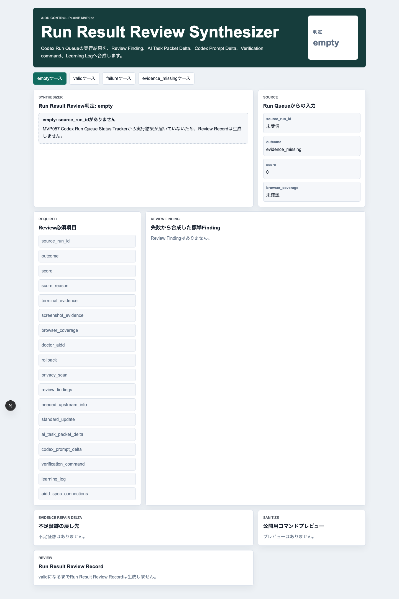
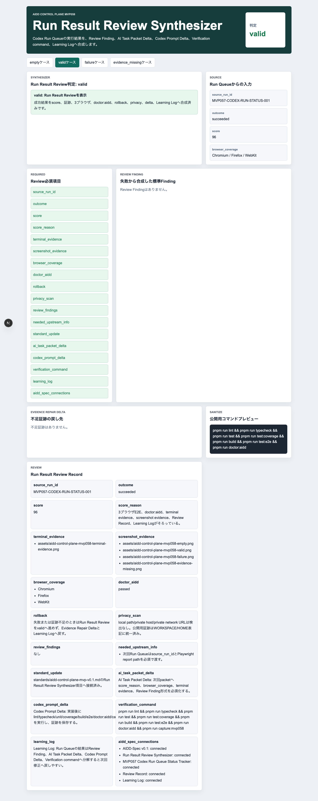
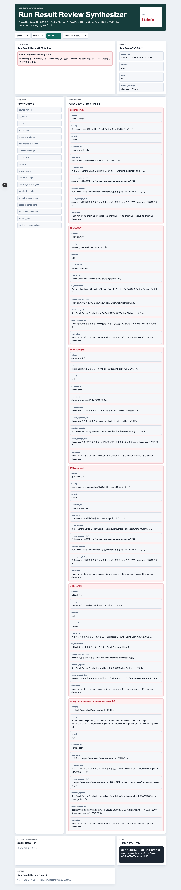
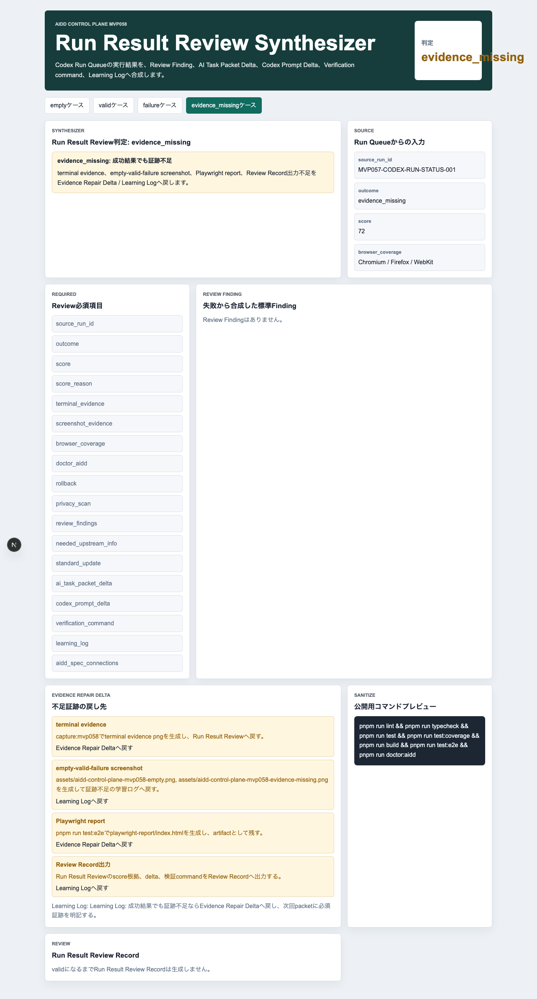
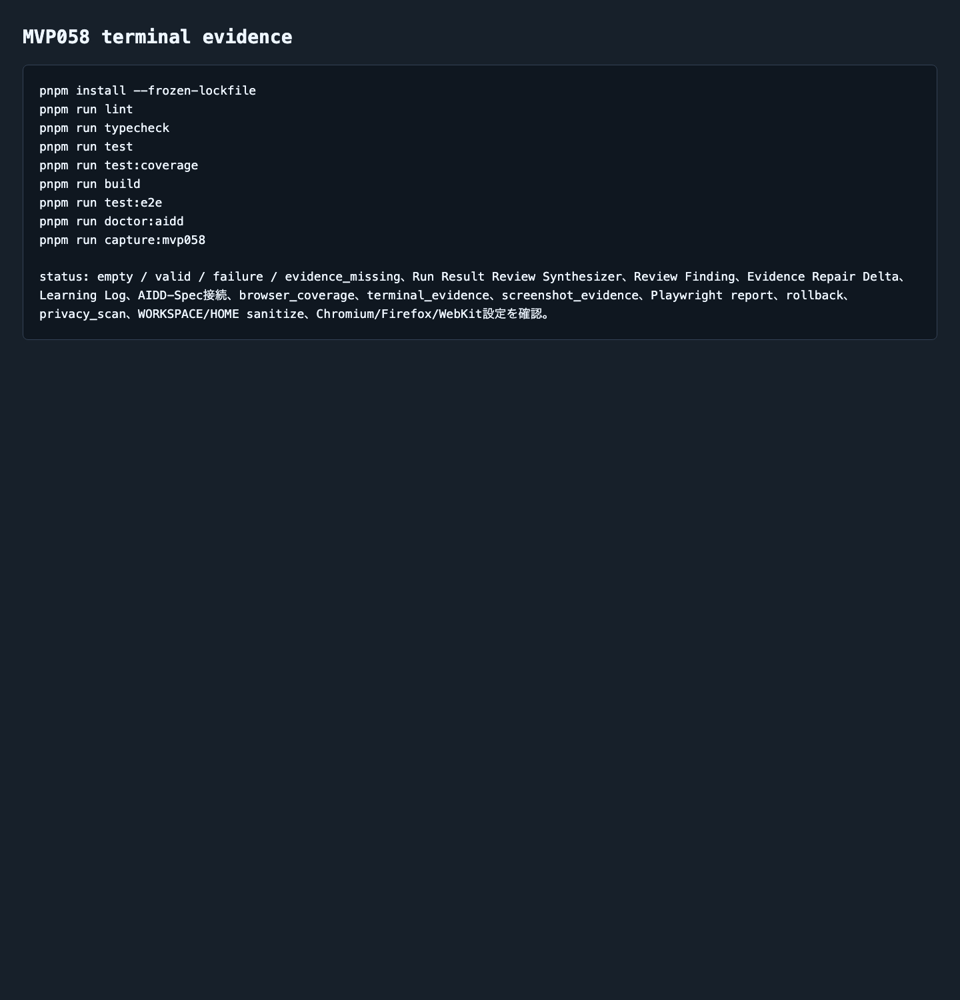

# AIDD Control Plane MVP 058：Codex実行結果を「次の指示」に変換する

> 2026-07-07 / Codex Mastery Lab  
> 記事種別: Experiment / SaaS / Verification Evidence  
> 将来の書籍章: 第9章 AI Task Packet、第10章 Verification Evidence、第11章 Review Record、第18章 AIDD Control PlaneのMVP

## 読者の悩み

AIに実装を頼んだあと、いちばん困るのは「で、次に何を直せばいいのか」が曖昧なことです。

- テストが落ちたのか
- Firefoxだけ走っていないのか
- 証跡画像が足りないのか
- doctorコマンドが浅い実装を見逃したのか
- 次回のCodex promptへ何を書き足すべきなのか

MVP057では、Codex Run Queueの状態を waiting / running / succeeded / failed / evidence_missing として追跡しました。今回はその次です。実行結果を読んで終わりにせず、**Review Finding、AI Task Packet delta、Codex prompt delta、Verification command、Learning Logへ変換する画面**を作りました。

料理でいえば、作った料理を見て「おいしい/まずい」で終わらせず、「塩が多い」「次回は計量スプーンを使う」「買い物メモに無塩バターを足す」まで残す感覚です。

## 今回の仮説

> Codex実行結果を、標準Review Findingと次回AI Task Packet deltaへ自動的に分解できれば、AI駆動開発の失敗は単発の事故ではなく、次回の入力品質を上げる一次情報になる。

AIDD Control Planeは、AIにコードを書かせるだけのSaaSではありません。AIが出した結果を、人間と次のAIが再利用できる形へ整理するSaaSです。

## 実験内容

生成先は `experiments/aidd-control-plane-mvp-058/generated-repo/` です。MVP057を参考にし、runtime生成物を除外して、CodexへMVP058のAI Task Packetを渡しました。

今回の実装テーマは **Run Result Review Synthesizer** です。

```text
MVP057のCodex Run Queue Status Trackerで得た実行結果を、
Review Finding / AI Task Packet delta / Codex prompt delta /
Verification command / Learning Logへ合成する。

empty / valid / failure / evidence_missing の4状態を表示する。
failureでは command失敗、Firefox未実行、doctor:aidd失敗、
危険command、rollback不足、local path/private host/private network URL混入を
Review Finding形式へ変換する。
```

## 画面キャプチャ

### empty: 元の実行結果がまだない



emptyでは `source_run_id` がありません。ここで無理にReview Recordを作らず、前段のCodex Run Queue Status Trackerから実行結果を受け取る必要がある、と止めます。

### valid: 成功結果をReview Recordへ変換する



validでは、次の情報を一つのRun Result Review Recordとして表示します。

| 項目 | 何を確認したいのか | なぜ必要か |
| --- | --- | --- |
| score / score_reason | 成功点数と根拠 | 「なんとなく成功」を避けるため |
| browser_coverage | Chromium / Firefox / WebKit がそろったか | 1ブラウザ成功を過大評価しないため |
| terminal_evidence | 検証ログの画像があるか | 記事・レビューで再確認できるため |
| screenshot_evidence | empty / valid / failure / evidence_missing の画面があるか | 状態設計を目で確認できるため |
| doctor_aidd | MVP固有の浅い実装検査が通ったか | 汎用テストだけでは見逃す抜けを止めるため |
| ai_task_packet_delta | 次回AIへ渡す改善差分があるか | 失敗を次の入力へ戻すため |
| codex_prompt_delta | 次回Codex promptに足す文があるか | 同じ失敗を繰り返しにくくするため |
| learning_log | 今回の学びが残ったか | 連載・書籍・SaaS改善へ再利用するため |

### failure: 失敗をReview Finding形式へ分解する



failureでは、単に「失敗」と出すのではなく、AIDD-Specへ戻せる形へ分解します。

```yaml
category: Firefox未実行
finding: browser_coverageにFirefoxがありません。
severity: high
observed_by: browser_coverage
ideal_state: Chromium / Firefox / WebKitの3ブラウザ結果がそろう。
fix_instruction: Playwright projectsへChromium / Firefox / WebKitを含め、Firefox結果をReview Recordへ記録する。
needed_upstream_info: Firefox未実行を再現できるsource run detailとterminal evidenceが必要。
standard_update: Run Result Review SynthesizerはFirefox未実行を標準Review Findingとして返す。
codex_prompt_delta: Firefox未実行を解消するまでvalid判定にせず、修正後に3ブラウザE2Eとdoctor:aiddを再実行する。
verification: pnpm run lint && pnpm run typecheck && pnpm run test && pnpm run test:e2e && pnpm run doctor:aidd
```

この形にしておくと、失敗が「次回のAI Task Packetに入れる具体的な文」へ変わります。

### evidence_missing: 成功しても証跡不足なら止める



今回の重要な状態は evidence_missing です。実行結果が成功でも、terminal evidence、4状態スクリーンショット、Playwright report、Review Record出力が不足していれば、完了扱いにしません。

AIDD Control Planeの価値は「AIが成功と言った」ことではなく、「あとから検証できる形で成功を残せる」ことにあります。

### terminal evidence



## 失敗と修正

今回のCodex実装は、生成物とテスト一式を作れました。ただし、Codexの自己申告は信用せず、こちらで独立検証を行いました。

修正・確認した点は次です。

1. terminal logに作業環境の絶対パスが出るため、公開証跡では `WORKSPACE` 表記へサニタイズした。
2. failure fixtureにはlocal pathやprivate network URLの検出を入れたが、公開記事・preview・artifactには実環境名を残さないようにした。
3. `test:e2e` はChromium / Firefox / WebKitで12ケース通した。
4. `doctor:aidd` はMVP058固有token、Run Result Review Synthesizer、Review Finding、Evidence Repair Delta、Learning Log、3ブラウザ設定、画像名を検査した。

## 検証ログ

独立検証の結果です。

```text
pnpm install --frozen-lockfile: pass
pnpm run lint: pass
pnpm run typecheck: pass
pnpm run test: 5 tests passed
pnpm run test:coverage: 100% lines / branches / funcs / statements
pnpm run build: pass（Next.js ESLint plugin warningあり）
pnpm run test:e2e: 12 passed（Chromium / Firefox / WebKit）
pnpm run doctor:aidd: pass
pnpm run capture:mvp058: pass
leak scan: no public leak hits
```

E2Eでは、3ブラウザで4状態を確認しました。

```text
12 passed
chromium: empty / valid / failure / evidence_missing
firefox: empty / valid / failure / evidence_missing
webkit: empty / valid / failure / evidence_missing
```

coverageは次の通りです。

```text
All files: 100% statements / 100% branches / 100% funcs / 100% lines
```

## 読者が使えるチェックリスト

| チェック項目 | 何を確認したいのか | なぜ必要か |
| --- | --- | --- |
| 実行結果にsource idがある | どのCodex実行から来た結果か | 後から原因を追えるようにするため |
| score_reasonがある | 点数の根拠が文章で残っているか | 高得点の思い込みを避けるため |
| 3ブラウザがそろっている | Chromium / Firefox / WebKitの差を見たか | ブラウザ依存の不具合を減らすため |
| terminal evidenceがある | コマンド結果を画像・ログで残したか | 記事やレビューで再確認できるため |
| failureをReview Finding化した | category / ideal_state / fix_instructionまで書いたか | 失敗を次回の指示へ変えるため |
| AI Task Packet deltaがある | 次回AIへ渡す改善差分があるか | 同じ抜けを繰り返さないため |
| Codex prompt deltaがある | 次回Codexへ足す具体文があるか | 抽象的な反省で終わらせないため |
| local pathを消した | 公開物に個人環境が出ていないか | noteやpreviewで安全に共有するため |

## AIDD-Spec / SaaSへの接続

AIDD-Spec v0.1では、AI駆動開発の成果物を次の流れでつなぎます。

```text
AI Task Packet
  -> Agent Run
  -> Verification Evidence
  -> Review Record
  -> Learning Log
  -> Spec Improvement
```

MVP058は、このうち **Agent Run -> Review Record / Learning Log** の変換を小さく実装したものです。

SaaSとして見ると、今回の画面は「実行結果を読み込んで、次回のAI Task Packetへ戻す変換器」です。まだ外部APIやDBはありませんが、次の価値が見えました。

- AIの成功報告をそのまま信じない
- 失敗を標準Findingへ分類する
- 証跡不足を成功扱いにしない
- 次回Codex promptへ入れる差分を残す
- note記事や書籍に使える一次情報を保存する

noteで読まれるのは、AIが量産した一般論ではなく、こうした実行ログ・画面・失敗・修正を持つ一次情報です。

## 次回

次回の自然な改善対象は、MVP058で作ったReview Findingを「次に実行する行動キュー」へ変換することです。

候補は **Next Increment Planner** または **Review Finding Action Queue** です。今回のRun Result Reviewをsourceにして、execute_now / next_increment / learning_log を混ぜずに扱えるようにします。
