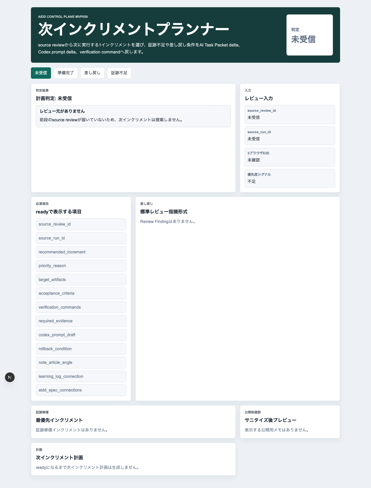
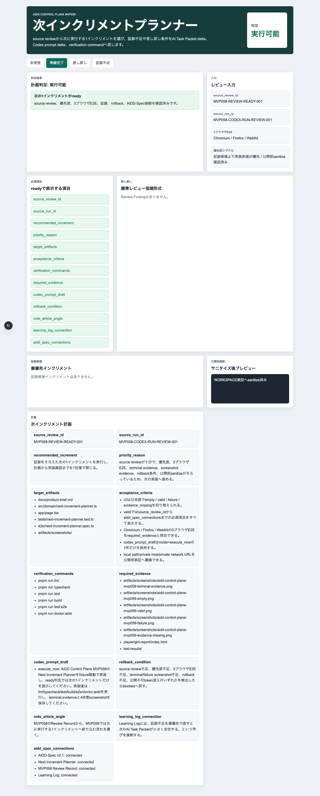
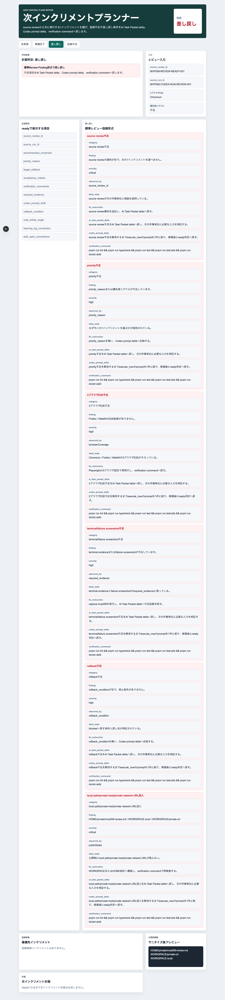
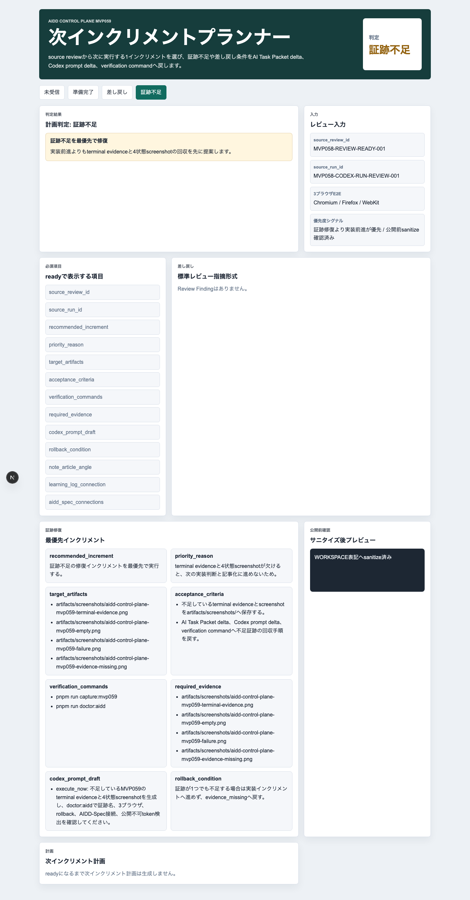
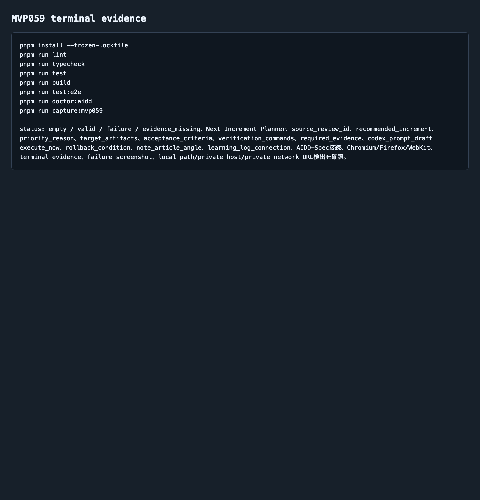

# AIDD Control Plane MVP 059：失敗ログから「次にやる1つ」を決める

> 2026-07-07 / Codex Mastery Lab  
> 記事種別: Experiment / SaaS / Verification Evidence  
> 将来の書籍章: 第9章 AI Task Packet、第10章 Verification Evidence、第11章 Review Record、第18章 AIDD Control PlaneのMVP

## 読者の悩み

AIに実装を頼むと、最後に大量のログとTODOが残ります。

- テストは通ったが、次は何を改善すべきか
- 失敗があるとして、全部同時に直すべきなのか
- 証跡画像が足りないだけなのか、仕様そのものが足りないのか
- 次のCodex promptに、どこまで入れれば暴走しないのか

MVP058では、Codexの実行結果をReview Finding、AI Task Packet delta、Codex prompt delta、Verification command、Learning Logへ分解しました。今回はその次です。分解した情報を、**次に実行する1インクリメントだけ**へ畳み込む画面を作りました。

買い物でいえば、冷蔵庫の不足リストを全部眺めるのではなく、「今日買うものは牛乳だけ。確認方法はレシート。買えなければ明日のメモへ戻す」と決める感覚です。

## 今回の仮説

> Review RecordとLearning Logから、次に実行する1インクリメントを自動的に提案できれば、AI駆動開発は「大量TODOをAIへ丸投げ」ではなく、「小さく検証できる一手」を積み上げる流れになる。

AIDD Control Planeは、AIにコードを書かせるだけのSaaSではありません。AIと人間が次に何をするかを、証跡つきで迷わず決めるためのSaaSです。

## 実験内容

生成先は `experiments/aidd-control-plane-mvp-059/generated-repo/` です。MVP058を土台に、CodexへMVP059のAI Task Packetを渡しました。

今回の実装テーマは **Next Increment Planner** です。

```text
MVP058のRun Result Review Synthesizerで作られたReview Record / Learning Logから、
次に実行する1インクリメントだけを提案する。

validでは、priority reason、target artifacts、acceptance criteria、
verification commands、required evidence、Codex prompt draft、rollback条件、
note記事観点まで表示する。

failureでは、source review不足、priority不足、3ブラウザE2E不足、
terminal/failure screenshot不足、rollback不足、local path/private host/private network URL混入を
Review Finding形式へ戻す。
```

## 画面キャプチャ

### empty: Review Recordがまだ届いていない



emptyでは `source_review_id` がありません。ここで無理に次回計画を作らず、前段のRun Result Review SynthesizerからReview Recordを受け取る必要がある、と止めます。

### valid: 次に実行する1インクリメントだけを決める



validでは、次の情報を一つのNext Increment Planとして表示します。

| 項目 | 何を確認したいのか | なぜ必要か |
| --- | --- | --- |
| source_review_id / source_run_id | どのReview Recordから来た計画か | 出所が曖昧だと学びを次回へ戻せないため |
| recommended_increment | 次に実行する1つ | TODOを増やすだけでなく、次の一手へ絞るため |
| priority_reason | なぜ今それをやるのか | 重要度の説明がない作業をAIへ渡さないため |
| target_artifacts | 触るファイルや証跡 | 作業範囲を小さく保つため |
| acceptance_criteria | 完了条件 | 「できた気がする」を避けるため |
| verification_commands | 独立検証コマンド | Codexの自己申告ではなく実行結果で判断するため |
| required_evidence | 必要な画像・ログ | note記事、レビュー、再実行で確認できるため |
| codex_prompt_draft | 次回Codexへ渡す文 | execute_nowの1件だけに絞り、暴走を防ぐため |
| rollback_condition | 進めない条件 | 失敗時に次工程へ流れ込ませないため |
| note_article_angle | 記事化の切り口 | 一次情報として読者へ伝えるため |

### failure: 計画に進めない理由をReview Findingへ戻す



failureでは、単に「次に進めない」と出すのではなく、なぜ止めるかをAIDD-Specへ戻せる形にします。

```yaml
category: 3ブラウザE2E不足
finding: Chromium / Firefox / WebKit の3ブラウザ結果がそろっていません。
severity: high
observed_by: browser_coverage
ideal_state: 次回実行前に3ブラウザE2Eと証跡がそろう。
fix_instruction: Playwright projectsを3ブラウザで実行し、terminal evidenceへ保存する。
ai_task_packet_delta: 3ブラウザE2Eを次回AI Task Packetの必須品質ゲートへ戻す。
codex_prompt_delta: Firefoxを除外したままexecute_nowへ進めない。
verification_command: pnpm run test:e2e && pnpm run doctor:aidd
```

この形にしておくと、失敗は「感想」ではなく、次回AI Task Packetへ戻せる入力になります。

### evidence_missing: 成功より先に証跡修復を優先する



実装内容が良くても、terminal evidenceやfailure screenshotが不足しているなら、AIDD Control Plane上では次の実装へ進めません。今回は、証跡不足を最優先の修復インクリメントとして提案する状態を作りました。

### terminal evidence: 実際に検証したログ



今回の独立検証では、Codexの自己申告とは別に次を実行しました。

```text
pnpm install --frozen-lockfile
pnpm run lint
pnpm run typecheck
pnpm run test
pnpm run build
pnpm run test:e2e
pnpm run doctor:aidd
pnpm run capture:mvp059
```

特にE2EはChromium / Firefox / WebKitの3ブラウザで12件通りました。

```text
Running 12 tests using 1 worker
chromium: 4 passed
firefox: 4 passed
webkit: 4 passed
12 passed
```

## 失敗/修正

今回の大きな修正点は、MVP058の文脈をMVP059へ完全に差し替えることでした。Codexには、MVP058のRun Result Review Synthesizerを土台にして、次の観点を明示しました。

- `package.json` のnameとcapture scriptをMVP059へ変える
- ドメイン名を `next-increment-planner` へ変える
- E2Eとunit testのテスト名を日本語にする
- `doctor:aidd` にMVP059固有語、3ブラウザ、terminal evidence、screenshot evidence、rollback、AIDD-Spec接続、local path検出を含める
- `codex_prompt_draft` はexecute_nowの1件だけに絞る

また、公開記事・preview・artifactへ残るローカルパスを検査し、必要なログは `WORKSPACE` / `HOME` 表記へサニタイズしました。

## 検証ログ

独立検証結果は以下です。

| コマンド | 結果 |
| --- | --- |
| `pnpm install --frozen-lockfile` | 成功 |
| `pnpm run lint` | 成功 |
| `pnpm run typecheck` | 成功 |
| `pnpm run test` | 6 tests passed |
| `pnpm run build` | 成功 |
| `pnpm run test:e2e` | 12 passed / Chromium・Firefox・WebKit |
| `pnpm run doctor:aidd` | passed |
| `pnpm run capture:mvp059` | completed |

## 読者が使えるチェックリスト

| チェック項目 | 何を確認したいのか | なぜ必要か |
| --- | --- | --- |
| 次の作業は1つか | execute_nowが1件に絞られているか | AIへ大量TODOを渡すと、検証不能な差分になりやすいため |
| 優先理由があるか | なぜ今それをやるのか説明できるか | 重要度のない作業を積み上げないため |
| 対象artifactが明確か | 触るファイル・証跡・記事が書かれているか | 作業範囲をレビューしやすくするため |
| 検証コマンドがあるか | lint/typecheck/test/build/e2e/doctorが明記されているか | Codexの自己申告ではなく実行結果で判断するため |
| 3ブラウザE2Eがあるか | Chromium / Firefox / WebKitを含むか | 1ブラウザ成功を過大評価しないため |
| 必要証跡があるか | terminal・empty・valid・failure・evidence_missing画像があるか | note記事とレビューで再確認できるため |
| rollback条件があるか | 進めない条件が書かれているか | 失敗を次工程へ流さないため |
| 公開不可情報を除去したか | local path/private host/private network URLがないか | 公開記事・証跡で環境情報を漏らさないため |

## SaaS/AIDD-Specへの接続

AIDD-Spec v0.1では、AI Task Packet、Verification Evidence、Review Record、Learning Logを分けて扱います。MVP059は、そのうちReview RecordとLearning Logを、次回AI Task Packetへ戻す入口です。

AIDD Control Plane SaaSとして見ると、今回の価値は次の通りです。

```text
Verification Evidence
  -> Review Record
  -> Learning Log
  -> Next Increment Planner
  -> 次回AI Task Packet / Codex prompt
```

つまり、SaaSは「AIにお願いするフォーム」だけでは足りません。実行結果を読み、次の1手へ絞り、必要証跡とrollback条件を添えてからAIへ渡す必要があります。

noteで読まれる記事にする上でも、これは重要です。AI量産記事ではなく、実際に作り、失敗し、検証し、画像とログを残した人だけが書ける一次情報になります。

## 次回

次回は、MVP059で決めたNext Increment Planを、実際のCodex実行開始レシートへ渡す前段として、実行許可・証跡保存先・停止条件をさらに明確にする予定です。AIDD Control Planeを「誰でもベストに近いAI駆動開発フローと設計ドキュメントを作れるSaaS」に近づけるため、次も1インクリメントだけを完了させます。
