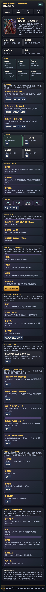
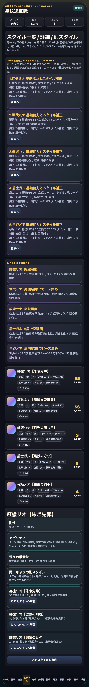
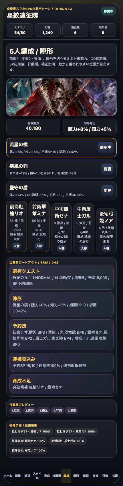
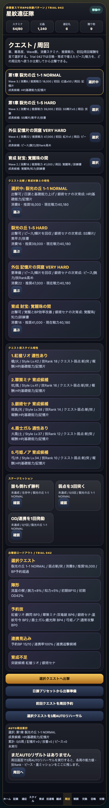
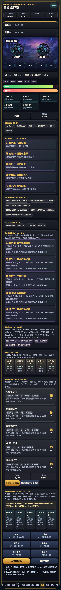

# SagaForge Trial 042: 出撃前ロードアウトとキャラ基礎能力で周回前の判断密度を上げる

前回までの星紋遠征隊は、ホーム、スタイル、編成、周回、戦闘、召喚、遠征、失敗状態を一通り触れるようになった。しかしユーザー評価は厳しく、「期待するキャラ収集RPG体験からはまだ遠い」だった。これは正しい。見た目のカードやファンタジー風の文言を増やすだけでは、スマホRPGで毎日触る判断の濃さには届かない。

今回のTrial 042では、記事化より先にプレイアブル版を更新し、次の3点に絞って差分を潰した。

1. **出撃前ロードアウト**: 選択クエスト、敵弱点、陣形、5人の予約技、BP消費、連携率、育成不足をホーム・編成・周回に出す。
2. **キャラ基礎能力とスタイル補正の分離**: 「キャラ」ではなく「スタイル単位で使う」だけでなく、周回で上がる基礎能力とカードごとの補正を見分けられるようにした。
3. **戦闘中の能力成長予告**: Round中に、勝利後に誰のHP、腕力/知力、技Rank、ピースが伸びるかを先読みする。

公開プレイアブル導線:

- `/sagaforge-app/index.html`（プレビュー配信のルートから開く）

## 前回の何が期待体験から遠かったか

Trial 041では、10連結果を「突破可能」「解放候補」「継承候補」「交換Pt判断」に仕分けし、召喚で終わらず育成・編成・再戦へ戻る導線を作った。これは前進だったが、まだ次の弱さが残っていた。

| 遠かった点 | なぜ弱いか | 今回の対応 |
|---|---|---|
| 出撃前に5人分の準備を読めない | スマホRPGでは、クエスト弱点、陣形、BP、技、連携見込みを見てから周回に入る感覚が強い | 出撃前ロードアウトをホーム・編成・周回に追加 |
| スタイルカードはあるが、基礎能力とスタイル補正の分離が薄い | 「同じキャラの別スタイルを使う」体験には、キャラ側の成長とカード側の役割差が必要 | キャラ基礎能力 × スタイル補正ボードを追加 |
| 戦闘中の成長期待が弱い | 周回RPGでは、戦闘は勝つだけでなく「この周回で誰が伸びるか」を期待して回す | 能力成長予告を戦闘画面へ追加 |

## 今回どの差分を潰したか

### 1. ホームに出撃前ロードアウトを追加

ホームで、選択中クエスト、敵弱点、陣形、予約技、連携率、育成不足を確認できるようにした。これで「次にどの画面へ行けばよいか」だけでなく、「この編成で周回に出してよいか」を読める。



### 2. スタイル画面にキャラ基礎能力 × スタイル補正を追加

前回までのスタイル一覧は、レアリティ、ロール、武器、属性、Style Lv、技Rank、突破、覚醒、継承技を持っていた。今回はさらに、基礎HP、主能力、所持スタイル数、現カード補正をまとめ、周回で伸びるものと召喚/ピースで伸びるものを分けた。



### 3. 編成・周回にも同じロードアウトを表示

ロードアウトをホームだけに置くと、実際に編成やクエストを触っているときに判断が途切れる。そこで、編成画面と周回画面にも同じ判断材料を出した。





### 4. 戦闘中に能力成長予告を追加

戦闘画面では、弱点、BP、OD、5人予約ターンに加えて、勝利後に誰がどう伸びるかを表示した。これにより、戦闘が単なるHP削りではなく、育成周回の一部として読める。



## 検証ログ

変更後、PlaywrightでプレイアブルURLを開き、ホーム、スタイル、編成、周回、戦闘を操作してスクリーンショットを保存した。

```text
Trial 042 playable verification
{"title":"星紋遠征隊 SagaForge Trial 042","homeLoadout":5,"characterBase":5,"partyLoadout":5,"questLoadout":5,"battleGrowth":5,"status":"稼働中","visibleTab":"battle"}
console:
```

記事プレビューとプレイアブルコピーは `scripts/build_preview.py` で再生成する。プレイアブル本体は `playables/sagaforge-app/`、公開用コピーは `preview/sagaforge-app/` に置く。

## まだ遠い点

まだ「本当に近づいた」と言うには足りない。特に次が弱い。

- スタイルごとの専用演出、技モーション、連携の気持ちよさはまだカード表現中心。
- 周回のテンポは改善したが、実際のAUTO周回の反復感、ドロップ一覧、リザルト演出はまだ薄い。
- 育成素材、ピース、能力値、技Rank、スタイルLvの相互作用は見えるが、長期育成の奥行きはまだ簡略化されている。
- ホームのイベント密度は増えたが、期間イベント、デイリー、ミッション、プレゼント、遠征、交換所の優先順位をもっと自然に見せる余地がある。

## 次に潰す差分

次回は、**リザルトと周回テンポ**をさらに寄せる。

- 勝利後に「能力値アップ」「技Rank」「ピース」「イベント報酬」「星ミッション」を段階演出で見せる。
- 3周AUTO後の結果を、キャラ別・素材別・次アクション別に整理する。
- クエスト選択から出撃、予約ターン、勝利、育成、再戦までをもっと短い操作で回せるようにする。
- 可能なら、戦闘画面のカットイン密度とダメージ表示をもう一段増やす。

## AIDD-Spec / Control Planeへの学び

今回の学びは、「画面要素を足す」だけではユーザー期待に届かないということだ。AI Task Packetには、次のような具体的な体験契約が必要になる。

| AIDD側の契約 | 今回の具体化 |
|---|---|
| 出撃前判断契約 | クエスト、弱点、陣形、5人予約技、BP、連携率、育成不足を同じ画面で確認する |
| スタイル育成契約 | キャラ基礎能力とスタイル補正を分け、周回・召喚・ピース・道場のどれで伸びるかを表示する |
| 周回期待契約 | 戦闘中から勝利後の能力値/技Rank/ピース増加を予告する |
| 非侵害境界 | 実在IPのロゴ、公式素材、公式キャラ、公式文言、公式確率は使わず、体験パターンだけを抽象化する |

この粒度で upstream の指示に入れないと、AIは「一般的なファンタジーRPGっぽい画面」を作って止まりやすい。今回の修正は、その弱さを少しずつ仕様に戻すための1サイクルである。
