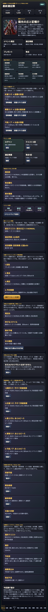
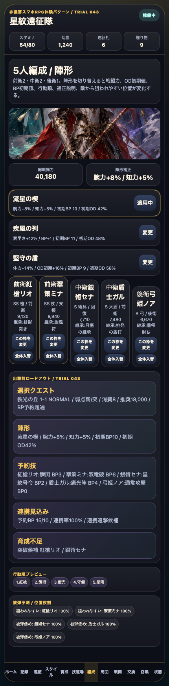
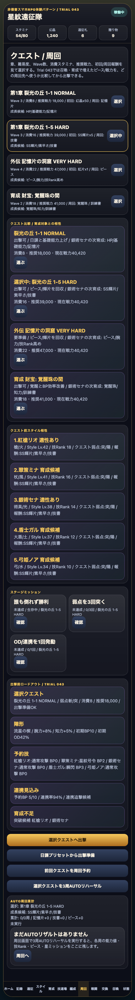
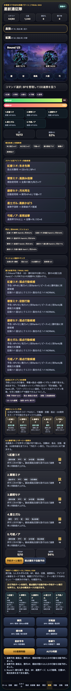
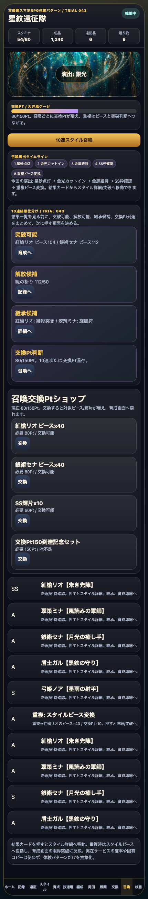
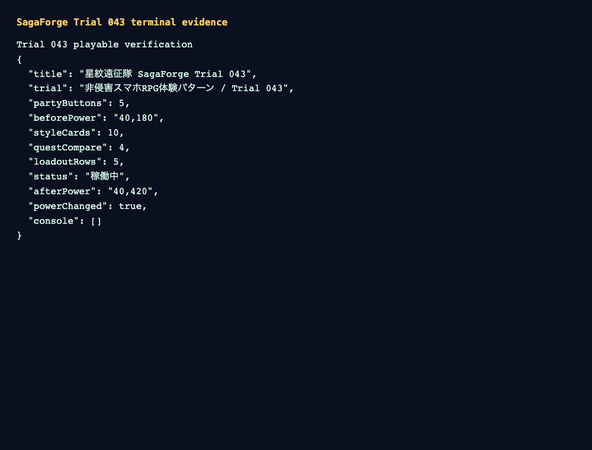

# SagaForge Trial 043: 5人編成を「見るだけ」から枠ごとに入れ替える出撃前調整へ

前回までの星紋遠征隊は、ホーム、スタイル、5人編成、クエスト、戦闘、召喚、遠征、失敗状態を一通り触れるようになった。ただし、ユーザーからの「期待するキャラ収集RPG体験からはまだ遠い」という評価はまだ解消しきれていない。一般的なファンタジーRPGのカードを増やすだけでは、スマホRPGで毎日行う「編成を少し変えて、弱点やBPを見て、周回先へ出す」感覚に届かない。

今回のTrial 043では、記事より先にプレイアブル版を更新し、**5人編成の各枠を個別に入れ替えられる**ようにした。入れ替え後は、総戦闘力、行動順、出撃前ロードアウト、クエスト相性、5人予約技が即時に再計算される。

公開プレイアブル導線:

- `/sagaforge-app/index.html`（プレビュー配信のルートから開く）

## 前回の何が期待体験から遠かったか

Trial 042では、出撃前ロードアウト、キャラ基礎能力とスタイル補正、戦闘中の能力成長予告を追加した。これは「周回前に読む情報」を増やす改善だったが、まだ次の弱さがあった。

| 遠かった点 | なぜ弱いか | 今回の対応 |
|---|---|---|
| 5人編成が固定表示に近い | キャラ収集RPGでは、クエスト弱点や育成状況を見て1枠だけ差し替える操作が重要 | 各編成枠に「この枠を変更」を追加 |
| 入れ替えと出撃前判断がつながっていない | 編成を変えたら、戦力、BP、OD、予約技、相性の読み直しが必要 | 入れ替え後にロードアウト、クエスト相性、予約技を再計算 |
| 「スタイル単位で使う」感覚がまだ薄い | キャラ名だけでなく、スタイル、武器、ロール、継承技が編成判断に影響する必要がある | 枠変更後に選択スタイルと育成ログを更新 |

## 今回どの差分を潰したか

### 1. ホームにTrial 043の改善意図を明記

ホームのイベント説明を、召喚結果の仕分けから、今回の主目的である「5人編成の各枠を触って調整する」方向へ更新した。プレイアブルを開いた時点で、今回どこが変わったか分かるようにした。



### 2. 編成画面に枠ごとの入れ替えを追加

各スロットに「この枠を変更」を追加した。押すと、その位置だけ別スタイルへ差し替わり、総戦闘力と行動順が変わる。全体反転のような大ざっぱな入れ替えではなく、前衛・中衛・後衛の枠を個別に触れるようにした。

変更前:



変更後:


検証では、総戦闘力が `40,180` から `40,420` に変わり、個別入れ替えが状態に反映されていることを確認した。

### 3. クエスト比較とロードアウトへ反映

編成を変えた後、周回画面でクエスト比較を開くと、現在戦力、推奨戦力、育成対象、弱点、報酬導線を再確認できる。これにより「入れ替えて終わり」ではなく、「この編成でどこへ行くか」へ戻れる。



### 4. 戦闘の5人予約にもつなげる

戦闘では、弱点優先の自動予約、5人分のBP、連携率、OD段階、成長予告を引き続き表示する。今回の編成枠変更は、この予約技とロードアウトにもつながるため、出撃前調整から戦闘テンポまでの流れが少し強くなった。



### 5. 召喚結果はスタイルカード導線として維持

10連結果、重複ピース変換、交換Pt、育成/詳細への戻り先は維持した。今回の改善で、召喚で増えたスタイルやピースを、次の編成枠調整へ使う流れが作りやすくなった。



## 検証ログ

Playwrightでプレイアブルを開き、ホーム、編成、枠変更、クエスト比較、戦闘予約、召喚を操作してスクリーンショットを保存した。



```text
Trial 043 playable verification
{
  "title": "星紋遠征隊 SagaForge Trial 043",
  "trial": "非侵害スマホRPG体験パターン / Trial 043",
  "partyButtons": 5,
  "beforePower": "40,180",
  "styleCards": 10,
  "questCompare": 4,
  "loadoutRows": 5,
  "status": "稼働中",
  "afterPower": "40,420",
  "powerChanged": true,
  "console": []
}
```

## まだ遠い点

まだ本物のスマホRPG体験には遠い。特に次が残っている。

- 編成枠は個別に変えられるようになったが、候補リスト、フィルタ、属性相性、装備、継承技選択はまだ簡略化されている。
- 戦闘演出はカードとログ中心で、連携/ODの気持ちよさはまだ薄い。
- 勝利後のリザルトは改善済みだが、能力値上昇・技Rank・ピース・交換所・再戦をもっと短いループで回せる余地がある。
- ホームは高密度になったが、イベント、デイリー、ミッション、プレゼント、遠征、交換所の優先順位はさらに整理が必要。

## 次に潰す差分

次回は、**編成候補選択とクエスト適性の読みやすさ**を潰す。

- 編成枠を押した時に、候補スタイル一覧を出す。
- 武器種、属性、ロール、弱点適性、育成不足で候補を見比べる。
- クエスト選択時に「この敵なら誰を入れるべきか」を表示する。
- 勝利後リザルトから、候補スタイルの育成・編成・再戦へ戻る導線をさらに短くする。

## AIDD-Spec / Control Planeへの学び

今回の学びは、AIに「5人編成を作って」と言うだけでは足りない、ということだ。AI Task Packetには、次のような体験契約が必要になる。

| AIDD側の契約 | 今回の具体化 |
|---|---|
| 編成操作契約 | 5人の各枠を個別に変更でき、変更後に戦力とロードアウトが変わる |
| 出撃前判断契約 | クエスト、弱点、陣形、予約技、BP、連携率、育成不足を同じ文脈で確認する |
| スタイル単位契約 | キャラではなくスタイル、武器、ロール、属性、継承技が編成判断に影響する |
| 非侵害境界 | 実在IPのロゴ、公式素材、公式キャラ、公式文言、公式確率は使わず、体験パターンだけを抽象化する |

この粒度で upstream の指示に入れないと、AIは「一般的なファンタジーRPGの見た目」を作って止まりやすい。今回の修正は、その弱さを少しずつ仕様へ戻すための1サイクルである。
