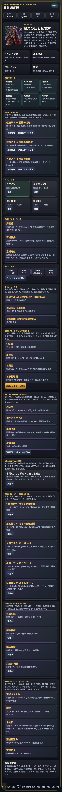
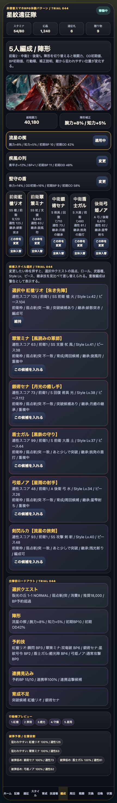
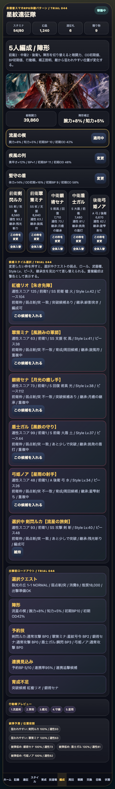
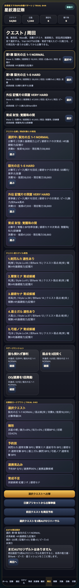
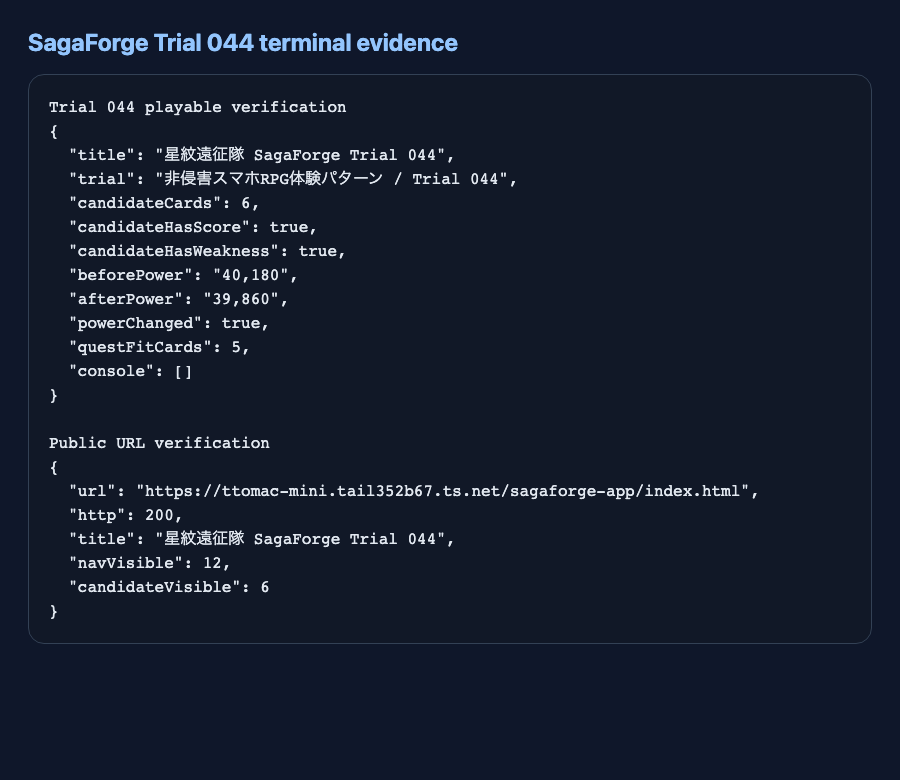

# SagaForge Trial 044: 編成候補を見比べてクエスト適性で差し替える

ユーザーからの「全然ロマサガRSとは程遠い」という評価は、前回までの改善後もまだ重い課題として残っている。星紋遠征隊はホーム、スタイル、5人編成、クエスト、戦闘、召喚、遠征、失敗状態を備えてきたが、まだ「一般的なファンタジーRPGに機能を足したもの」に見えやすい。

今回のTrial 044では、記事より先にプレイアブル版を更新し、**5人編成の枠を押すと候補スタイルを比較して選べる**ようにした。前回の「この枠を変更」は次のスタイルへ自動で回るだけだったため、スマホRPGで重要な「クエスト弱点を見て、候補を比べ、1枠だけ差し替える」判断にはまだ届いていなかった。

公開プレイアブル導線:

- `PUBLIC_PLAYABLE_URL/sagaforge-app/index.html`

## 前回の何がロマサガRS的な期待から遠かったか

| 遠かった点 | なぜ弱いか | Trial 044での対応 |
|---|---|---|
| 編成枠変更が自動ローテーションだった | スマホRPGの編成は、候補一覧から弱点・ロール・育成状況を見て選ぶ行為が中心 | 候補スタイル選択ボードを追加 |
| クエスト適性の判断が読みにくい | 「誰を入れるべきか」が戦力値だけだと分かりにくい | 弱点一致、前衛/後衛枠、武器種、ピース、継承技、適性スコアを表示 |
| 重複編成や現在枠の状態が見えない | 5人編成では同一スタイルの重複不可や現在選択中が重要 | 重複中/編成可/選択中を候補カードに表示 |

## 今回どの差分を潰したか

### 1. ホームの改善意図をTrial 044へ更新

ホームのイベント説明と「今回潰す差分」を、候補選択とクエスト適性の改善に合わせて更新した。プレイアブルを開いた時点で、今回の目的が「見た目追加」ではなく「編成判断の手触り」だと分かるようにした。



### 2. 編成画面に候補スタイル選択ボードを追加

編成画面で「この枠を変更」を押すと、候補スタイル選択ボードが対象枠に切り替わる。候補カードには次を出した。

- 適性スコア
- 前衛/中衛/後衛の対象枠
- レアリティ、ロール、武器種、属性
- Style Lv、ピース数
- 選択中クエストの弱点一致/不一致
- 突破候補かどうか
- 継承技
- 重複中/編成可



### 3. 候補選択後にロードアウト・予約技・相性へ反映

候補を選ぶと、総戦闘力、出撃前ロードアウト、行動順、被弾予測、5人予約技が再計算される。重複中の候補を押した場合は警告を出し、無言で壊れた編成にならないようにした。



### 4. クエスト選択側にも「誰を入れるべきか」の読み筋を残した

既存のクエスト比較、クエスト前スタイル相性、出撃前ロードアウトは維持し、候補選択で変えた編成がそのまま周回判断につながるようにした。今回は完全なフィルタUIまでは入れていないが、少なくとも「弱点と育成状況を見て1枠を差し替える」流れを触れる。



## 検証ログ

Playwrightでローカルのプレイアブルを開き、ホーム、編成、候補ボード、候補選択、クエスト適性を操作した。さらにプレビュー再生成後、公開URLと主要アセットURLが `http=200` を返すことを確認した。



```text
Trial 044 playable verification
{
  "title": "星紋遠征隊 SagaForge Trial 044",
  "trial": "非侵害スマホRPG体験パターン / Trial 044",
  "candidateCards": 6,
  "candidateHasScore": true,
  "candidateHasWeakness": true,
  "beforePower": "40,180",
  "afterPower": "39,860",
  "powerChanged": true,
  "questFitCards": 5,
  "console": []
}
```

## まだ遠い点

まだロマサガRS的な期待には遠い。特に次が残っている。

- 候補一覧にフィルタ、ソート、武器/属性タブ、育成不足だけを出す切替がない。
- 装備、継承技の明示選択、耐性、状態異常役などの編成判断がまだ簡略化されている。
- 戦闘演出はログとカード中心で、連携/ODの気持ちよさはまだ弱い。
- 周回リザルトから「この候補を入れる」「この技を覚醒する」「このクエストを再戦する」までの導線はまだ短縮できる。

## 次に潰す差分

次回は、**編成候補のフィルタ/ソートと継承技選択**を潰す。

- 候補一覧に「弱点一致」「育成候補」「突破可能」「後衛向き」などの切替を入れる。
- スタイルごとの継承技を候補として選べるようにする。
- クエスト選択時に、推奨入替候補を上位3件で出す。
- 勝利後リザルトから、そのまま候補入替・育成・再戦へ戻れる導線をさらに短くする。

## AIDD-Spec / Control Planeへの学び

今回の学びは、AIに「5人編成を作る」と頼むだけでは、候補を比較して選ぶ体験まで出にくいということだ。AI Task Packetには、次のような契約が必要になる。

| AIDD側の契約 | 今回の具体化 |
|---|---|
| 編成候補選択契約 | 枠を押すと候補一覧が出て、弱点・ロール・武器・育成状況で比較できる |
| クエスト適性契約 | 選択中クエストの弱点と推奨戦力が候補評価に反映される |
| 重複/制約契約 | 編成中スタイルは重複警告を出し、状態を壊さない |
| 非侵害境界 | 実在IPのロゴ、公式素材、公式キャラ、公式文言、公式確率は使わず、体験パターンだけを抽象化する |

「候補を選んで編成を調整する」という小さな操作でも、先に契約化しないとAIは汎用的なカード一覧で止まりやすい。Trial 044は、その差分を1つ潰したサイクルである。
