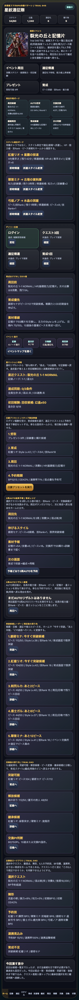
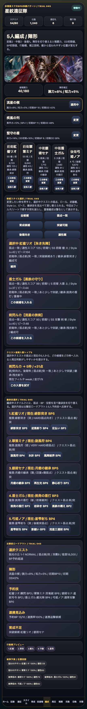
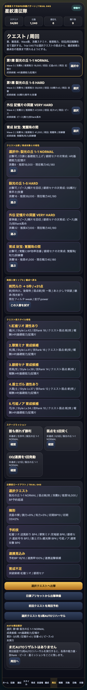
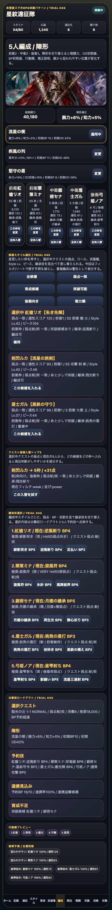
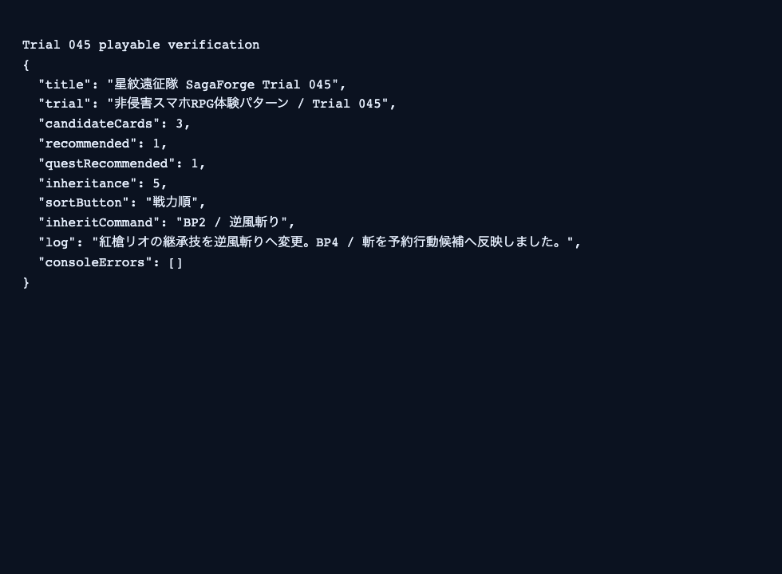

# SagaForge Trial 045: 候補フィルタと継承技選択で周回前の編成判断に寄せる

ユーザーからの「全然ロマサガRSとは程遠い」という評価は、まだ解消できていない。前回までにホーム、スタイル、5人編成、クエスト、戦闘テンポ、召喚、遠征、失敗状態、候補スタイル選択を足したが、それでも「一般的なファンタジーRPGに機能を足したもの」に見えやすかった。

今回のTrial 045では、記事より先にプレイアブル版を更新し、**編成候補のフィルタ/ソート、クエスト推奨入替トップ3、継承技選択**を入れた。前回の候補ボードは「候補を見比べる」段階までだったが、スマホRPGらしい「周回先の弱点を見て、候補を絞り込み、継承技まで変えて出撃する」判断にはまだ足りなかった。

公開プレイアブル導線は、配信レポート側に記載する。記事本文には公開ホスト名を固定で埋め込まず、プレイアブル本体は `preview/sagaforge-app/index.html` として再生成される。

## 前回の何がロマサガRS的な期待から遠かったか

| 遠かった点 | なぜ弱いか | Trial 045での対応 |
|---|---|---|
| 候補一覧は出るが探し方が弱い | 実際のキャラ収集RPGでは、弱点一致、育成候補、突破可能、後衛向きなどで候補を絞って考える | 候補フィルタと適性/戦力/ピース順ソートを追加 |
| クエストから編成へ戻る理由が薄い | 周回先を選んだ後、「誰をどの枠へ入れるべきか」が見えないと、単なるクエスト一覧で止まる | 推奨入替トップ3を編成画面とクエスト画面に表示 |
| 継承技が固定だった | スタイル制RPGでは、同じキャラでも継承技の選択が周回適性やBP計画に関わる | 編成中5人の継承技選択ボードを追加し、予約行動へ反映 |

## 今回どの差分を潰したか

### 1. ホームをTrial 045の目的に更新

ホームのイベント説明と「今回潰す差分」を、候補フィルタ、推奨入替、継承技選択に合わせて更新した。単なる見た目追加ではなく、周回前の判断密度を増やすサイクルだと分かるようにした。



### 2. 候補スタイルにフィルタ/ソートを追加

編成画面の候補スタイル選択に、次の切替を入れた。

- 全候補
- 弱点一致
- 育成候補
- 突破可能
- 後衛向き
- 適性順 / 戦力順 / ピース順

これで、候補カードをただ眺めるのではなく、選択中クエストに合わせて探す手触りに近づいた。



### 3. クエスト推奨入替トップ3を追加

選択中クエストの弱点と現在の5人編成から、候補スタイルをどの枠に入れると適性が上がるかを表示するようにした。今回はまだ簡易スコアだが、「このクエストならこの枠を変える」という読み筋が画面に出る。



### 4. 継承技選択を編成判断に接続

編成中5人それぞれに継承技候補を表示し、クエスト弱点に合う技を推奨する。ボタンを押すと現在の継承技、BP、予約行動候補が更新される。これで「スタイルカードを変える」だけでなく、「同じメンバーでも技を差し替える」方向へ一歩寄せた。



## 検証ログ

Playwrightでローカルのプレイアブルを開き、ホーム、編成、弱点一致フィルタ、ソート切替、継承技選択、クエスト側の推奨入替を操作した。ブラウザコンソールエラーは0件だった。



```text
Trial 045 playable verification
{
  "title": "星紋遠征隊 SagaForge Trial 045",
  "trial": "非侵害スマホRPG体験パターン / Trial 045",
  "candidateCards": 3,
  "recommended": 1,
  "questRecommended": 1,
  "inheritance": 5,
  "sortButton": "戦力順",
  "inheritCommand": "BP2 / 逆風斬り",
  "log": "紅槍リオの継承技を逆風斬りへ変更。BP4 / 斬を予約行動候補へ反映しました。",
  "consoleErrors": []
}
```

## まだ遠い点

まだロマサガRS的な期待には遠い。特に次が残っている。

- フィルタ/ソートは入ったが、武器種タブ、属性タブ、耐性、状態異常役、ボスギミック対応までは扱えていない。
- 継承技は選べるが、技Rank、覚醒段階、演出テンポ、OD時の技順最適化はまだ薄い。
- 推奨入替トップ3は簡易スコアで、敵の行動、被弾位置、周回速度、報酬効率まで統合していない。
- 戦闘演出はカード/ログ中心で、連携やODの気持ちよさはまだ弱い。

## 次に潰す差分

次回は、**戦闘テンポとOD/連携の見た目・手触り**を優先して潰す。

- 予約ターン実行時に、5人の技カードが段階的に流れる演出を追加する。
- Weak、Resist、Over、連携追撃、技Rank上昇を同じリザルトリールで見せる。
- Roundまたぎの敵配置と報酬表示を、周回テンポが分かる形にする。
- 勝利後に「再戦」「育成」「継承変更」「交換」へ戻る導線をさらに短くする。

## AIDD-Spec / Control Planeへの学び

今回の学びは、AIに「編成候補を表示して」と頼むだけでは、候補を探す条件や技選択の判断まで出にくいということだ。AI Task Packetには、次のような契約が必要になる。

| AIDD側の契約 | 今回の具体化 |
|---|---|
| 候補探索契約 | 弱点一致、育成候補、突破可能、位置適性などで絞り込める |
| 推奨入替契約 | クエスト弱点と現在編成から、入替候補と対象枠を提示する |
| 継承技契約 | 同一キャラ/別スタイルの技候補を選択し、BPと予約行動へ反映する |
| 非侵害境界 | 実在IPのロゴ、公式素材、公式キャラ、公式文言、公式確率は使わず、体験パターンだけを抽象化する |

「5人編成がある」だけでは足りない。周回先に合わせて候補を絞り、技を変え、戦闘へ持ち込む一連の判断を先に契約化しないと、AIは汎用カードUIで止まりやすい。Trial 045は、その差分を1つ潰したサイクルである。
