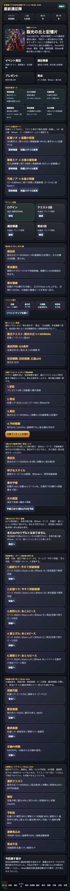
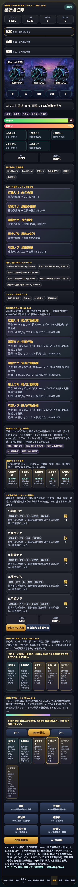
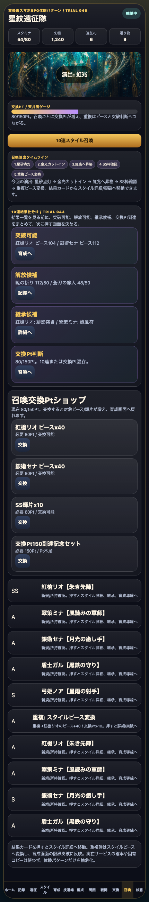

# SagaForge Trial 046: 予約ターンのテンポリールで戦闘をログ読みから一歩進める

ユーザーからの「全然ロマサガRSとは程遠い」という評価は、まだ正しい。前回までにホーム、スタイル、5人編成、クエスト、召喚、遠征、候補フィルタ、継承技選択を足してきたが、戦闘体験はまだ「カードとログで説明されている」比重が大きかった。

今回のTrial 046では、記事より先に `playables/sagaforge-app/index.html` を更新し、**予約ターン実行後の5人行動を段階表示する「連携テンポリール」**を追加した。実在IPのロゴ、公式素材、公式キャラ、公式文言、公式確率は使わず、キャラ収集・スタイル育成・5人編成・BP/OD・連携テンポという体験パターンだけを非侵害で抽象化している。

公開プレイアブル導線は配信レポート側に記載する。記事本文には公開ホスト名を固定で埋め込まず、プレイアブル本体は `preview/sagaforge-app/index.html` として再生成される。

## 前回の何がロマサガRS的な期待から遠かったか

| 遠かった点 | なぜ弱いか | Trial 046での対応 |
|---|---|---|
| 戦闘がログ読みに寄っていた | 5人が順番に動き、Weak、補助、回復、追撃が連続して見える気持ちよさが薄い | 予約ターン実行後に、現在解決中のカードをハイライトするテンポリールを追加 |
| 予約ターン解決リールは静的だった | 解決カードは残るが、どの順番で流れたのかを触って追えない | 前へ / AUTO再生 / 次へボタンと進捗メーターを追加 |
| 連携追撃の見せ方が弱い | 連携率が高いと追撃は発生するが、通常行動との段差が見えにくい | 連携カードを別カードとして追加し、chain表示とSTEP要約に出す |

## 今回どの差分を潰したか

### 1. ホームの目的を「戦闘テンポ改善」に更新

ホームのイベント説明と「今回潰す差分」をTrial 046向けに更新した。前回は候補検索と継承技選択を強めたが、今回は戦闘中の手触りを優先するサイクルだと分かるようにしている。



### 2. 予約ターン実行後にテンポリールを生成

戦闘画面に「連携テンポリール / Trial 046」を追加した。予約ターン実行後に、次の情報がカードとして流れる。

- STEP番号
- 現在解決中のスタイル
- 使用技
- Weak / 通常
- Hit / 回復量
- BP消費
- OD増加
- 補助、回復、連携追撃などのメモ

これにより、従来の「ログに書いてある」状態から、少なくとも「5人の行動順を手で送って追える」状態へ一歩進んだ。



### 3. 手動送りとAUTO再生を追加

テンポリールには、前へ / AUTO再生 / 次への3ボタンと進捗メーターを入れた。まだ豪華なアニメーションではないが、どのカードが現在処理中かが `live` 表示で分かる。連携率が高い場合は、通常5人分に加えて「連携追撃」カードが並ぶ。

検証では、予約ターン実行後に `STEP 4/6` までAUTO再生され、1枚だけが現在解決中カードとしてハイライトされた。

### 4. 召喚/スタイル導線は維持

今回の主眼は戦闘テンポだが、召喚結果がスタイルカードとして表示され、重複時にピース変換風の説明が出る導線は壊していない。



## 検証ログ

Playwrightでローカルのプレイアブルを開き、ホーム、戦闘、弱点優先予約、予約ターン実行、テンポリールの次へ/AUTO再生、召喚画面を操作した。ブラウザコンソールエラーは0件だった。

```text
Trial 046 playable verification
{
  "title": "星紋遠征隊 SagaForge Trial 046",
  "trial": "非侵害スマホRPG体験パターン / Trial 046",
  "tempoSummary": "STEP 4/6: 盾士ガルの瞬閃。Weak! 連携段階上昇。 Hit 46 / 次は弓姫ノア。",
  "resolveSummary": "予約ターン解決: 合計187 / 回復0 / 弱点3件 / 連携率95% / 残BP11/13 / OD100%",
  "liveCards": 1,
  "meter": "67%",
  "consoleErrors": []
}
```

保存した証跡:

- `experiments/character-collection-rpg-trial-001/artifacts/character-collection-rpg-trial-046/terminal/trial046-playable-verification.txt`
- `experiments/character-collection-rpg-trial-001/artifacts/character-collection-rpg-trial-046/screenshots/2026-07-07-character-collection-rpg-trial-046-home.png`
- `experiments/character-collection-rpg-trial-001/artifacts/character-collection-rpg-trial-046/screenshots/2026-07-07-character-collection-rpg-trial-046-tempo-reel.png`
- `experiments/character-collection-rpg-trial-001/artifacts/character-collection-rpg-trial-046/screenshots/2026-07-07-character-collection-rpg-trial-046-gacha.png`

## まだ遠い点

まだロマサガRS的な期待には遠い。特に次が残っている。

- テンポリールはカード段階表示であり、キャラカットイン、敵揺れ、ヒットストップ、SE風フィードバックまではない。
- OD発動時の特別演出はまだ薄く、通常予約ターンと大きく差が出ていない。
- 敵ごとのギミック、耐性、状態異常、ターン制高難度の読み合いは簡略化されている。
- スタイル育成と戦闘中の技Rank/閃きの結びつきはあるが、育成リザルトの気持ちよさはまだ弱い。

## 次に潰す差分

次回は、**OD/連携の特別感と勝利後の再周回テンポ**を優先して潰す。

- OD発動時だけの5人カットイン風カードを追加する。
- Roundまたぎ時の敵配置・弱点・予約技をまとめて更新する。
- 勝利後に「再戦」「育成」「交換」「継承変更」へ戻る固定ショートカットを強化する。
- 技Rank上昇と閃き候補を、戦闘リールから道場/育成へ戻る理由としてもっと強く見せる。

## AIDD-Spec / Control Planeへの学び

今回の学びは、AIに「ターン制バトルを作って」と頼むだけでは、戦闘の時間的な手触りがログに押し込まれやすいということだ。AI Task Packetには、次の契約が必要になる。

| AIDD側の契約 | 今回の具体化 |
|---|---|
| 戦闘テンポ契約 | 5人分の行動、Weak、補助、回復、連携追撃を順番に追える |
| 操作可能な演出契約 | AUTO再生だけでなく、前へ/次へで状態を確認できる |
| 連携表示契約 | 高連携時は通常行動と別に追撃カードを出す |
| 非侵害境界 | 実在IPのロゴ、公式素材、公式キャラ、公式文言、公式確率は使わず、体験パターンだけを抽象化する |

「BPとODがある」だけでは足りない。誰が、どの順で、何をして、なぜ連携したのかを画面で追える契約がないと、AIは汎用RPGのログ表示で止まりやすい。Trial 046は、その差分を1つ潰したサイクルである。
