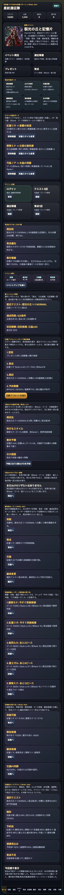
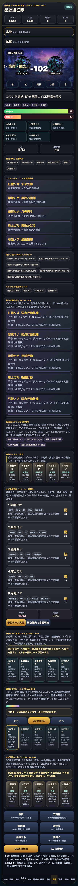

# SagaForge Trial 047: ODの特別感と勝利後ループを足して「戦って終わり」から一歩進める

ユーザーからの「全然ロマサガRSとは程遠い」という評価は、まだ重く受け止める必要がある。前回Trial 046では予約ターン後の5人行動をテンポリール化したが、まだ「OD/連携が特別に気持ちいい」「勝利後にすぐ再戦・育成・交換へ戻る」というスマホRPGらしい循環は弱かった。

今回も記事より先に `playables/sagaforge-app/index.html` を更新した。実在IPのロゴ、公式素材、公式キャラ、公式文言、公式確率は使わず、キャラ収集・スタイル育成・5人編成・BP/OD・連携テンポ・勝利後周回導線という体験パターンだけを非侵害で抽象化している。

## 前回の何がロマサガRS的な期待から遠かったか

| 遠かった点 | なぜ弱いか | Trial 047での対応 |
|---|---|---|
| ODが通常行動の延長に見えた | ODゲージはあるが、押した瞬間だけ別格に見える演出情報が薄い | OD専用の5人カットイン風カードを追加 |
| 勝利後の戻り先が画面に弱く残っていた | 勝って報酬を得ても、次に再戦か育成か交換かがホームで即判断しにくい | ホームに「勝利後ループ」を追加 |
| 周回→成長→再戦の循環が説明寄りだった | 触る導線より、文章での説明がまだ多い | 再戦、育成、交換、継承変更ボタンをホームの判断カードにした |

## 今回どの差分を潰したか

### 1. ホームをTrial 047向けに更新

ホームのイベント説明を、前回の「予約ターン順番表示」から、今回の「ODの特別感」と「勝利後ループ」に更新した。



### 2. OD五連カットイン風カードを追加

戦闘画面に「OD五連カットイン / Trial 047」を追加した。OD100%で「OD連携発動」を押すと、5人の役割・技名・ヒット量・役割メモ・追撃強調を並べる。

これは公式演出のコピーではない。目的は、AIが作りがちな「ODボタンを押すと数字が減るだけ」から、少なくとも「この瞬間だけ特別な5人行動が走った」と分かる表示へ寄せることだ。



### 3. 勝利後ループをホームへ戻した

ホームに「勝利後ループ / Trial 047」を追加した。直近状態から次の4つをカード化している。

- 再戦
- 育成
- 交換
- 継承変更

これにより、戦闘画面で勝ったあとだけでなく、ホームへ戻っても「次に何を押すか」が残る。


## 検証ログ

Playwrightでローカルのプレイアブルを開き、ホーム表示、戦闘画面、OD100%化、OD連携発動、ODカットインカード数、ホームの勝利後ループ文言を検証した。ブラウザコンソールエラーは0件だった。

```text
Trial 047 playable verification
{
  "title": "星紋遠征隊 SagaForge Trial 047",
  "trial": "非侵害スマホRPG体験パターン / TRIAL 047",
  "odSummary": "OD演出: 紅槍リオ → 翠策ミナ → 銀術セナ → 盾士ガル → 弓姫ノア。最後に星雨で追撃し、勝利後ループへ接続。",
  "odCards": 5,
  "loopIncludes": {
    "replay": true,
    "training": true,
    "exchange": true,
    "inheritance": true
  },
  "consoleErrors": []
}
```

保存した証跡:

- `experiments/character-collection-rpg-trial-001/artifacts/character-collection-rpg-trial-047/terminal/trial047-playable-verification.txt`
- `experiments/character-collection-rpg-trial-001/artifacts/character-collection-rpg-trial-047/screenshots/2026-07-07-character-collection-rpg-trial-047-home.png`
- `experiments/character-collection-rpg-trial-001/artifacts/character-collection-rpg-trial-047/screenshots/2026-07-07-character-collection-rpg-trial-047-od-cutin.png`
- `experiments/character-collection-rpg-trial-001/artifacts/character-collection-rpg-trial-047/screenshots/2026-07-07-character-collection-rpg-trial-047-loop.png`

## まだ遠い点

まだ期待されるスマホRPG体験には遠い。

- ODカットインはカード表現であり、敵揺れ、ヒットストップ、SE、キャラ絵の本格的な演出はない。
- 勝利後ループは導線として出たが、複数周回後の成長差分やおすすめ育成の精度はまだ浅い。
- 敵ギミック、耐性、デバフの読み合い、高難度向けの行動予約は簡略化されている。
- スタイルの別バージョン、継承技、技Rank、ピース突破はあるが、育成UIの快感はまだ足りない。

## 次に潰す差分

次回は、**勝利リザルトの気持ちよさと、周回後に育成が伸びた感覚**を優先する。

- 勝利直後に5人分の能力値アップをより派手に出す。
- 技Rank上昇、閃き候補、ピース獲得、突破可能を1枚のリザルトに束ねる。
- 3周AUTO後に「誰を強化すべきか」をより明確に出す。
- ODカットインと勝利リザルトをつなげ、連携したから報酬/成長が良くなったように見せる。

## AIDD-Spec / Control Planeへの学び

「ODゲージを実装する」と「ODが特別に感じる」は別物だった。AI Task Packetには、次の契約を入れる必要がある。

| AIDD側の契約 | 今回の具体化 |
|---|---|
| 特別行動演出契約 | OD発動時だけ通常行動とは別の5人カード列を出す |
| 勝利後ループ契約 | 再戦、育成、交換、編成/継承変更の戻り先をホームにも残す |
| 周回判断契約 | 報酬・素材・スタミナ・弱点から次の行動を決められる |
| 非侵害境界 | 実在IPのロゴ、公式素材、公式キャラ、公式文言、公式確率を使わない |

今回の前進は小さいが、「戦闘中に特別な瞬間がある」「勝ったあと次に押す場所がある」という2点を足した。汎用RPGの見た目追加ではなく、ユーザーが期待するキャラ収集・スタイル育成RPGの循環に近づけるための1サイクルである。
