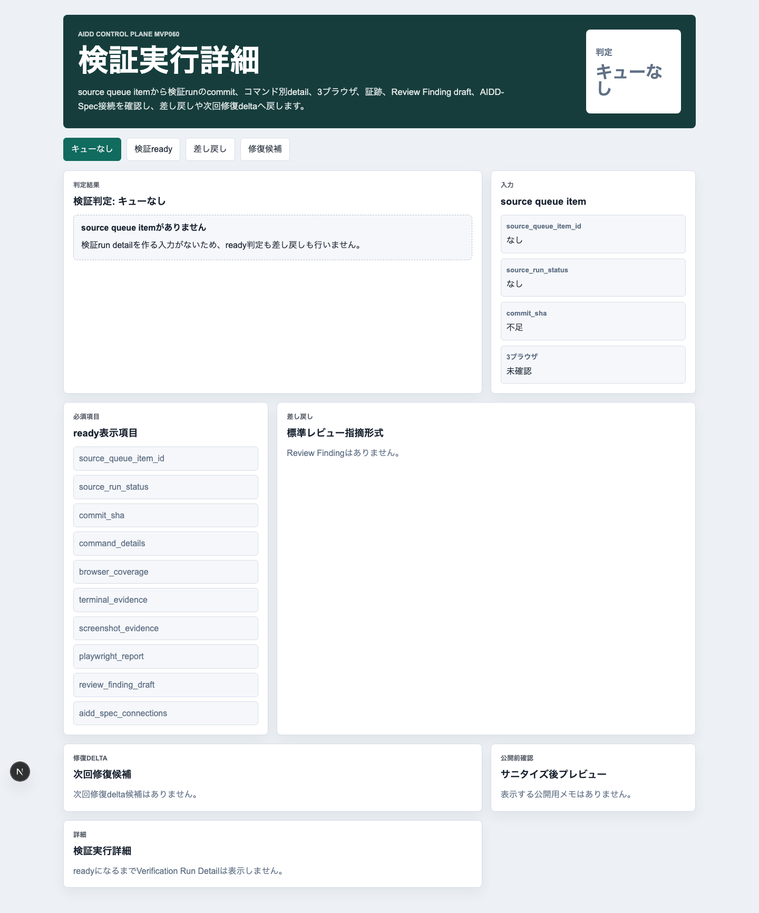
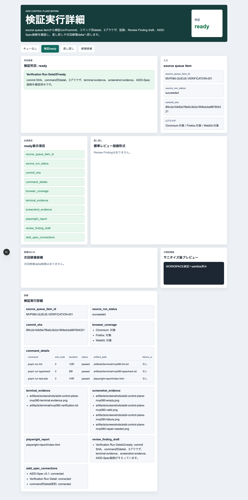
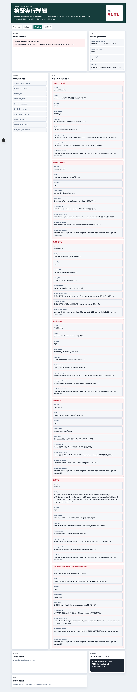
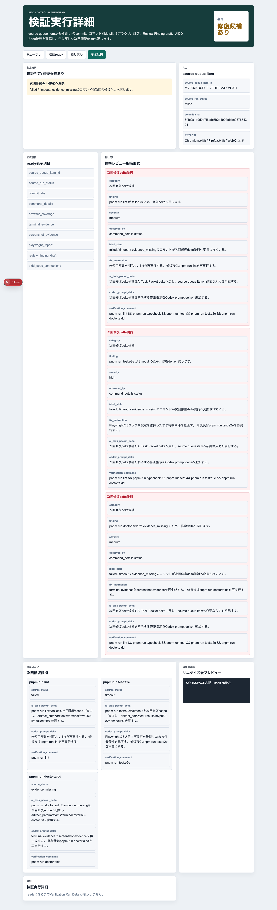
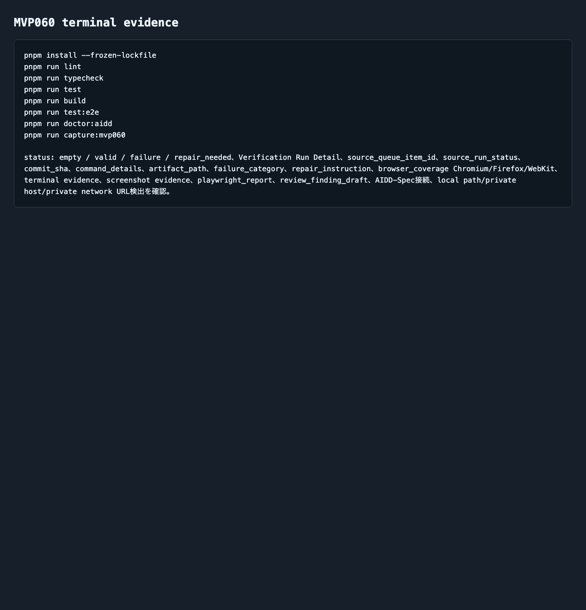

# AIDD Control Plane MVP 060：失敗を「コマンド別の修理メモ」に分解する

> 2026-07-08 / Codex Mastery Lab
> 記事種別: Experiment / SaaS / Verification Evidence
> 将来の書籍章: 第10章 Verification Evidence、第11章 Review Record、第18章 AIDD Control PlaneのMVP

## 読者の悩み

AIに実装を頼んだ後、最後に出てくる結果はだいたいこうです。

- 「テストが失敗しました」
- 「E2Eが落ちました」
- 「証跡が足りません」
- 「次に直します」

でも、このままでは次のAI実行に渡せません。どのコマンドが落ちたのか、exit codeはいくつか、ログはどこにあるのか、失敗分類は何か、次にどう直すのかが曖昧だからです。

MVP059では、Review Record / Learning Logから「次に実行する1インクリメントだけ」を選ぶNext Increment Plannerを作りました。今回はその次です。選んだ実行結果を、**コマンド別のVerification Evidence**として分解する画面を作りました。

健康診断でいえば、「要再検査」という総合判定だけではなく、血圧・血液検査・視力のように項目別に見て、次の生活改善を1つ決める感覚です。

## 今回の仮説

> Codex Run Queueの実行結果をコマンド別detailへ分解できれば、失敗はただの赤いログではなく、次回AI Task Packetへ戻せる修理メモになる。

AIDD Control Planeは、AIを実行するだけのSaaSではありません。AIが出した結果を、人間と次のAIが再利用できる形へ変換するSaaSです。

## 実験内容

生成先は `experiments/aidd-control-plane-mvp-060/generated-repo/` です。MVP059を土台に、CodexへMVP060のAI Task Packetを渡しました。

今回の実装テーマは **Verification Run Detail** です。

```text
Codex Run Queueの各itemを、command別exit code、artifact path、
失敗分類、修正指示、terminal/screenshot/playwright evidence、
Chromium / Firefox / WebKitの3ブラウザ結果へ分解する。

failureでは、commit SHA不足、command別detail不足、artifact path不足、
失敗分類不足、修正指示不足、Firefox除外、証跡不足、
local path/private host/private network URL混入をReview Finding形式へ戻す。
```

## 画面キャプチャ

### empty: 実行キューitemがまだない



emptyでは `source_queue_item_id` がありません。ここで無理に詳細を作らず、前段のCodex Run Queueから実行itemを受け取る必要がある、と止めます。

### valid: コマンド別detailがそろっている



validでは、次の情報をVerification Run Detailとして表示します。

| 項目 | 何を確認したいのか | なぜ必要か |
| --- | --- | --- |
| source_queue_item_id | どのRun Queue itemの結果か | 出所が曖昧だと次回修復へ戻せないため |
| source_run_status | 実行全体の状態 | succeeded / failed / timeoutを分けるため |
| commit_sha | 検証対象の版 | 後から同じ状態を確認できるようにするため |
| command_details | コマンド別の結果 | 「E2E失敗」だけでなく、どのコマンドがどう失敗したかを見るため |
| artifact_path | ログやreportの保存先 | 証拠をクリック・確認できるようにするため |
| failure_category | 失敗分類 | 次回AI Task Packetの修理scopeへ変換するため |
| repair_instruction | 修正指示 | Codex prompt deltaへ戻すため |
| browser_coverage | Chromium / Firefox / WebKit | Firefox除外のような浅い検証を防ぐため |
| terminal/screenshot evidence | 実行証跡 | note記事、レビュー、再実行で確認できるため |
| AIDD-Spec接続 | 標準とのつながり | 個別画面で終わらせず標準artifactへ戻すため |

### failure: 不足をReview Findingへ戻す



failureでは、単に「失敗」と出すのではなく、次回AI Task Packetへ戻せる形式へ変換します。

```yaml
category: artifact path不足
finding: pnpm run lint のartifact_pathが空です。
severity: high
observed_by: command_details.artifact_path
ideal_state: 各commandがterminal logまたはreport artifactへ接続している。
fix_instruction: artifact_pathをverification commandの保存先として追加する。
ai_task_packet_delta: artifact path不足をAI Task Packet deltaへ戻す。
codex_prompt_delta: artifact path不足を解消する修正指示をCodex prompt deltaへ追加する。
verification_command: pnpm run lint && pnpm run typecheck && pnpm run test && pnpm run test:e2e && pnpm run doctor:aidd
```

この形にしておくと、失敗が「次に何を入れてCodexへ渡すべきか」まで進みます。

### repair_needed: failed / timeout / evidence_missingを修復deltaへ変換する



repair_neededでは、落ちたコマンドを次回修復delta候補へ分けます。

- `pnpm run lint`: failed → 静的検査失敗として修正指示へ
- `pnpm run test:e2e`: timeout → 3ブラウザ維持のまま待機条件を見直す
- `pnpm run doctor:aidd`: evidence_missing → terminal / screenshot evidenceを再生成する

重要なのは、ここで何でも一度に直そうとしないことです。次回のAI Task Packetには、修復対象と検証コマンドを絞って渡します。

### terminal evidence: 実際に検証したログ



今回の独立検証では、Codexの自己申告とは別に次を実行しました。

```text
pnpm install --frozen-lockfile
pnpm run lint
pnpm run typecheck
pnpm run test
pnpm run build
pnpm run test:e2e
pnpm run doctor:aidd
pnpm run capture:mvp060
```

E2EはChromium / Firefox / WebKitの3ブラウザで12件通りました。

```text
Running 12 tests using 1 worker
chromium: 4 passed
firefox: 4 passed
webkit: 4 passed
12 passed (20.6s)
```

## 失敗/修正

今回の小さな失敗は、cron環境で `codex` コマンドがPATHに入っていなかったことです。

```text
/bin/bash: line 2: codex: command not found
```

ただし `~/.local/bin/codex` は存在していたため、フルパスで再実行しました。

```text
WORKSPACE/bin/codex exec --sandbox danger-full-access "$(cat ../CODEX_PROMPT.md)"
```

公開記事やpreviewにはローカルパスを載せない方針なので、記事上の再現例・画面・証跡では `WORKSPACE` 表記へ置換しています。この失敗自体も、AIDD Control Planeが将来「実行開始レシート」でPATHやsandbox modeを記録する理由になります。

## 検証ログ

保存したログは `experiments/aidd-control-plane-mvp-060/artifacts/terminal/` にあります。

| コマンド | 結果 |
| --- | --- |
| `pnpm install --frozen-lockfile` | pass |
| `pnpm run lint` | pass |
| `pnpm run typecheck` | pass |
| `pnpm run test` | 8 tests pass |
| `pnpm run build` | pass |
| `pnpm run test:e2e` | 12 tests pass / Chromium・Firefox・WebKit |
| `pnpm run doctor:aidd` | pass |
| `pnpm run capture:mvp060` | pass |

## 読者が使えるチェックリスト

| チェック項目 | 何を確認したいのか | なぜ必要か |
| --- | --- | --- |
| commit SHAがあるか | 検証対象の版が固定されているか | 後から「同じもの」を確認できないと証跡にならないため |
| command別detailがあるか | lint / typecheck / test / build / e2eの結果が分かれているか | 失敗原因を雑にまとめないため |
| artifact pathがあるか | ログやreportへ辿れるか | スクリーンショットだけでは再確認できないため |
| failure categoryがあるか | 失敗を分類できるか | 次回AI Task Packetの修復scopeを作るため |
| repair instructionがあるか | 次に何を直すか書かれているか | AIへ「失敗したから直して」だけを渡さないため |
| Firefoxが除外されていないか | 3ブラウザE2Eがそろっているか | Chromiumだけの成功で品質を過大評価しないため |
| terminal / screenshot evidenceがあるか | 実行と画面の証跡があるか | note記事・レビュー・再実行の一次情報になるため |
| local pathやprivate URLがないか | 公開物に環境名が漏れていないか | 公開前の安全確認として必要なため |

## AIDD-Spec / SaaSへの接続

AIDD-Spec v0.1では、AI Task PacketとVerification Evidenceを分けて扱います。MVP060はこのうちVerification Evidenceを、さらにコマンド別に細かく見るためのUIです。

AIDD Control Plane SaaSとしては、次の価値につながります。

1. Codex実行結果をrun単位で保存する
2. 各commandのexit codeとartifact pathを束ねる
3. 失敗をReview Findingへ変換する
4. failed / timeout / evidence_missingを次回修復deltaへ戻す
5. 次のAI Task Packetを小さく、検証可能にする

AI量産記事ではなく、実際に実験した本人しか書けない一次情報が強いのはここです。画面、ログ、失敗、修正、検証コマンドが残っているため、読者が自分の開発フローへ持ち帰れるチェックリストになります。

## まとめと次回

MVP060では、Codex Run Queueの結果をVerification Run Detailへ分解しました。

学びは次です。

- 「失敗しました」ではなく、command別exit codeとartifact pathが必要
- Firefox除外、証跡不足、修正指示不足は次回AI Task Packetへ戻すべき入力
- repair_neededを明示すると、次回のCodex promptを小さくできる
- cron環境ではCodex CLIのPATHも実行開始証跡として扱う価値がある

次回は、今回のVerification Run Detailから **Evidence Repair Delta Generator** へ進め、failed / timeout / evidence_missingを次回AI Task Packet delta、Codex prompt delta、rollback条件、Learning Logへ自動で戻す流れを作ります。
