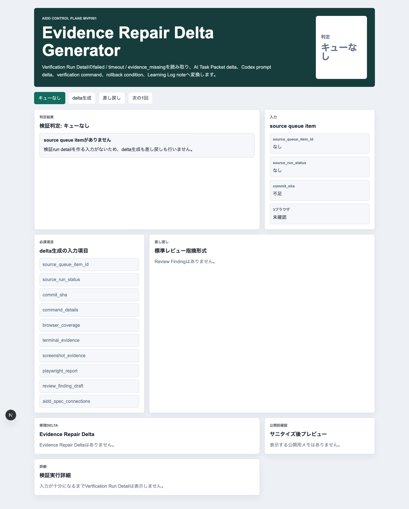
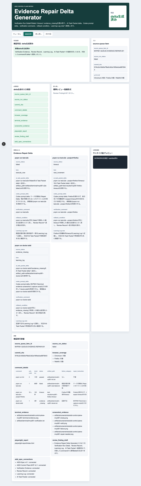
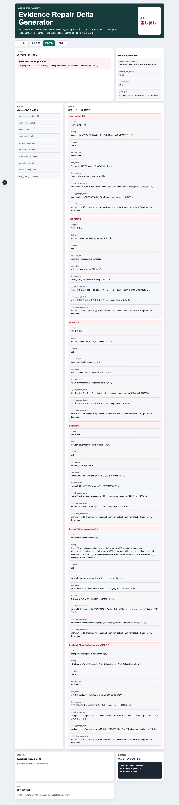
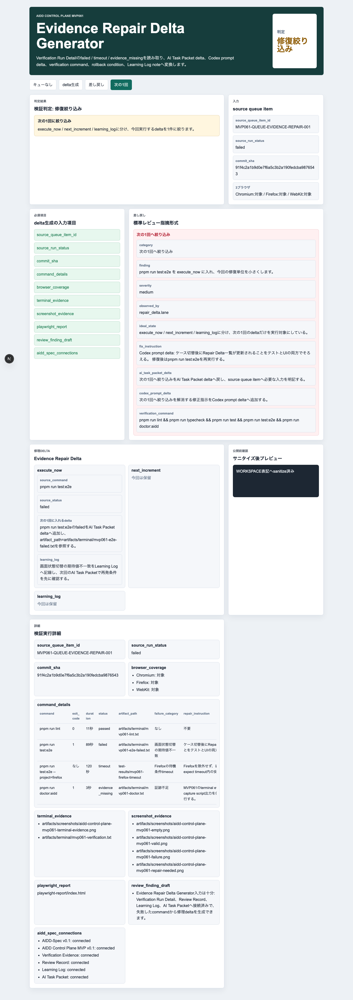
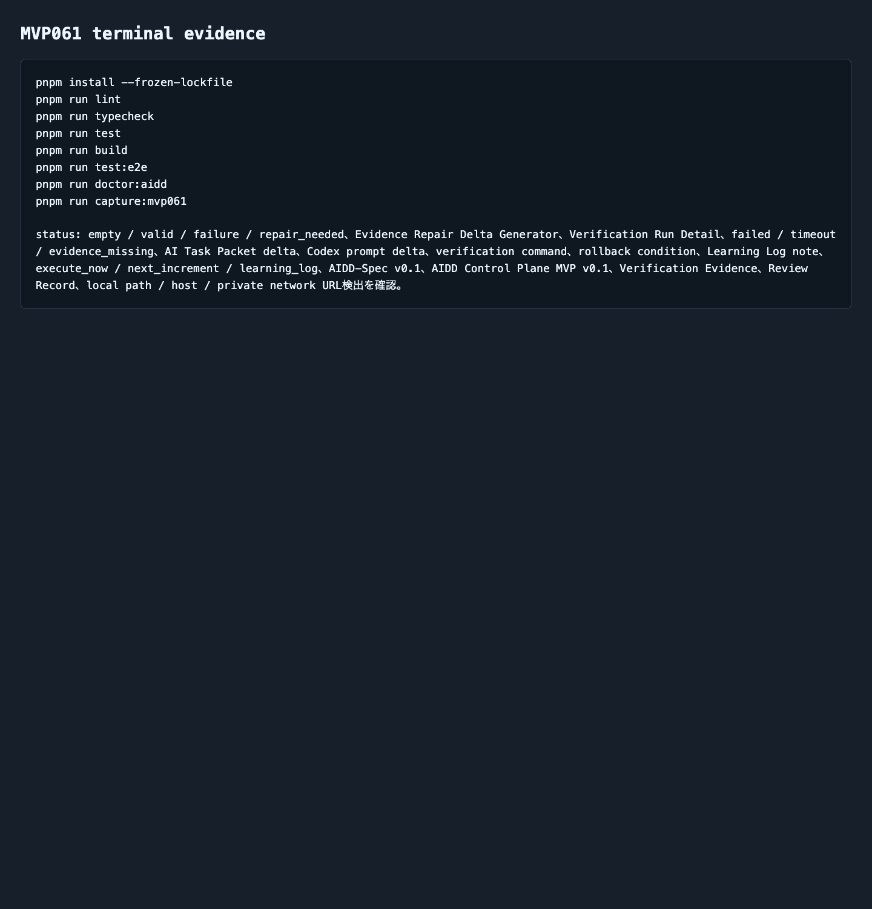

# AIDD Control Plane MVP 061：失敗ログを「次回の修理delta」に変換する

> 2026-07-08 / Codex Mastery Lab  
> 記事種別: Experiment / SaaS / Verification Evidence  
> 将来の書籍章: 第10章 Verification Evidence、第11章 Review Record、第18章 AIDD Control PlaneのMVP

## 読者の悩み

AIにアプリを作らせると、最後に「lintが落ちた」「E2Eがtimeoutした」「証跡が足りない」というログが残ります。ここでよく起きる問題は、失敗を見た人が次のAIに何を渡せばよいか分からなくなることです。

- どの失敗を次の1回で直すのか
- どれは次回送りにするのか
- どれはLearning Logへ残すだけなのか
- 修正後に何を再実行すればよいのか
- rollback条件は何か

MVP060では、実行結果をコマンド別のVerification Run Detailへ分解しました。今回はその次として、失敗したコマンドを **AI Task Packet delta / Codex prompt delta / 検証コマンド / rollback条件 / Learning Log** へ戻す画面を作りました。

健康診断でたとえると、「要再検査」という総合判定で終わらせず、血圧は今週見直す、食事メモは次回まで記録する、視力検査は別日に回す、のように分ける感覚です。

## 今回の仮説

> Verification Run Detailの failed / timeout / evidence_missing を修理deltaへ変換できれば、失敗ログはただの赤い結果ではなく、次回AI実行の材料になる。

AIDD Control Planeは、AIを実行するだけのSaaSではありません。AIに渡す入力、AIが出した結果、検証証跡、レビュー、次回改善を一つの流れにするSaaSです。

## 実験内容

生成先は `experiments/aidd-control-plane-mvp-061/generated-repo/` です。MVP060を土台に、CodexへMVP061のAI Task Packetを渡しました。

今回の実装テーマは **Evidence Repair Delta Generator** です。

```text
Verification Run Detailの failed / timeout / evidence_missing を入力として、
AI Task Packet delta、Codex prompt delta、verification command、
rollback condition、Learning Log noteへ変換する。

repair_neededでは、execute_now / next_increment / learning_logに分け、
次の1回へ入れるdeltaを絞る。
```

## 画面キャプチャ

### empty: source detailがまだない



emptyでは、Verification Run Detailが選ばれていないため修理deltaを生成しません。「入力がないのに修理指示を作る」ことを防ぎます。

### valid: 失敗コマンドから修理deltaを生成する



validでは、失敗したコマンドを次の形式へ変換します。

| 項目 | 何を確認したいのか | なぜ必要か |
| --- | --- | --- |
| source_detail_id | どのVerification Run Detailから来たか | 出所が曖昧だと次回AI実行へ戻せないため |
| failure_category | 失敗分類 | lint失敗、E2E timeout、証跡不足を同じ扱いにしないため |
| AI Task Packet delta | 次回packetへ足す条件 | AIへの依頼を具体化するため |
| Codex prompt delta | Codexへ渡す修正指示 | 「直して」ではなく対象と確認方法を伝えるため |
| verification command | 修正後に再実行するコマンド | 完了判定をログではなく実行結果で見るため |
| rollback condition | やめる条件・戻す条件 | 失敗ループを防ぐため |
| Learning Log note | 次回に残す学び | 同じ失敗を繰り返さないため |
| 3ブラウザ | Chromium / Firefox / WebKit | Firefox除外のような浅い検証を防ぐため |

### failure: 不足をReview Findingへ戻す



failureでは、次の不足をReview Finding形式へ戻します。

```yaml
category: terminal/failure screenshot不足
finding: 不足証跡: artifacts/screenshots/aidd-control-plane-mvp061-terminal-evidence.png
severity: high
observed_by: terminal_evidence / screenshot_evidence / playwright_report
ideal_state: terminal evidence、failure screenshot、playwright_reportがそろっている。
fix_instruction: 不足証跡を保存してverification commandへ戻す。
ai_task_packet_delta: terminal/failure screenshot不足をAI Task Packet deltaへ戻す。
codex_prompt_delta: terminal/failure screenshot不足を解消する修正指示をCodex prompt deltaへ追加する。
verification_command: pnpm run lint && pnpm run typecheck && pnpm run test && pnpm run test:e2e && pnpm run doctor:aidd
```

さらに、公開物にlocal path / host / private network URLが混ざるケースも検出し、公開前に `WORKSPACE` 表記へ置換する前提にしています。

### repair_needed: 次の1回へ入れるdeltaを絞る



repair_neededでは、全部を一度に直そうとしません。

- `execute_now`: 今回のCodex実行へ入れる
- `next_increment`: 次回の改善候補へ回す
- `learning_log`: すぐ直さず、再発防止メモとして残す

今回の画面では、`failed` を `execute_now` として優先し、`timeout` や `evidence_missing` は次回やLearning Logへ分ける流れを確認しました。旅行の持ち物リストでいうと、今すぐ買うもの、次の旅行までに考えるもの、メモだけ残すものを分ける感覚です。

### terminal evidence: 実際に検証したログ



今回の独立検証では、Codexの自己申告とは別に次を実行しました。

```text
pnpm install --frozen-lockfile
pnpm run lint
pnpm run typecheck
pnpm run test
pnpm run build
pnpm run test:e2e
pnpm run doctor:aidd
pnpm run capture:mvp061
```

E2EはChromium / Firefox / WebKitの3ブラウザで12件通りました。

```text
Running 12 tests using 1 worker
chromium: 4 passed
firefox: 4 passed
webkit: 4 passed
12 passed (28.1s)
```

## 失敗/修正

今回の目立つ修正は、MVP060由来の名前をMVP061へ寄せることでした。package名、capture script名、doctor:aiddの必須語、スクリーンショット名、テスト名が古いままだと、記事や証跡がどのMVPのものか分からなくなります。

この失敗は小さいですが、AIDD Control Planeにとっては重要です。証跡名が1つずれるだけで、後から「どの実行結果を見ればよいか」が分からなくなるからです。

## 検証ログ

保存したログは `experiments/aidd-control-plane-mvp-061/artifacts/terminal/` にあります。

| コマンド | 結果 |
| --- | --- |
| `pnpm install --frozen-lockfile` | pass |
| `pnpm run lint` | pass |
| `pnpm run typecheck` | pass |
| `pnpm run test` | 8 tests pass |
| `pnpm run build` | pass |
| `pnpm run test:e2e` | 12 tests pass / Chromium・Firefox・WebKit |
| `pnpm run doctor:aidd` | pass |
| `pnpm run capture:mvp061` | pass |

`pnpm run build` ではNext.jsのESLint plugin警告が出ていますが、ビルド自体は成功しています。これは次回以降の品質改善候補としてLearning Logへ残します。

## 読者が使えるチェックリスト

| チェック項目 | 何を確認したいのか | なぜ必要か |
| --- | --- | --- |
| 失敗をコマンド別に分けたか | lint / typecheck / test / build / e2e / doctorを混ぜていないか | 修正対象が曖昧になるのを防ぐため |
| failure_categoryがあるか | 失敗分類が空ではないか | AI Task Packet deltaへ戻しやすくするため |
| repair_instructionがあるか | 次に何を直すか書かれているか | Codexへ「直して」だけを渡さないため |
| verification_commandがあるか | 修正後に何を再実行するか | 完了判定を再現可能にするため |
| rollback conditionがあるか | 失敗ループ時に止まれるか | AIの自動修正が広がりすぎるのを防ぐため |
| execute_nowを絞ったか | 次の1回に入れるdeltaが多すぎないか | 1回のAI実行を小さく保つため |
| Firefoxを除外していないか | 3ブラウザ検証が残っているか | 通ったように見える浅い検証を防ぐため |
| 公開不可情報を消したか | local path / host / private network URLがないか | noteやpreviewで環境情報を漏らさないため |

## SaaS/AIDD-Specへの接続

MVP061は、AIDD-Spec v0.1の次のartifactへ接続します。

- Verification Evidence: 失敗した検証結果の証跡
- Review Record: どの不足を指摘したか
- Learning Log: 次回へ残す学び
- AI Task Packet: 次回AIに渡す差分

AIDD Control Plane SaaSとして見ると、今回の画面は「失敗ログを次回の依頼文へ変換する翻訳機」です。AI量産記事よりも、こうした一次情報の価値が高いのは、実際に失敗し、直し、証跡を残した人しか書けないからです。

## 次回

次回は、修理deltaを採用 / 保留 / 却下として判断する **Repair Delta Priority Decision Workspace** へ進めます。次の1回に何を入れるかを、理由・証跡・rollback条件つきで決める画面にします。
