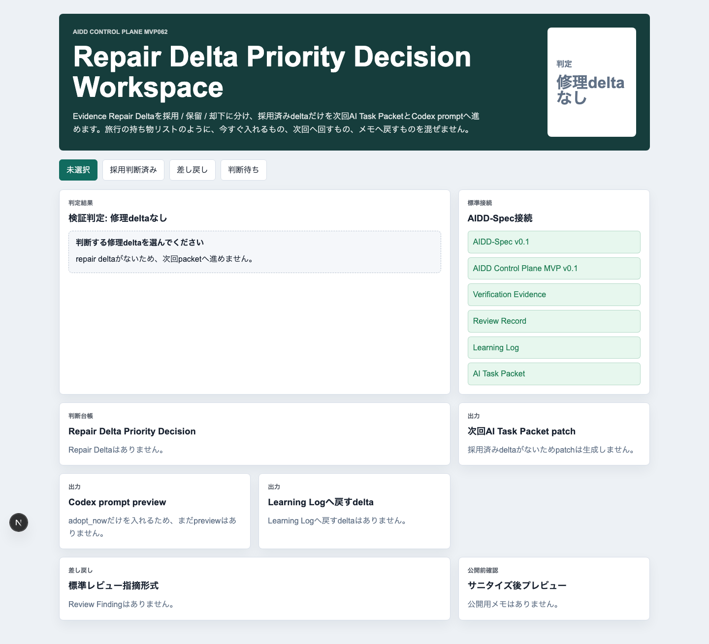
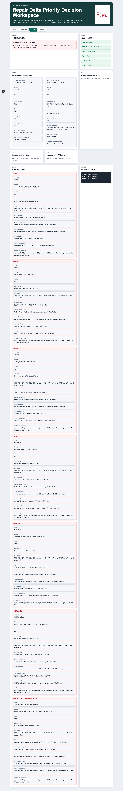
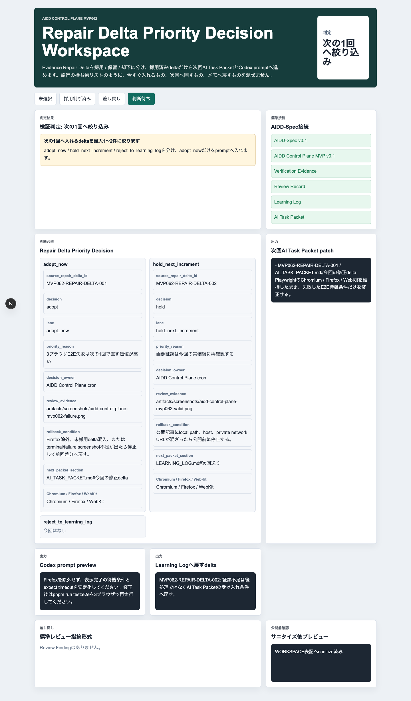
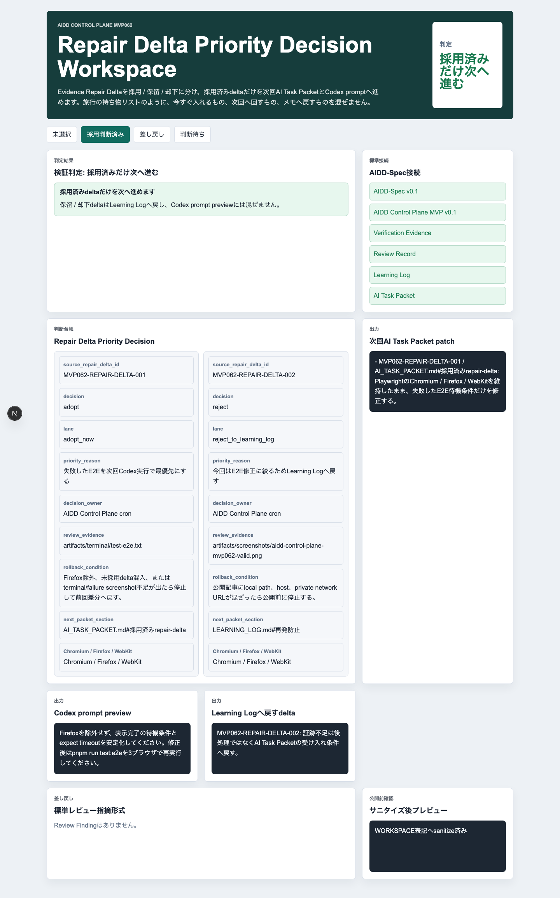

# AIDD Control Plane MVP 062：修理deltaを「次の1回」に入れるか判断する

> 2026-07-08 / Codex Mastery Lab  
> 記事種別: Experiment / SaaS / Verification Evidence  
> 将来の書籍章: 第10章 Verification Evidence、第11章 Review Record、第18章 AIDD Control PlaneのMVP

## 読者の悩み

AIに修正を頼むとき、失敗ログから作った「直すことリスト」を全部そのまま次のpromptへ入れてしまうことがあります。すると、E2Eの修正、証跡不足、記事用スクリーンショット、rollback条件、次回送りの学びが混ざり、AIは何を優先すればよいか分からなくなります。

MVP061では、失敗したVerification Run DetailをEvidence Repair Deltaへ変換しました。今回はその次として、repair deltaを **採用 / 保留 / 却下** に分け、採用済みdeltaだけを次回AI Task Packet / Codex promptへ進める画面を作りました。

旅行の持ち物リストでたとえると、「今回の旅行かばんへ入れるもの」「次の旅行までに考えるもの」「メモだけ残すもの」を分ける感覚です。全部を同じ袋へ入れないことが、AI駆動開発でも大事でした。

## 今回の仮説

> Evidence Repair Deltaを採用 / 保留 / 却下として判断できれば、次回Codex実行は「今やる1〜2件」に絞られ、未採用delta混入やFirefox除外を防げる。

AIDD Control Planeは、AIを実行するだけのSaaSではありません。AIに渡す入力、検証結果、レビュー判断、次回改善をつなぐSaaSです。今回のMVP062は、その「レビュー判断」の入口です。

## 実験内容

生成先は `experiments/aidd-control-plane-mvp-062/generated-repo/` です。Codex CLIはこのcron環境では `codex: command not found` で起動できなかったため、MVP061を土台に同じAI Task Packetを使って実装し、独立検証を行いました。

今回の実装テーマは **Repair Delta Priority Decision Workspace** です。

```text
Evidence Repair Delta
  -> adopt / hold / rejectを判断
  -> adopt_nowだけをAI Task Packet patchへ入れる
  -> adopt_nowだけをCodex prompt previewへ入れる
  -> hold / rejectはLearning Logへ戻す
  -> 未判断・理由不足・証跡不足・rollback不足・Firefox除外・未採用delta混入をReview Findingへ戻す
```

## 画面キャプチャ

### empty: 判断するrepair deltaがまだない



emptyでは、repair deltaがないため次回packetへ何も進めません。「入力がないのにpromptを作る」ことを防ぎます。

### valid: 採用済みdeltaだけを次へ進める


validでは、`adopt` になったdeltaだけがAI Task Packet patchとCodex prompt previewへ入ります。`reject_to_learning_log` はLearning Logへ戻すため、次回Codex promptへ混ざりません。

| チェック項目 | 何を確認したいのか | なぜ必要か |
| --- | --- | --- |
| decision | adopt / hold / rejectの判断 | 修理deltaを全部promptへ入れないため |
| priority_reason | なぜ今やるか | AIの作業範囲を絞るため |
| review_evidence | 判断の根拠 | 人間レビューと再検証で追えるようにするため |
| rollback_condition | 止める条件 | 失敗ループを防ぐため |
| next_packet_section | 次回packetの反映先 | AI Task Packetのどこへ戻すかを明確にするため |
| Chromium / Firefox / WebKit | 3ブラウザ維持 | Firefox除外による浅い検証を防ぐため |

### failure: 判断不足をReview Findingへ戻す



failureでは、次の不足をReview Finding形式へ戻します。

```yaml
category: 未採用delta混入
finding: 保留または却下deltaがadopt_now laneへ混入している。
severity: critical
observed_by: decision workspace / doctor:aidd / UI test
ideal_state: 採用済みdeltaだけが次回promptへ進む。
fix_instruction: laneとdecisionをそろえてから次回AI Task Packetへ進める。
verification_command: pnpm run lint && pnpm run typecheck && pnpm run test && pnpm run build && pnpm run test:e2e && pnpm run doctor:aidd
```

local path / host / private network URLも検出し、公開前には `WORKSPACE/private-url` へ置換する前提にしました。

### decision_needed: 次の1回へ入れるdeltaを絞る



`decision_needed` では、laneを次の3つに分けます。

- `adopt_now`: 今回のCodex実行へ入れる
- `hold_next_increment`: 次回の改善候補へ回す
- `reject_to_learning_log`: promptへ入れずLearning Logへ戻す

この状態では、Codex prompt previewに `adopt_now` だけが入ることをUIとテストで確認しました。

## 検証ログ

### terminal evidence: 実際に検証したログ



独立検証では、Codexの自己申告ではなく次を個別に実行しました。

```text
pnpm install --frozen-lockfile
pnpm run lint
pnpm run typecheck
pnpm run test
pnpm run build
pnpm run test:e2e
pnpm run doctor:aidd
pnpm run capture:mvp062
```

E2EはChromium / Firefox / WebKitの3ブラウザで12件通りました。

```text
Running 12 tests using 1 worker
chromium: 4 passed
firefox: 4 passed
webkit: 4 passed
12 passed (20.5s)
```

## 失敗 / 修正

最初のE2E実行はtimeoutしました。原因は、前回のPlaywright実行で残ったNext.js dev serverがローカルpreview用ポートを使い続けていたことです。プロセスを確認して終了し、再実行したところ3ブラウザE2Eが通りました。

また、E2E内で親要素を探すlocatorが長時間待機していたため、検証対象を「画面に表示された日本語テキスト」へ寄せて安定化しました。これはAIDD-Spec的には、UIの内部構造ではなくユーザーに見える契約を確認するテストへ近づける修正です。

## AIDD-Spec / AIDD Control Plane SaaSへの接続

MVP062で増えた標準化ポイントは次です。

```yaml
standard_update:
  document: standards/aidd-control-plane-mvp-v0.1.md
  field: Repair Delta Priority Decision Workspace
  rule:
    - repair deltaはadopt / hold / rejectで判断する
    - adopt_nowだけを次回AI Task Packet / Codex promptへ進める
    - hold / rejectはLearning Logへ戻す
    - Firefox除外、未採用delta混入、証跡不足、rollback不足をReview Findingへ戻す
verification:
  command: pnpm run test:e2e && pnpm run doctor:aidd
  expected: Chromium / Firefox / WebKitでpass
```

## 読者が使えるチェックリスト

| チェック項目 | 何を確認したいのか | なぜ必要か |
| --- | --- | --- |
| 採用判断があるか | repair deltaにadopt / hold / rejectがあるか | AIに全部渡す事故を防ぐため |
| 理由があるか | priority_reasonが書かれているか | 次の1回の優先順位を説明するため |
| 証跡があるか | review_evidenceが保存されているか | 後で判断を再確認するため |
| rollbackがあるか | 止める条件が明記されているか | 修正ループを止めるため |
| 3ブラウザが残っているか | Chromium / Firefox / WebKitが維持されているか | 都合の悪いブラウザ除外を防ぐため |
| 未採用deltaが混ざっていないか | hold/rejectがpromptへ入っていないか | AIの作業範囲を守るため |
| 公開前sanitize済みか | local pathやprivate network URLがないか | 記事・previewへ個人環境を漏らさないため |

## SaaSへの意味

このMVPで、AIDD Control Planeは「失敗ログを修理deltaへ変換する」だけでなく、「そのdeltaを次の1回に入れるか判断する」段階へ進みました。

AI量産記事ではなく、実験した本人しか書けない一次情報が強いのは、こうした失敗、修正、検証ログ、画面の変化を残せるからです。AIDD Control Planeは、その一次情報を自然に残すSaaSに近づいています。

## 次回

次は、採用済みdeltaを実行候補としてCodex Run Queueへ入れる直前の **Run Queue Intake** または、実行状態を追跡する **Codex Run Queue Status Tracker** を進めます。今回の判断結果が、実際の実行キューへ安全に渡るところを確認します。
