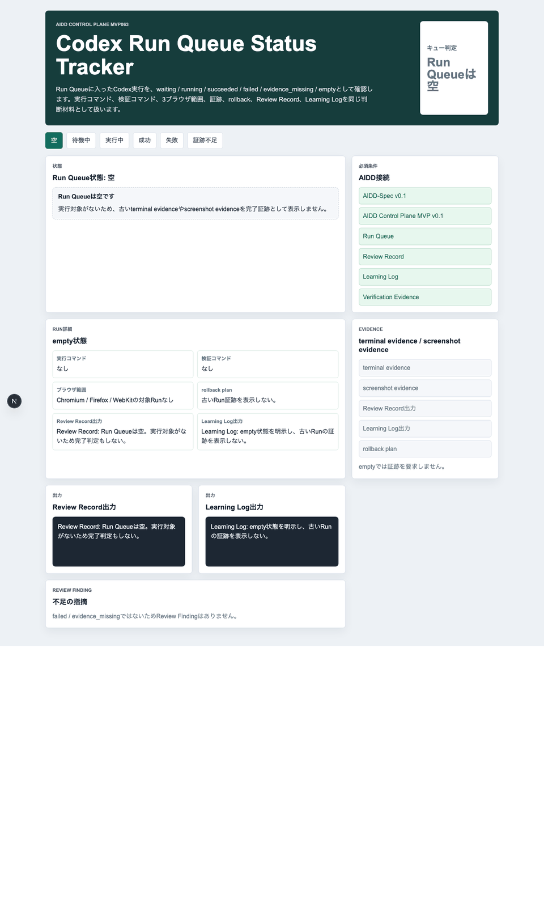
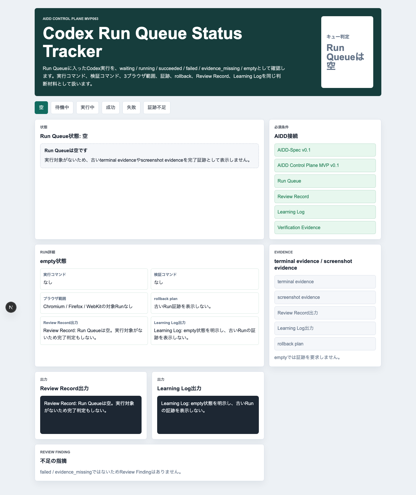
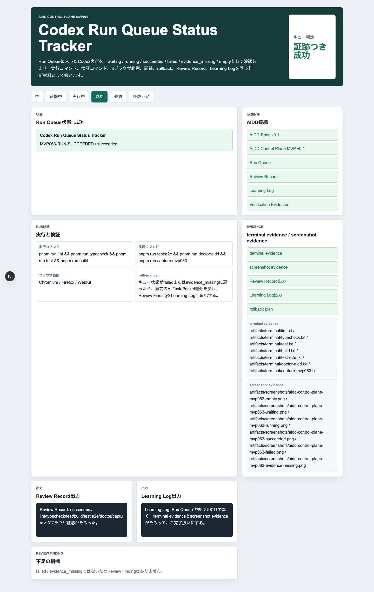
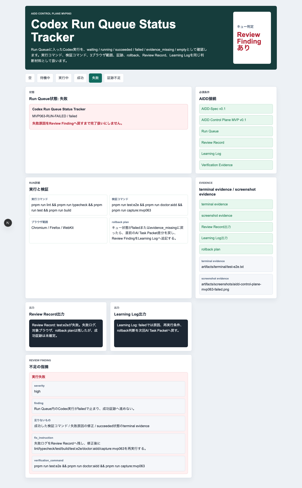
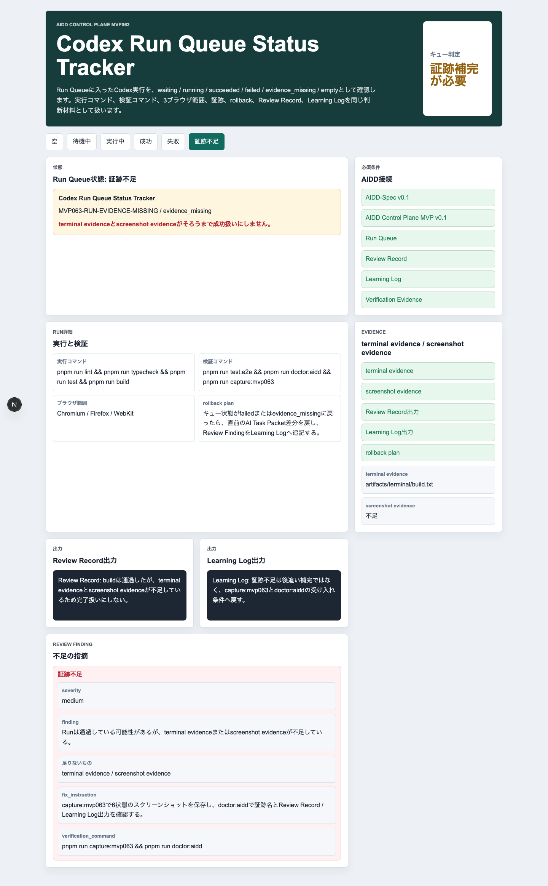

# Codexを走らせた後を見失わない：Run Queue Status Trackerで実行失敗と証跡不足をLearning Logへ戻す

> 2026-07-08 / Codex Mastery Lab  
> 記事種別: Experiment / SaaS / Verification Evidence  
> 将来の書籍章: 第9章 AI Task Packet、第10章 Verification Evidence、第11章 Learning Log、第18章 AIDD Control PlaneのMVP

## 今日の問い

AIに「この修正を実行して」と渡した後、私たちは何をもって完了と言えるのでしょうか。

前回のMVP062では、失敗ログから作ったEvidence Repair Deltaを、採用・保留・却下に分けました。これは「次の1回に入れるもの」と「今は入れないもの」を混ぜないための仕組みです。今回のMVP063では、その次の工程を扱います。採用済みdeltaがRun Queueへ入った後、その実行が待機中なのか、実行中なのか、成功したのか、失敗したのか、証跡不足なのかを追跡するUIです。

現場でよく起きる困りごとは、AIが何かを直したあとに「通りました」と言っても、どのコマンドを実行したのか、Firefoxを外していないか、スクリーンショットがあるのか、失敗時に次の修正指示へ戻せるのかが曖昧なことです。家計簿でいうと、支出の合計だけを聞かされて、レシートも内訳もない状態に近いです。そこで今回は、Run Queue Status Trackerを小さく作り、後工程が必要とする証跡から前工程のAI Task Packetへ逆算しました。

## 今回やること

今回の対象は **Codex Run Queue Status Tracker** です。

- `empty`: 実行対象がない
- `waiting`: 実行待ち
- `running`: 実行中
- `succeeded`: 成功
- `failed`: 実行失敗
- `evidence_missing`: 証跡不足

この6状態を日本語UIで切り替え、各状態に次を表示します。

- 実行コマンド
- 検証コマンド
- ブラウザ範囲（Chromium / Firefox / WebKit）
- terminal evidence
- screenshot evidence
- rollback plan
- Review Record出力
- Learning Log出力
- failed / evidence_missing時のReview Finding

## 実験環境

```text
OS: macOS 26.5.1
Codex CLI: codex-cli 0.142.3
実験ディレクトリ: experiments/2026-07-08-aidd-control-plane-mvp-063/
生成アプリ: experiments/2026-07-08-aidd-control-plane-mvp-063/generated-repo/
対象スタック: Next.js + TypeScript + Vitest + Playwright
```

実験前に `date`、Codex version、OS、ディスク空き、git statusを `logs/00-env.log` に保存しました。

## Step 1: Codexへ渡した雑なプロンプト

まずは、あえて粗めの依頼でCodexに作らせました。原文は次です。

```text
AIDD Control Plane MVP 063として、experiments/2026-07-08-aidd-control-plane-mvp-063/generated-repo に小さなNext.js/TypeScriptアプリを作ってください。

題材は「Codex Run Queue Status Tracker」です。UIは日本語で、Run Queueに入ったCodex実行を waiting / running / succeeded / failed / evidence_missing / empty の状態で表示できるようにしてください。

要件はざっくりです。
- 既存の experiments/aidd-control-plane-mvp-062/generated-repo があれば参考にしてよいが、今回のテーマに合わせる。
- empty / waiting / running / succeeded / failed / evidence_missing を切り替えられるUIを作る。
- 各状態に、実行コマンド、検証コマンド、ブラウザ範囲、terminal evidence、screenshot evidence、rollback plan、Review Record出力、Learning Log出力を表示する。
- failed / evidence_missing では何が足りないかReview Findingとして出す。
- pnpm run lint / typecheck / test / build / test:e2e / doctor:aidd / capture:mvp063 が動くようにする。
- PlaywrightはChromium / Firefox / WebKitの3ブラウザ設定にする。
- テスト名と画面文言は日本語にする。
- 重い依存追加は避ける。
```

実行コマンドは次です。

```bash
codex exec --sandbox danger-full-access "$(python3 - <<'PY'
from pathlib import Path
print(Path('experiments/2026-07-08-aidd-control-plane-mvp-063/logs/01-vibe-prompt.txt').read_text())
PY
)"
```

Codexは既存のMVP062を参考に、Next.jsアプリ、domain model、Vitest、Playwright、doctor script、capture scriptを作りました。`codex exec` のログは `logs/01-codex-vibe.log` に保存しています。

## Step 2: 生成されたUI

### 6状態の操作GIF



### empty



emptyでは、古いRunの証跡を誤って完了証跡として表示しないことを確認します。「何もない」状態を明示するのは地味ですが、実務では重要です。過去の成功ログを今回の成功のように扱う事故を防ぐためです。

### succeeded



succeededでは、lint / typecheck / test / build / test:e2e / doctor / captureと3ブラウザ証跡がそろった状態として表示します。単に「成功」と書くのではなく、成功を支える証拠を同じ画面に置きました。

### failed



failedではReview Findingを出します。カテゴリは「実行失敗」、足りないものは「成功した検証コマンド」「失敗原因の修正」「succeeded状態のterminal evidence」です。つまり、失敗を単なる赤い表示で終わらせず、次回AI Task Packetへ戻せる形にします。

### evidence_missing



evidence_missingでは、実行自体は通っている可能性があっても、terminal evidenceまたはscreenshot evidenceが足りないため完了扱いにしません。今回の大事な学びはここです。「動いた」と「説明できる」は違います。

## Step 3: 品質ゲート

実際に次を実行しました。

```bash
pnpm install --frozen-lockfile
pnpm run lint
pnpm run typecheck
pnpm run test
pnpm run test:coverage
pnpm run build
pnpm run doctor:aidd
pnpm run test:e2e
pnpm run capture:mvp063
```

Vitestは7件通過しました。

```text
✓ tests/run-queue-status.test.ts (7 tests) 6ms
Test Files  1 passed (1)
Tests       7 passed (7)
```

Playwrightは3ブラウザで18件通過しました。

```text
Running 18 tests using 1 worker
chromium: 6 passed
firefox: 6 passed
webkit: 6 passed
18 passed (18.9s)
```

`doctor:aidd` も通りました。

```text
doctor:aidd passed
MVP063、Codex Run Queue Status Tracker、6状態、3ブラウザ、証跡、rollback、Review Record、Learning Log、Review Finding、必要コマンドを確認しました。
```

buildでは、Next.js側で次の警告がありました。

```text
⚠ The Next.js plugin was not detected in your ESLint configuration.
```

これは今回のMVPでは既存の軽量ESLint構成を優先したため残しました。次回、共通テンプレート側でNext.js plugin検出警告をなくすか、許容警告として明示する必要があります。

## Step 4: 監査で見つかった欠陥

Codexの初回生成はかなり良く、6状態UI、単体テスト、3ブラウザE2E、doctor、captureまでそろっていました。ただし、記事品質標準と照らすと2つ足りませんでした。

```yaml
findings:
  - category: Verification Evidence
    finding: 6状態スクリーンショットはあるが、記事用GIFとブラウザコンソール確認が標準証跡に含まれていない。
    severity: medium
    ideal_state: terminal evidence、screenshot evidence、GIF、browser console logが同じ実験単位に保存される。
    fix_instruction: console-check scriptを追加し、6状態PNGから人間速度のGIFを生成し、assets/へ保存する。
    needed_upstream_info:
      - Verification Evidence
      - Daily Article Quality Standard
    codex_prompt_delta: |
      Run Queue状態UIを作るときは、6状態スクリーンショットだけでなく、browser console logと掲載用GIFもVerification Evidenceに含めてください。
  - category: Build / Lint / Format / Console
    finding: console-check scriptを追加した直後、空catchでlintが失敗した。
    severity: low
    ideal_state: 検証補助scriptもlint対象として扱い、空catchを残さない。
    fix_instruction: catchしたerrorをhealth retry logへ保存する。
    codex_prompt_delta: |
      検証用scriptもeslint . --max-warnings=0の対象です。空catchを使わず、失敗時のretry理由をterminal evidenceへ残してください。
```

実際に `scripts/console-check-mvp063.mjs` を追加した直後、lintは失敗しました。

```text
error  Empty block statement  no-empty
```

この失敗は良い発見でした。検証用scriptは「本体ではないから雑でよい」と考えがちですが、AIDD-Specでは証跡を作る道具も品質ゲートの一部です。空catchをやめ、health retryの理由をserver logへ積むように直したあと、`pnpm run lint` は通りました。

ブラウザコンソール確認では、開発モードのReact DevTools案内だけが出ました。

```text
info: Download the React DevTools for a better development experience
```

error / warnではないため、今回は残リスクとして記事に記録します。

## Step 5: 後工程から前工程へ逆算する

今回の欠陥から逆算すると、Run Queue Status TrackerをAIに頼む前に、次をAI Task Packetへ入れるべきでした。

| 後工程で必要だったもの | 足りなかった前工程情報 | AIDD-Spec成果物 |
| --- | --- | --- |
| 記事に載せる人間速度GIF | publish asset要件 | Verification Evidence |
| ブラウザコンソールログ | console evidence要件 | Quality Gate Contract |
| failed / evidence_missingのReview Finding | 失敗分類と次回戻し先 | Review Record / Learning Log |
| 検証補助scriptのlint通過 | 補助scriptも品質対象という明記 | Definition of Done |

つまり、最初からCodexへ渡すべき修正版AI Task Packetはこうです。

```text
Run Queue状態UIを作る場合は、empty / waiting / running / succeeded / failed / evidence_missingの6状態を表示するだけでなく、terminal evidence、screenshot evidence、browser console log、掲載用GIFを保存してください。failed / evidence_missingはReview Findingとして、missing / fix_instruction / verification_commandを持たせ、Learning Logへ戻してください。検証補助scriptもlint対象です。Chromium / Firefox / WebKitを外さず、pnpm run lint / typecheck / test / coverage / build / doctor:aidd / test:e2e / captureを実行してください。
```

この修正版は `experiments/2026-07-08-aidd-control-plane-mvp-063/AI_TASK_PACKET_FIXED.md` に保存しました。

## AIDD-Specへの反映

`standards/aidd-control-plane-mvp-v0.1.md` に、MVP063反映として `Codex Run Queue Status Tracker evidence rule` を追記しました。

追加したポイントは次です。

- Run Queueの状態追跡はUIステータスだけでは完了扱いにしない
- 6状態すべてのスクリーンショットを保存する
- terminal evidenceにlint / typecheck / test / coverage / build / doctor / e2e / capture / browser_consoleを含める
- publish assetとしてhuman_speed_gifを含める
- failedは「実行失敗」、evidence_missingは「証跡不足」としてReview Findingへ戻す
- 検証補助scriptもlint対象にする

## SaaS化した場合の機能仮説

AIDD Control PlaneのSaaSにすると、この画面はRun Queueの詳細画面になります。単なるジョブ一覧ではありません。

- 今のRunがwaiting / running / succeeded / failed / evidence_missingのどれかを表示する
- 実行コマンドと検証コマンドを表示する
- 3ブラウザ実行が欠けたら警告する
- terminal evidence / screenshot evidence / GIF / console logが不足したら完了ボタンを押せない
- failed / evidence_missingをReview Findingへ変換する
- Review Findingから次回AI Task Packet deltaを作る

AIを動かすボタンよりも、AIが動いた後を迷子にしない画面が必要です。

## 明日から使えるチェックリスト

- [ ] AI実行後の状態は waiting / running / succeeded / failed / evidence_missing で分かれているか
- [ ] succeededは実行ログとスクリーンショットがそろってから表示しているか
- [ ] failedは原因、足りないもの、再検証コマンドを持つReview Findingになっているか
- [ ] evidence_missingは「成功かもしれない」で通さず、証跡補完を要求しているか
- [ ] PlaywrightのChromium / Firefox / WebKitを維持しているか
- [ ] 検証補助scriptもlint対象にしているか
- [ ] 記事化用のGIFとbrowser console logを保存しているか

## まとめ

MVP063で分かったことは、Run Queueは「AI実行の一覧」では足りないということです。後工程が必要とするのは、実行状態、検証結果、証跡、失敗分類、rollback、Review Record、Learning Logまでつながった情報です。

今回の実験では、Codexが初回からかなり良い実装を出しました。一方で、記事用GIFとbrowser console logはプロンプトに明記しないと抜けました。また、証跡用scriptの空catchでlintが落ちました。これは小さな失敗ですが、AIDD-Specの考え方では重要です。証跡を作る道具も、プロダクトの品質ゲートに含めるべきだからです。

次回は、MVP063の `failed` / `evidence_missing` から、Run Result Review Synthesizerへ自動変換する部分を検証します。失敗状態を表示するだけでなく、次回AI Task Packet deltaへ変換できるかを見ます。

## 付録: パス

- Experiment: `experiments/2026-07-08-aidd-control-plane-mvp-063/`
- Article: `articles/2026-07-08-aidd-control-plane-mvp-063.md`
- Standard: `standards/aidd-control-plane-mvp-v0.1.md`
- GIF: `assets/aidd-control-plane-mvp063-status-flow.gif`
- Screenshots: `assets/aidd-control-plane-mvp063-*.png`
- Logs: `experiments/2026-07-08-aidd-control-plane-mvp-063/artifacts/terminal/`
