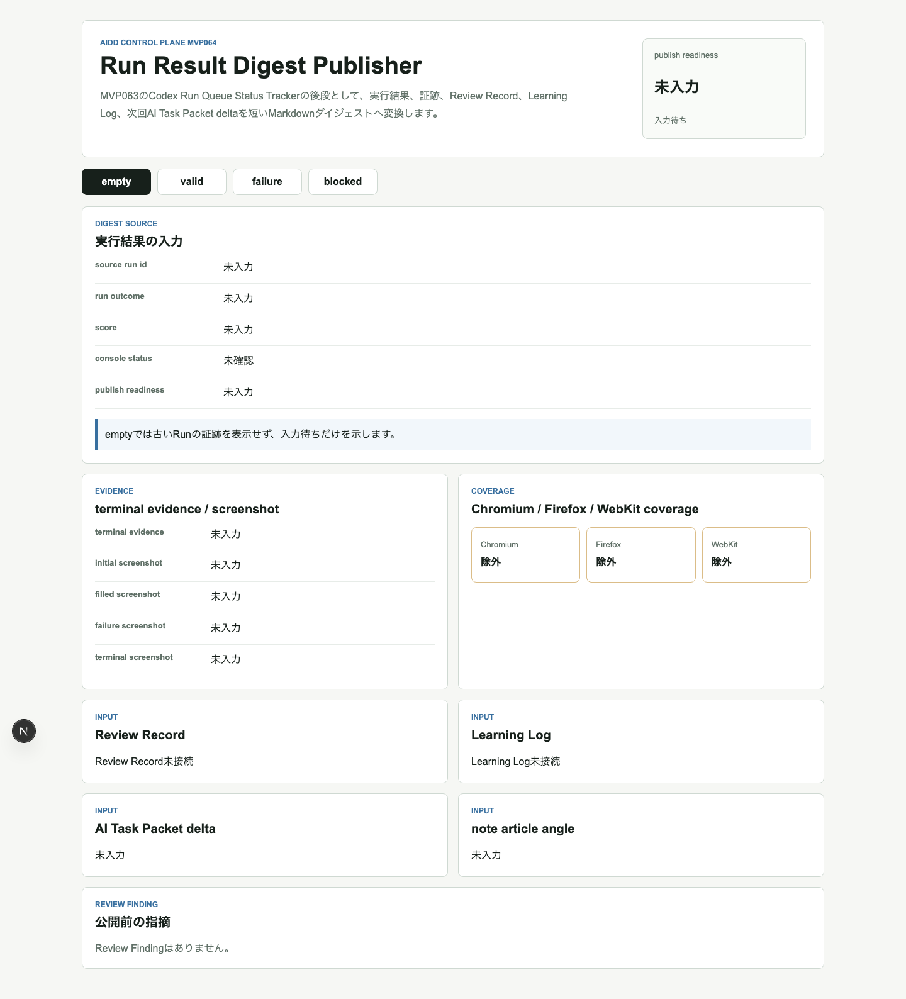
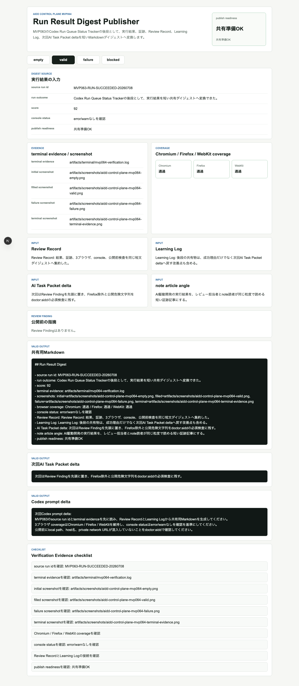
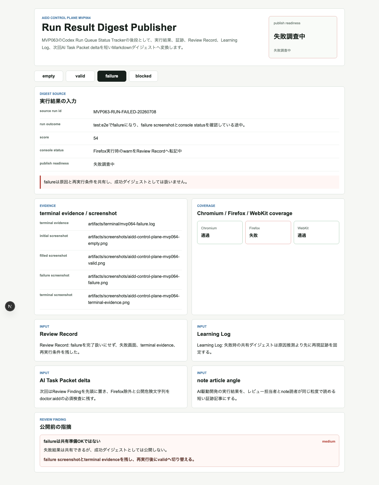
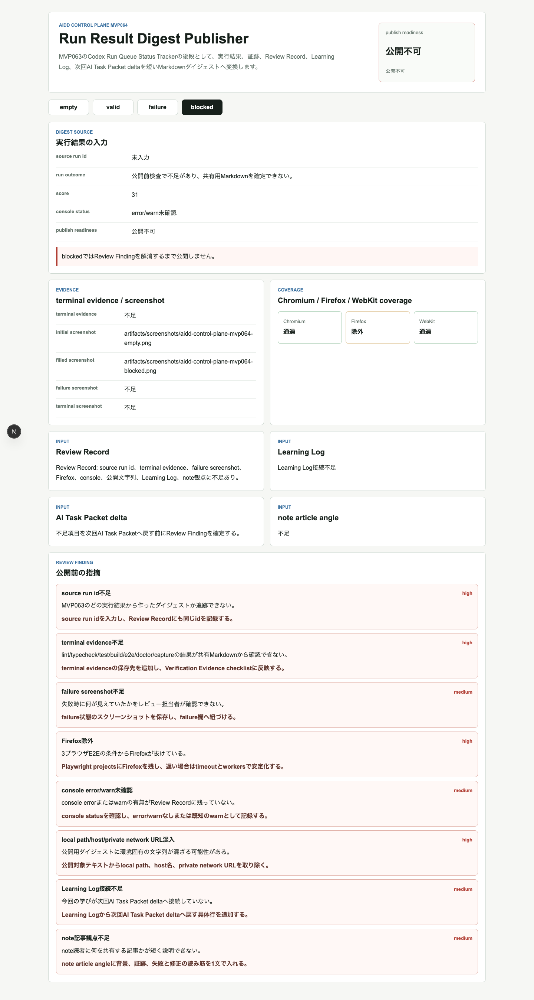
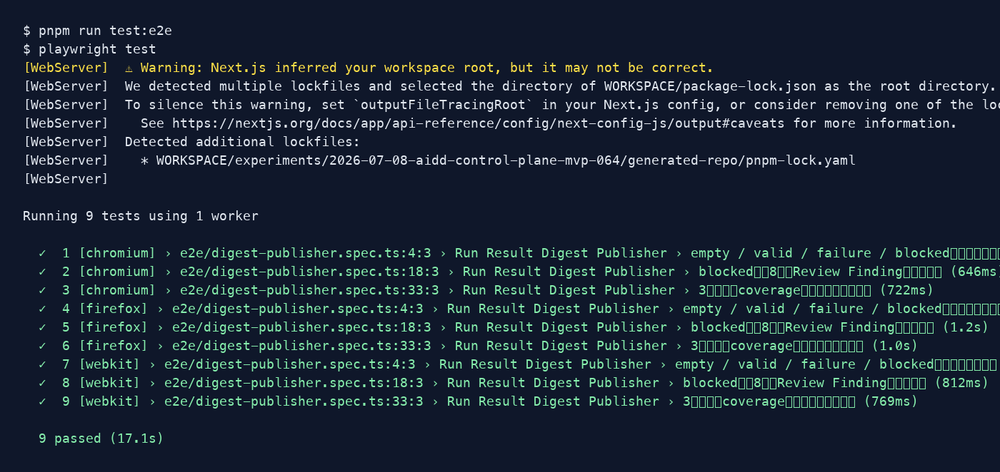

# AI実行結果を「共有できる証跡」に変える：Run Result Digest Publisherを作った

> 2026-07-08 / Codex Mastery Lab  
> 記事種別: Experiment / SaaS / Verification Evidence  
> 将来の書籍章: 第10章 Verification Evidence、第11章 Learning Log、第18章 AIDD Control PlaneのMVP

## 読者の悩み

AIに実装を任せたあと、「通りました」「直しました」という報告だけが残っていないでしょうか。そこにログの場所、失敗画面、3ブラウザの範囲、console errorの有無、次回の修正指示がなければ、レビュー担当者も未来の自分も判断できません。

MVP063では、Codex Run Queueの状態を `waiting / running / succeeded / failed / evidence_missing` として追跡しました。今回のMVP064では、その次の一歩として **Run Result Digest Publisher** を作りました。目的は、実行結果を開発者だけの詳細ログから、レビュー担当者やnote読者にも共有できる短いMarkdownダイジェストへ変換することです。

たとえるなら、長いレシートの束をそのまま渡すのではなく、「合計、内訳、足りないレシート、次に確認すること」を1枚の家計メモにまとめる作業です。

## 今回の仮説

AI駆動開発で品質が崩れる原因の一つは、実装そのものよりも **実行後の情報が散らばること** です。

そこで今回は、Run結果を共有する前に次を必ず束ねるUIを作れば、AIDD Control Planeは「コード生成ツール」ではなく「検証と学習を次回に戻すSaaS」に近づく、という仮説で進めました。

- source run id
- run outcome / score
- terminal evidence
- initial / filled / failure / terminal screenshot
- Chromium / Firefox / WebKit coverage
- console status
- Review Record
- Learning Log
- AI Task Packet delta
- Codex prompt delta
- note article angle
- publish readiness

## 実験内容

Codexへ渡したAI Task Packetは `experiments/2026-07-08-aidd-control-plane-mvp-064/AI_TASK_PACKET.md` に保存しました。実装対象は `generated-repo/` のNext.js + TypeScriptアプリです。

今回のUI状態は4つです。

| 状態 | 意味 | 確認したいこと |
| --- | --- | --- |
| empty | ダイジェスト対象がない | 古いRunを誤って共有しない |
| valid | 共有準備OK | 証跡、3ブラウザ、Review Record、Learning Logが揃っている |
| failure | 失敗Runの共有 | 失敗を隠さず、原因と次回deltaを残す |
| blocked | 共有不可 | 不足証跡や公開危険文字列をReview Findingにする |

## 画面キャプチャ

### empty: 対象Runがない状態



emptyは地味ですが重要です。対象Runがないときに、前回の成功ログを今回の証跡のように見せてしまう事故を防ぎます。

### valid: 共有できるRun Result Digest



validでは、source run id、terminal evidence、3ブラウザcoverage、Review Record、Learning Log、次回AI Task Packet delta、Codex prompt deltaを1画面で確認できます。ここで初めて「共有準備OK」と言えます。

### failure: 失敗Runも次回へ戻せる形で共有する



failureは「失敗だから捨てる」ではありません。失敗画面、terminal evidence、Firefoxでの失敗、再実行条件を残すことで、次回AI Task Packetへ戻せる材料になります。

### blocked: 証跡不足をReview Findingにする



blockedでは、次の8項目をReview Findingとして表示しました。

- source run id不足
- terminal evidence不足
- failure screenshot不足
- Firefox除外
- console error/warn未確認
- local path/host/private network URL混入
- Learning Log接続不足
- note記事観点不足

この状態があることで、「なんとなく共有する」を止められます。

### terminal evidence画像



## 失敗と修正

Codex実行自体は成果物を作りましたが、実行ログが非常に長くなり、こちらのジョブではtimeoutしました。ここでCodexの自己申告を信用せず、独立検証へ切り替えました。

また、Next.js build / E2Eではworkspace root推定のwarningが出ました。コマンド自体は成功しましたが、warningは「品質点として無視しない」扱いにします。次回以降は `outputFileTracingRoot` などでwarningを減らす候補にします。

## 検証ログ

独立検証として、次を個別に実行し、`artifacts/terminal/` に保存しました。

```text
pnpm install --frozen-lockfile: 成功
pnpm run lint: 成功
pnpm run typecheck: 成功
pnpm run test: 6 tests passed
pnpm run build: 成功（Next.js workspace root warningあり）
pnpm run test:e2e: 3ブラウザで9 tests passed
pnpm run doctor:aidd: 成功
pnpm run capture:mvp064: 成功
```

特にE2EはChromium / Firefox / WebKitを外さずに通しました。

```text
9 passed (17.1s)
```

## 読者が使えるチェックリスト

| チェック項目 | 何を確認したいのか | なぜ必要か |
| --- | --- | --- |
| source run idがある | どの実行結果か追跡できるか | 別Runの証跡を混ぜないため |
| terminal evidenceがある | 実コマンドの結果が残っているか | AIの自己申告だけで判断しないため |
| failure screenshotがある | 失敗時に何が見えていたか | 修正指示を具体化するため |
| Firefoxを外していない | 3ブラウザで確認したか | 便利なブラウザだけで成功扱いにしないため |
| console statusがある | error/warnを確認したか | 画面が見えても内部で壊れている可能性を拾うため |
| 公開危険文字列がない | local pathやprivate URLが混ざっていないか | 記事や証跡を安全に公開するため |
| Learning Logに接続している | 次回改善へ戻せるか | 失敗を一回限りで終わらせないため |
| note article angleがある | 読者に何を伝えるか | ログの羅列ではなく一次情報記事にするため |

## AIDD-Spec / SaaSへの接続

今回の成果は、`standards/aidd-control-plane-mvp-v0.1.md` に **Run Result Digest Publisher sharing rule** として追記しました。

AIDD Control Planeの価値は、AIにコードを書かせることだけではありません。むしろ、実行結果を検証証跡、Review Record、Learning Log、次回AI Task Packet deltaへ変換することにあります。今回のMVP064は、その変換を人間にも読みやすい共有ダイジェストとして固定しました。

note記事としても同じです。AI量産記事ではなく、実際に作り、失敗し、warningを見て、証跡を残した本人しか書けない一次情報に価値があります。

## 次回

次回は、今回のダイジェストをさらに進めて、複数Runのダイジェストから「次に1つだけ実行する改善」を選ぶ仕組みに進めます。候補は **Digest-to-Next Action Selector** です。共有で終わらせず、次の1インクリメントへ戻すところまでSaaSの流れにします。
