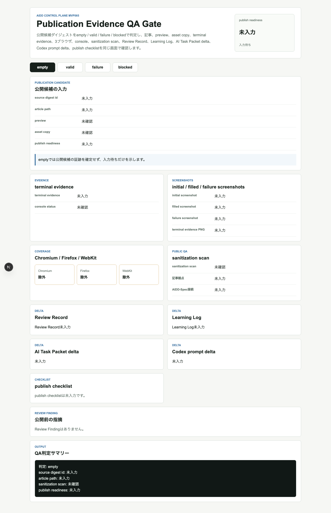
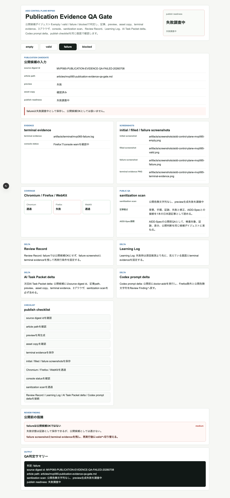
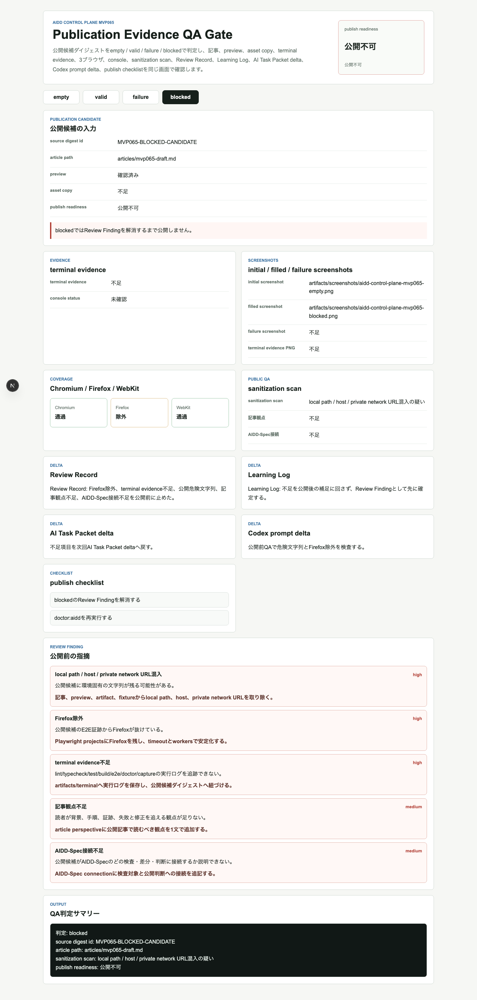
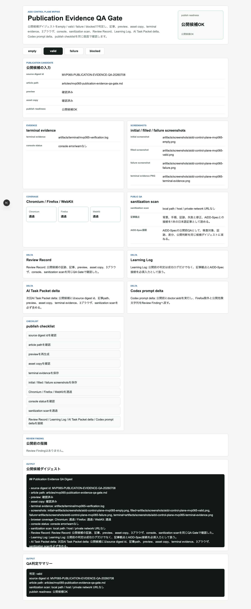

# 公開前に「証拠のリンク切れ」を止める：Publication Evidence QA Gateを作った

> 2026-07-08 / Codex Mastery Lab  
> 記事種別: Experiment / SaaS / Verification Evidence / Release Checklist  
> 将来の書籍章: 第10章 Verification Evidence、第12章 Release Checklist、第18章 AIDD Control PlaneのMVP

## 読者の悩み

AIに実装させたあと、記事や社内共有にまとめようとすると、最後にこういう事故が起きます。

- スクリーンショットのリンクが切れている
- terminal evidenceが「どこかにあるはず」で終わる
- Chromiumだけ通っていてFirefoxが抜けている
- console error/warnの確認がない
- ローカルパスやホスト名が公開物に混ざる
- AIDD-Specや次回AI Task Packetへの接続がない

MVP064では、Run Result Digest Publisherとして「実行結果を短い共有ダイジェストにする」ところまで作りました。今回のMVP065では、そのダイジェストを公開する直前に止める **Publication Evidence QA Gate** を作りました。

たとえるなら、旅行前に荷物を詰めたあと、玄関で「財布、鍵、スマホ、チケット、行き先メモ」をもう一度確認するチェックです。荷物を作ることと、出発してよいかを確認することは別の作業です。

## 今回の仮説

AIDD Control Planeが「誰でもベストに近いAI駆動開発フローと設計ドキュメントを作れるSaaS」になるには、実装後の証跡を集めるだけでは足りません。

公開前に次を1画面で確認できれば、AI量産記事ではなく、実験した本人しか書けない一次情報として安全に出せるはずです。

- source digest id
- article path
- preview
- asset copy
- terminal evidence
- initial / filled / failure screenshots
- terminal evidence PNG
- Chromium / Firefox / WebKit coverage
- console status
- sanitization scan
- Review Record
- Learning Log
- AI Task Packet delta
- Codex prompt delta
- publish checklist

## 実験内容

Codexへ渡したAI Task Packetは `experiments/2026-07-08-aidd-control-plane-mvp-065/AI_TASK_PACKET.md` に保存しました。実装対象は `generated-repo/` のNext.js + TypeScriptアプリです。

今回のUI状態は4つです。

| 状態 | 意味 | 確認したいこと |
| --- | --- | --- |
| empty | 公開候補が未選択 | 古い記事や古い証跡を誤公開しない |
| valid | 公開候補OK | 記事、preview、画像、terminal、3ブラウザ、サニタイズが揃っている |
| failure | 検証失敗あり | 失敗を隠さず、再実行条件を残せている |
| blocked | 公開不可 | 危険文字列、Firefox除外、証跡不足、記事観点不足を止める |

## 画面キャプチャ

### empty: 公開候補がまだない



emptyは地味ですが重要です。公開候補がないときに、前回の成功記事や前回の画像を今回の証跡のように見せないための状態です。

### valid: 公開候補OK


validでは、source digest id、article path、preview、asset copy、terminal evidence、3ブラウザcoverage、console status、sanitization scan、Review Record、Learning Logをまとめて確認できます。

### failure: 失敗は公開候補OKにしない



failureは「捨てる状態」ではありません。失敗画面とterminal evidenceを残し、次回の再実行条件へ戻すための状態です。ただし、公開候補OKとしては扱いません。

### blocked: 公開前に止める



blockedでは次の5件をReview Findingとして表示しました。

- local path / host / private network URL混入
- Firefox除外
- terminal evidence不足
- 記事観点不足
- AIDD-Spec接続不足

「あとで直す」ではなく、公開前に止めることが目的です。

### terminal evidence画像



## 失敗と修正

今回もCodex実行は成果物を作りましたが、こちらのジョブではCodexプロセスがtimeoutしました。そこでCodexの自己申告を信用せず、独立検証へ切り替えました。

また、Next.js build / E2Eではworkspace root推定のwarningが残っています。コマンドは成功していますが、warningは品質上の改善余地として扱います。次回以降は `outputFileTracingRoot` などで抑制できるかを検討します。

## 検証ログ

独立検証として、次を個別ログに保存しました。

```text
pnpm install --frozen-lockfile: 成功
pnpm run lint: 成功
pnpm run typecheck: 成功
pnpm run test: 6 tests passed
pnpm run build: 成功（Next.js workspace root warningあり）
pnpm run test:e2e: Chromium / Firefox / WebKitで12 tests passed
pnpm run doctor:aidd: 成功
pnpm run capture:mvp065: 成功
```

E2Eは3ブラウザを外さずに通しました。

```text
12 passed (11.8s)
```

## 読者が使えるチェックリスト

| チェック項目 | 何を確認したいのか | なぜ必要か |
| --- | --- | --- |
| source digest idがある | どの共有ダイジェストを公開するのか | 別Runや別記事の証跡を混ぜないため |
| article pathがある | どの記事を公開対象にするのか | 下書きと公開物の取り違えを防ぐため |
| previewを確認した | 生成後の表示を見たか | Markdownだけでは画像リンク切れに気づけないため |
| asset copyを確認した | 記事内画像がpreview/assetsにもあるか | 公開ページで画像が消える事故を防ぐため |
| terminal evidenceがある | 実コマンドの結果が残っているか | AIの自己申告だけで判断しないため |
| failure screenshotがある | 失敗時に何が見えていたか | 失敗を次回修正へ戻すため |
| Firefoxを含む3ブラウザE2E | Chromiumだけに依存していないか | ブラウザ差分を公開前に発見するため |
| console statusを確認した | error/warnの有無が記録されたか | 画面上は動いて見える不具合を拾うため |
| sanitization scanを通した | ローカルパスやホスト名がないか | 公開時の情報漏れを防ぐため |
| AIDD-Spec接続がある | どの標準項目に戻すか | 1回の実験を次回の改善に変えるため |

## SaaS / AIDD-Specへの接続

今回のMVP065は、AIDD Control Planeを「コード生成ツール」ではなく「公開可能な証跡へ整えるSaaS」に近づける部品です。

AIDD-Spec側では、Verification Evidenceだけでなく、Release Checklistに近い公開前QAが必要だと分かりました。実行結果のダイジェストができても、記事・preview・画像・terminal evidence・サニタイズが揃っていなければ、レビュー可能な一次情報にはなりません。

## 次回

次回は、Publication Evidence QA Gateでreadyになった公開候補を、実際のpreview URL検査や記事一覧への登録確認まで進める段階を扱います。特に、画像参照がpreviewで非ゼロバイトとして取得できること、公開前サニタイズログをReview Recordへ残すことを強化します。
