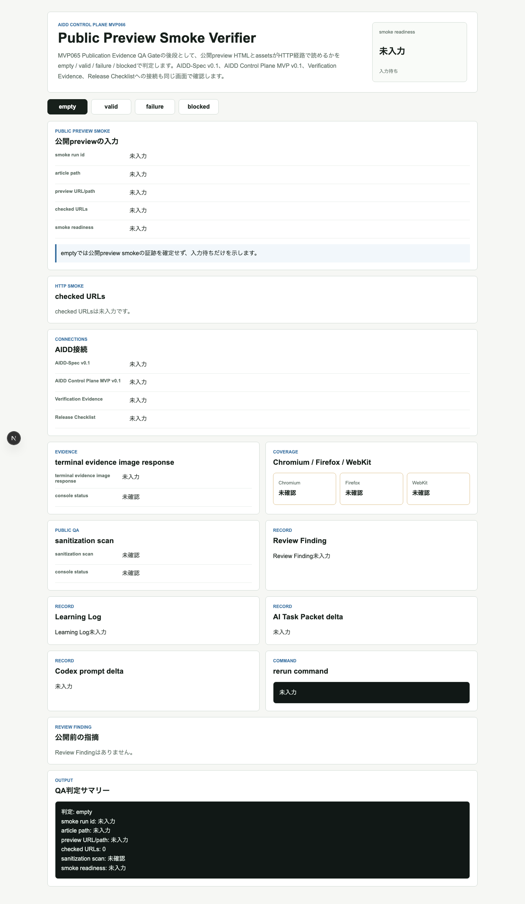
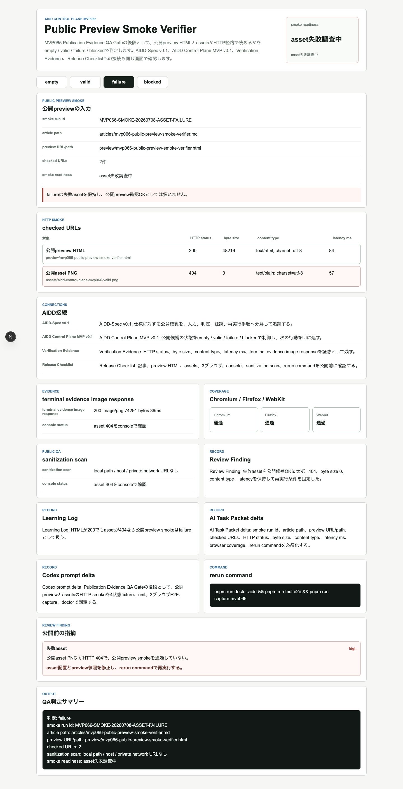
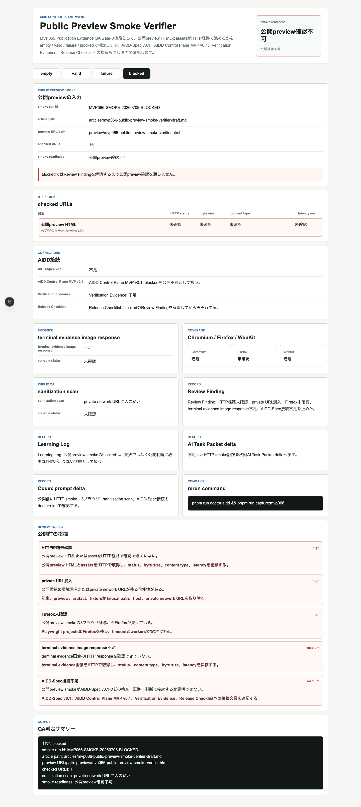
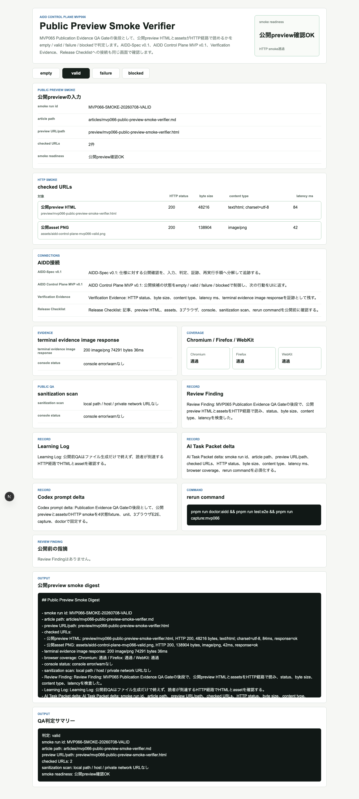

# 「画像はあるはず」を公開前に止める：Public Preview Smoke Verifierを作った

> 2026-07-08 / Codex Mastery Lab  
> 記事種別: Experiment / SaaS / Verification Evidence / Release Checklist  
> 将来の書籍章: 第10章 Verification Evidence、第12章 Release Checklist、第18章 AIDD Control PlaneのMVP

## 読者の悩み

AIに実装させ、テストも通し、記事も書いた。なのに公開previewを見ると、最後にこういう事故が起きます。

- Markdownでは画像pathが正しそうなのに、preview上では画像が出ない
- terminal evidence画像だけ404になる
- HTMLは表示されるが、assetが0 byteになっている
- 「ローカルでは見えた」を根拠に公開してしまう
- 失敗時に、どのURLが何byteで返ったのか残っていない

MVP065ではPublication Evidence QA Gateとして、公開前に記事・画像・terminal evidence・3ブラウザ・console・サニタイズを確認しました。今回のMVP066では、その次の一手として **Public Preview Smoke Verifier** を作りました。

たとえるなら、荷物リストに「財布」と書くだけではなく、出発前に実際に財布を手に取って中身を確認する作業です。記事内に画像リンクが書かれていることと、読者が見るpreview経路で画像が読めることは別物です。

## 今回の仮説

AIDD Control Planeが「誰でもベストに近いAI駆動開発フローと設計ドキュメントを作れるSaaS」になるには、成果物の存在確認だけでは足りません。

公開previewのHTMLとassetsについて、次を1画面で確認できれば、リンク切れや0 byte画像を公開前に止められるはずです。

- smoke run id
- article path
- preview URL/path
- checked URLs
- HTTP status
- byte size
- content type
- latency ms
- terminal evidence image response
- Chromium / Firefox / WebKit coverage
- console status
- sanitization scan
- Review Finding
- Learning Log
- AI Task Packet delta
- Codex prompt delta
- rerun command

## 実験内容

Codexへ渡したAI Task Packetは `experiments/2026-07-08-aidd-control-plane-mvp-066/AI_TASK_PACKET.md` に保存しました。実装対象は `generated-repo/` のNext.js + TypeScriptアプリです。

今回のUI状態は4つです。

| 状態 | 意味 | 確認したいこと |
| --- | --- | --- |
| empty | smoke対象が未選択 | 古いURLや前回記事を誤検査しない |
| valid | HTTP smoke通過 | HTML、asset、terminal evidence画像が200かつ非ゼロbyte |
| failure | asset失敗 | 404/0 byte/timeoutを隠さず修正指示へ戻す |
| blocked | 公開確認不可 | private URL、Firefox未確認、証跡不足、AIDD-Spec接続不足を止める |

## 画面キャプチャ

### empty: smoke対象がまだない



emptyは地味ですが重要です。前回のURLや画像を今回の検査結果のように見せないため、smoke run idとchecked URLsが未入力なら入力待ちにします。

### valid: preview HTMLとassetが読める


validでは、公開preview HTMLとasset PNGのHTTP status、byte size、content type、latency msを同じ表で確認できます。terminal evidence image responseも、単なるpathではなくresponseとして扱います。

### failure: HTMLが200でもasset 404なら止める



failureでは、HTMLが読めてもassetが404なら公開OKにしません。どのassetが何statusで、byte sizeがいくつだったかをReview Findingとして残し、rerun commandへ戻します。

### blocked: private URLや証跡不足を公開前に止める



blockedでは次の5件を止める条件にしました。

- HTTP経路未確認
- private URL混入
- Firefox未確認
- terminal evidence image response不足
- AIDD-Spec接続不足

### terminal evidence画像



## 失敗と修正

今回もCodex実行は成果物を作りましたが、こちらのジョブではCodexプロセスがtimeoutしました。そこでCodexの自己申告は採用せず、独立検証に切り替えました。

また、最初のlintログ保存コマンドでshellのpipe status取得に失敗しました。これはアプリ品質の失敗ではありませんが、証跡収集の手順ミスです。`bash -o pipefail -c 'command | tee log'` に直して、lint / typecheck / test / build / E2E / doctor / captureを個別に再実行しました。

## 検証ログ

独立検証として、次を個別ログに保存しました。

```text
pnpm install --frozen-lockfile: 成功
pnpm run lint: 成功
pnpm run typecheck: 成功
pnpm run test: 6 tests passed
pnpm run build: 成功
pnpm run test:e2e: Chromium / Firefox / WebKitで15 tests passed
pnpm run doctor:aidd: 成功
pnpm run capture:mvp066: 成功
```

E2Eは3ブラウザを外さずに通しました。

```text
15 passed (17.5s)
```

## 読者が使えるチェックリスト

| チェック項目 | 何を確認したいのか | なぜ必要か |
| --- | --- | --- |
| preview HTMLのHTTP status | 読者が記事previewに到達できるか | Markdown上の存在確認だけでは公開経路を保証できない |
| assetのbyte size | 画像が0 byteでないか | 画像リンクがあっても中身が空なら証跡にならない |
| content type | PNGやHTMLとして返っているか | 404ページやtext/plainを画像証跡と誤認しないため |
| terminal evidence image response | terminal証跡画像が読めるか | 「ログはあるはず」を公開前に止めるため |
| 3ブラウザcoverage | Chromiumだけで済ませていないか | 1ブラウザだけの確認を過信しないため |
| sanitization scan | local pathやprivate URLがないか | 公開物に環境情報を混ぜないため |
| rerun command | 失敗時に何を再実行するか | 失敗を次の行動へ戻すため |

## SaaS/AIDD-Specへの接続

AIDD-Spec v0.1では、Verification Evidenceを「実行したと言える証拠」として扱います。MVP066はその中でも、公開previewのHTTP smokeを証跡化する部品です。

AIDD Control Plane SaaSとしては、Publication Evidence QA Gateの後ろにこのSmoke Verifierを置くことで、記事化直前の最後の健康チェックをUI化できます。AIに記事を量産させるのではなく、実験した本人しか持っていない一次情報を壊さず届けるための機能です。

## 次回

次回は、MVP066のsmoke結果を公開可否の手動判断だけで終わらせず、失敗assetを自動でReview Finding Action Queueへ戻す流れを進めます。つまり「どのリンクが壊れたか」から「次のAI Task Packetに何を入れるか」までをもう一段つなげます。
