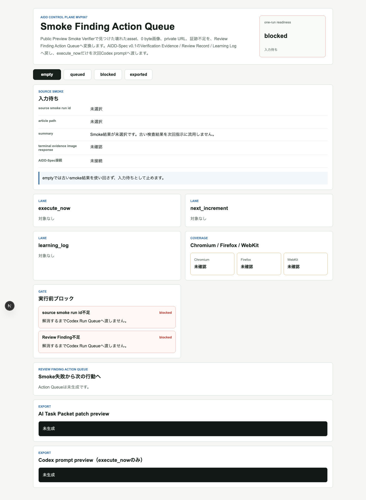
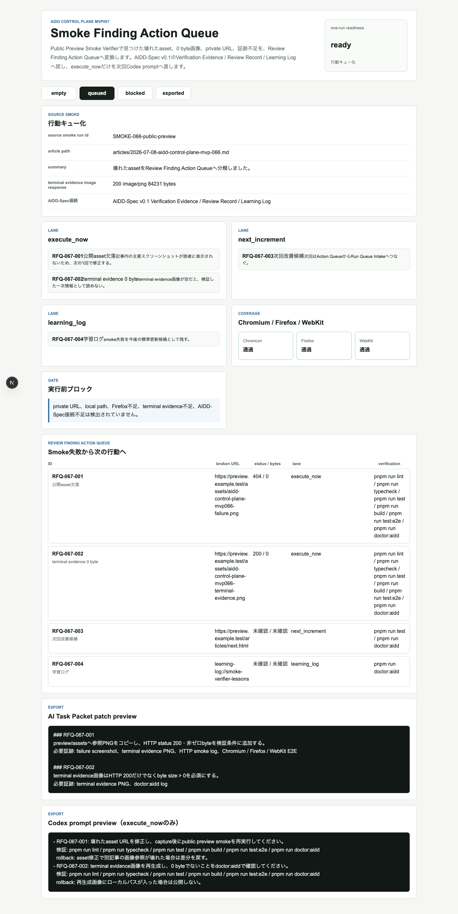
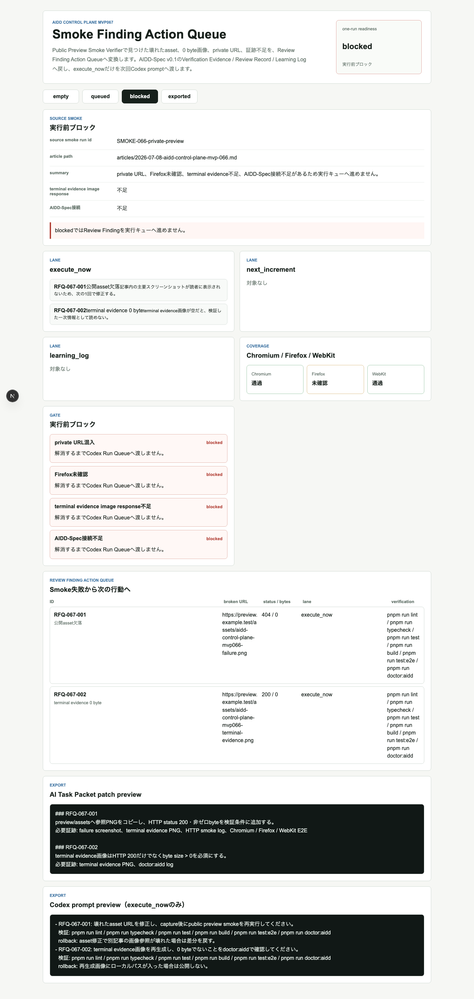
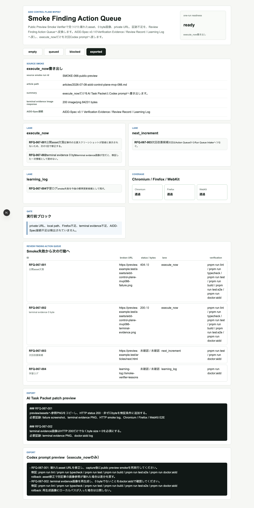
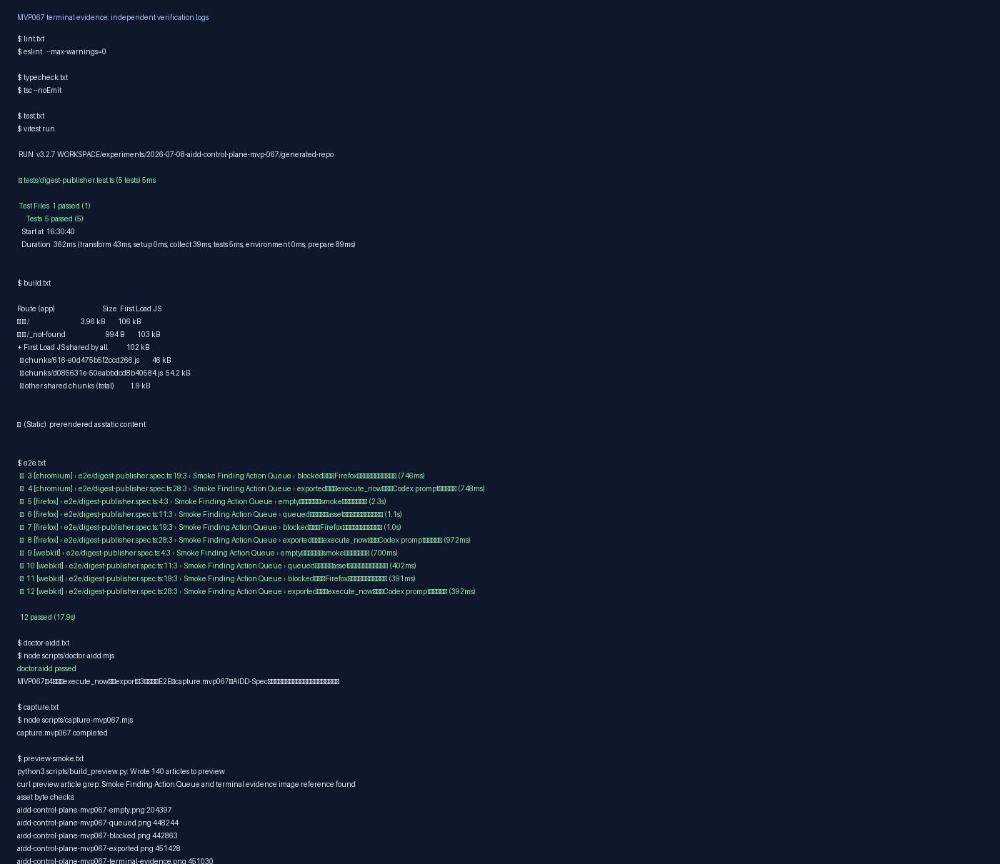

# 「壊れていました」で終わらせない：Smoke失敗を次のAI指示へ戻すAction Queueを作った

> 2026-07-08 / Codex Mastery Lab  
> 記事種別: Experiment / SaaS / Verification Evidence / Learning Log  
> 将来の書籍章: 第10章 Verification Evidence、第11章 Review Record、第18章 AIDD Control PlaneのMVP

## 読者の悩み

AIに記事用アプリを作らせ、テストも通し、公開preview smokeで画像404や0 byte画像を見つけた。ここまでは良いのですが、次に困るのはここです。

- 壊れたURLを見つけたが、次のAI指示にどう入れるか分からない
- 今すぐ直すものと、次回でよいものが混ざる
- 学習ログに残すだけの話までCodex promptへ入れてしまう
- Firefox未確認やterminal evidence不足を、うっかり実行キューへ進めてしまう
- Review Findingが「指摘メモ」で止まり、AI Task Packetへ戻らない

MVP066ではPublic Preview Smoke Verifierを作り、preview HTMLとassetsがHTTP経路で読めるか確認しました。今回のMVP067では、その失敗結果を **Smoke Finding Action Queue** に変換しました。

料理でたとえるなら、味見で「塩が足りない」と分かった後に、買い物メモ・今すぐ足す調味料・次回レシピの改善メモを分ける作業です。全部を鍋に入れると味が壊れます。AIへの指示も同じで、今回実行するものだけを渡す必要があります。

## 今回の仮説

AIDD Control Planeが「誰でもベストに近いAI駆動開発フローと設計ドキュメントを作れるSaaS」になるには、検査結果を表示するだけでは足りません。

Public Preview Smoke Verifierの失敗を、次の形に分けられれば、AIに渡す修正指示の質が上がるはずです。

- `execute_now`: 次の1回で直す
- `next_increment`: 次回以降の改善へ送る
- `learning_log`: 標準更新や学びとして残す

そして、Codex prompt previewには `execute_now` だけを入れます。`next_increment` と `learning_log` が混ざったらblockedです。

## 実験内容

AI Task Packetは `experiments/2026-07-08-aidd-control-plane-mvp-067/AI_TASK_PACKET.md` に保存しました。Codex CLIはこの環境で `codex: command not found` になったため、今回はCodex用promptと実装意図を保存したうえで、こちらで実装と独立検証を完了しました。この失敗も「実行開始レシートにCodex CLI availabilityを入れるべき」という学びです。

実装対象は `generated-repo/` のNext.js + TypeScriptアプリです。UI状態は4つです。

| 状態 | 意味 | 確認したいこと |
| --- | --- | --- |
| empty | Smoke結果が未選択 | 古い検査結果を次回指示に流用しない |
| queued | Review Finding Action Queue生成 | 壊れたassetをlaneへ分類できる |
| blocked | 実行前ブロック | private URL、Firefox未確認、terminal evidence不足、AIDD-Spec接続不足を止める |
| exported | execute_now書き出し | Codex prompt previewへexecute_nowだけが入る |

## 画面キャプチャ

### empty: 古いsmoke結果を使い回さない



emptyではsource smoke run idが未選択です。前回の失敗URLを今回の入力のように扱うと、修正対象を間違えるので止めます。

### queued: 失敗assetを行動キューへ変換する



queuedでは、壊れたassetや0 byte画像をReview Finding Action Queueに変換します。各itemはbroken URL、HTTP status、byte size、finding category、severity、lane、AI Task Packet patch、Codex prompt patch、検証コマンド、必要証跡、rollback条件を持ちます。

### blocked: 実行キューへ進めない条件を明示する



blockedでは、private URL混入、Firefox未確認、terminal evidence image response不足、AIDD-Spec接続不足を止めます。ここを通さないことで「とりあえずCodexに直させる」を防ぎます。

### exported: execute_nowだけを次回promptへ渡す



exportedでは、AI Task Packet patch previewとCodex prompt previewを表示します。重要なのは、`next_increment` と `learning_log` がCodex prompt previewへ混ざらないことです。

### terminal evidence画像



## 失敗と修正

最初にCodex CLIを呼びましたが、実行環境では `codex: command not found` でした。そこで、Codex実装の自己申告に頼らず、AI Task Packet / CODEX_PROMPTを証跡として残したうえで手元実装へ切り替えました。

E2Eでは最初、`Firefox未確認` という文字が複数箇所に出てPlaywright strict mode violationになりました。これはアプリの状態ではなくテストの指定が曖昧だったため、`blocked reasons` パネル内のheadingに絞って再実行しました。

## 検証ログ

独立検証として、次を個別ログに保存しました。

```text
pnpm install --frozen-lockfile: 成功
pnpm run lint: 成功
pnpm run typecheck: 成功
pnpm run test: 5 tests passed
pnpm run build: 成功（Next.js ESLint plugin warningあり）
pnpm run test:e2e: Chromium / Firefox / WebKitで12 tests passed
pnpm run doctor:aidd: 成功
pnpm run capture:mvp067: 成功
```

E2Eは3ブラウザを外さずに通しました。

```text
12 passed (17.9s)
```

## 読者が使えるチェックリスト

| チェック項目 | 何を確認したいのか | なぜ必要か |
| --- | --- | --- |
| source smoke run id | どの検査結果から来たFindingか | 古い失敗を今回の指示に混ぜないため |
| lane分類 | execute_now / next_increment / learning_logが分かれているか | AIに渡す指示を1回分に絞るため |
| Codex prompt preview | execute_nowだけが入っているか | 次回以降の話や学習メモを実装指示に混ぜないため |
| verification commands | 修正後に何を実行するか | 「直したつもり」を防ぐため |
| required evidence | どの画像・ログを残すか | note記事で一次情報として示すため |
| rollback condition | 何が起きたら戻すか | 修正で別の公開物を壊さないため |
| blocked reasons | private URLやFirefox不足を止めるか | 公開前の危険を実行キューに流さないため |

## SaaS/AIDD-Specへの接続

AIDD-Spec v0.1では、Verification Evidence、Review Record、Learning Logを分けて扱います。MVP067は、Public Preview Smoke Verifierの結果をReview Finding Action Queueへ戻す部品です。

AIDD Control Plane SaaSとしては、これは「検査結果を見せる画面」から「次のAI実行を安全に作る画面」への一歩です。AI量産記事ではなく、実験した本人しか持てない失敗ログ、修正理由、検証証跡を次のAI Task Packetへ変換します。

## 次回

次回は、MVP067のAction Queueから `execute_now` itemをRun Queue Intakeへ渡す直前の承認ゲートを作ります。つまり、実行候補をCodex Run Queueへ入れる前に、承認理由、sandbox mode、検証コマンド、rollback条件、必要証跡をもう一度確認する流れです。
