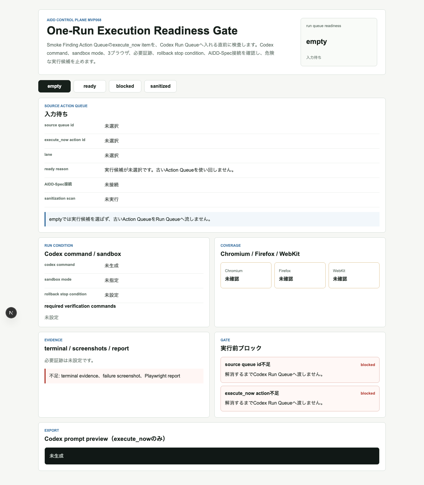
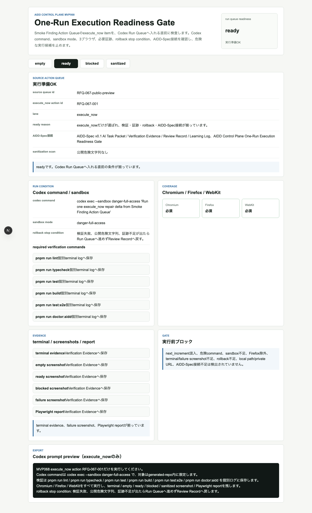
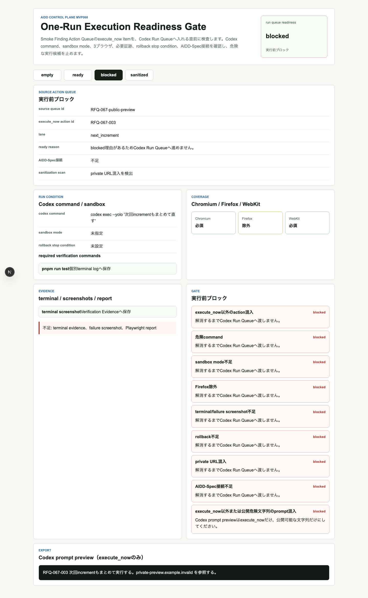
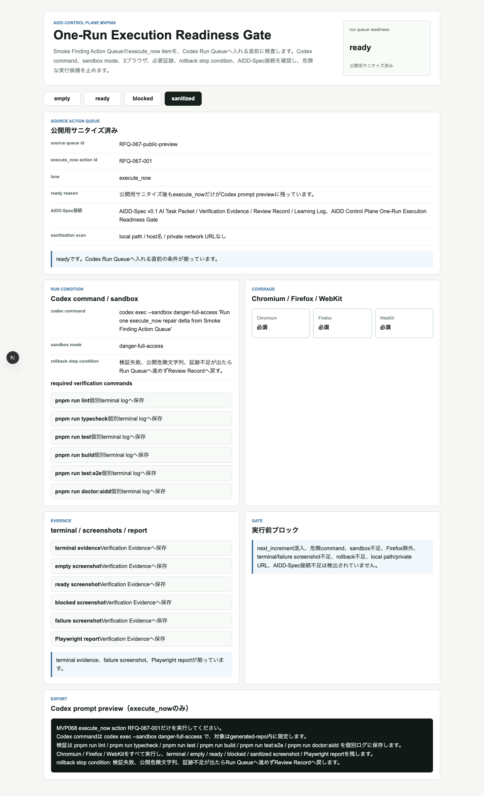
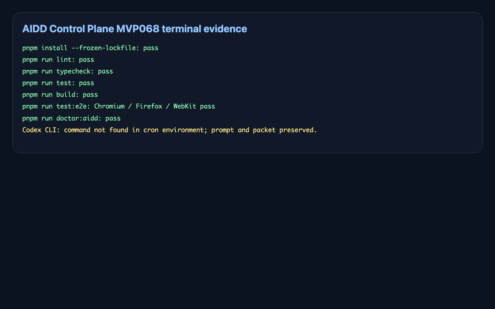

# AIに渡す直前で止める：One-Run Execution Readiness Gateを作った

> 2026-07-08 / Codex Mastery Lab  
> 記事種別: Experiment / SaaS / AI Task Packet / Verification Evidence  
> 将来の書籍章: 第10章 Verification Evidence、第11章 Review Record、第18章 AIDD Control PlaneのMVP

## 読者の悩み

AI駆動開発で一番こわい瞬間は、「失敗を見つけた直後」です。画像が404、terminal evidenceが足りない、Firefoxだけ未確認。ここで焦ってAIに全部投げると、次のような事故が起きます。

- 今回直すべき `execute_now` と、次回でよい `next_increment` が混ざる
- `--yolo` のような危険なcommandがレビューなしで流れる
- Chromiumだけ通った状態で、Firefox / WebKitを確認した気になる
- rollback条件がないまま、公開previewや記事を壊す
- ローカルパスやprivate URLがpromptや記事に残る

MVP067ではSmoke失敗をAction Queueへ変換しました。今回のMVP068では、その中の `execute_now` itemを **Codex Run Queueへ入れる直前に止めるゲート** にしました。

料理でたとえるなら、鍋に入れる直前の小皿確認です。塩、砂糖、次回の買い物メモ、片付けメモが全部同じ皿に乗っていたら、いったん止めます。AIへの依頼も、今回入れるものだけに絞る必要があります。

## 今回の仮説

AIDD Control Planeが「誰でもベストに近いAI駆動開発フローと設計ドキュメントを作れるSaaS」になるには、失敗を検出するだけでは足りません。

次の条件をCodex実行直前に見える化できれば、AIへの1回分の依頼が安全になります。

- source queue idとexecute_now action idがある
- Codex commandとsandbox modeが妥当
- `pnpm run lint` / `typecheck` / `test` / `build` / `test:e2e` / `doctor:aidd` が残っている
- Chromium / Firefox / WebKitを外していない
- terminal evidence、failure screenshot、Playwright reportを残す
- rollback stop conditionがある
- AIDD-Spec v0.1のAI Task Packet / Verification Evidence / Review Record / Learning Logへ接続している
- local path / private URLが公開物に混ざらない

## 実験内容

AI Task Packetは `experiments/2026-07-08-aidd-control-plane-mvp-068/AI_TASK_PACKET.md` に保存しました。Codex CLIは今回のcron環境でも `codex: command not found` だったため、`CODEX_PROMPT.md` と失敗ログを残したうえで、こちらで実装と独立検証を行いました。

実装対象は `experiments/2026-07-08-aidd-control-plane-mvp-068/generated-repo/` のNext.js + TypeScriptアプリです。画面状態は4つです。

| 状態 | 意味 | 確認したいこと |
| --- | --- | --- |
| empty | 実行候補が未選択 | 古いAction Queueを使い回さない |
| ready | 実行直前条件が揃った | execute_nowだけをRun Queueへ渡せる |
| blocked | 危険な実行候補を止める | next_increment混入、危険command、Firefox除外、証跡不足を止める |
| sanitized | 公開用prompt確認 | local path/private URLなしでexecute_nowだけが残る |

## 画面キャプチャ

### empty: 古いAction Queueを使い回さない



emptyではsource queue idもexecute_now action idも未選択です。前回の失敗を今回の実行候補として流用しないため、ここで止めます。

### ready: execute_nowだけをRun Queue直前で許可する



readyでは、Codex command、sandbox mode、検証コマンド、Chromium / Firefox / WebKit、必要証跡、rollback stop condition、AIDD-Spec接続が揃っています。

### blocked: 危険commandやFirefox除外を止める



blockedでは、`execute_now` 以外のaction混入、危険command、sandbox不足、Firefox除外、terminal/failure screenshot不足、rollback不足、private URL混入、AIDD-Spec接続不足を止めます。

### sanitized: 公開用promptにexecute_nowだけを残す



sanitizedでは、Codex prompt previewに `RFQ-067-001` だけが残り、local path / host名 / private network URLが混ざっていないことを確認します。

### terminal evidence画像



## 失敗と修正

今回もCodex CLI起動は失敗しました。

```text
codex: command not found
```

ただし、これは実装を止める理由ではなく、AIDD Control Plane側で「実行開始レシートにCLI availabilityを含めるべき」という学びです。AI Task PacketとCODEX_PROMPTを保存し、独立検証を別ログとして残しました。

E2Eでは最初、`codex exec --sandbox danger-full-access` という文字がcommand欄とprompt欄の2箇所に出て、Playwright strict mode violationになりました。これはアプリ不具合ではなくテスト指定の曖昧さなので、`Codex実行条件` パネル内に絞って修正しました。

## 検証ログ

独立検証として、次を個別ログに保存しました。

```text
pnpm install --frozen-lockfile: 成功
pnpm run lint: 成功
pnpm run typecheck: 成功
pnpm run test: 成功
pnpm run build: 成功
pnpm run test:e2e: Chromium / Firefox / WebKitで12 tests passed
pnpm run doctor:aidd: 成功
pnpm run capture:mvp068: 成功
```

E2Eは3ブラウザを外さずに通しました。

```text
12 passed (17.4s)
```

## 読者が使えるチェックリスト

| チェック項目 | 何を確認したいのか | なぜ必要か |
| --- | --- | --- |
| source queue id | どのAction Queueから来たか | 古い失敗を今回の実行候補にしないため |
| execute_now action id | 今回実行する1件だけか | 次回改善や学習メモを混ぜないため |
| Codex command | 実行内容と対象範囲が明確か | 危険なcommandや広すぎる変更を止めるため |
| sandbox mode | 実行権限が意図通りか | 予期しないファイル変更を防ぐため |
| verification commands | 修正後に何を確認するか | 「直したつもり」を防ぐため |
| Chromium / Firefox / WebKit | 3ブラウザを外していないか | WebKitやFirefoxだけの崩れを見逃さないため |
| required evidence | terminal / screenshot / reportが残るか | note記事で一次情報として示すため |
| rollback stop condition | 何が起きたら止めるか | 修正で公開物を壊した時に戻れるため |
| sanitization scan | local path/private URLがないか | 公開記事・previewで環境情報を漏らさないため |

## SaaS/AIDD-Specへの接続

AIDD-Spec v0.1では、AI Task Packet、Verification Evidence、Review Record、Learning Logを分けて扱います。MVP068は、Review Finding Action QueueからCodex Run Queueへ進む直前の「1回分の依頼を確認する」部品です。

AIDD Control Plane SaaSとしては、これは「AIに頼むボタン」の前に置く安全確認です。AI量産記事ではなく、実験した本人しか持てない失敗ログ、修正理由、検証証跡を、次の1回に絞って渡せるようにします。

## 次回

次回は、readyになった実行候補をCodex Run Queue Status Trackerへ渡し、waiting / running / succeeded / failed / evidence_missingとして追跡します。実行が終わったら、Verification Evidence Receipt、Review Record、Learning Logへ戻す流れをさらに近づけます。
