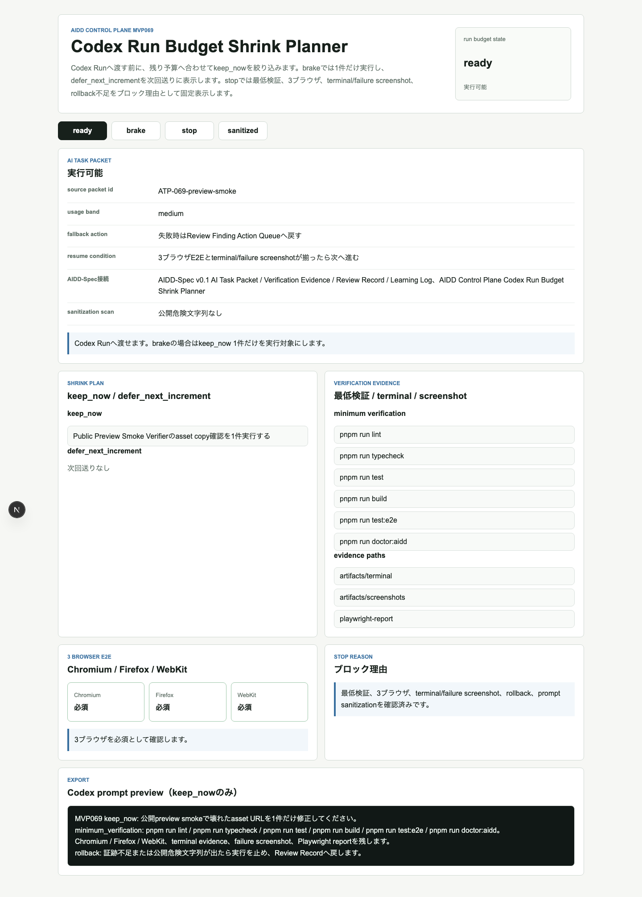
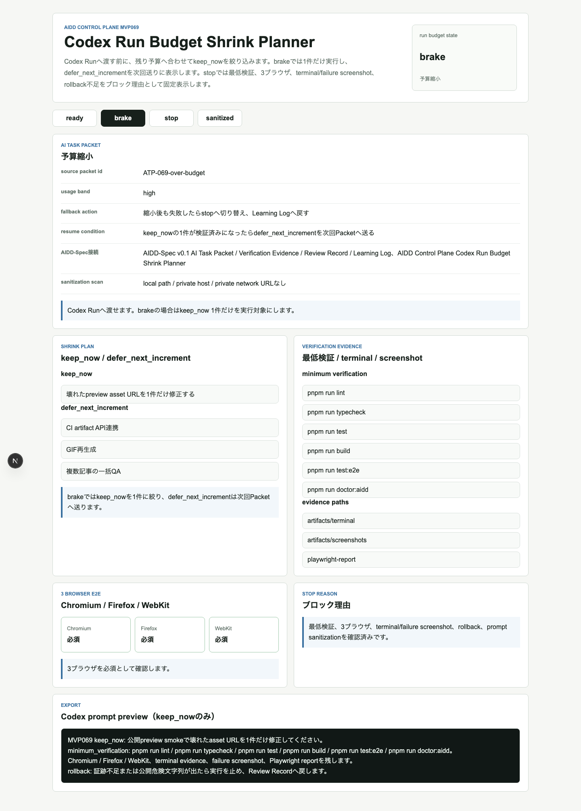
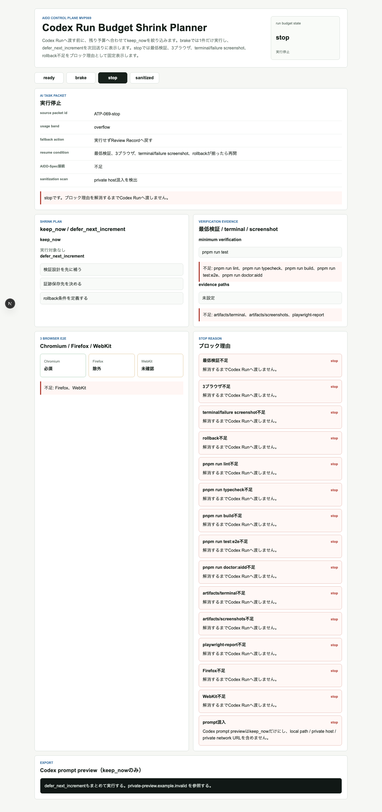
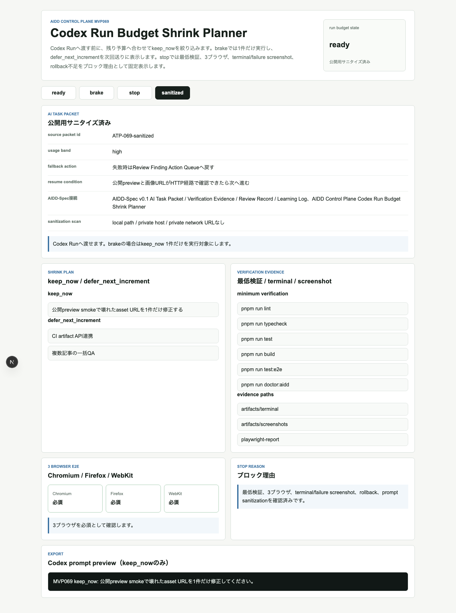
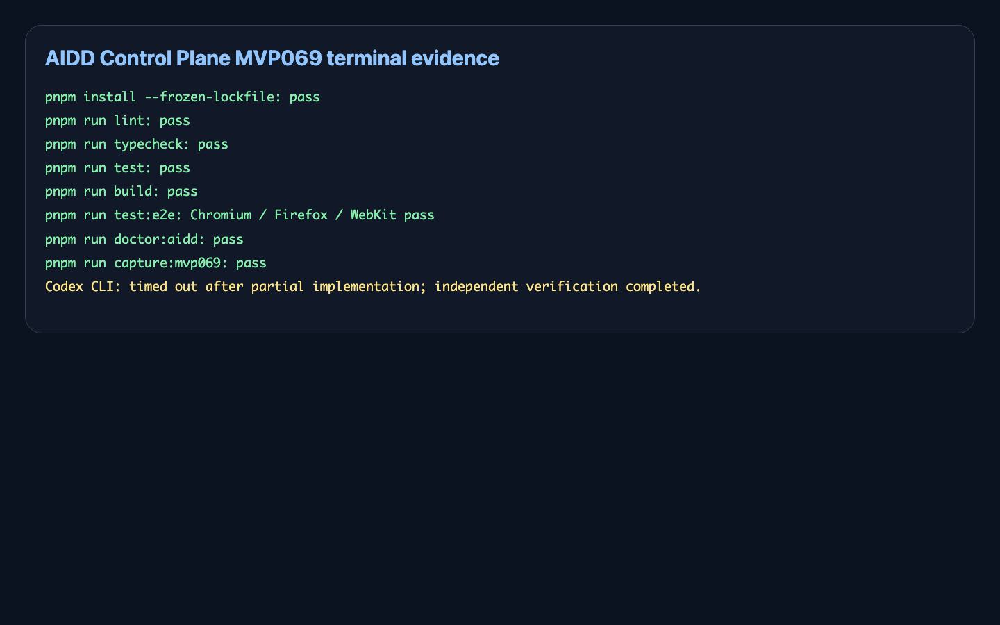

# AIへの依頼が大きすぎる時に畳む：Codex Run Budget Shrink Plannerを作った

> 2026-07-08 / Codex Mastery Lab  
> 記事種別: Experiment / SaaS / AI Task Packet / Verification Evidence  
> 将来の書籍章: 第9章 AI Task Packet、第10章 Verification Evidence、第18章 AIDD Control PlaneのMVP

## 読者の悩み

AI駆動開発でよくある失敗は、「ついでにこれも」と依頼を大きくしてしまうことです。preview画像の404を直すだけのはずが、CI連携、GIF再生成、複数記事QAまで同じpromptに入る。すると、AIは動いても検証が薄くなり、証跡も残りません。

MVP068では、Codexへ渡す直前に危険な実行候補を止めるOne-Run Execution Readiness Gateを作りました。今回のMVP069では、止めるだけでなく、**今回やる最小単位へ畳む** UIを作りました。

料理でたとえるなら、買い物リスト全部を今夜の鍋に入れない判断です。今日入れる具材、明日買うもの、足りない調味料を分けます。AIへの依頼も同じで、今やる`keep_now`と次回へ送る`defer_next_increment`を分ける必要があります。

## 今回の仮説

AIDD Control Planeが「誰でもベストに近いAI駆動開発フローと設計ドキュメントを作れるSaaS」になるには、実行前ブロックだけでは足りません。

- 予算内ならreadyとして実行する
- 大きすぎるならbrakeとして`keep_now`だけに縮小する
- 最低検証や証跡が足りないならstopで止める
- 公開用promptはlocal path / private host / private network URLを消し、`keep_now`だけにする

この4状態を見える化できれば、AIに渡す1回分の依頼が小さく、検証可能になります。

## 実験内容

AI Task Packetは `experiments/2026-07-08-aidd-control-plane-mvp-069/AI_TASK_PACKET.md` に保存しました。Codex CLIは今回は起動できましたが、120秒でtimeoutし、実装途中の差分だけが残りました。そのため、Codexの自己申告は採用せず、こちらで不足ファイルを補い、独立検証をやり直しました。

実装対象は `experiments/2026-07-08-aidd-control-plane-mvp-069/generated-repo/` のNext.js + TypeScriptアプリです。

| 状態 | 意味 | 確認したいこと |
| --- | --- | --- |
| ready | 予算内で実行可能 | minimum verification、3ブラウザ、証跡、rollbackが揃う |
| brake | 大きすぎる依頼を縮小 | keep_nowを1件にし、defer_next_incrementを次回送りにする |
| stop | 実行停止 | 最低検証、3ブラウザ、terminal/failure screenshot、rollback不足を止める |
| sanitized | 公開用prompt確認 | private hostやlocal pathなしでkeep_nowだけが残る |

## 画面キャプチャ

### ready: 予算内で実行できる



readyでは、source packet id、usage band、minimum verification、Chromium / Firefox / WebKit、evidence pathsが揃っています。

### brake: 大きすぎる依頼を1件へ畳む



brakeでは、壊れたpreview asset URLの修正だけを`keep_now`に残し、CI artifact API連携や複数記事QAを`defer_next_increment`へ送ります。

### stop: 証跡不足やrollback不足を止める



stopでは、最低検証不足、3ブラウザ不足、terminal/failure screenshot不足、rollback不足、prompt混入を止めます。

### sanitized: 公開用promptにkeep_nowだけを残す



sanitizedでは、Codex prompt previewから`defer_next_increment`とprivate hostを消し、`keep_now`だけを表示します。

### terminal evidence画像



## 失敗と修正

Codex CLIは途中まで実装しましたが、今回のcron実行では120秒でtimeoutしました。

```text
Command timed out after 120s
```

これは失敗として記録しました。UIの主要差分は残っていたため、テスト、doctor、capture、docsをこちらで補いました。

もう1つの失敗は、brake状態をブロック理由として扱ってしまい、run stateが`stop`になったことです。brakeは「止める」ではなく「縮小して進める」状態なので、`実行予算超過のためkeep_nowへ縮小`をhard blockerから除外しました。

## 検証ログ

独立検証として、次を個別ログに保存しました。

```text
pnpm install --frozen-lockfile: 成功
pnpm run lint: 成功
pnpm run typecheck: 成功
pnpm run test: 7 tests passed
pnpm run build: 成功
pnpm run test:e2e: Chromium / Firefox / WebKitで12 tests passed
pnpm run doctor:aidd: 成功
pnpm run capture:mvp069: 成功
```

E2Eは3ブラウザを外さずに通しました。

```text
12 passed (16.1s)
```

## 読者が使えるチェックリスト

| チェック項目 | 何を確認したいのか | なぜ必要か |
| --- | --- | --- |
| usage band | 今回の依頼が大きすぎないか | 大きすぎると検証と証跡が薄くなるため |
| keep_now | 今回やる1件が明確か | AIに渡す作業を小さくするため |
| defer_next_increment | 次回送りをpromptに混ぜていないか | ついで修正で品質を落とさないため |
| minimum verification | 最低限の検証を消していないか | 縮小しても品質ゲートを残すため |
| 3 browser | Chromium / Firefox / WebKitを外していないか | ブラウザ差分を見落とさないため |
| evidence paths | terminal、screenshots、reportが残るか | 後からレビューできる一次情報にするため |
| sanitization scan | local pathやprivate hostがないか | 公開記事とpreviewの漏えいを防ぐため |
| resume condition | いつ次へ進むか | 止めっぱなしにしないため |

## SaaS/AIDD-Specへの接続

今回のMVP069は、`standards/aidd-control-plane-mvp-v0.1.md` の **Codex Run Budget Shrink Planner** に対応します。AIDD-Spec v0.1では、AI Task Packetを作るだけでなく、Verification Evidence、Review Record、Learning Logへ戻すことが重要です。

AIDD Control Plane SaaSとしては、次の価値に近づきました。

- 実行前に依頼を小さく畳む
- 今回実行するものと次回送りを分ける
- 最低検証と証跡を消さない
- 公開用promptの危険文字列を止める
- 失敗をLearning Logへ戻す

## 次回

次は **Shrunk Packet Handoff Receipt** へ進めます。縮小後AI Task Packetを、実際にCodexへ渡す直前の手渡しレシートとして、承認者、理由、証跡保存先、rollback条件まで確認できるようにします。
