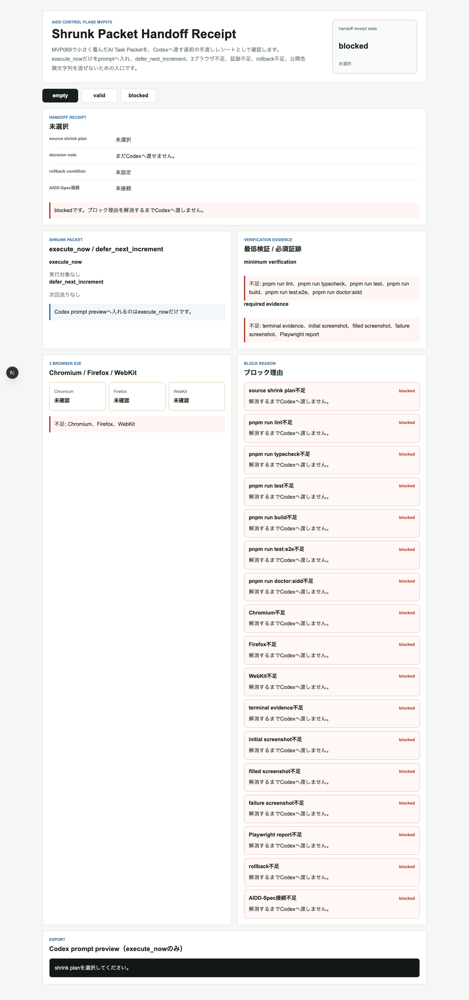
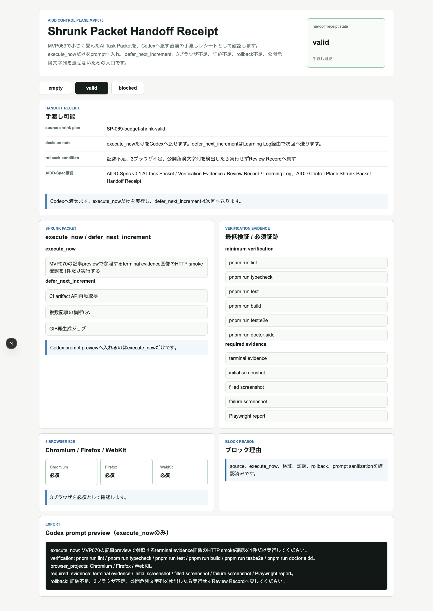
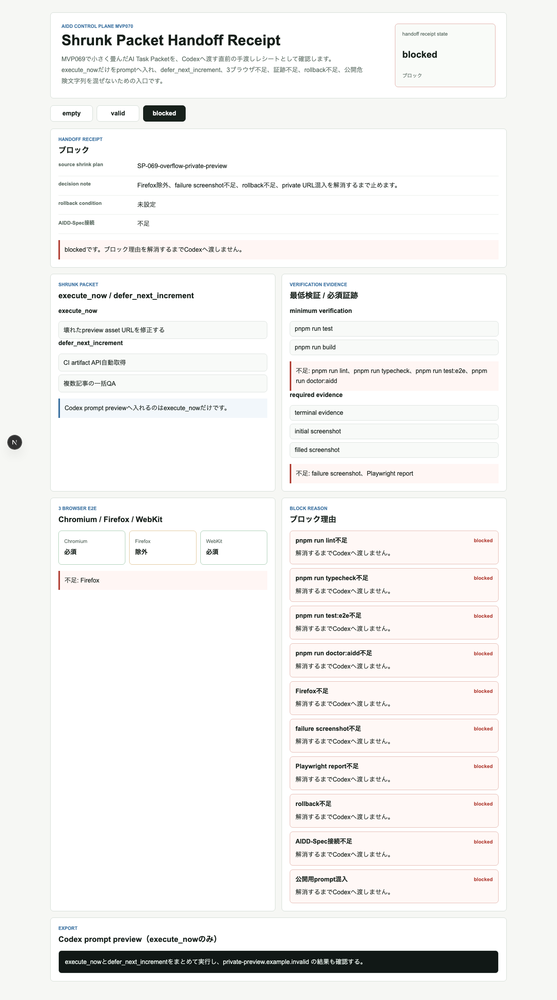
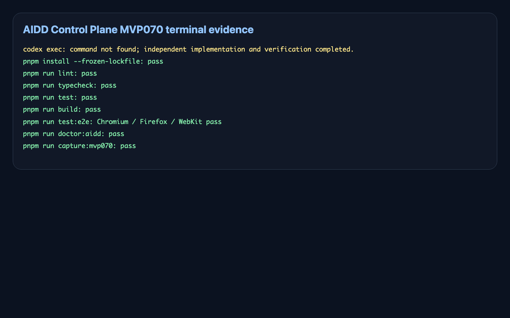

# 縮小したAI依頼を渡す直前に確認する：Shrunk Packet Handoff Receiptを作った

> 2026-07-08 / Codex Mastery Lab  
> 記事種別: Experiment / SaaS / AI Task Packet / Verification Evidence  
> 将来の書籍章: 第9章 AI Task Packet、第10章 Verification Evidence、第18章 AIDD Control PlaneのMVP

## 読者の悩み

AIに仕事を頼む前に「今回はここだけ」と絞ったはずなのに、最後のpromptへ次回送りの作業まで混ざってしまうことがあります。

MVP069では、大きすぎる依頼を`keep_now`と`defer_next_increment`へ分けるCodex Run Budget Shrink Plannerを作りました。今回のMVP070では、その縮小後packetをCodexへ渡す直前に、**本当に渡してよいかを1枚のレシートで確認する** UIを作りました。

日用品の買い物でたとえるなら、レジへ行く直前に「今日買うもの」「次回でよいもの」「財布」「レシート保存先」をもう一度見る作業です。AI駆動開発でも、execute_now、検証、証跡、rollbackを渡す直前に確認しないと、後でレビューできない実行になります。

## 今回の仮説

AIDD Control Planeが「誰でもベストに近いAI駆動開発フローと設計ドキュメントを作れるSaaS」になるには、縮小したAI Task Packetを作るだけでは足りません。

- source shrink planがある
- execute_nowだけがCodex promptへ入る
- defer_next_incrementは次回送りとして見えるが、promptへ混ざらない
- minimum verificationが消えていない
- Chromium / Firefox / WebKitが揃う
- terminal / initial / filled / failure / Playwright report証跡が揃う
- rollback conditionがある
- local path / private host / private network URLが混ざらない

この条件を手渡しレシートとして見せれば、AI実行前の「最後の確認漏れ」を減らせるはずです。

## 実験内容

AI Task Packetは `experiments/2026-07-08-aidd-control-plane-mvp-070/AI_TASK_PACKET.md` に保存しました。Codex CLIは今回のcron環境では見つからず、次のログを証跡として残しました。

```text
/bin/bash: line 2: codex: command not found
```

そのため、Codexの自己申告は使わず、こちらで実装し、独立検証を個別コマンドでやり直しました。実装対象は `experiments/2026-07-08-aidd-control-plane-mvp-070/generated-repo/` のNext.js + TypeScriptアプリです。

| 状態 | 意味 | 確認したいこと |
| --- | --- | --- |
| empty | shrink plan未選択 | source、検証、証跡、rollbackがないため渡せない |
| valid | 手渡し可能 | execute_nowだけをpromptに入れ、3ブラウザと証跡が揃う |
| blocked | 実行停止 | Firefox除外、failure screenshot不足、rollback不足、private URL混入を止める |

## 画面キャプチャ

### initial: まだ渡せない



initialでは、source shrink planが未選択です。何を渡すか決まっていないため、blockedになります。

### filled: execute_nowだけを渡せる



filledでは、source shrink plan、execute_now、defer_next_increment、minimum verification、3ブラウザ、required evidence、rollback condition、AIDD-Spec接続が揃っています。Codex prompt previewにはexecute_nowだけを入れます。

### failure: 渡す直前に止める



failureでは、Firefox不足、failure screenshot不足、rollback不足、公開用prompt混入を表示します。ここで止めることで、実行後に「証跡がない」「Firefoxを見ていない」と気づく事故を減らします。

### terminal evidence画像



## 失敗と修正

今回の失敗は2つあります。

1つ目は、Codex CLIがcron環境で見つからなかったことです。これは隠さず `artifacts/terminal/codex-exec.txt` に残しました。

2つ目は、最初のE2EでPlaywrightのstrict modeに引っかかったことです。`valid`という文字がボタンとステータスの2箇所にあり、locatorが曖昧でした。また、`failure screenshot不足`も説明文と見出しの2箇所にありました。

修正として、E2Eを「AIDD Control Plane MVP070のhero内のvalid」「見出しとしてのfailure screenshot不足」のように、確認対象を絞りました。これはAIDD-Spec的にも重要です。人間が読めるUIでも、テストが曖昧なら証跡として弱くなります。

## 検証ログ

独立検証として、次を個別ログに保存しました。

```text
pnpm install --frozen-lockfile: 成功
pnpm run lint: 成功
pnpm run typecheck: 成功
pnpm run test: 4 tests passed
pnpm run build: 成功
pnpm run test:e2e: Chromium / Firefox / WebKitで9 tests passed
pnpm run doctor:aidd: 成功
pnpm run capture:mvp070: 成功
```

E2Eは3ブラウザを外さずに通しました。

```text
9 passed (14.6s)
```

## 読者が使えるチェックリスト

| チェック項目 | 何を確認したいのか | なぜ必要か |
| --- | --- | --- |
| source shrink plan | どの縮小計画から来た依頼か | 後から判断理由を追えるようにするため |
| execute_now | 今回AIへ渡す1件が明確か | 大きすぎる依頼を再発させないため |
| defer_next_increment | 次回送りがpromptに混ざっていないか | ついで修正で検証を薄くしないため |
| minimum verification | lint/typecheck/test/build/e2e/doctorが残っているか | 小さくしても品質ゲートを消さないため |
| 3 browser | Chromium / Firefox / WebKitが揃うか | ブラウザ差分を見落とさないため |
| required evidence | terminal、initial、filled、failure、reportが残るか | note記事とレビューの一次情報にするため |
| rollback condition | 止める条件が書かれているか | 失敗時に無理に続けないため |
| prompt sanitization | local path / private host / private network URLがないか | 公開previewや記事への漏えいを防ぐため |

## SaaS/AIDD-Specへの接続

今回のMVP070は、`standards/aidd-control-plane-mvp-v0.1.md` の **Shrunk Packet Handoff Receipt** に対応します。

AIDD-Spec v0.1では、AI Task Packetを作るだけでなく、Verification Evidence、Review Record、Learning Logへ戻すことが重要です。今回のレシートは、AIへ渡す直前にそれらが欠けていないかを確認する画面です。

SaaSとしては、次の価値に近づきました。

- 大きすぎる依頼を縮小した後、最後にもう一度確認できる
- execute_nowとdefer_next_incrementを混ぜない
- 3ブラウザ、証跡、rollbackを実行前に見える化する
- 公開危険文字列をprompt段階で止める
- 失敗をReview Record / Learning Logへ戻せる

## 次回

次は **Handoff Decision Ledger** へ進めます。手渡しレシートを見た後、承認、保留、ブロックのどれにするかをReview Recordとして残し、未承認の実行がRun Queueへ入らないようにします。
