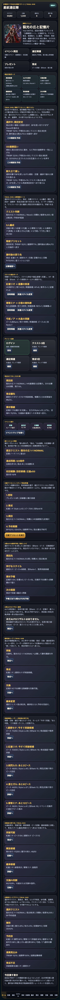
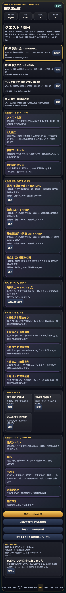

# SagaForge Trial 049: 出撃確認シートで「周回前に判断する」手触りを足す

前回までのSagaForgeは、初期の「一般的なファンタジーRPGの見た目」からはかなり離れ、ホーム、スタイル、5人編成、陣形、クエスト、戦闘、OD風連携、ガチャ、遠征、育成、交換所を持つプレイアブルになった。

ただし、ユーザーが期待している体験パターンとの差分はまだ残っている。特に前回までの弱点は、**クエストへ行く前の判断が分散していた**ことだった。

## 前回の何が期待体験から遠かったか

- ホーム、スタイル、編成、クエスト、戦術プリセットはあるが、出撃直前に「この5人で、この弱点に、この予約BPで行けるか」を一目で確認しづらかった。
- 周回目的が、育成・ピース・交換・星ミッション・召喚Ptに分かれており、スマホRPGらしい「次の1周で何を伸ばすか」の見え方がまだ弱かった。
- 戦術プリセットは追加したが、クエスト選択と勝利後の戻り先までを1枚にまとめるところまでは届いていなかった。

## 今回潰した差分

Trial 049では、プレイアブル版に **出撃確認シート** を追加した。

確認シートにまとめた情報は次の通り。

| 項目 | 追加した意味 |
|---|---|
| クエスト判断 | Wave数、消費スタミナ、推奨戦力、弱点、出撃可否をまとめる |
| 5人編成 | 陣形、5人のスタイル、武器種、総戦力をまとめる |
| 戦術プリセット | 周回安定/OD狙い/耐久の選択、予約BP、連携率、次の導線をまとめる |
| 勝利後の戻り先 | 育成候補、記憶片、召喚Pt、星ミッションをまとめる |

これにより、クエスト画面は単なる一覧ではなく、出撃前に「この周回は何のために行くのか」を確認する画面へ少し近づいた。

## プレイアブルで確認できること





公開プレイアブルでは、次の順で確認できる。

1. ホームの「Trial 049: 出撃確認シート」を見る。
2. 「出撃確認へ」を押してクエスト画面へ移動する。
3. クエストを選び、出撃確認シートの弱点・戦力・予約BP・連携率・戻り先が変わることを確認する。
4. 戦術プリセットを切り替えると、予約BPや連携率の見え方が変わり、戦闘へつながる。

公開プレイアブルは、今回のレポート本文でURLを示す。記事本文ではホスト名を固定せず、プレビュー配下の相対リンクとして扱う。

## AIDD Control Planeとしての学び

今回の修正は「画面を増やす」ではなく、**分散している情報を、プレイヤーの次の判断へ変換する**ための修正だった。

```text
観測された不足
  -> クエスト、5人編成、BP、OD、育成候補、報酬が別々に見える
理想状態
  -> 出撃前に、1枚の確認シートで周回目的と準備状態が分かる
修正指示
  -> ホームとクエストに出撃確認シートを追加し、選択クエスト/編成/戦術/報酬戻り先を動的に表示する
必要な上流情報
  -> 出撃前確認契約、クエスト弱点、スタイル役割、戦術プリセット、勝利後ループ
検証
  -> HTML構文確認、preview再生成、ローカルHTTP確認、公開URL確認
```

## まだ遠い点

まだ、期待されるキャラ収集RPG体験から遠い点はある。

- スタイルごとの長期育成差、継承技の使い分け、技Rank上昇の気持ちよさはまだカード説明寄り。
- 戦闘演出は抽象カード中心で、スマホRPGらしい「間」「連撃の爽快感」「報酬演出」は不足している。
- クエスト周回のテンポは改善しているが、イベント交換、ミッション、図鑑、育成がもっと自然に循環する余地がある。
- ガチャ結果からの所持図鑑・ピース変換・突破・編成おすすめは、さらに満足感を強められる。

## 次に潰す差分

次回は、出撃確認シートを土台にして、次の差分を潰す。

- クエスト選択時に「推奨戦術プリセット」を自動提案する。
- 勝利後リザルトに、星ミッション、初回報酬、ピース変換、突破可能、交換所導線をより強くまとめる。
- 10連召喚結果を、所持/未所持/重複/ピース変換/突破可能/編成候補へ分類し、スタイル収集の手触りを上げる。

## 検証メモ

- `playables/sagaforge-app/index.html` をTrial 049へ更新した。
- `scripts/build_preview.py` にTrial 049記事と画像パターンを追加し、`preview/sagaforge-app/` へコピーされる状態を維持した。
- アプリ本体には、実在IP名、公式素材、商標、ロゴ、公式コピー、公式確率を入れていない。
