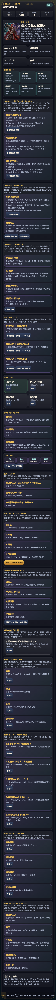
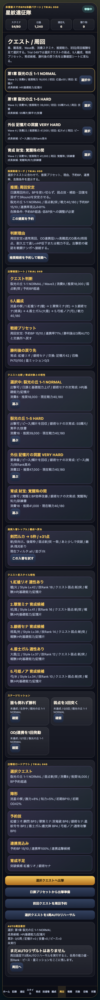
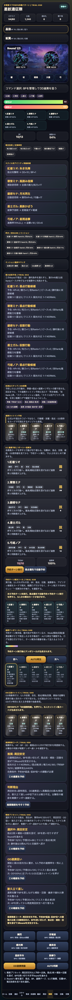

# SagaForge Trial 050: 推奨戦術コーチで「確認するだけ」から「予約して戦う」へ進める

前回のTrial 049では、出撃確認シートを追加し、クエスト弱点、消費スタミナ、5人編成、陣形、予約BP、連携率、勝利後の戻り先を1枚にまとめた。

ただし、ユーザーから最初に指摘された「全然ロマサガRSとは程遠い」という評価を考えると、まだ足りない。単に情報を並べるだけでは、キャラ収集RPGらしい「この周回はこの戦術で行こう」という手触りにならない。

## 前回の何が期待体験から遠かったか

- 出撃確認シートはできたが、プレイヤーが次に押すべき戦術は自分で読み解く必要があった。
- 5人編成、スタイル、BP、OD、弱点、育成候補は表示されるが、それが「周回安定」「OD連携狙い」「耐久立て直し」のどれに向くかまでは提案していなかった。
- 戦闘画面の5人予約と、クエスト画面の出撃判断がまだ少し離れていた。

## 今回潰した差分

Trial 050では、プレイアブル版に **推奨戦術コーチ** を追加した。

| 追加箇所 | できるようにしたこと |
|---|---|
| ホーム | 現在選択中のクエストと隊列状態から、推奨プリセットを表示する |
| クエスト画面 | 選択クエストの弱点、推奨戦力、予約BP、連携率、危険条件をまとめて出す |
| 戦闘画面 | 戦闘中のHP/BP/OD状態から、同じ推奨を再確認してそのまま予約できる |
| 予約ボタン | 推奨された周回安定/OD連携狙い/耐久立て直しを5人予約へ反映する |

判断ルールはまだ簡易版だが、次のように分岐する。

```text
通常周回・余裕あり
  -> 周回安定
高難度 / OD高め / 術や複合弱点
  -> OD連携狙い
隊列HP低下 / 戦力不足気味
  -> 耐久立て直し
```

これで、出撃確認シートが「読む資料」で止まらず、5人予約と戦闘テンポへつながる導線になった。

## プレイアブルで確認できること







確認手順は次の通り。

1. ホームで「Trial 050: 推奨戦術コーチ」を見る。
2. 「推奨戦術を予約」を押す。
3. クエスト画面で、推奨プリセット、予約BP、連携率見込み、危険条件を見る。
4. 「推奨戦術を予約して戦闘へ」を押す。
5. 戦闘画面で、同じ推奨が5人予約カードと戦術プリセットへ反映されることを確認する。

公開プレイアブル: `/sagaforge-app/index.html`

## AIDD Control Planeとしての学び

今回の差分は、画面密度の追加ではなく、**判断の自動化を少し足した**ことに意味がある。

```text
観測された不足
  -> 出撃確認シートはあるが、どの戦術を選ぶべきかは読み手任せ
理想状態
  -> クエスト・弱点・HP/BP/OD・戦力から、次の戦術候補が提示される
修正指示
  -> 推奨戦術コーチをホーム/クエスト/戦闘に置き、ボタンで5人予約へ反映する
必要な上流情報
  -> 戦術選択契約、クエスト弱点、隊列状態、BP/OD状態、危険条件
検証
  -> HTML構文確認、ローカルHTTP確認、Playwrightによる主要導線確認、preview再生成、公開URL確認
```

AIDD Control Plane的には、ユーザーが迷う判断をそのまま記事や説明で補うのではなく、プレイアブルの中で「次に押す候補」として表示することが重要だった。

## まだ遠い点

- 推奨戦術はまだ簡易ルールで、敵構成、技Rank、継承技、耐性、周回効率まで細かく見ていない。
- 戦闘の爽快感は、カードとログ中心で、連撃の間や報酬演出はまだ弱い。
- ガチャ結果、ピース変換、限界突破、編成おすすめの循環は、さらに一体化できる。
- 長期育成の差、スタイル違いの価値、技Rank上昇の気持ちよさはまだ薄い。

## 次に潰す差分

次回は、推奨戦術を土台にして、次の差分を潰す。

- 勝利後リザルトを「星ミッション」「初回報酬」「突破可能」「交換所」「再戦」にさらに強く分解する。
- 推奨戦術に、技Rank、継承技、敵弱点、スタイルロールの重みを入れる。
- 10連召喚結果を、所持/未所持/重複/ピース変換/突破可能/編成候補へより強く分類する。

## 検証メモ

- `playables/sagaforge-app/index.html` をTrial 050へ更新した。
- `scripts/build_preview.py` にTrial 050記事と画像パターンを追加した。
- `preview/sagaforge-app/` へコピーされる状態を維持した。
- アプリ本体には、実在IP名、公式素材、商標、ロゴ、公式コピー、公式確率を入れていない。
