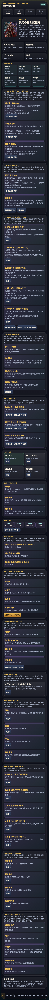
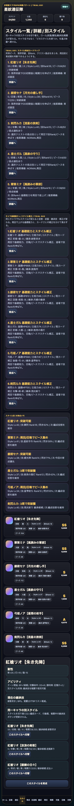
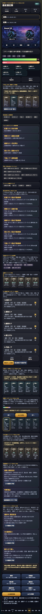
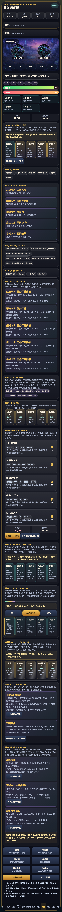

# SagaForge Trial 051: スタイル育成ロードマップと連携テンポ診断で「周回する理由」を前面に出す

前回までのSagaForgeは、ホーム、スタイル、編成、クエスト、戦闘、召喚、遠征、失敗状態を順に増やしてきました。とはいえ、ユーザーからの「全然ロマサガRSとは程遠い」という評価を基準に見ると、まだ弱い点がありました。

実在IP・公式素材・商標・ロゴ・キャラ・公式文言・公式確率は使いません。ここで目指すのは、保護された作品のコピーではなく、**キャラ収集、スタイル育成、周回クエスト、5人編成、BP/OD風のターン制テンポ、召喚結果から育成へ戻る導線**という体験パターンを、非侵害のオリジナル表現で近づけることです。

## 前回の何が遠かったか

Trial 050では「推奨戦術コーチ」を入れて、出撃確認シートから5人予約へつなげました。ただし、まだ次の距離が残っていました。

1. **スタイルを伸ばす理由がホームで弱い**  
   スタイル一覧や突破候補はあるが、ホームを見た瞬間に「今日はこのスタイルを伸ばす」と判断しにくかった。
2. **クエスト選択が育成対象と十分に結びついていない**  
   クエストには消費スタミナ・推奨戦力・報酬が出ていたが、選んだ周回先がどのスタイルのピース/技Rank/能力上昇につながるかが、まだ分散していた。
3. **5人予約のテンポが、戦闘前の読み物に寄りがち**  
   BP/OD/連携率は見えるが、起点、補助、弱点、回復、追撃の順番として読むカードが不足していた。

## 今回潰した差分

Trial 051では、記事より先に触れるプレイアブル版を更新しました。

- ホームとスタイル画面に **スタイル育成ロードマップ** を追加。
- クエスト画面に **周回ルート推薦** を追加。
- 戦闘画面に **連携テンポ診断** を追加。
- 「最優先スタイルで周回準備」「推薦ルートを予約」「連携向けに並べ替え」という操作を追加し、見るだけでなく状態が変わるようにした。
- `playables/sagaforge-app/` から `preview/sagaforge-app/` へコピーされる状態を維持した。

## 触れる画面

公開プレイアブルURL:

https://ttomac-mini.tail352b67.ts.net/sagaforge-app/index.html

### ホーム: スタイル育成ロードマップ

### スタイル: ピース、突破、技Rank、推奨導線

### クエスト: 育成対象から周回ルートを推薦

### 戦闘: 連携テンポ診断

## 実装メモ

追加した主な関数は次の通りです。

- `styleRoadmapEntries()` / `renderStyleRoadmap()`  
  スタイルごとに、ピース、限界突破、弱点適性、技Rank、レアリティを評価し、育成順をカード化する。
- `applyStyleRoadmap()`  
  最優先スタイルを選び、突破候補なら育成へ、そうでなければ適した周回先を予約する。
- `routeCoach()` / `renderRouteCoach()` / `applyRouteCoach()`  
  選択クエスト、スタミナ、育成対象のピース見込みから、何周するかと勝利後の戻り先を提示する。
- `renderComboRhythm()` / `optimizeComboRhythm()`  
  5人予約行動を起点・補助・弱点・回復・追撃として読み替え、BP超過や連携率を診断する。

## 検証ログ

今回保存した証跡:

- `experiments/character-collection-rpg-trial-001/artifacts/character-collection-rpg-trial-051/terminal/playwright-capture.txt`
- `experiments/character-collection-rpg-trial-001/artifacts/character-collection-rpg-trial-051/terminal/static-verification.txt`
- `experiments/character-collection-rpg-trial-001/artifacts/character-collection-rpg-trial-051/terminal/generated-gates.txt`
- `experiments/character-collection-rpg-trial-001/artifacts/character-collection-rpg-trial-051/terminal/build-preview.txt`
- `experiments/character-collection-rpg-trial-001/artifacts/character-collection-rpg-trial-051/terminal/public-url.txt`

Playwright captureでは、`trial051_combo_visible=true` を確認し、ホーム、スタイル、周回ルート、戦闘テンポ診断のスクリーンショットを取得しました。

## まだ遠い点

まだ「本当にスマホRPGを遊んでいる」感覚には届きません。

- スタイルごとの別イラスト、武器/属性に応じた演出差、キャラごとの育成履歴が薄い。
- クエスト周回結果が、長期的なイベント交換、スタイル上限、遠征枠拡張へまだ十分につながっていない。
- 戦闘テンポはカード診断に近く、アニメーション、効果音、テンポの緩急は弱い。
- 召喚演出と結果カードはあるが、所持済み/未所持/ピース交換/突破の喜びがまだ軽い。

## 次に潰す差分

次回は、次の1〜3個に絞って進めます。

1. **スタイル所持/未所持/重複ピースの感情差**  
   10連結果から、New、重複、ピース変換、突破可能、交換Pt到達をより強く見せる。
2. **戦闘テンポの体感強化**  
   予約ターン実行時に、5人のカードが順に強調され、Weak、OD、回復、追撃が段階的に見えるようにする。
3. **周回後の長期育成ループ**  
   3周AUTO後に、スタイルLv、技Rank、能力値、交換、次の推奨クエストがより自然につながるようにする。

## AIDD-Specへの戻し

今回の学びは、AI Task Packetに次のように戻せます。

- 「キャラ収集RPG」では、キャラ一覧だけでなく**スタイル単位の育成ロードマップ**を要求する。
- クエスト一覧には、消費スタミナと報酬だけでなく、**育成対象、周回数、勝利後の戻り先**を要求する。
- 戦闘UIには、HPを減らすボタンだけでなく、**BP、OD、弱点、補助、回復、連携順の診断**を要求する。

これにより、単なるファンタジーRPG画面ではなく、キャラ収集・スタイル育成・周回判断・連携テンポを持つスマホRPGプロトタイプへ、少し近づけました。
