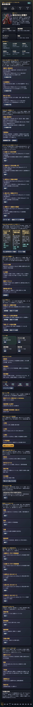
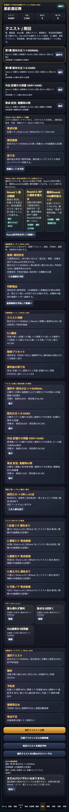
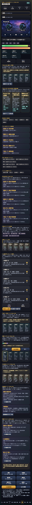
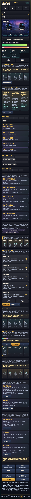

# SagaForge Trial 052: Round別クエスト目的チケットで「周回前に戦闘と育成を読む」状態へ近づける

ユーザーからの「全然ロマサガRSとは程遠い」という評価を、今回も出発点にしました。ここで実在IP・公式素材・商標・ロゴ・キャラ・公式文言・公式確率・公式UIの完全コピーは使いません。目指すのは、**キャラ収集、スタイル育成、5人編成、周回クエスト、BP/OD風のターン制テンポ、勝利後の育成/交換/再戦導線**を持つ、非侵害のオリジナルスマホRPGプロトタイプです。

## 前回の何がロマサガRS的な期待から遠かったか

Trial 051では、スタイル育成ロードマップ、周回ルート推薦、連携テンポ診断を追加しました。これで「誰を育てたいか」「どのクエストを回すか」「5人予約がどう連携するか」は以前より見えるようになりました。

ただし、まだ次の距離が残っていました。

1. **Roundごとの目的が弱い**  
   クエストを選び、戦術を選んでも、Round 1/2/3で何を達成するかがまだぼんやりしていました。
2. **出撃前の判断と戦闘中の判断が分かれていた**  
   ホームやクエスト画面で育成方針を読んでも、戦闘画面に入ると「今は弱点を突くのか、BPを戻すのか、ODを狙うのか」が薄くなっていました。
3. **勝利後の戻り先が、戦闘前から十分に予告されていない**  
   勝った後に育成・交換・再戦へ戻れるカードはありますが、出撃前から「この周回は誰のピース/技Rankのためか」を強く読むには不足していました。

## 今回潰した差分

今回は記事より先に、触れるプレイアブル版 `playables/sagaforge-app/index.html` を更新しました。

追加した主な体験は **Round別クエスト目的チケット** です。

- ホームに `Trial 052: Round別クエスト目的チケット` を追加。
- クエスト画面にも同じ目的チケットを追加。
- 戦闘画面にも `Trial 052: Round別目的 / 戦闘中確認` を追加。
- `prepareQuestIntent()` で、育成対象、選択クエスト、弱点、BP、OD、勝利後の戻り先をまとめて再計算。
- ボタン操作で「Round別予約を作って戦闘へ」進めるようにし、単なる説明カードではなく状態が変わる導線にした。

これで、少なくとも次のように読めるようになりました。

| Round | 目的 | 近づけた体験 |
|---|---|---|
| Round 1 | 弱点確認 | 敵弱点を見て星ミッションを進める |
| Round 2 | BPと補助を整える | 通常攻撃・補助・回復で最終Roundの準備をする |
| 最終Round | OD/勝利後ループ | 連携、報酬、スタイル育成/交換/再戦へ戻る |

## 触れる画面

公開プレイアブルURL:

https://ttomac-mini.tail352b67.ts.net/sagaforge-app/index.html

### ホーム: Round別クエスト目的チケット



### クエスト: 周回前にRound目的を確認



### 戦闘: Round目的を見ながら5人予約へ進む



### 予約ターン実行: 5人分の解決カードを確認



## 実装メモ

追加・更新した主な関数は次の通りです。

- `questIntentEntries()`  
  選択クエスト、敵弱点、育成ロードマップ上の優先スタイル、記憶片、ピース見込みから、Round 1/2/最終Roundの目的を生成する。
- `renderQuestIntentBoard()`  
  ホーム、クエスト、戦闘の3か所に同じ目的チケットを描画する。
- `prepareQuestIntent()`  
  3周予約、推奨戦術、OD加算、5人予約への遷移をまとめて実行する。
- `renderAll()`  
  既存の描画更新に `renderQuestIntentBoard()` を追加し、クエスト変更や戦闘状態の変化に追従するようにした。

## 検証ログ

今回保存した証跡:

- `experiments/character-collection-rpg-trial-001/artifacts/character-collection-rpg-trial-052/terminal/playwright-capture.txt`
- `experiments/character-collection-rpg-trial-001/artifacts/character-collection-rpg-trial-052/terminal/static-verification.txt`
- `experiments/character-collection-rpg-trial-001/artifacts/character-collection-rpg-trial-052/terminal/generated-gates.txt`
- `experiments/character-collection-rpg-trial-001/artifacts/character-collection-rpg-trial-052/terminal/build-preview.txt`
- `experiments/character-collection-rpg-trial-001/artifacts/character-collection-rpg-trial-052/terminal/public-url.txt`

Playwright captureでは次を確認しました。

```json
{
  "home_has_round": true,
  "battle_has_final": true,
  "turn_resolved": true,
  "title": "星紋遠征隊 SagaForge Trial 052"
}
```

## まだ遠い点

まだ「本当に期待されるスマホRPG体験」には届いていません。

- 戦闘演出はカード中心で、テンポ、効果音、カメラ、カットインの気持ちよさは弱い。
- スタイルごとのビジュアル差、武器/属性ごとの演出差、別スタイルの所有感が薄い。
- 召喚結果のNew/重複/ピース変換/突破可能の感情差がまだ軽い。
- 長期育成、イベント交換、遠征、日課、スタイル上限解放が、まだ実ゲームほど密に絡んでいない。

## 次に潰す差分

次回は、次の1〜3個に絞るのがよさそうです。

1. **召喚結果の感情差**  
   New、重複、ピース変換、突破可能、交換Pt到達を、10連結果の中で強く見せる。
2. **戦闘テンポの視覚強化**  
   予約ターン実行時に、5人カードが順に強調され、Weak、補助、回復、OD、追撃が段階的に見えるようにする。
3. **勝利後の長期育成ループ**  
   1回の勝利だけでなく、3周AUTO後に「誰がどれだけ伸び、どの交換/突破/再戦へ戻るか」をさらに濃くする。

## AIDD-Specへの戻し

今回の学びは、AI Task Packetに次のように戻せます。

- キャラ収集RPGでは、クエスト一覧だけでなく **Round別の目的** を要求する。
- 戦闘UIでは、HPを減らすボタンだけでなく **弱点、BP、補助、OD、勝利後の育成戻り先** を同じ流れで要求する。
- プレイアブル改善では、記事説明より先に **クリックで状態が変わる導線** を要求する。

今回の改善で、まだ完全ではないものの、「クエストを選ぶ → Roundごとの目的を読む → 5人予約へ進む → 勝利後の育成へ戻る」という構造が前より明確になりました。
