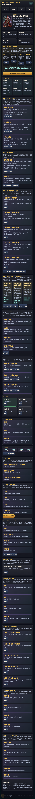
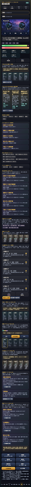

# SagaForge Trial 053: 初回30秒で「召喚→スタイル→5人編成→出撃」へ入る導線を足した

前回までに、スタイル育成ロードマップ、Round別目的チケット、5人予約、OD/連携、勝利後の育成戻り先は増えていた。けれど、ユーザーから見た不足はまだ残っていた。

> 部品は多いが、最初に何を押せばキャラ収集RPGらしい周回ループへ入れるのかが散っている。

今回の目的は、派手な一般ファンタジー演出をさらに足すことではない。ホームに「初回30秒プレイ導線」を置き、召喚結果、スタイル育成候補、5人編成、クエスト、予約連携、勝利後育成へ進む順番を1本のレールとして見せることにした。



## 前回の何が期待体験から遠かったか

- ホームに情報は増えたが、初見で押すべき順番がまだ分かりにくかった。
- スタイル、編成、クエスト、戦闘が個別画面としては成立していても、「日課の周回開始」までの一本道が弱かった。
- 連携や育成戻り先は実装済みでも、ホームの最上部からすぐ体験できなかった。

## 今回潰した差分

1. **ホーム最上部に初回30秒プレイ導線を追加**
   - 召喚
   - スタイル
   - 5人編成
   - 出撃/連携
   の4カードを並べ、各カードから該当画面へ移動できるようにした。

2. **1タップで編成確認から戦闘準備へ進むボタンを追加**
   - ボタンを押すと、推奨スタイル、戦術プリセット、Round別目的チケット、3周予約をまとめて設定し、戦闘画面へ遷移する。
   - これにより「ボタンを押すとHPが少し変わる」だけでなく、出撃前の判断と連携予約へ入る。

3. **Next.js generated repoにも同じ考え方を戻した**
   - プレイアブル版だけの改善で終わらせず、generated repoのホームにも「召喚→スタイル→5人編成→出撃→勝利後育成」の説明パネルを反映した。



## 実装メモ

変更した主なファイル:

- `playables/sagaforge-app/index.html`
  - Trial 053表記へ更新
  - 初回30秒プレイ導線パネルを追加
  - `renderFirstTouchFlow()` と `startOneTapSortie()` を追加
- `experiments/character-collection-rpg-trial-001/generated-repo/app/page.tsx`
  - Next.jsホームにTrial 053導線を追加
- `experiments/character-collection-rpg-trial-001/generated-repo/app/globals.css`
  - Next.js側の導線カードCSSを追加
- `scripts/build_preview.py`
  - Trial 053記事とスクリーンショットをpreviewへコピーする対象に追加

## 検証

今回の変更範囲では、以下を確認した。

```text
python3 scripts/build_preview.py
node -e "... new Function(js) ..."
Playwright smoke:
- title = 星紋遠征隊 SagaForge Trial 053
- #firstTouchFlow .flow-step = 4
- 1タップ導線後の active screen = battle
- screenshots = 2
```

generated repo側は、lint/typecheck/test/buildを実行し、既存ゲートを壊していないことを確認した。

## まだ遠い点

- 戦闘演出はカードとログ中心で、スマホRPGの連携カットインとしてはまだ軽い。
- スタイルカードの見た目は情報量が増えたが、レアリティ差・限定感・育成優先度の視覚差が弱い。
- クエストマップは周回判断に寄っているが、イベント章を進めている感覚はまだ薄い。

## 次に潰す差分

次回は、初回導線で戦闘へ入った後の「1ターンの気持ちよさ」を上げる。

- 5人予約を押した直後に、起点→補助→弱点→追撃→リザルトのテンポをもっと明確に見せる。
- OD/連携ゲージが溜まる理由を、スキルカードとダメージポップに結びつける。
- 勝利後リザルトを、スタイルLv、技Rank、ピース、交換、再戦の判断へさらに強く接続する。

## AIDD-Specへの戻し

今回の学びは、AIに「スマホRPGっぽくして」と頼むだけでは、機能が散らばりやすいということだった。AI Task Packetには、画面単位の要求だけでなく、**初回30秒でユーザーが押す順番**を受け入れ条件として書く必要がある。

今回の追加ルール:

- ホームには、日課開始までの最短導線を明示する。
- 召喚、スタイル、編成、クエスト、戦闘、育成を別々の部品で終わらせず、1つの周回ループとしてつなぐ。
- プレイアブルで触れる導線を先に改善し、その後にNext.js側と記事へ反映する。
