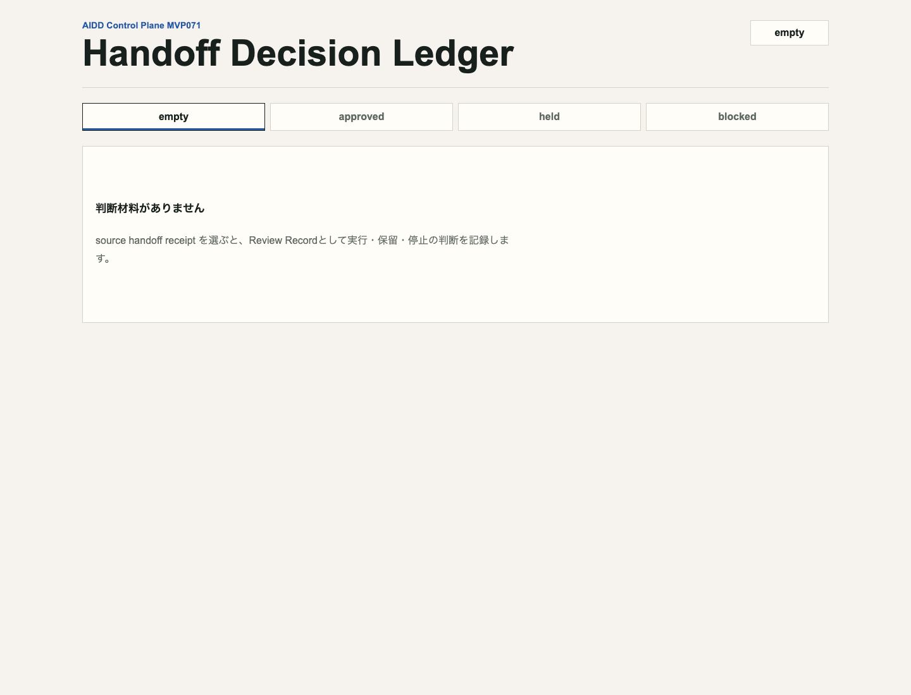
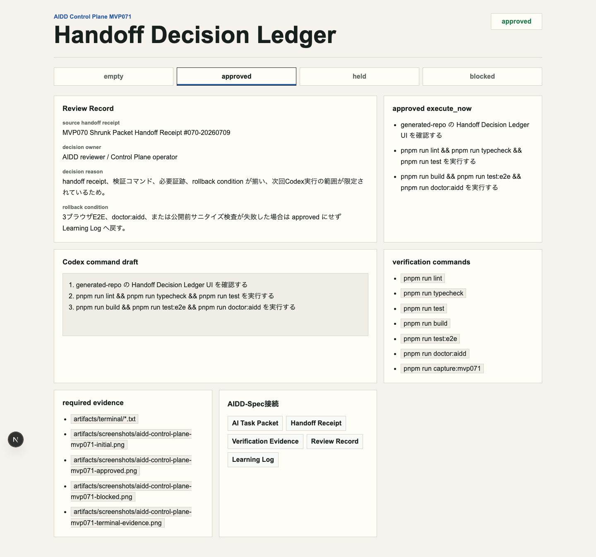
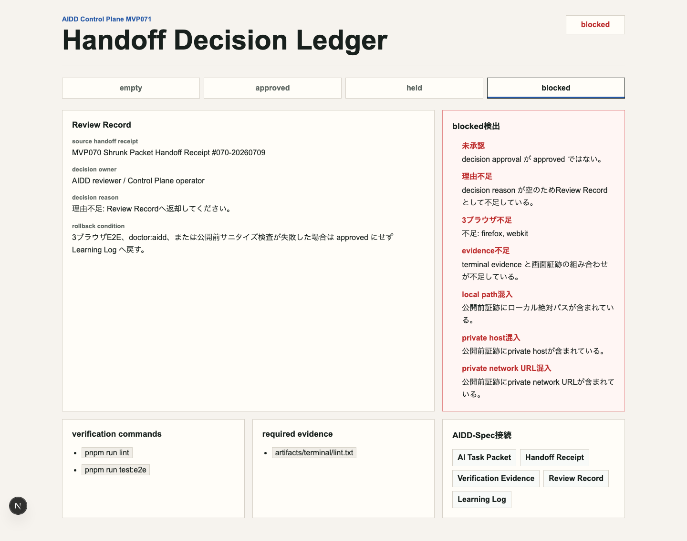
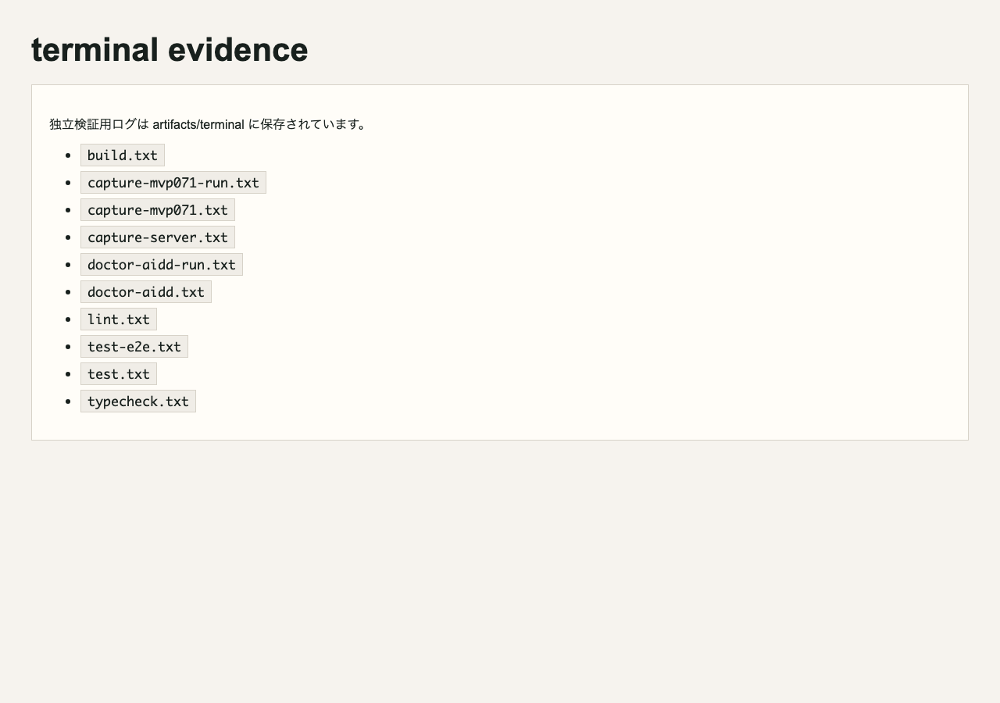

# AI実行へ進める判断を1枚で残す：Handoff Decision Ledgerを作った

> 2026-07-09 / Codex Mastery Lab  
> 記事種別: Experiment / SaaS / Review Record / Verification Evidence  
> 将来の書籍章: 第9章 AI Task Packet、第10章 Verification Evidence、第18章 AIDD Control PlaneのMVP

## 読者の悩み

AIに渡す依頼を小さく畳んでも、最後に「本当に実行してよいのか」を誰が、なぜ判断したかが残らないことがあります。

MVP070では、縮小後AI Task PacketをCodexへ渡す直前に見る **Shrunk Packet Handoff Receipt** を作りました。今回のMVP071では、そのレシートを見た後に、**進める / 保留する / 止める** をReview Recordとして残す **Handoff Decision Ledger** を作りました。

日常の例で言えば、旅行前の荷物チェックがMVP070なら、MVP071は「この荷物で出発するか、買い足してからにするか、今日は出発しないか」を家族で決めてメモに残す作業です。AI駆動開発でも、実行前の判断が曖昧だと、失敗した時に次の改善へ戻せません。

## 今回の仮説

AIDD Control Planeが「誰でもベストに近いAI駆動開発フローと設計ドキュメントを作れるSaaS」になるには、AI Task PacketやHandoff Receiptだけでなく、実行直前の判断記録が必要です。

今回の仮説は次です。

- approvedなら、approved execute_nowだけをCodex command draftへ進める
- heldなら、hold reasonとLearning Log返却を表示する
- blockedなら、未承認、理由不足、3ブラウザ不足、evidence不足、local path / private host / private network URL混入を止める
- 判断理由、rollback condition、AIDD-Spec接続が見えると、次回のRun Queue Intakeへ安全につなげやすくなる

## 実験内容

AI Task Packetは `experiments/2026-07-09-aidd-control-plane-mvp-071/AI_TASK_PACKET.md` に保存しました。Codex CLIには次のpromptを渡しました。

```text
Handoff Decision Ledger画面を実装する。
状態は empty / approved / held / blocked。
approvedでは source handoff receipt、decision owner、decision reason、approved execute_now、Codex command draft、verification commands、required evidence、rollback condition、AIDD-Spec接続を表示する。
blockedでは未承認、理由不足、3ブラウザ不足、evidence不足、local path/private host/private network URL混入を検出する。
```

Codexは `generated-repo/` を作りましたが、capture中にCLIセッションがtimeoutしました。ここでCodexの自己申告を完了扱いにせず、こちらで独立検証を個別にやり直しました。

## 画面キャプチャ

### initial: 判断材料がない



initialでは、source handoff receiptが未選択です。何を見て判断したのかがないため、実行には進めません。

### approved: execute_nowだけを実行候補へ進める



approvedでは、decision owner、decision reason、approved execute_now、verification commands、required evidence、rollback condition、AIDD-Spec接続が見えます。Codex command draftには、approved execute_nowだけが入ります。保留理由や次回送りの作業は混ぜません。

### blocked: 公開前に止める



blockedでは、未承認、理由不足、3ブラウザ不足、evidence不足、local path混入、private host混入、private network URL混入を表示します。ここで止めることで、後から「Firefoxを見ていなかった」「terminal evidenceがなかった」「公開してはいけないURLが入っていた」と気づく事故を減らします。

### terminal evidence画像



## 失敗と修正

今回の失敗は、Codex CLIがcapture実行中にtimeoutしたことです。画像自体は作られていましたが、capture scriptの子プロセス終了処理が弱く、CLIセッションが戻りませんでした。

修正として、capture scriptでstdout/stderrを閉じ、子プロセスをkillしてから明示的に終了するようにしました。その後、`pnpm run capture:mvp071` は正常終了しました。

もう1つの小さな注意点は、doctor:aiddの初回実行では画像がまだないためNGが出ることです。これは良い挙動です。証跡がないのにOKにしないからです。capture後にdoctor:aiddを再実行し、画像とterminal evidenceが揃った状態でOKになりました。

## 検証ログ

独立検証として、次を個別ログに保存しました。

```text
pnpm install --frozen-lockfile: 成功
pnpm run lint: 成功
pnpm run typecheck: 成功
pnpm run test: 4 tests passed
pnpm run build: 成功
pnpm run test:e2e: Chromium / Firefox / WebKitで9 tests passed
pnpm run doctor:aidd: 成功
pnpm run capture:mvp071: 成功
```

E2Eは3ブラウザを外さずに通しました。

```text
9 passed (15.3s)
```

## 読者が使えるチェックリスト

| チェック項目 | 何を確認したいのか | なぜ必要か |
| --- | --- | --- |
| source handoff receipt | どのレシートを見て判断したか | 後から判断根拠を追えるようにするため |
| decision owner | 誰が判断したか | 責任者不明のAI実行を減らすため |
| decision reason | なぜ進める/保留/停止なのか | 次回レビューで同じ迷いを繰り返さないため |
| approved execute_now | 今回本当に実行する1範囲か | ついで作業で検証を薄くしないため |
| Codex command draft | 実行文にapproved以外が混ざっていないか | 保留・次回送りを誤実行しないため |
| verification commands | lint/typecheck/test/build/e2e/doctorが残っているか | 判断後の検証が空にならないようにするため |
| required evidence | terminal/initial/approved/blocked画像が残るか | note記事とレビューの一次情報にするため |
| rollback condition | どの失敗で止めるか | 失敗時に無理に走り続けないため |
| private情報検査 | local path / private host / private network URLがないか | 公開previewや記事への漏えいを防ぐため |

## SaaS/AIDD-Specへの接続

今回のMVP071は、`standards/aidd-control-plane-mvp-v0.1.md` の **Handoff Decision Ledger** に対応します。

AIDD-Spec v0.1では、AI Task Packet、Verification Evidence、Review Record、Learning Logをつなげることが重要です。今回のLedgerは、Handoff Receiptを見た後の判断をReview Recordとして固定し、保留や停止をLearning Logへ戻す役割を持ちます。

SaaSとしては、次の価値に近づきました。

- 実行直前の判断をUIで残せる
- approved execute_nowだけを次工程へ渡せる
- blocked理由をReview Findingとして次回改善へ戻せる
- 公開前サニタイズを判断ゲートに入れられる

## 次回

次は、Handoff Decision LedgerでapprovedになったものだけをCodex Run Queueへ入れる **Run Queue Intake** を作るのが自然です。ここでは、held / blocked / unapproved decisionをqueueへ混ぜないこと、危険commandやFirefox除外をqueue投入前に止めることを確認します。
