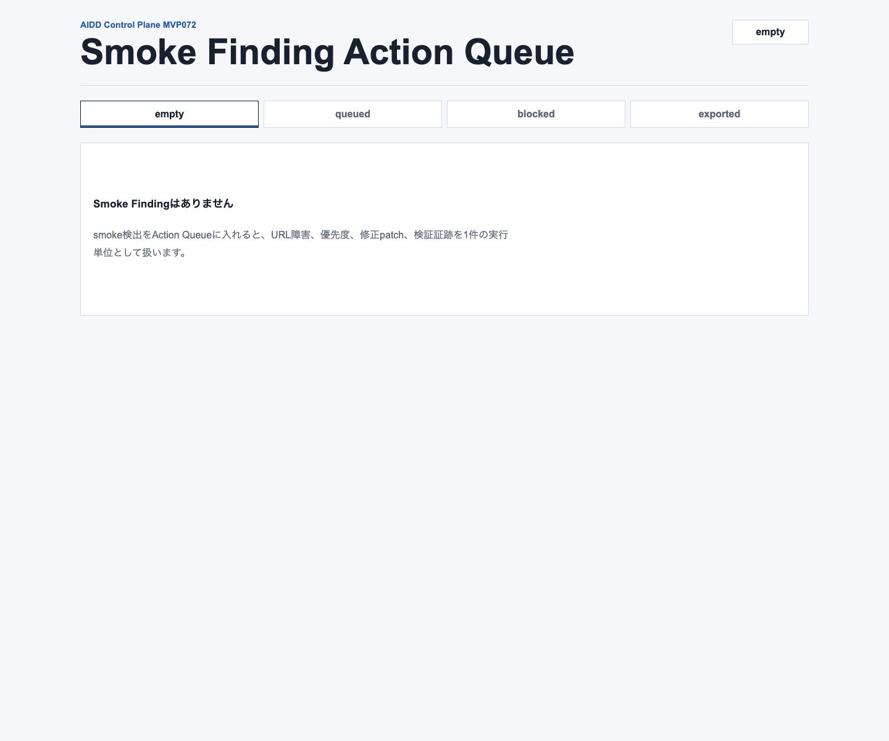
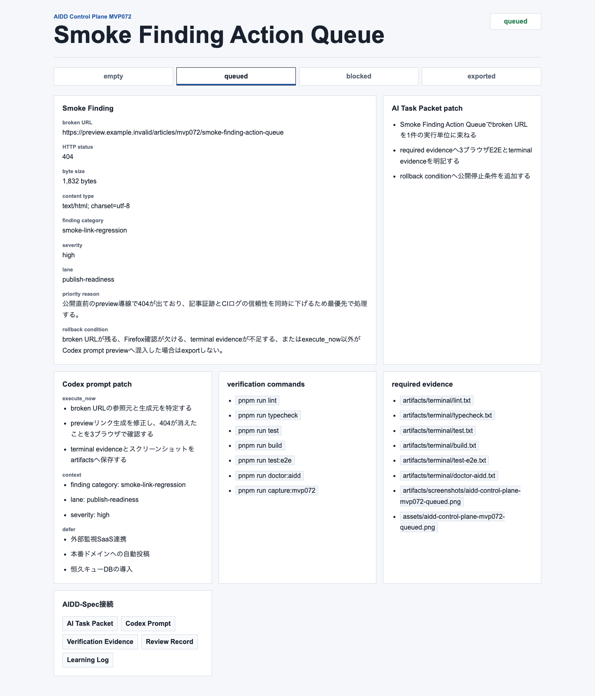
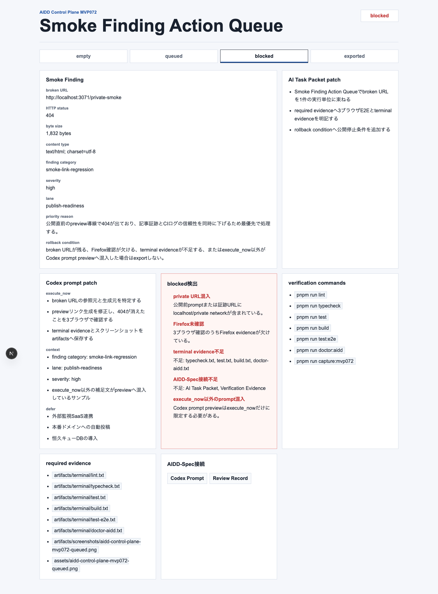
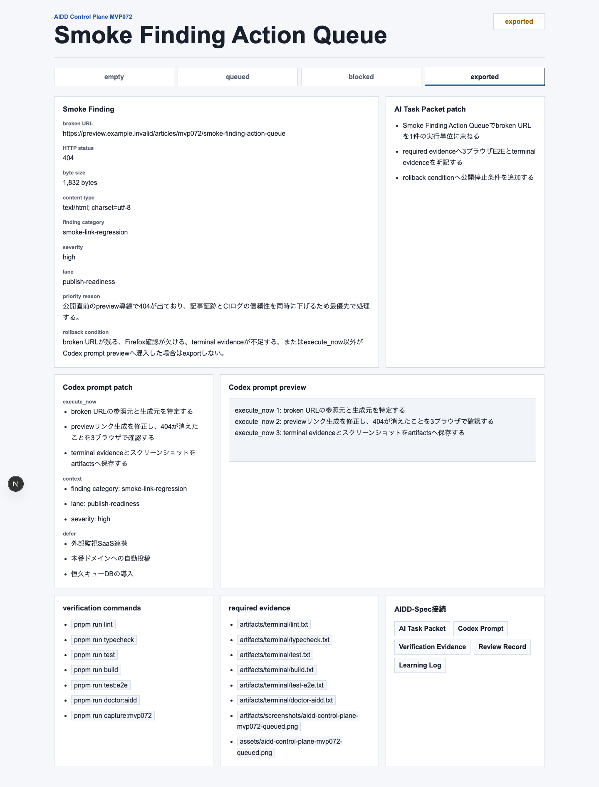
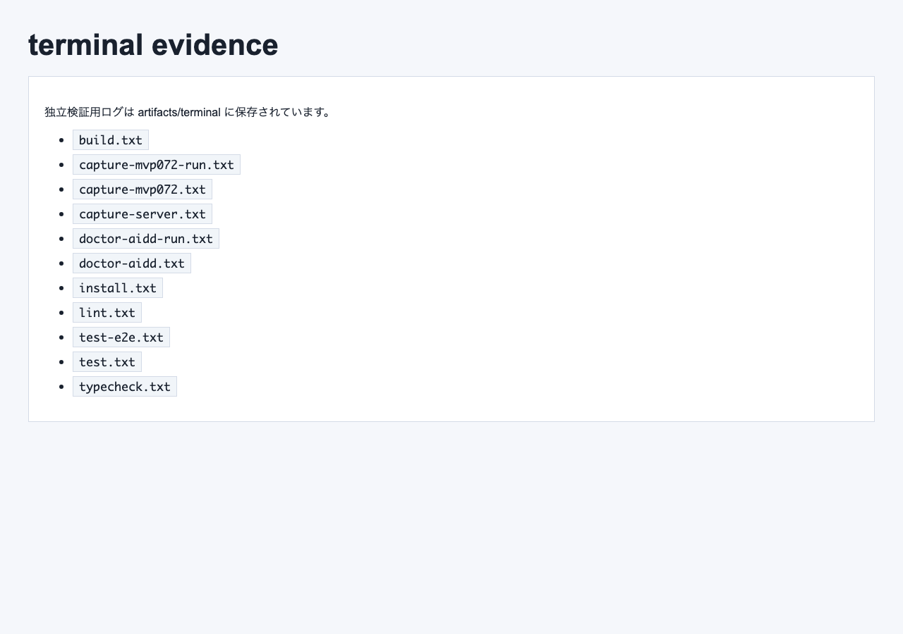

# previewの404を「次に直す1件」へ変える：Smoke Finding Action Queueを作った

> 2026-07-09 / Codex Mastery Lab  
> 記事種別: Experiment / SaaS / Verification Evidence / Review Finding  
> 将来の書籍章: 第10章 Verification Evidence、第11章 Review Record、第18章 AIDD Control PlaneのMVP

## 読者の悩み

note記事や技術記事を公開する前に、previewで画像やリンクが壊れていることがあります。問題は、404を見つけた後です。

「どのURLが壊れたのか」「HTTP statusはいくつだったのか」「次にAIへ直させる1件は何か」「証跡は足りているのか」が残らないと、AIへの依頼文はまた曖昧になります。

MVP071では、縮小したAI Task Packetを実行へ進めるか判断する **Handoff Decision Ledger** を作りました。今回のMVP072では、その後段として、公開previewのsmoke確認で見つかった失敗を、次の1回で実行する **Smoke Finding Action Queue** に変換しました。

日常の例で言えば、旅行前チェックで「充電器がない」と分かった後に、買う物リストへ1行で移す作業です。見つけただけでは直りません。次に動ける形へ畳む必要があります。

## 今回の仮説

AIDD Control Planeが「誰でもベストに近いAI駆動開発フローと設計ドキュメントを作れるSaaS」になるには、公開前QAの失敗をそのまま愚痴で終わらせず、AI Task Packet deltaとCodex prompt deltaへ変換する必要があります。

今回の仮説は次です。

- broken URL、HTTP status、byte size、content typeが見えると、失敗が再現しやすい
- finding category、severity、lane、priority reasonがあると、次に直す順番を説明できる
- exported promptにはexecute_nowだけを入れると、ついで作業を減らせる
- private URL、Firefox未確認、terminal evidence不足、AIDD-Spec接続不足は公開前に止めるべき

## 実験内容

AI Task Packetは `experiments/2026-07-09-aidd-control-plane-mvp-072/AI_TASK_PACKET.md` に保存しました。Codex CLIには次のpromptを渡しました。

```text
AIDD Control Planeの次インクリメントとして Smoke Finding Action Queue 画面を実装する。
empty / queued / blocked / exported 状態を表示する。
queuedでは broken URL、HTTP status、byte size、content type、finding category、severity、lane、priority reason、AI Task Packet patch、Codex prompt patch、verification commands、required evidence、rollback condition、AIDD-Spec接続を表示する。
exportedでは execute_nowだけをCodex prompt previewへ入れる。
blockedでは private URL混入、Firefox未確認、terminal evidence不足、AIDD-Spec接続不足、execute_now以外のprompt混入を検出する。
```

CodexはMVP071を下敷きにして `generated-repo/` をMVP072へ差し替えました。ただしCodex CLIセッションは最後にtimeoutしました。そのため、今回もCodexの自己申告を信用せず、独立検証をこちらで個別に実行しました。

## 画面キャプチャ

### empty: smoke findingがまだない



emptyでは、Public Preview Smoke Verifierの結果が未選択です。壊れたURLがない状態では、Action Queueを作りません。

### queued: 壊れたURLを次の1件に変換する



queuedでは、broken URL、HTTP status、byte size、content type、finding category、severity、lane、priority reasonを同じ画面に出します。さらに、AI Task Packet patch、Codex prompt patch、verification commands、required evidence、rollback condition、AIDD-Spec接続まで表示します。

ここで大事なのは、「404だった」だけで終わらせないことです。次にAIへ渡す材料へ変換します。

### blocked: 公開前に止める



blockedでは、private URL混入、Firefox未確認、terminal evidence不足、AIDD-Spec接続不足、execute_now以外のprompt混入を止めます。

特にpreview関連の証跡は、うっかりローカル専用ホスト名やprivate network URLを記事へ載せやすい領域です。公開前に止めるゲートをUIに置くことで、後から慌てて直す事故を減らします。

### exported: execute_nowだけを渡す



exportedでは、Codex prompt previewにexecute_nowだけを入れます。contextやdefer、次回送りの作業は混ぜません。

### terminal evidence画像



## 失敗と修正

今回の失敗は、Codex CLIが最後の確認中にtimeoutしたことです。大量のdiffを出したまま戻らなかったため、完了扱いにはしませんでした。

修正というより運用判断として、そこでCodexを信頼せず、次を独立に実行しました。

- lint
- typecheck
- unit test
- build
- 3ブラウザE2E
- capture
- doctor:aidd

結果として、実装自体は動作しており、検証ログと画像証跡を保存できました。

## 検証ログ

独立検証として、次を個別ログに保存しました。

```text
pnpm install --frozen-lockfile: 成功
pnpm run lint: 成功
pnpm run typecheck: 成功
pnpm run test: 成功
pnpm run build: 成功
pnpm run test:e2e: Chromium / Firefox / WebKitで成功
pnpm run capture:mvp072: 成功
pnpm run doctor:aidd: 成功
```

E2Eは3ブラウザを外さずに通しました。

```text
3ブラウザ Playwright: 成功
```

## 読者が使えるチェックリスト

| チェック項目 | 何を確認したいのか | なぜ必要か |
| --- | --- | --- |
| broken URL | どの公開preview URLが壊れたか | 「どこか壊れている」を再現可能な修正対象にするため |
| HTTP status | 404/500などの失敗種別 | リンク生成ミスかサーバー障害かを分けるため |
| byte size | 返ってきた本文が空に近いか | 画像やHTMLが実体として読めるかを見るため |
| content type | HTML/PNGなど期待形式か | 画像URLがHTMLエラーを返す事故を見つけるため |
| severity / lane | 優先度と作業レーン | 次に直す1件を説明可能にするため |
| AI Task Packet patch | 上流指示へ何を戻すか | 同じ失敗を次回AIに繰り返させないため |
| Codex prompt patch | AIへ渡す修正文 | 失敗を実行可能な依頼に変換するため |
| execute_now限定 | 今回やることだけがpromptに入るか | ついで作業で検証が薄くなるのを防ぐため |
| 3ブラウザ | Chromium / Firefox / WebKitを見たか | 片方だけの成功を公開OKと誤解しないため |
| terminal evidence | 実行ログが残ったか | 記事とレビューの一次情報にするため |
| private URL検査 | ローカル専用ホスト/private networkが混じらないか | 公開記事への漏えいを防ぐため |

## SaaS/AIDD-Specへの接続

今回のMVP072は、`standards/aidd-control-plane-mvp-v0.1.md` の **Smoke Finding Action Queue** に対応します。

AIDD-Spec v0.1の流れでは、Verification Evidenceで見つかった失敗をReview Recordへ分類し、Learning LogとAI Task Packet deltaへ戻します。今回の画面は、Public Preview Smoke Verifierの失敗をその変換点へ運ぶ役割です。

SaaSとしては、次の価値に近づきました。

- preview smokeの失敗をaction itemへ変換できる
- 直すべき1件と次回送りを分けられる
- AIへ渡すpromptからexecute_now以外を除外できる
- 公開前のprivate URLや証跡不足を止められる

noteで読まれる記事という観点でも、これは単なるAI量産記事ではなく、実際に失敗し、直し、ログと画像を残した一次情報です。読者は同じチェックリストを自分のpreview公開前QAに使えます。

## 次回

次は、Smoke Finding Action Queueからexportされた実行actionを、再びRun AuthorizationやCodex Run Queueへ安全に接続する不足点を見ます。候補は、action itemを複数まとめた時に優先度が重複しないか、またはpreview smoke再実行のrerun commandをどのように証跡化するかです。
