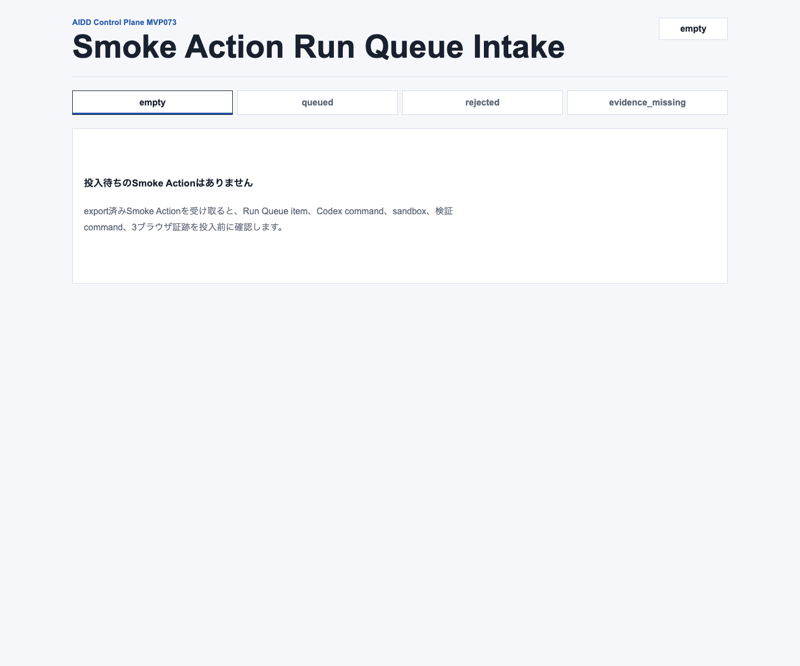
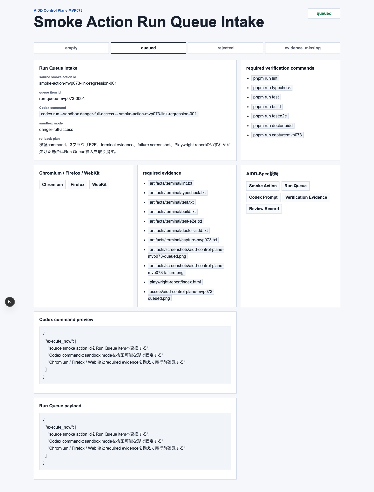
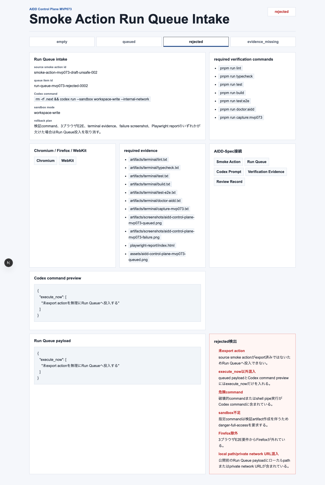
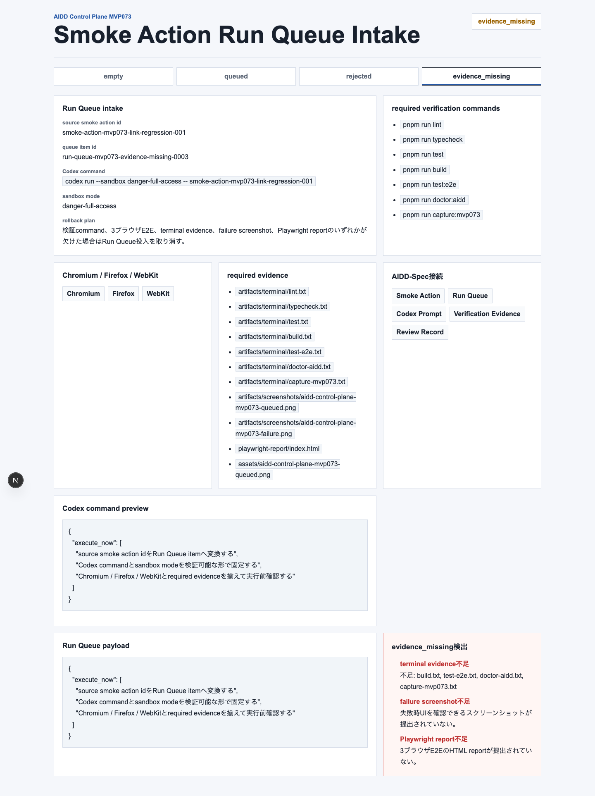
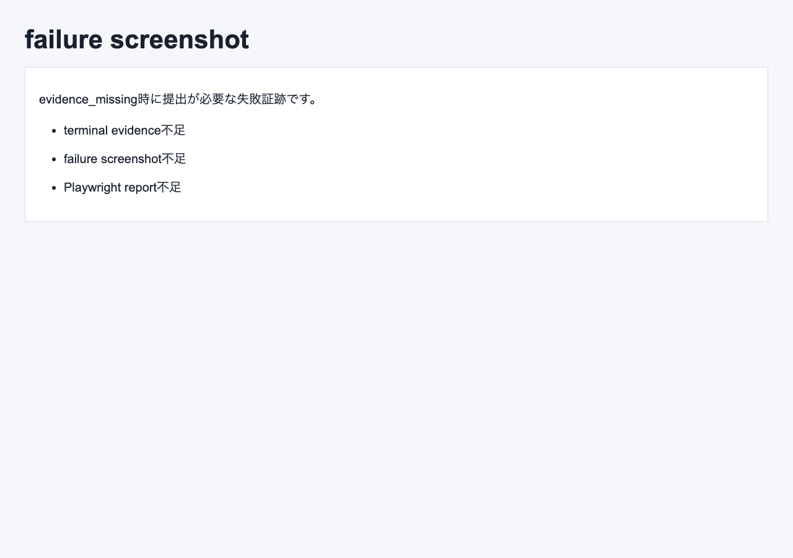
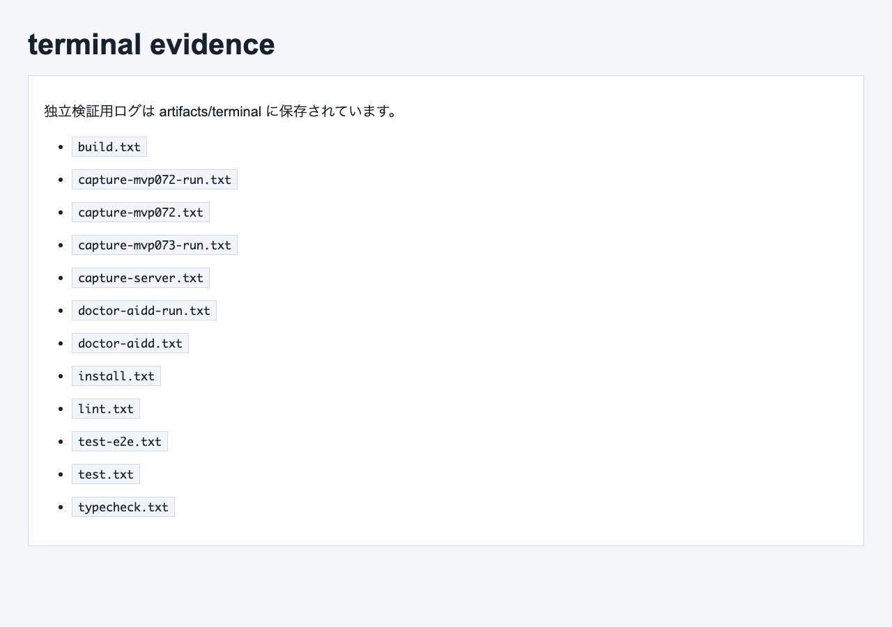

# 「実行していい修正」だけをRun Queueへ入れる：Smoke Action Run Queue Intakeを作った

> 2026-07-09 / Codex Mastery Lab  
> 記事種別: Experiment / SaaS / Verification Evidence / Run Queue  
> 将来の書籍章: 第9章 AI Task Packet、第10章 Verification Evidence、第11章 Review Record、第18章 AIDD Control PlaneのMVP

## 読者の悩み

AIに修正を頼む時、いちばん怖いのは「直すべきこと」と「まだ準備できていないこと」が同じ依頼文に混ざることです。

たとえばpreview smokeで404を見つけたあと、MVP072ではそれを **Smoke Finding Action Queue** として1件のactionへ変換しました。けれど、そのactionをそのままCodex Run Queueへ入れてよいとは限りません。

- まだexport済みではないactionかもしれない
- `execute_now` 以外の次回送りや学習ログがpromptに混じっているかもしれない
- 危険なcommandやsandbox不足があるかもしれない
- Firefoxやfailure screenshot、Playwright reportが欠けているかもしれない

日常の例で言えば、買い物メモに「今日買うもの」と「いつか調べるもの」と「家族に相談するもの」が混ざっている状態です。そのまま店に行くと、余計なものを買ったり、本当に必要なものを忘れたりします。

今回のMVP073では、exported actionを実行キューへ入れる直前に止める **Smoke Action Run Queue Intake** を作りました。

## 今回の仮説

AIDD Control Planeが「誰でもベストに近いAI駆動開発フローと設計ドキュメントを作れるSaaS」になるには、AIへ渡す直前の入口で次を分ける必要があります。

- `queued`: 実行してよい。Run Queue payloadに必要情報が揃っている
- `rejected`: 実行してはいけない。危険commandや未export actionがある
- `evidence_missing`: 実行前または公開前に必要な証跡が足りない
- `empty`: まだ投入対象がない

特に大事なのは、Run Queue payloadとCodex command previewに **execute_nowだけ** を残すことです。次回送りやLearning Logを混ぜると、AIの作業範囲が広がり、検証ログの意味も薄くなります。

## 実験内容

AI Task Packetは `experiments/2026-07-09-aidd-control-plane-mvp-073/AI_TASK_PACKET.md` に保存しました。Codex CLIには次のpromptを渡しました。

```text
AIDD Control Planeの次インクリメントとして Smoke Action Run Queue Intake 画面を実装する。
empty / queued / rejected / evidence_missing 状態を表示する。
queuedでは source smoke action id、queue item id、Codex command、sandbox mode、required verification commands、Chromium / Firefox / WebKit、required evidence、rollback plan、AIDD-Spec接続、Run Queue payloadを表示する。
queued payloadとCodex command previewにはexecute_nowだけを入れる。
rejectedでは未export action、execute_now以外混入、危険command、sandbox不足、Firefox除外、local path/private network URL混入を検出する。
evidence_missingではterminal evidence、failure screenshot、Playwright report不足を検出する。
```

Codex CLIは実装差分を生成しましたが、最後の確認中にtimeoutしました。そのため、Codexの自己申告は採用せず、生成された実装をこちらで独立検証しました。

## 画面キャプチャ

### empty: 投入待ちのactionがない



emptyでは、Run Queueへ入れるexport済みSmoke Actionがまだありません。ここで無理に実行候補を作らないことが重要です。

### queued: 実行してよいpayloadを確認する



queuedでは、source smoke action id、queue item id、Codex command、sandbox mode、required verification commands、3ブラウザ、required evidence、rollback plan、AIDD-Spec接続を1画面で確認します。

Run Queue payloadとCodex command previewには `execute_now` だけを表示します。これにより、「今回AIへ渡すこと」と「次回以降に戻すこと」を混ぜません。

### rejected: 実行してはいけないactionを止める



rejectedでは、未export action、execute_now以外混入、危険command、sandbox不足、Firefox除外、local path/private network URL混入を検出します。

ここでの狙いは、AIを止めること自体ではありません。止める理由をReview Recordとして説明できる形にすることです。

### evidence_missing: 証跡不足を分けて止める



evidence_missingでは、terminal evidence、failure screenshot、Playwright report不足を検出します。実装が正しくても、証跡がなければ記事にもレビューにも使いにくいので、rejectedとは別の状態として扱いました。

### failure screenshot



### terminal evidence画像



## 失敗と修正

今回の失敗は、Codex CLIが最後まで終了せずtimeoutしたことです。これは実装そのものの失敗というより、長い差分出力と検証の途中でセッションが止まった運用上の失敗でした。

対応として、次を行いました。

- Codexの完了報告を信用せず、生成された差分を独立に確認
- `pnpm install --frozen-lockfile` から `doctor:aidd` まで個別に再実行
- 3ブラウザE2Eを実際に通過させる
- capture scriptでempty / queued / rejected / evidence_missing / failure / terminal evidenceを保存
- 記事・previewへ載せる前にローカルpathやprivate URLの漏れを検査

## 検証ログ

独立検証として、次を個別ログに保存しました。

```text
pnpm install --frozen-lockfile: 成功
pnpm run lint: 成功
pnpm run typecheck: 成功
pnpm run test: 成功
pnpm run build: 成功
pnpm run test:e2e: Chromium / Firefox / WebKitで成功（12 passed）
pnpm run capture:mvp073: 成功
pnpm run doctor:aidd: 成功
```

E2EではChromium / Firefox / WebKitを外さずに通しました。

```text
12 passed
```

## 読者が使えるチェックリスト

| チェック項目 | 何を確認したいのか | なぜ必要か |
| --- | --- | --- |
| source smoke action id | どのsmoke finding由来の実行か | 修正対象を追跡可能にするため |
| queue item id | Run Queue上の実行単位 | 複数actionが混ざった時に取り違えないため |
| exported | actionが正式にexport済みか | 下書きや保留中actionを誤実行しないため |
| execute_now限定 | payloadとcommand previewが今回実行分だけか | AIの作業範囲を広げすぎないため |
| Codex command | 実行commandが安全で再現可能か | 危険commandや曖昧な起動を止めるため |
| sandbox mode | 期待するsandbox条件か | 証跡生成に必要な権限と安全性を明示するため |
| Chromium / Firefox / WebKit | 3ブラウザ確認が入っているか | 片方だけの成功を公開OKと誤解しないため |
| required evidence | terminal、failure screenshot、reportが揃うか | 記事・レビュー・再実行の一次情報にするため |
| rollback plan | どの条件なら投入を取り消すか | 失敗時に迷わず止めるため |
| local/private検査 | ローカルpathやprivate network URLが混じらないか | 公開記事への漏えいを防ぐため |

## SaaS/AIDD-Specへの接続

今回のMVP073は、`standards/aidd-control-plane-mvp-v0.1.md` に追加した **Smoke Action Run Queue Intake** に対応します。

AIDD-Spec v0.1の流れでは、Review FindingからAI Task Packet deltaを作り、それをVerification Evidence付きの実行へ進めます。今回の画面は、その「実行へ進める直前」の入口です。

SaaSとしては、次の価値に近づきました。

- smoke finding由来のactionをRun Queue itemへ変換できる
- execute_nowだけをpayloadへ残せる
- 危険command、sandbox不足、Firefox除外を実行前に止められる
- 証跡不足をrejectedとは別に扱える
- Review RecordとLearning Logへ戻す理由を画面で説明できる

noteで読まれる記事という観点でも、これはAI量産記事ではなく、実際にCodexを動かし、timeoutを記録し、検証ログと画像を残した一次情報です。読者は同じチェックリストを、自分のAI実行キューや手動運用にも使えます。

## 次回

次は、Run Queueへ入ったitemの状態を、waiting / running / succeeded / failed / evidence_missingとして追跡する不足点を見ます。特に、実行結果をReview RecordとLearning Logへ戻すために、command別exit code、duration、console status、修正指示をどこまで最初から表示すべきかを検証します。
