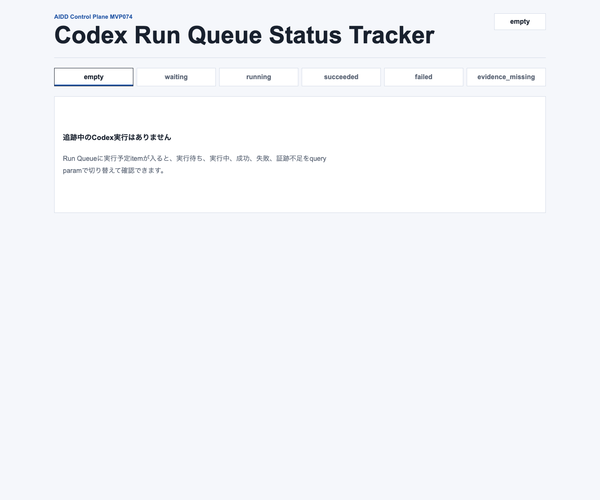
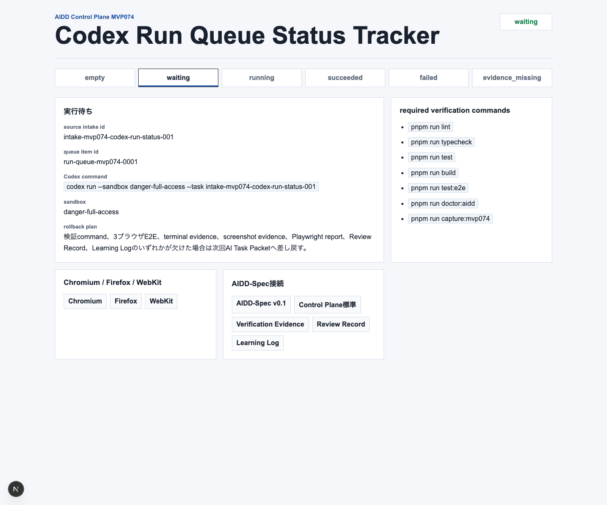
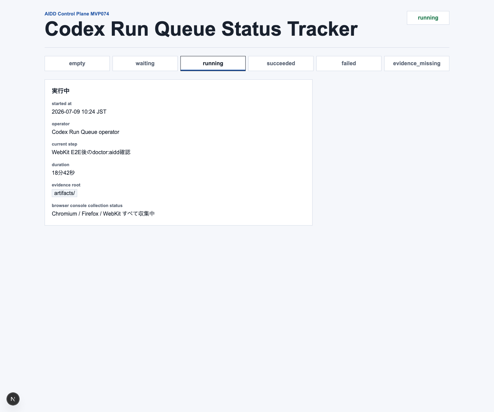
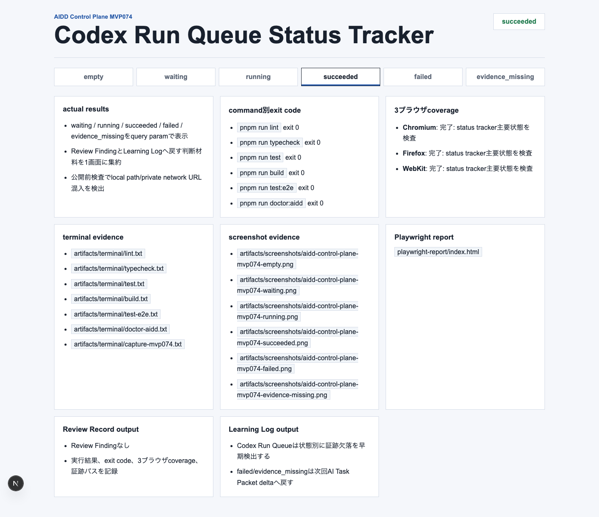
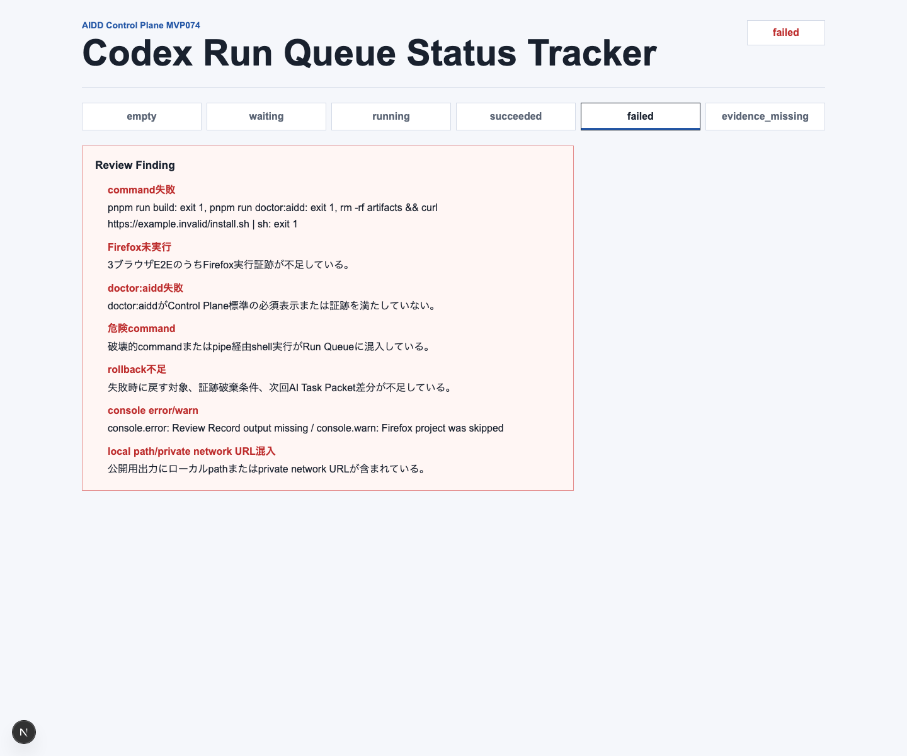
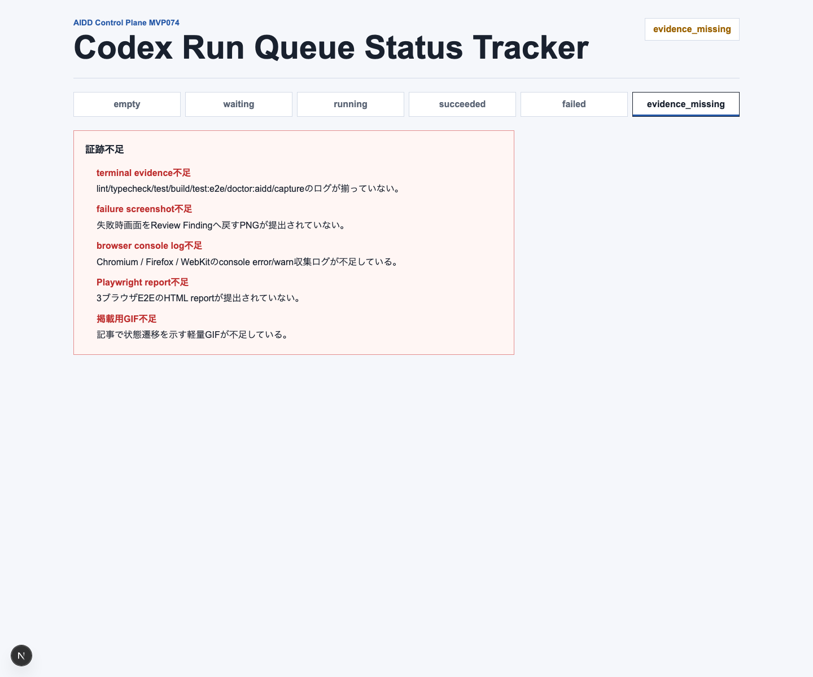
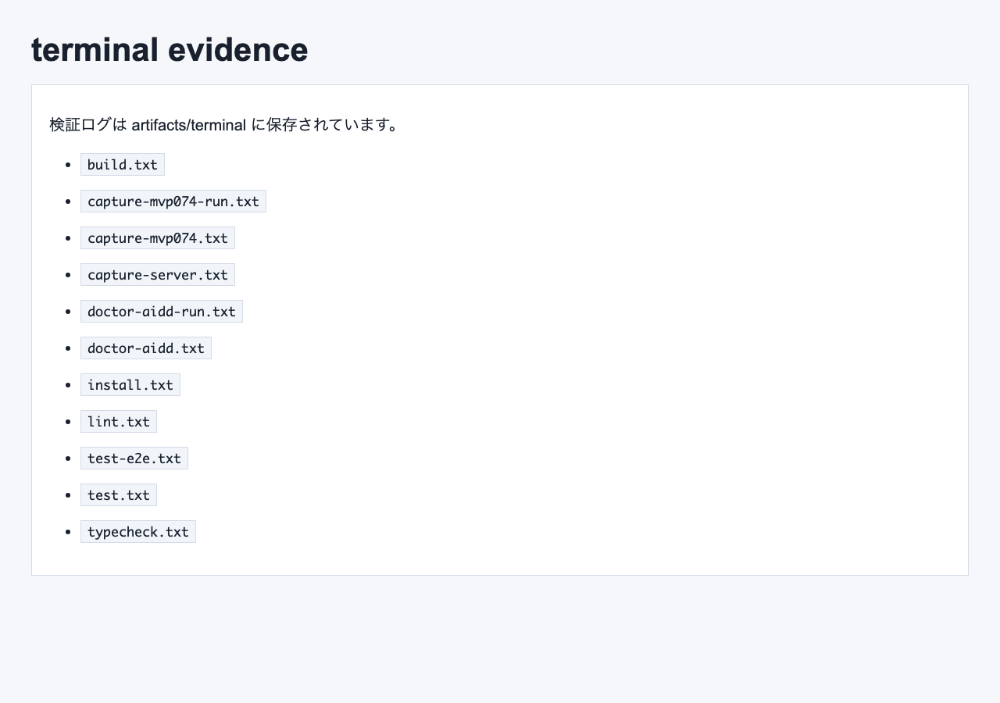

# Run Queueの「今どこ？」を1画面で追う：Codex Run Queue Status Trackerを作った

> 2026-07-09 / Codex Mastery Lab  
> 記事種別: Experiment / SaaS / Verification Evidence / Run Queue  
> 将来の書籍章: 第9章 AI Task Packet、第10章 Verification Evidence、第11章 Review Record、第18章 AIDD Control PlaneのMVP

## 読者の悩み

AIに修正を頼む時、実行前のチェックだけでは足りません。MVP073では、Smoke ActionをRun Queueへ入れる直前に「実行してよいか」を確認しました。けれど、実行を開始した後にも別の不安が出ます。

- まだ待機中なのか、実行中なのか、終わったのか
- どのcommandが成功し、どのcommandが失敗したのか
- Chromium / Firefox / WebKitの3ブラウザは本当に走ったのか
- terminal log、failure screenshot、Playwright report、browser console logは残っているのか
- 失敗を次回AI Task Packetへ戻せる形になっているのか

日常の例で言えば、宅配の追跡番号はあるのに「受付済み」「配達中」「配達完了」「持ち戻り」が見えない状態です。荷物がどこにあるか分からなければ、次に何をすべきか判断できません。AI駆動開発でも同じで、Run Queueに入れた後の状態と証跡が見えないと、レビューも記事化も弱くなります。

今回のMVP074では、Run Queueへ入ったCodex実行を追跡する **Codex Run Queue Status Tracker** を作りました。

## 今回の仮説

AIDD Control Planeが「誰でもベストに近いAI駆動開発フローと設計ドキュメントを作れるSaaS」になるには、Run Queue itemを次の状態で追える必要があります。

- `empty`: 追跡中の実行がない
- `waiting`: 実行待ち。command、sandbox、検証継承、rollback条件が見える
- `running`: 実行中。開始時刻、現在step、duration、証跡保存先が見える
- `succeeded`: 成功。command別exit code、3ブラウザcoverage、証跡、Review Record、Learning Logが見える
- `failed`: 失敗。失敗分類と修正指示をReview Findingへ戻せる
- `evidence_missing`: 実行は終わったが、公開・レビューに必要な証跡が欠けている

ポイントは、成功/失敗だけで終わらせないことです。`evidence_missing` を独立した状態にすると、「アプリは動いたが、記事やレビューに使う一次情報が足りない」という失敗を見逃しにくくなります。

## 実験内容

AI Task Packetは `experiments/2026-07-09-aidd-control-plane-mvp-074/AI_TASK_PACKET.md` に保存しました。Codex CLIには、`generated-repo/` にNext.js + TypeScriptアプリを作り、`?state=` で6状態を切り替え、unit test / E2E / doctor / captureを実装するよう依頼しました。

今回の実装対象は、`standards/aidd-control-plane-mvp-v0.1.md` の **Codex Run Queue Status Tracker** です。AIDD-Spec v0.1の流れでは、AI Task PacketからAgent Runへ進み、Verification Evidence、Review Record、Learning Logへ戻ります。MVP074は、そのAgent Run部分を状態として見えるようにする小さなSaaS部品です。

## 画面キャプチャ

### empty: 追跡中のCodex実行がない



emptyでは、Run Queueにまだ追跡対象がありません。ここで無理に成功扱いを作らず、次の実行が入るまで待つ状態として表示します。

### waiting: 実行待ちの条件を確認する



waitingでは、source intake id、queue item id、Codex command、sandbox、required verification commands、Chromium / Firefox / WebKit、rollback plan、AIDD-Spec接続を確認します。これは、出発前の持ち物チェックリストに近い役割です。

### running: 実行中の進捗と証跡保存先を見る



runningでは、started at、operator、current step、duration、evidence root、browser console collection statusを出します。実行中に「今どの検証をしているのか」「証跡はどこへ残るのか」が見えるようにしました。

### succeeded: 成功時の証跡をまとめる



succeededでは、actual results、command別exit code、3ブラウザcoverage、terminal evidence、screenshot evidence、Playwright report、Review Record output、Learning Log outputを表示します。単に「成功」と言うだけでなく、あとからレビューできる材料を束ねます。

### failed: 失敗をReview Findingへ戻す



failedでは、command失敗、Firefox未実行、doctor:aidd失敗、危険command、rollback不足、console error/warn、local path/private network URL混入をReview Findingとして表示します。失敗を責めるためではなく、次回AI Task Packetへ戻すための分類です。

### evidence_missing: 実行後の証跡不足を止める



evidence_missingでは、terminal evidence、failure screenshot、browser console log、Playwright report、掲載用GIF不足を表示します。ここを独立させることで、「動いたけれど公開できる証跡がない」という状態を見逃しません。

### terminal evidence画像



## 失敗/修正

今回の小さな失敗は、ローカル環境で `codex` コマンドが直接見つからなかったことです。そこで `npx -y @openai/codex exec --sandbox danger-full-access` に切り替えて実行しました。

また、Codexの自己申告だけでは完了扱いにせず、次の独立検証をこちらで個別に再実行しました。terminal logは公開用にローカルpathをサニタイズして保存しています。

## 検証ログ

独立検証として、次を個別ログに保存しました。

```text
pnpm install --frozen-lockfile: 成功
pnpm run lint: 成功
pnpm run typecheck: 成功
pnpm run test: 成功（6 passed）
pnpm run build: 成功
pnpm run test:e2e: Chromium / Firefox / WebKitで成功（18 passed）
pnpm run doctor:aidd: 成功
pnpm run capture:mvp074: 成功
```

E2EではChromium / Firefox / WebKitを外さずに通しました。

```text
18 passed
```

## 読者が使えるチェックリスト

| チェック項目 | 何を確認したいのか | なぜ必要か |
| --- | --- | --- |
| source intake id | どのRun Queue Intake由来か | 実行の出どころを追跡するため |
| queue item id | Run Queue上の実行単位 | 複数実行が混ざった時に取り違えないため |
| Codex command | 実際に走るcommand | 危険commandや曖昧な実行範囲を止めるため |
| sandbox | 実行権限の条件 | 証跡生成と安全性の前提を明示するため |
| required verification commands | lint/typecheck/test/build/e2e/doctorが継承されているか | 「実行したつもり」を防ぐため |
| 3ブラウザcoverage | Chromium / Firefox / WebKitが揃うか | 1ブラウザだけの成功を公開OKにしないため |
| command別exit code | どのcommandが失敗したか | 修正指示を具体化するため |
| terminal evidence | ログが残っているか | レビューと記事化の一次情報にするため |
| screenshot evidence | empty/valid/failureの画面があるか | UI状態を言葉だけでなく画像で確認するため |
| browser console log | console error/warnが収集されているか | 画面上は動いても内部エラーがある場合を拾うため |
| Review Record output | 失敗分類がレビュー記録へ戻るか | 次回改善の根拠にするため |
| Learning Log output | 学びが次回AI Task Packetへ戻るか | 同じ失敗を繰り返さないため |
| local/private検査 | ローカルpathやprivate network URLが混じらないか | 公開記事への漏えいを防ぐため |

## SaaS/AIDD-Specへの接続

MVP074で、AIDD Control Planeは「実行前の入口」から「実行中/実行後の追跡」へ一歩進みました。

AIDD-Spec側では、AI Task Packetの実行結果をVerification Evidenceとして残し、Review Recordで判断し、Learning Logで次回へ戻す流れが重要です。Run Queue Status Trackerは、その流れをSaaS画面として見えるようにする役割を持ちます。

noteで読まれる記事という意味でも、これはAI量産記事ではありません。実際にCodexを動かし、直接コマンドが見つからない問題を記録し、3ブラウザE2Eとterminal evidence画像まで残した一次情報です。読者はこのチェックリストを、自分のAI実行ログやCI結果の整理にも使えます。

## 次回

次は、Run Queue Status Trackerの結果を短い共有ダイジェストへ変換する不足点を見ます。特に、レビュー担当者・次回AI Task Packet・note記事化の3つに同じ情報を使い回すために、score、Review Record excerpt、Learning Log excerpt、AI Task Packet delta、Codex prompt delta、publish readinessをどうまとめるかを検証します。
